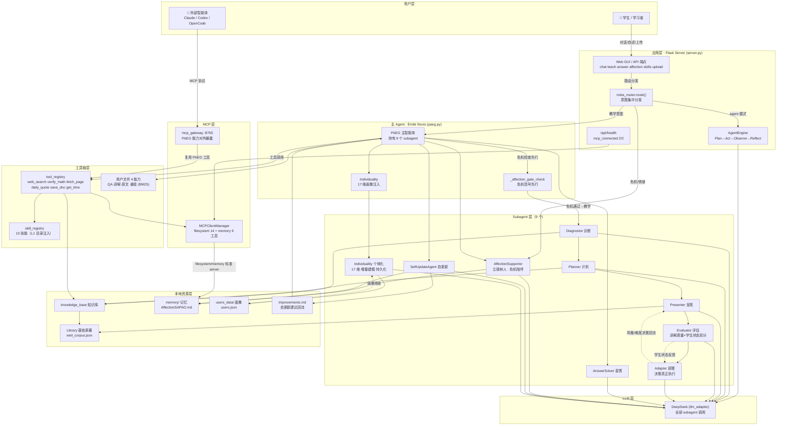
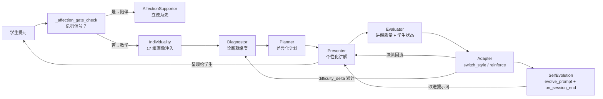
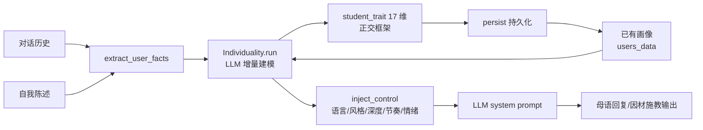
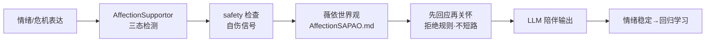
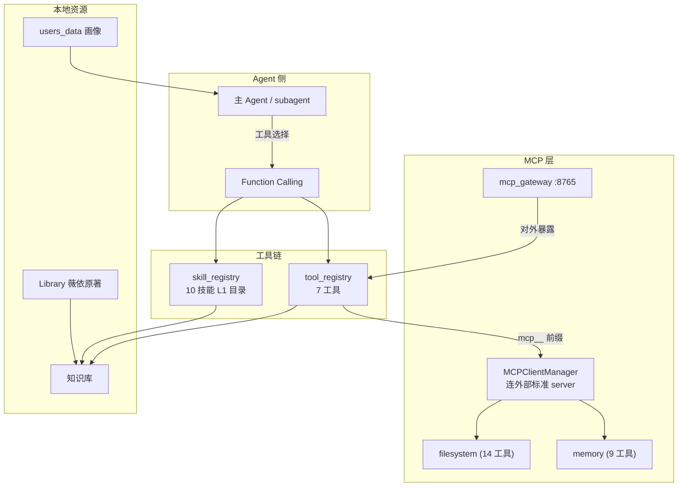

# PAEG 智能体架构链路图（v0.24 关键节点 · 修复后真实连接）

> 本图基于修复后的真实代码状态绘制，20 项连接已逐一验证（arch 检查通过）。
> 渲染：GitHub 原生支持 Mermaid，任何 Markdown 查看器均可直接显示。

## 一、全链路总览图（技术文档 §1.6 用）

## 二、教学闭环链路（技术文档 §1.6.1 用）

## 三、个体化闭环链路（亮点文档用 · 因材施教）

## 四、立德树人闭环链路（亮点文档用）

## 五、工具/MCP/资源链路（技术文档 §1.6.9 用）

