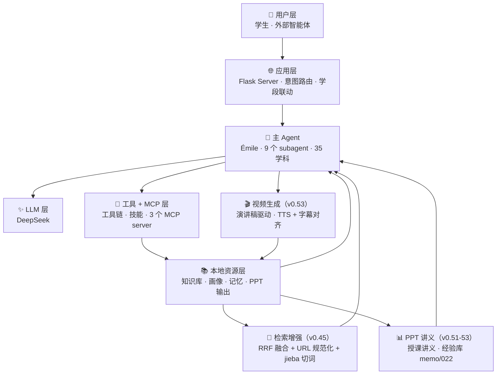
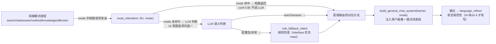
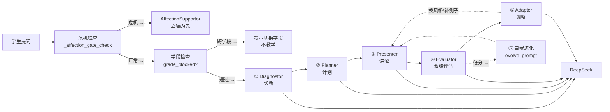
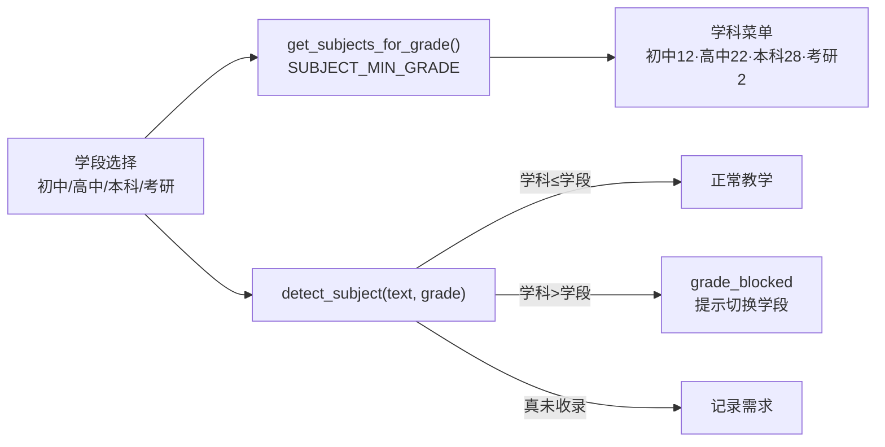
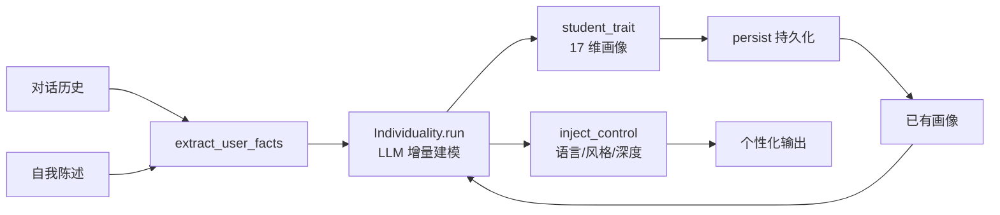
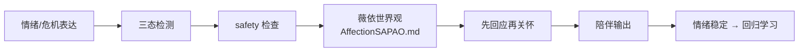
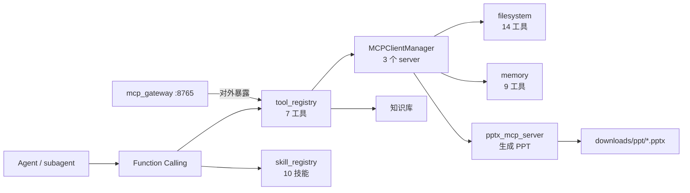
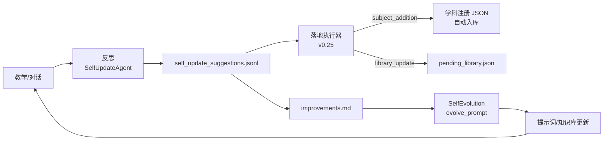
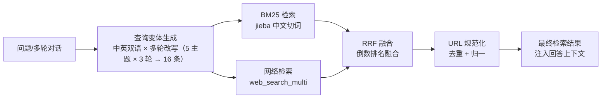
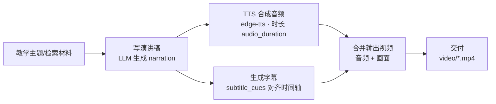

# PAEG 智能体架构链路图（v0.53 关键节点 · 分层展开）

> 阅读方式：先看 **L0 总览**（一图了解全貌），再按需展开各层细图。
> 每张图 ≤12 节点，聚焦单一主题，避免视觉负担。
> v0.53 更新：检索增强（RRF 融合 + jieba）+ 视频生成（演讲稿驱动）+ PPT 授课讲义 + 经验教训库（memo/022）+ 问答文档体系。
> 全部基于修复后真实代码绘制，连接已逐一验证。

---

## L0 · 架构总览（一图看懂）

> 六层结构 + 三支扩展（检索增强 / 视频生成 / PPT 讲义）。箭头表示数据流向。

> **分层细图导航**：
> - [L1 · 教学闭环](#l1--教学闭环九个-subagent-如何协同)（9 个 subagent 流水线）
> - [L1 · 学段-学科联动](#l1--学段-学科联动v025-新增)（v0.25 新增）
> - [L1 · 个体化（因材施教）](#l1--个体化闭环因材施教)
> - [L1 · 立德树人](#l1--立德树人闭环)
> - [L1 · 工具 / MCP / PPT](#l1--工具--mcp--ppt-生成)
> - [L1 · 自我进化](#l1--自我进化闭环)
> - [L1 · 检索增强（v0.45）](#l1--检索增强v045-新增)
> - [L1 · 视频生成（v0.53）](#l1--视频生成v053-新增)

---

## L1 · 意图路由闭环（v0.41.6 ⭐ 模式短路）

> 聚焦：提示词结构化管线——确定性信号（模式按钮）先行，LLM 判断次之，规则兜底兜尾。

**说明**：判断成本分层——确定性信号（免费）> 规则（廉价）> LLM（昂贵）。用户已选模式时 LLM 不必重复判断；画像+历史+模式场景段一并注入 system prompt（结构化提示词管线）。

---

## L1 · 教学闭环（九个 subagent 如何协同）

> 聚焦：一次教学对话中，9 个 subagent 的分工与协作。

**说明**：Diagnostor/Planner/Presenter/Evaluator/Adapter 是教学主链；**v0.25 新增学段检查**（跨学段学科拦截）；AnswerSolver 独立处理"直接要答案"；AffectionSupportor 危机先行；SelfUpdateAgent 会话后反思；Individuality 贯穿全程注入画像。

---

## L1 · 学段-学科联动（v0.25 新增）

> 聚焦：学段与学科绑定——高中学段不出现语言学/量子场论等大学学科。

---

## L1 · 个体化闭环（因材施教）

> 聚焦：Individuality 如何把对话/自述变成可用的个性化画像。

---

## L1 · 立德树人闭环

> 聚焦：AffectionSupportor 的危机处理与陪伴流程。

---

## L1 · 工具 / MCP / PPT 生成

> 聚焦：LLM 如何调用工具、技能、MCP，以及 v0.25 新增的 PPT 生成链路。

---

## L1 · 自我进化闭环（v0.25 增强）

> 聚焦：教学经验如何回流——v0.25 SelfUpdateAgent 扩到 7 分类 + 落地执行器。

---

## L1 · 检索增强（v0.45 新增）

> 聚焦：中文检索质量升级——多路检索 + RRF 融合，中英双语变体 + 多轮改写覆盖。

**说明**：jieba 解决中文切词（"分离定律"不再被拆碎）；RRF 融合多路结果排序稳定；URL 规范化去重防止重复引用。

---

## L1 · 视频生成（v0.53 新增）

> 聚焦：演讲稿驱动的视频管线——先文后声，音画同步。

**说明**：**演讲稿驱动**（v0.53）——先定 narration 文本，再生成 TTS 与字幕 cue，`audio_duration` 保证音频长度与视频画面对齐，避免早期"先视频后配音"的错位。经验沉淀在 `memo/022_PPT与视频制作经验教训库.md`。
