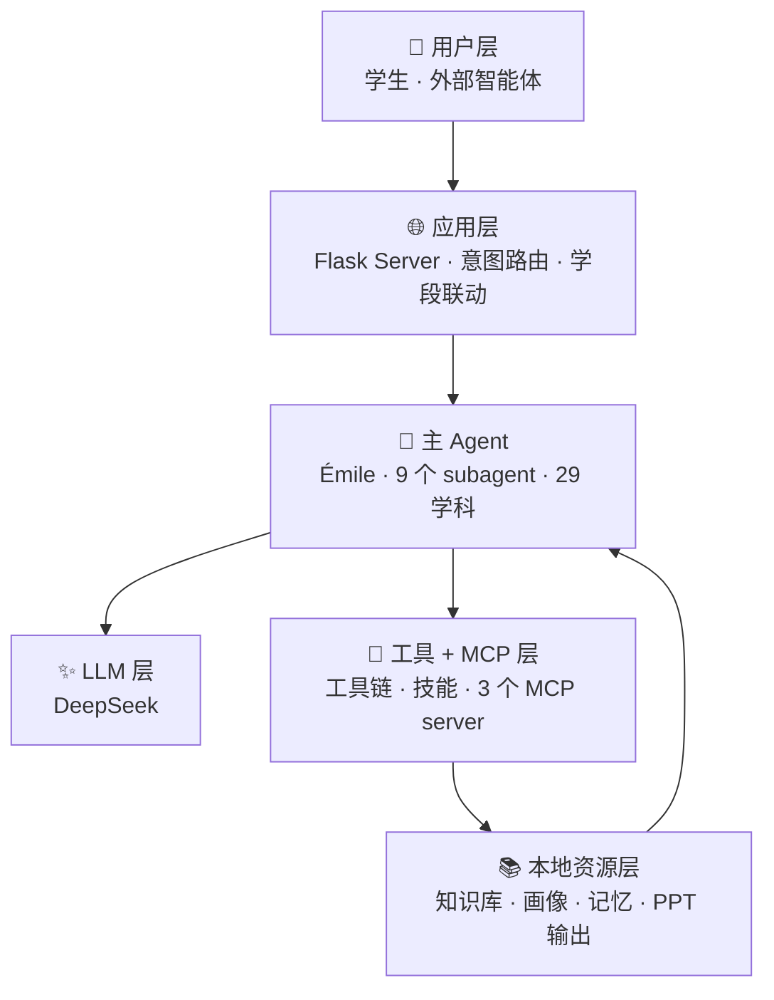
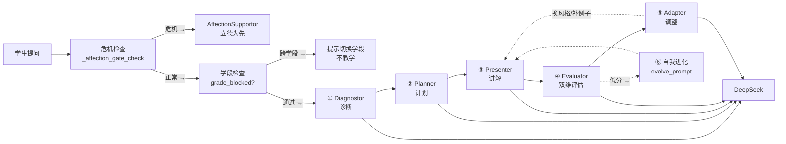
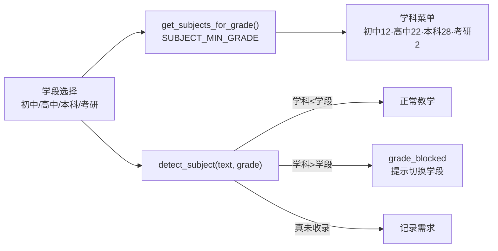
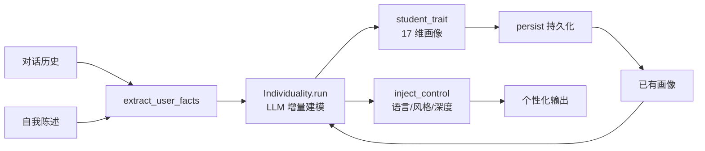
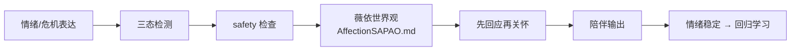
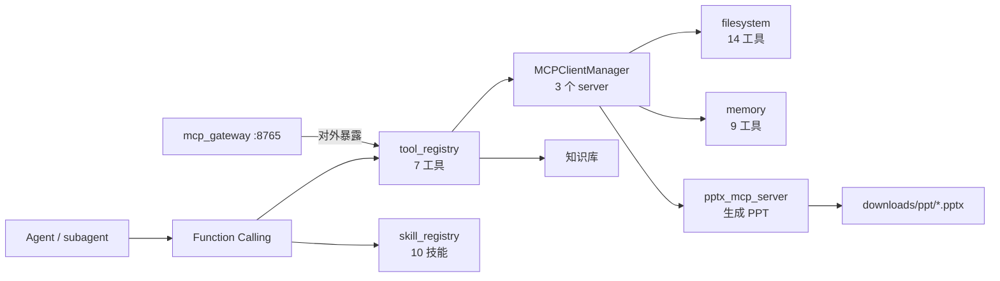
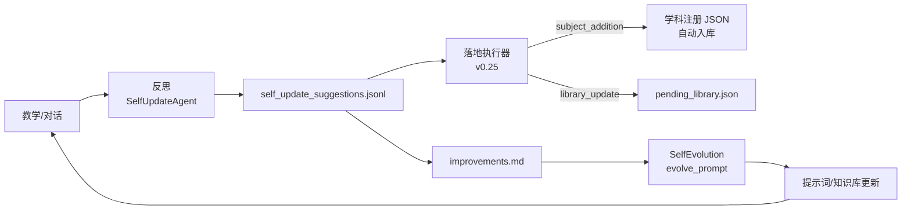

# PAEG 智能体架构链路图（v0.25 关键节点 · 分层展开）

> 阅读方式：先看 **L0 总览**（一图了解全貌），再按需展开各层细图。
> 每张图 ≤10 节点，聚焦单一主题，避免视觉负担。
> v0.25 更新：3 新学科（语言学/大气科学/量子场论）+ 学段-学科联动 + PPT MCP + SelfUpdateAgent 增强。
> 全部基于修复后真实代码绘制，连接已逐一验证。

---

## L0 · 架构总览（一图看懂）

> 六层结构，每层是一个可展开的独立模块。箭头表示数据流向。

> **分层细图导航**：
> - [L1 · 教学闭环](#l1--教学闭环九个-subagent-如何协同)（9 个 subagent 流水线）
> - [L1 · 学段-学科联动](#l1--学段-学科联动v025-新增)（v0.25 新增）
> - [L1 · 个体化（因材施教）](#l1--个体化闭环因材施教)
> - [L1 · 立德树人](#l1--立德树人闭环)
> - [L1 · 工具 / MCP / PPT](#l1--工具--mcp--ppt-生成)
> - [L1 · 自我进化](#l1--自我进化闭环)

---

## L1 · 教学闭环（九个 subagent 如何协同）

> 聚焦：一次教学对话中，9 个 subagent 的分工与协作。

**说明**：Diagnostor/Planner/Presenter/Evaluator/Adapter 是教学主链；**v0.25 新增学段检查**（跨学段学科拦截）；AnswerSolver 独立处理"直接要答案"；AffectionSupportor 危机先行；SelfUpdateAgent 会话后反思；Individuality 贯穿全程注入画像。

---

## L1 · 学段-学科联动（v0.25 新增）

> 聚焦：学段与学科绑定——高中学段不出现语言学/量子场论等大学学科。

---

## L1 · 个体化闭环（因材施教）

> 聚焦：Individuality 如何把对话/自述变成可用的个性化画像。

---

## L1 · 立德树人闭环

> 聚焦：AffectionSupportor 的危机处理与陪伴流程。

---

## L1 · 工具 / MCP / PPT 生成

> 聚焦：LLM 如何调用工具、技能、MCP，以及 v0.25 新增的 PPT 生成链路。

---

## L1 · 自我进化闭环（v0.25 增强）

> 聚焦：教学经验如何回流——v0.25 SelfUpdateAgent 扩到 7 分类 + 落地执行器。

