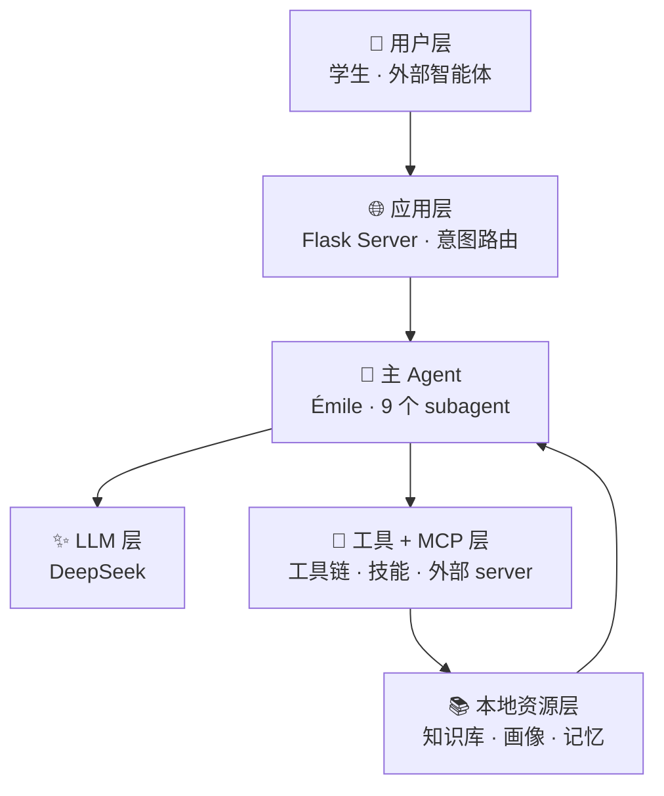
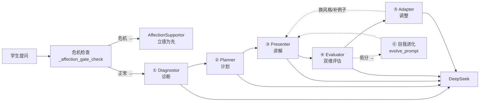
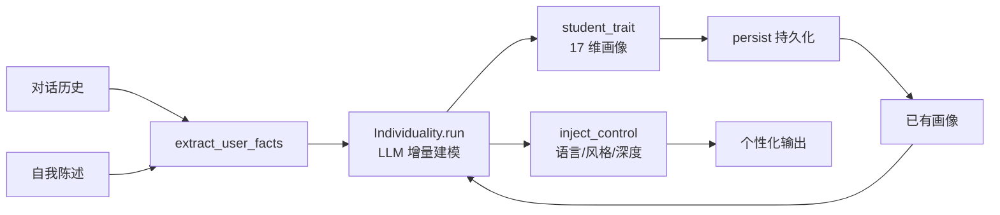
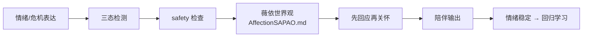
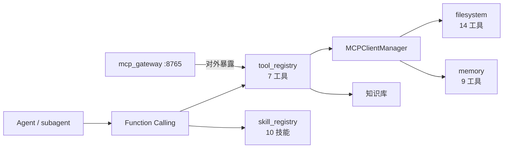
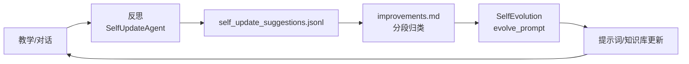

# PAEG 智能体架构链路图（v0.24 关键节点 · 分层展开）

> 阅读方式：先看 **L0 总览**（一图了解全貌），再按需展开各层细图。
> 每张图 ≤10 节点，聚焦单一主题，避免视觉负担。
> 全部基于修复后真实代码绘制，20 项连接已逐一验证。

---

## L0 · 架构总览（一图看懂）

> 六层结构，每层是一个可展开的独立模块。箭头表示数据流向。

> **分层细图导航**：
> - [L1 · 教学闭环](#l1--教学闭环九个-subagent-如何协同)（9 个 subagent 流水线）
> - [L1 · 个体化（因材施教）](#l1--个体化闭环因材施教)
> - [L1 · 立德树人](#l1--立德树人闭环)
> - [L1 · 工具 / MCP](#l1--工具与-mcp-层)
> - [L1 · 自我进化](#l1--自我进化闭环)

---

## L1 · 教学闭环（九个 subagent 如何协同）

> 聚焦：一次教学对话中，9 个 subagent 的分工与协作。

**说明**：Diagnostor/Planner/Presenter/Evaluator/Adapter 是教学主链；AnswerSolver 独立处理"直接要答案"；AffectionSupportor 危机先行；SelfUpdateAgent 会话后反思；Individuality 贯穿全程注入画像。

---

## L1 · 个体化闭环（因材施教）

> 聚焦：Individuality 如何把对话/自述变成可用的个性化画像。

---

## L1 · 立德树人闭环

> 聚焦：AffectionSupportor 的危机处理与陪伴流程。

---

## L1 · 工具与 MCP 层

> 聚焦：LLM 如何调用工具、技能，以及 MCP 双向连通。

---

## L1 · 自我进化闭环

> 聚焦：教学经验如何回流，让系统越用越懂怎么教。

