# PAEG 教育者智能体 — 技术全景文档

> **版本**：v0.73 关键节点（2026-08-16）：Docker 容器化完整技术章节（§10.11，与 Flask 同级基础设施技术）+ 结构优化（TOC 自动生成/围栏修复/层级修正/§3.17 生产链路补强）；Docker 容器化完整技术章节（§10.11，与 Flask 同级基础设施技术）；架构精细拆分（server.py 2601 行/31 路由/12 蓝图）+ RAG 检索增强（BM25Okapi/多路召回）+ 自我进化优化（Schema+CoT/失败案例/去重）+ dsh Harness 30 项落地 27/30（Seam/Registry/Provider/Persona 外置/Patch 系统/三角色契约层/Preset 体系/条件启停/Constitutional 补丁化/Self-Update via Patch）+ 前端 SVG 化+ 薇依人格大幅提升（文选 9 大哲学基石）
> **适用对象**：项目维护者（你本人）
> **目的**：让你从零到一掌握 PAEG 的每个环节——大模型、智能体架构、后端、前端、网络部署、日常维护与升级。读完本文档，你能独立理解、排查、升级这套系统。
> **项目位置**：`D:\桌面\智能体架构与开发（含大模型）\14_教育者Agent项目\`
>
> **v0.25 关键节点**：新增语言学/大气科学/量子场论 3 学科 + 学段-学科联动 + PPT MCP；v0.24 完成架构断链修复（教学闭环 / 个体化闭环 / 工具链 / 路由自更新），20 项连接逐一验证通过，详见 §1.6.11。
>
> **v0.72+ 关键节点（2026-08-16）**：§3.45/§3.46 架构导向拆分——server.py 4780→2601 行（12 蓝图 42+ 路由迁出，组合根模式）；§3.46 ULW 多波次——自我更新优化（Schema+CoT 提炼/确定性去重/supersession/failure_case）+ RAG 优化（真 BM25Okapi/SOURCES 注入/config 化/多路召回）+ dsh Harness 借鉴（H-1 会话事件日志/PTC-5 主循环策略/H-14 hooks 瀑布/#12 LLM Seam）。详见需求文档 §3.45-3.47。

---

## 目录

1. [1. 系统总览](#1-系统总览)
    - [1.1 这是什么](#11-这是什么)
    - [1.1.1 设计目标（回到初衷 ⭐）](#111-设计目标回到初衷-)
    - [1.1.2 v0.43 功能 / 模块 / 管线 / 接线汇总（2026-08-10 ⭐）](#112-v043-功能--模块--管线--接线汇总2026-08-10-)
    - [1.2 一句话架构](#12-一句话架构)
    - [1.3 数据流（一次完整教学）](#13-数据流一次完整教学)
    - [1.4 Agent 指挥 LLM 的工作机制（⭐ 核心设计）](#14-agent-指挥-llm-的工作机制-核心设计)
    - [1.5 三大架构支柱（v0.19.17 ⭐ 设计验证）](#15-三大架构支柱v01917--设计验证)
    - [1.6 项目最大亮点：教育者 Agent 的基础架构定义（⭐ 阶段性总结）](#16-项目最大亮点教育者-agent-的基础架构定义-阶段性总结)
    - [1.6.1 教学设计：一次教学如何完成"设计与循环"](#161-教学设计一次教学如何完成设计与循环)
    - [1.6.2 子代理架构：哪些职责拆分出去，为什么](#162-子代理架构哪些职责拆分出去为什么)
    - [1.6.3 执行引擎（Harness）：Agent 如何指挥 LLM 完成一次真实思考](#163-执行引擎harnessagent-如何指挥-llm-完成一次真实思考)
    - [1.6.4 工具调用系统（Tool Use）：真实、可靠、可恢复](#164-工具调用系统tool-use真实可靠可恢复)
    - [1.6.5 子代理之间的连通：上下文如何流转](#165-子代理之间的连通上下文如何流转)
    - [1.6.6 角色设定与预置提示词：如何保证教育价值观与教育能力](#166-角色设定与预置提示词如何保证教育价值观与教育能力)
    - [1.6.7 自我更新能力：现状确认（对话级真实运行，周期级待接调度器）⭐](#167-自我更新能力现状确认对话级真实运行周期级待接调度器)
    - [1.6.8 系统性自进化：知识库/提示词/工具经验四路更新（v0.19.22 ⭐ 核心亮点）](#168-系统性自进化知识库提示词工具经验四路更新v01922--核心亮点)
    - [1.6.9 MCP 双向打通：Agent 通过 MCP 调标准化工具（v0.19.25 ⭐ 核心亮点）](#169-mcp-双向打通agent-通过-mcp-调标准化工具v01925--核心亮点)
    - [1.6.10 为什么这套 Agent 架构是革命性的（v0.20 ⭐ 架构定位）](#1610-为什么这套-agent-架构是革命性的v020--架构定位)
    - [1.6.11 v0.24 断链修复清单（关键节点 ⭐）](#1611-v024-断链修复清单关键节点-)
    - [1.7 Agent Steering：自动识别学科并切换（v0.19.26 ⭐ 核心亮点）](#17-agent-steering自动识别学科并切换v01926--核心亮点)
    - [1.7.1 问题](#171-问题)
    - [1.7.2 解决方案：学科自动识别层](#172-解决方案学科自动识别层)
    - [1.7.3 未收录学科 → 自我更新闭环](#173-未收录学科--自我更新闭环)
    - [1.7.4 学段-学科联动（v0.25 ⭐ 学科与学段绑定）](#174-学段-学科联动v025--学科与学段绑定)
    - [1.7.5 PPT 演示文稿生成 MCP（v0.25 ⭐ 新能力）](#175-ppt-演示文稿生成-mcpv025--新能力)
    - [1.8 学科/学段定制化的技术实现路径（v0.19.26 ⭐ 文档化）](#18-学科学段定制化的技术实现路径v01926--文档化)
    - [1.14 借鉴项目清单与效能改进建议（v0.26 ⭐）](#114-借鉴项目清单与效能改进建议v026-)
    - [1.14.2 效能改进建议（P0 已落地 / P1 待做）](#1142-效能改进建议p0-已落地--p1-待做)
    - [1.15 v0.27 增强（LLM 意图/检索引导/资料检索/PPT）](#115-v027-增强llm-意图检索引导资料检索ppt)
    - [1.8.1 数据源：prompts.py 两个核心字典](#181-数据源promptspy-两个核心字典)
    - [1.7.6 充分发挥、增益 LLM 能力 + 规则链兜底（v0.26 ⭐ 架构原则）](#176-充分发挥增益-llm-能力--规则链兜底v026--架构原则)
    - [1.7.7 连通性审计：301 条连接清单（v0.26 ⭐ 连接的真实性是 agent 设计核心）](#177-连通性审计301-条连接清单v026--连接的真实性是-agent-设计核心)
    - [1.7.8 重点学科策略（v0.26 ⭐ 聚焦深耕 + 持续扩展）](#178-重点学科策略v026--聚焦深耕--持续扩展)
    - [1.8.2 归一化路由](#182-归一化路由)
    - [1.8.3 分层效果](#183-分层效果)
    - [1.9 市场垂直优势：专门的博雅教育（v0.19.26 ⭐ 定位）](#19-市场垂直优势专门的博雅教育v01926--定位)
    - [1.9.1 什么是博雅教育定位](#191-什么是博雅教育定位)
    - [1.9.2 与通用 AI 教育产品的差异](#192-与通用-ai-教育产品的差异)
    - [1.9.3 垂直优势总结](#193-垂直优势总结)
    - [1.9.4 面向市场的垂直领域优势（v0.20 ⭐ 市场定位强化）](#194-面向市场的垂直领域优势v020--市场定位强化)
    - [1.10 自我指涉模块：Agent 能说清自己的界面（v0.19.27）](#110-自我指涉模块agent-能说清自己的界面v01927)
    - [1.11 情绪与心理支持 subagent（v0.19.27 ⭐ 哲学三角）](#111-情绪与心理支持-subagentv01927--哲学三角)
    - [1.11.1 情绪支持宪法（EMOTION_SUPPORT_CORE.md）](#1111-情绪支持宪法emotion_support_coremd)
    - [1.11.2 三阶段对话流程](#1112-三阶段对话流程)
    - [1.11.3 红线](#1113-红线)
    - [1.11.4 实现](#1114-实现)
    - [1.11.5 生命现象学维度 + 约纳斯语言风格（v0.19.30 ⭐ 扩充）](#1115-生命现象学维度--约纳斯语言风格v01930--扩充)
    - [1.12 全局中文语言质量层（v0.20 ⭐ 项目亮点）](#112-全局中文语言质量层v020--项目亮点)
    - [为什么语言规范性是教育智能体的独立问题（v0.21.8 ⭐）](#为什么语言规范性是教育智能体的独立问题v0218-)
    - [问题](#问题)
    - [三层架构（调研 star-word / stop-slop-zh / writing-harness / FastAPI zh-prompt）](#三层架构调研-star-word--stop-slop-zh--writing-harness--fastapi-zh-prompt)
    - [L1 提示词约束（prompts.py"动宾搭配与省略边界"）](#l1-提示词约束promptspy动宾搭配与省略边界)
    - [L2 规则检测（language_refiner._check_ellipsis 扩展）](#l2-规则检测language_refiner_check_ellipsis-扩展)
    - [L3 LLM 修正（minimal-edit）](#l3-llm-修正minimal-edit)
    - [关键修复：teach_stream 绕过 refiner 漏洞](#关键修复teach_stream-绕过-refiner-漏洞)
    - [实测效果](#实测效果)
    - [1.13 上下文打包契约 + 模式自动纠正（v0.20.3 ⭐ 关键技术）](#113-上下文打包契约--模式自动纠正v0203--关键技术)
    - [1.13.1 上下文打包器（context_bundle.py）](#1131-上下文打包器context_bundlepy)
    - [1.13.2 模式自动纠正（_mode_auto_correct）](#1132-模式自动纠正_mode_auto_correct)
    - [1.17 知识导图 + 气象页面（v0.20.5 ⭐ 新能力）](#117-知识导图--气象页面v0205--新能力)
    - [1.17.1 知识导图功能](#1171-知识导图功能)
    - [1.17.2 气象页面（windy 接入）](#1172-气象页面windy-接入)
    - [1.18 模块化架构 + 元能力 + 可观测性（v0.21 ⭐ 架构成熟化）](#118-模块化架构--元能力--可观测性v021--架构成熟化)
    - [1.18.1 功能模块注册机制（module_registry.py）](#1181-功能模块注册机制module_registrypy)
    - [1.18.2 元能力文档（元能力文档.md）](#1182-元能力文档元能力文档md)
    - [1.18.3 可观测性（observability.py）](#1183-可观测性observabilitypy)
    - [1.18.4 Thread/Turn/Item 三层会话模型（v0.21.1 ⭐ 借鉴 Codex App Server）](#1184-threadturnitem-三层会话模型v0211--借鉴-codex-app-server)
    - [1.16 商业教育 AI 借鉴设计（v0.21.2 ⭐ 调研转化）](#116-商业教育-ai-借鉴设计v0212--调研转化)
    - [1.16.1 防止直接给答案（Khanmigo 四层防线）](#1161-防止直接给答案khanmigo-四层防线)
    - [1.16.2 教育 KPI（Khanmigo 可观测化）](#1162-教育-kpikhanmigo-可观测化)
    - [1.16.3 哲学知识图谱（Socratic X-ray + 智谱知识图谱）](#1163-哲学知识图谱socratic-x-ray--智谱知识图谱)
    - [1.16.4 间隔重复（Duolingo HLR + Anki FSRS）](#1164-间隔重复duolingo-hlr--anki-fsrs)
    - [1.16.5 动机系统（Khanmigo Gems + Duolingo Streak）](#1165-动机系统khanmigo-gems--duolingo-streak)
    - [1.16.6 其他借鉴](#1166-其他借鉴)
    - [1.16.7 问题驱动调研方法论（v0.21.9 ⭐ 成熟项目检索）](#1167-问题驱动调研方法论v0219--成熟项目检索)
2. [2. 大模型知识（LLM 基础）](#2-大模型知识llm-基础)
    - [2.1 我们用的模型：DeepSeek](#21-我们用的模型deepseek)
    - [2.2 关键概念：Token](#22-关键概念token)
    - [2.3 关键概念：Prompt（提示词）](#23-关键概念prompt提示词)
    - [2.4 为什么之前教学"浮夸"，现在"像人话"了？](#24-为什么之前教学浮夸现在像人话了)
3. [3. 智能体架构（PAEG 核心）](#3-智能体架构paeg-核心)
    - [3.1 主类：paeg.py](#31-主类paegpy)
    - [3.2 子代理体系（subagents.py，v0.19.14 共 6 个）](#32-子代理体系subagentspyv01914-共-6-个)
    - [3.3 学科提示词中心：prompts.py（v0.8.2 ⭐）](#33-学科提示词中心promptspyv082-)
    - [3.4 世界观：world_view.py](#34-世界观world_viewpy)
    - [3.5 知识库：knowledge_base.py](#35-知识库knowledge_basepy)
    - [3.5.1 教学策略库：pedagogy.py（v0.9 ⭐）](#351-教学策略库pedagogypyv09-)
    - [3.6 自我更新：self_update.py](#36-自我更新self_updatepy)
    - [3.7 智能体基础架构：agent_core.py（v0.10 ⭐）](#37-智能体基础架构agent_corepyv010-)
    - [3.8 用户自我描述（v0.10 ⭐）](#38-用户自我描述v010-)
    - [3.9 对象意识：用户建模（v0.11 ⭐）](#39-对象意识用户建模v011-)
    - [3.10 知识库扩展接口（v0.11 ⭐）](#310-知识库扩展接口v011-)
    - [3.11 文件生成与下载（v0.12 ⭐）](#311-文件生成与下载v012-)
    - [3.12 语言优化 Agent（v0.12 ⭐）](#312-语言优化-agentv012-)
    - [3.13 新方法加强（v0.13 ⭐）](#313-新方法加强v013-)
    - [3.14 语法完整性与用户系统（v0.14 ⭐）](#314-语法完整性与用户系统v014-)
    - [3.15 自我更新与系统优化（v0.15 ⭐）](#315-自我更新与系统优化v015-)
    - [3.16 名字、词汇策略与 UI 优化（v0.16 ⭐）](#316-名字词汇策略与-ui-优化v016-)
    - [3.17 教学材料生产链路（v0.40+ ⭐ 生产流水线）](#317-教学材料生产链路v040--生产流水线)
4. [4. 后端服务（server.py + API）](#4-后端服务serverpy--api)
    - [4.1 是什么](#41-是什么)
    - [4.2 API 端点一览](#42-api-端点一览)
    - [4.3 关键：/api/teach 请求格式](#43-关键apiteach-请求格式)
5. [5. 前端界面（GUI）](#5-前端界面gui)
    - [5.1 是什么](#51-是什么)
    - [5.2 界面结构](#52-界面结构)
    - [5.3 技术要点](#53-技术要点)
    - [5.4 想改 UI？直接编辑 index.html 的 CSS/HTML 即可，无需动后端。](#54-想改-ui直接编辑-indexhtml-的-csshtml-即可无需动后端)
    - [5.5 ⭐ GUI 设计原则（v0.29 调研：WCAG 2.2 / NN/G / Material Design 3 / Apple HIG / Mayer / Sweller）](#55--gui-设计原则v029-调研wcag-22--nng--material-design-3--apple-hig--mayer--sweller)
6. [6. 网络与公网部署](#6-网络与公网部署)
    - [6.1 网络拓扑](#61-网络拓扑)
    - [6.2 当前方案（A：临时隧道）](#62-当前方案a临时隧道)
    - [6.3 升级方案（B：固定域名，未来可选）](#63-升级方案b固定域名未来可选)
    - [6.4 多用户扩展性（v0.38 ⭐ 大用户量架构）](#64-多用户扩展性v038--大用户量架构)
7. [7. 日常维护与排错](#7-日常维护与排错)
    - [7.1 查看系统是否在跑](#71-查看系统是否在跑)
    - [7.2 常见问题速查](#72-常见问题速查)
    - [7.3 日志在哪](#73-日志在哪)
8. [8. 关机/断连后的恢复](#8-关机断连后的恢复)
    - [8.1 最简恢复（一键脚本）](#81-最简恢复一键脚本)
    - [8.2 手动恢复（如果脚本失效）](#82-手动恢复如果脚本失效)
    - [8.3 数据会丢吗？](#83-数据会丢吗)
    - [8.4 开机后想要全自动？（未来可选）](#84-开机后想要全自动未来可选)
9. [9. 如何升级与扩展](#9-如何升级与扩展)
    - [9.1 调整教学风格（最常见需求）](#91-调整教学风格最常见需求)
    - [9.2 新增学科](#92-新增学科)
    - [9.3 新增技能节点（G4）](#93-新增技能节点g4)
    - [9.4 升级到固定域名（方案 B）](#94-升级到固定域名方案-b)
    - [9.5 增强功能（未来方向）](#95-增强功能未来方向)
10. [10. 附录：文件地图 & 测试](#10-附录文件地图--测试)
    - [10.1 文件地图](#101-文件地图)
    - [10.2 测试命令](#102-测试命令)
    - [10.3 版本历史](#103-版本历史)
    - [10.4 从 GitHub 拉取并部署到自己的电脑/服务器](#104-从-github-拉取并部署到自己的电脑服务器)
    - [10.5 可扩充与更新的资源清单](#105-可扩充与更新的资源清单)
    - [10.6 架构连通性指标（v0.19.7 ⭐ 关键技术指标）](#106-架构连通性指标v0197--关键技术指标)
    - [10.7 自检复盘与未来优化任务列表（v0.19.20 ⭐ 阶段性总结）](#107-自检复盘与未来优化任务列表v01920--阶段性总结)
    - [10.7.1 机制层优化（按优先级）](#1071-机制层优化按优先级)
    - [10.7.2 内容层扩充（按优先级）](#1072-内容层扩充按优先级)
    - [10.8 设计背景与材料存放位置索引（v0.19.20 ⭐ 供下次 LLM 读取）](#108-设计背景与材料存放位置索引v01920--供下次-llm-读取)
    - [10.8.1 快速启动路径（读这些就能开工）](#1081-快速启动路径读这些就能开工)
    - [10.8.2 设计背景与决策记录](#1082-设计背景与决策记录)
    - [10.8.3 代码与数据](#1083-代码与数据)
    - [10.8.3.1 测试哲学（v0.44 ⭐ 既测功能有无，也测功能好坏 —— memo/010）](#10831-测试哲学v044--既测功能有无也测功能好坏--memo010)
    - [10.8.4 知识库（Library）——PAEG"学过什么"的真实来源](#1084-知识库librarypaeg学过什么的真实来源)
    - [10.8.5 外部环境与工具](#1085-外部环境与工具)
    - [10.8 真实用户测试方法论（v0.21.4 ⭐）](#108-真实用户测试方法论v0214-)
    - [10.8.3.2 安全加固设计（v0.46 ⭐ 借鉴成功 Agent 项目 —— memo/013）](#10832-安全加固设计v046--借鉴成功-agent-项目--memo013)
    - [10.9 关键节点标记与回退流程（v0.21.4 ⭐ SOP）](#109-关键节点标记与回退流程v0214--sop)
11. [11. 规划中功能（未实现 · 非可用承诺）⭐](#11-规划中功能未实现--非可用承诺)
    - [11.1 注意力追踪（眼动/行为监测）— 规划中](#111-注意力追踪眼动行为监测-规划中)
    - [11.2 六级反馈体系 — 规划中](#112-六级反馈体系--规划中)
    - [10.8.3.3 PPT 生成方法论与 pipeline（v0.51 ⭐ 依据 memo/019）](#10833-ppt-生成方法论与-pipelinev051--依据-memo019)
    - [10.8.3.4 视频生成 pipeline（v0.53 ⭐ Oracle 设计 —— 演讲稿驱动）](#10834-视频生成-pipelinev053--oracle-设计--演讲稿驱动)
    - [12. 新增资产：PPT 脚本 + Logo 品牌（2026-08-12 ⭐）](#12-新增资产ppt-脚本--logo-品牌2026-08-12-)
    - [9.8 Manim 教学动画速度规范（v0.65 ⭐ 三档分级固定标准）](#98-manim-教学动画速度规范v065--三档分级固定标准)
    - [10.9 架构连通性重构（v0.66 ⭐ 2026-08-13）](#109-架构连通性重构v066--2026-08-13)
    - [10.11 ⭐ Docker 容器化技术（v0.67 → v0.73 · 与 Flask 同级的基础设施技术）](#1011--docker-容器化技术v067--v073--与-flask-同级的基础设施技术)
    - [10.12 双远程仓库同步（GitHub + ModelScope）（v0.67 ⭐ 2026-08-13）](#1012-双远程仓库同步github--modelscopev067--2026-08-13)
    - [10.17 MCP 工具可移植性：配置驱动加载器（v1.1.1 §3.36 ⭐ 2026-08-15）](#1017-mcp-工具可移植性配置驱动加载器v111-336--2026-08-15)
    - [10.18 Harness P1 低成本实施三项（v1.1.2 §3.37 ⭐ 2026-08-15）](#1018-harness-p1-低成本实施三项v112-337--2026-08-15)
    - [10.19 subagent 生命周期事件 + 多级 skill 目录（v1.1.4 §3.38 ⭐ 2026-08-15）](#1019-subagent-生命周期事件--多级-skill-目录v114-338--2026-08-15)
    - [10.20 ⭐ 本次大更新架构章节（v0.73 · 2026-08-16 · Harness 30 项 27/30 + T1-T4）](#1020--本次大更新架构章节v073--2026-08-16--harness-30-项-2730--t1-t4)

---

# 1. 系统总览

## 1.1 这是什么

**PAEG**（Pedagogical Agent with Evolving Growth，自我更新的教育者智能体）是一个**教育 AI 系统**：学生（你或任何访问网页的人）提问，PAEG 用大模型（DeepSeek）生成自然、有教学法的讲解，并记录学习画像、持续自我更新。

## 1.1.1 设计目标（回到初衷 ⭐）

> **一句话**：在"人的温度"的基础上，提供超越普通人的教育专业性——而不是反过来，变成一套刻板模板、一套话术、神志不清地回答所有问题。

PAEG 的设计目标分层：

| 层次 | 目标 | 实现 |
|---|---|---|
| **第一层：像人** | 有温度、真诚、不刻板、不套模板 | 薇依人格（WEIL_CORE）+ presenter 总原则"先做人，再教书" |
| **第二层：专业** | 讲解有结构、有深度、能迁移 | 好讲解质量标准 + 学科黄金法则 + 讲义级结构 + 指令类型判断 |
| **第三层：真实** | 不编造、可核查 | 工具调用（联网搜索/数学验证）+ 拒绝编造协议 |
| **第四层：个体化** | 每个学生被当独立的人 | 用户画像 + BDI + 三层记忆 + 用户资料库 |

**核心判断**：任何功能/提示词都服从一个标准——"这个回答，对眼前这个学生有用吗？他听完会更好吗？"规范是为学生服务的，不是学生为规范服务。

## 1.1.2 v0.43 功能 / 模块 / 管线 / 接线汇总（2026-08-10 ⭐）

### 功能清单（6 对话模式 × 共享能力）

| 模式 | 端点 | 语言规范 | 记忆写回 | 停止按钮 | 检索 | 问卷注入 | 意图聚焦 |
|---|---|---|---|---|---|---|---|
| **teach 教学** | `/api/teach/stream` | ✅ L1+L2+L3 | ✅ chat_hist | ✅ | ✅ KB+facts+web | ✅ | ✅ |
| **chat 闲聊** | `/api/chat/stream` + `/api/chat` | ✅ | ✅ | ✅ | ✅ 三线 | ✅ | ✅ |
| **answer 找答案** | `/api/answer` | ✅ | ✅ | ✅ | ✅ | ✅ | ✅ |
| **method 方法** | `/api/method` | ✅ | ✅ | ✅ | ✅ | ✅ | ✅ |
| **knowledge 知识库** | `/api/knowledge` | ✅ | ✅ | ✅ | ✅（自身即检索） | ✅ | ✅ |
| **affection 倾诉** | `/api/affection` | ✅ | ✅ | ✅ | N/A（不检索） | ✅ | ✅ |

### 核心模块清单（v0.43）

| 模块 | 职责 | 关键文件 | 状态 |
|---|---|---|---|
| **Agent 编排** | 6 阶段教学闭环 + 9 子代理调度 | `paeg.py` | ✅ |
| **9 子代理** | Diagnostor/Planner/Presenter/Evaluator/Adapter/AnswerSolver/AffectionSupportor/SelfUpdateAgent/Individuality | `subagents.py` | ✅ |
| **提示词模板** | 固定模板+动态槽（12 槽）+ 3 位掩码约束分层 | `prompt_template.py` + `prompts.py` | ✅ v0.43 |
| **约束分层** | L0 保底 11 条 + A(8)/B(9)/C(6) 位掩码 | `prompts.py` `_build_constraint_layers` | ✅ v0.43 |
| **约束信号** | DIRECT/EMOTION/PREF → 位掩码检测 | `utils/constraint_signals.py` | ✅ v0.43 |
| **问卷画像** | 注册问卷→固定提示词注入所有模式→建模 | `prompts.py` `_build_questionnaire_block` + `server.py` `/api/profile/<id>/questionnaire` | ✅ v0.43 |
| **意图聚焦** | 提示词开头 LLM 判断用户关键需求 | `prompts.py` build_*_system 开头 | ✅ v0.43 |
| **语言质量层** | L1 提示词/L2 规则/L3 LLM 修正 | `language_refiner.py` + `services/polish.py` | ✅ |
| **安全伦理** | 危机协议/未成年人/内容过滤 | `safety.py` + `quality_gate.py` | ✅ |
| **记忆系统** | 三层记忆 + 用户事实 + 画像持久化 | `memory_system.py` + `user_store.py` | ✅ |
| **检索三线** | KB + Library + Web | `subagents.py` `_pre_retrieve` | ✅ |
| **前端** | 单文件 GUI（6 模式+问卷弹窗+停止按钮） | `index.html` | ✅ |

### 关键管线（数据流）

```
用户输入 → 意图路由(meta_router) → 关键需求判断(意图聚焦) → 约束掩码(detect_constraint_flags)
  → 模式分发(6 模式) → system 构建(build_*_system: 角色+语言规范+检索+问卷+约束分层)
  → LLM 生成 → 语言规范收口(polish/refiner) → 记忆写回(chat_hist) → 画像持久化
```

### 新增能力亮点（v0.43）

1. **注册问卷**：10 题选择题 → 用户专属固定提示词（所有模式每次注入）→ 进入 Individuality 建模
2. **意图聚焦**：模板化提示词开头加 LLM 关键需求判断——"类型化模板是工具不是枷锁，过强约束让能力失效"
3. **3 位掩码约束架构**：3 变量=3 位（100 组A直接性/010 组B情绪/001 组C深度）精确取消对应组，**L0 保底（语言规范/格式/反AI腔/安全）永不跳过**——"语言规范层永远不会被跳过，它不在这三个层中的任何一个"


## 1.2 一句话架构

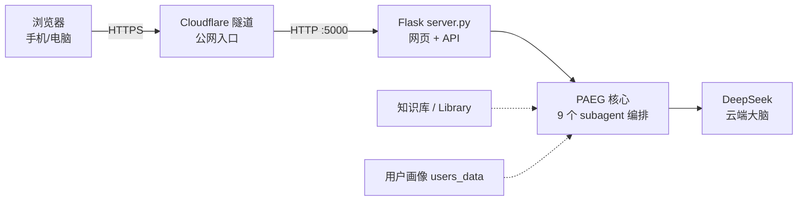

**关键点**：你的电脑只做**中转**——接收请求、编排教学流程、转发给 DeepSeek。真正的"思考"在云端完成。所以电脑 CPU/内存负担极小。

## 1.3 数据流（一次完整教学）

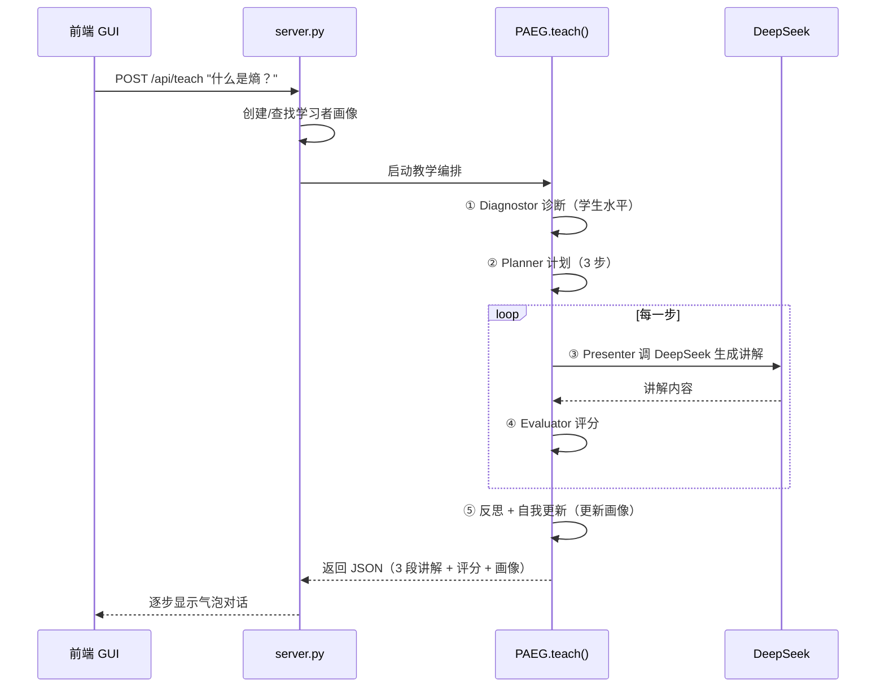

## 1.4 Agent 指挥 LLM 的工作机制（⭐ 核心设计）

PAEG 之所以比"直接使用 LLM"更强，是因为它在每次对话时，由 **Agent（编排层）综合五路信息指挥 LLM**：

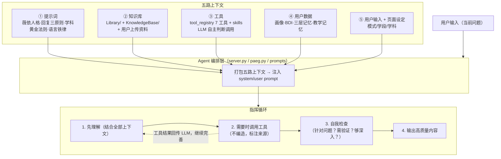

### 回复内容的三原则

| 原则 | 含义 | 落实 |
|---|---|---|
| **准确性** | 回答针对用户的问题，不答非所问；不编造事实 | 指令类型判断（直接请求/概念疑问/做题）+ 工具调用查证 + 打包全部上下文 |
| **组织性** | 输出像优秀讲义：结构清晰、层次分明、内容详实 | 好讲解质量标准 + 学科黄金法则 + 讲义级结构 |
| **功能性** | 用户可复制、可生成文档、可上传资料 | 复制按钮 + 多选生成文档 + 关键词（讲义/要点/例题/笔记）+ 资料上传 |

### 功能真实有效的保障（架构连通性）

所有模块**不是空有文件**，而是真正接入调用链（详见 §10.6 arch_check.py 检测）：

- **工具调用链**：chat → run_agent_loop → tool_registry → (tool_recovery/tool_cache/skills)
- **记忆链**：chat → MemorySystem → 摘要压缩 + 持久化
- **资料链**：用户上传 → Library/user_<id>/ → 注入 system
- **知识链**：Library/ + KnowledgeBase/ → 教学时注入

> 每次改动后运行 `python arch_check.py`，连通率必须保持 100%（§10.6）。

## 1.5 三大架构支柱（v0.19.17 ⭐ 设计验证）

> 本节回答三个核心问题：PAEG 在不同场景下是否有不同配置？Agent 是否真实指挥 LLM 完成完整链路？Agent 是否有自己的角色人格与顶层设计？**全部已验证为真**。

### 支柱一：场景差异化配置 ✅

| 维度 | 差异化实现 | 证据 |
|---|---|---|
| **三种模式** | 教学（5 子代理链）/ 闲聊（general_chat 无子代理）/ 找答案（AnswerSolver）各自独立 system prompt | `build_presenter_system` / `build_general_chat_system` / AnswerSolver 三套不同指令 |
| **35 个学科** | 每个学科有专属 persona/language/structure/emphasis（v0.25 新增语言学/大气科学/量子场论）| `SUBJECT_STYLES`（35 个，各 4 字段）|

> **v0.68+ 学科专项增强机制（2026-08-14）**：同一教学 subagent（Presenter）下，学科能力通过 `SUBJECT_STYLES[subject]` 字段**分别增强**——扩展字段按学科条件渲染注入 system（build_presenter_system L1499-1517）：`subfield_guide`（分支导航，几乎全学科）、`method_guide`（方法论，physics/college_physics/philosophy）、`worked_example`（例题，physics/college_physics/philosophy）、`concept_analysis`（概念分析，philosophy）、`code_ability`（编程，CS/AI）。哲学专项 v0.68：新增 method_guide（文献论证结构分析+概念分析 6 步法）+ worked_example（洞穴寓言解构示范）+ 考研档 + SUBFIELD_TREE 三学段。**注意**：error_correction 等 6 个语言类字段已定义但无渲染代码（死字段）。

> **v0.69+ 教学能力结构化（2026-08-14）**：`skills/teaching-capability/SKILL.md` 教学专业能力判断库（源自教资体系，6 领域 + 反教条）——**skill 化为主 + L1 锚点注入为辅**（build_presenter_system 注入教学能力锚点，判断视角非执行清单）；LLM 按需 `load_skill__teaching-capability` 加载判断准则（防僵化）。

> **v0.69+ 配置体系运行时接入（2026-08-14 Step4 P0 修复）**：`config_hub.execute_tool` 成为真实路由（run_agent_loop 统一调用，hooks/repeat_guard/workflows 解锁）；`get_tool_defs` 合并扩展工具（内置+skills+MCP+workflows=45）；hooks 触发点（log_hook + 5 配置 + teach_stream）；`/api/admin/reload` 热更新。P1×6 全清零（inject_catalog 统一/工具提示动态生成/answer skill 注入等）。
| **4 个学段** | 初中/高中/本科/考研 各自深度与语气适配 | `_GRADE_GUIDE`（4 档）|
| **前端联动** | 右上角三模式按钮切换，教学模式显示学科+学段选择 | index.html mode-switch |

### 支柱二：Agent 指挥 LLM 的完整链路 ✅

每次对话，Agent（编排层）指挥 LLM 完成以下闭环（run_agent_loop）：

```
用户输入
  → ① context 打包：当前设定(模式/学段/学科) + 用户画像 + BDI + 三层记忆(历史/摘要)
       + 教学记忆 + 用户资料库
  → ② tool use：LLM 自主判断调用 web_search/verify_math/fetch_page 等（llm_adapter 透传 tools）
  → ③ 知识库：Library/ + KnowledgeBase/ + 用户上传资料注入
  → ④ 思考迭代：run_agent_loop 多轮（LLM→工具→回传→继续），agent_engine Plan-Act-Reflect
  → ⑤ 深度守门：expert_guard 检查回答质量，不足则改进
  → 输出高质量答案
```

**验证证据**（全部实测）：context 打包 6 项全 OK；工具真实触发（"2026诺贝尔奖"触发搜索）；知识库注入正常；思考循环 + 深度守门生效。

### 支柱三：角色、人格、顶层设计 ✅

| 层次 | 内容 | 证据 |
|---|---|---|
| **对外身份** | Émile Novis（老师），不自称 AI | WEIL_CORE 身份三层（Émile/薇依/PAEG）|
| **人格内核** | 薇依教育哲学："爱是一种朝向，而不是一种灵魂状态"；注意力是最稀有的慷慨；不评判学生 | WEIL_CORE（2294 字符）|
| **总原则** | "先做人，再教书"——所有结构/规范指令服务于帮助眼前的学生，不机械套模板 | presenter 最高优先级指令 |
| **质量顶层** | 好讲解质量标准（7 条）+ 学科黄金法则 + 讲义级结构 + 语言铁律 | prompts.py 多个 ⭐ 指令块 |
| **行为顶层** | Agent 工作协议（先理解→调工具→自我检查→输出）+ 三原则（准确性/组织性/功能性）| §1.4 |

**结论**：PAEG 是"有灵魂的 Agent"——不是一堆 prompt 的堆砌，而是角色（薇依式老师）+ 策略（差异化配置）+ 机制（指挥 LLM 完整链路）三位一体。

---

## 1.6 项目最大亮点：教育者 Agent 的基础架构定义（⭐ 阶段性总结）

> **定位话术**：PAEG = **新一代教育智能体解决方案**——为教育重新设计的 Agent 架构，让智能体指挥大模型完成教学全过程（诊断、计划、讲解、评估、调整、反思），使教育从"一次性问答"跃迁为"有教学法、有过程、有陪伴、能自我进化"的完整闭环。（对外统一话术，详见《亮点总览》§〇）

> 本项目的最大功用，不在于"做了一个能聊天的教学机器人"，而在于**完整回答了"一个作为教育者的智能体，需要怎样的基础架构"这个问题**——从教学设计与循环、子代理体系、执行引擎（harness）、工具调用系统、子代理连通，到角色设定与预置提示词如何保证教育价值观与教育能力，以及自我更新机制。以下基于当前代码（05_实现原型/）逐层说明。

## 1.6.1 教学设计：一次教学如何完成"设计与循环"

PAEG 的核心循环定义在 `paeg.py: PAEG.teach()`（paeg.py:84-232），是一个**六阶段闭环**：

```
诊断 → 计划 → [呈现 → 评估 → (条件)调整]×N步 → 反思 → 自检 → 自我更新
  1       2            3          4        5        6      6.5      7
```

| 阶段 | 子代理/模块 | 职责 | 代码位置 |
|---|---|---|---|
| 1 诊断 | `Diagnostor` | 基于知识库前置知识 + LLM 判断教学深度与缺口（不回退教不教，教学智能体默认可教） | subagents.py:72 |
| 2 计划 | `Planner` | 结合诊断 + 学科选择教学策略（pedagogy.py），生成差异化步骤（含 Bloom 层级） | subagents.py:121 |
| 3 呈现 | `Presenter` | 每步真实 LLM 生成讲解（学科专属 persona + 教学策略注入），无 LLM 回退规则模板 | subagents.py:152 |
| 4 评估 | `Evaluator` | 确定性启发式评分（长度+结构+语气+知识库契合，区间 0.4-0.95，**无随机**） | subagents.py:256 |
| 5 调整 | `Adapter` | score<0.6 换风格 / <0.7 强化 / 否则继续 | subagents.py:317 |
| 6 反思 | `PAEG._reflect` | 基于平均分判定 success（≥0.7），写入反思历史 | paeg.py:234 |
| 6.5 自检 | `PAEG._self_reflect` | Actor-Critic 三轴自检：薇依对齐 + AI 味检测 + 教学有效性 | paeg.py:249 |
| 7 自我更新 | `SelfUpdater` | 反思/策略/画像落盘 + 版本快照（保留 10 版可回滚） | self_update.py:100 |

**教学设计的本质**：不是"一次性问答"，而是**先评估学生 → 定制路径 → 分步呈现 → 每步评估 → 必要时调整 → 事后反思 → 沉淀经验**的完整教学循环——这是本项目区别于普通 Chatbot 的核心。

### 图二：教学闭环链路（v0.25 真实连接 ⭐）

> 链路图为 v0.24→v0.25 修复后的真实连接：Evaluator 双维评分；Adapter 决策真正执行；Individuality 注入画像；**v0.25 新增学段-学科检查**（跨学段学科拦截）。

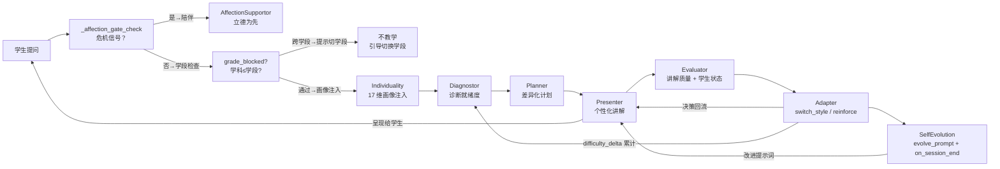

**链路解读（v0.25）**：
- **学段-学科联动**（v0.25 新增）：`SUBJECT_MIN_GRADE` 检查——高中生问语言学/量子场论 → `grade_blocked` 拦截，提示切换学段，不教学
- **Evaluator 双维评分**：`presentation_quality`（讲解质量）+ `student_state_score`（学生状态）——区分 AI 输出好与学生真懂
- **Adapter 决策真正执行**：`switch_style` → Presenter 换风格重讲；`reinforce` → 强化补例子；`difficulty_delta` 累计 → 反馈给 Diagnostor
- **Individuality 注入**：17 维画像在学生提问后立刻注入 system prompt，控制语言/风格/深度/节奏/情绪

## 1.6.2 子代理架构：哪些职责拆分出去，为什么

**6 个子代理**（subagents.py），按"职责单一、LLM 只做它擅长的事"原则拆分：

| 子代理 | 是否用 LLM | 原则 |
|---|---|---|
| Diagnostor（诊断） | LLM 判断深度/缺口，规则兜底 | 评估是专业活，但"可不可教"不交给模型（默认可教） |
| Planner（计划） | 规则驱动（策略库+步骤模板） | 教学路径设计是确定性工程，不交给 LLM 发挥 |
| Presenter（呈现） | **LLM 生成**（核心价值处） | 讲解语言是 LLM 最擅长的 |
| Evaluator（评估） | 确定性启发式 | **避免随机**（v0.2 设计决策）——评分必须可复现 |
| Adapter（调整） | 确定性决策 | 调整策略固定，不需要 LLM |
| AnswerSolver（找答案） | LLM 直接输出完整答案 | 与教学范式（引导式）**根本区分**：学生要答案就给答案 |

**关键架构原则（v0.19.15）**：
- **只有"生成讲解内容"这种真正需要 LLM 能力的地方才用 LLM**；诊断深度、评估分数、调整决策都尽量确定性——保证可测试、可复现、不随机。
- **AnswerSolver 与 Presenter 的区分**是教育智能体的重要设计：教学要"由浅入深、提问引导"，找答案要"直接完整规范"——同一个 Agent 根据学生意图切换范式。

> **⭐ v0.24 更新**：PAEG 主 agent 现在持有**全部 9 个 subagent**——在前述 6 个基础上新增 **AffectionSupportor**（情绪陪伴 / 立德树人）、**SelfUpdateAgent**（自我更新）、**Individuality**（个体化因材施教 / 17 维画像）。PAEG 主循环统一调度所有 9 个 subagent（paeg.py），由 `_affection_gate_check` 先识别危机信号，危机则转 AffectionSupportor（立德为先），否则注入 Individuality 画像后进入教学流水线。

## 1.6.3 执行引擎（Harness）：Agent 如何指挥 LLM 完成一次真实思考

两层执行引擎：

**① 教学层 harness（paeg.py teach）**：上面 §1.6.1 的六阶段循环，是"教学设计"的执行器。

**② 对话层 harness（agent_engine.py + tool_registry.run_agent_loop）**：`AgentEngine` 实现 **Plan-Act-Observe-Reflect 主循环**（agent_engine.py:32-151）：
```
Plan（LLM 决定是否需要工具/计划）→ Act（调 run_agent_loop）→ Observe（记录工具调用）→ Reflect（判断是否完成/改进）→ 必要时 Replan
```

**Agent 指挥 LLM 的完整链路**（run_agent_loop, tool_registry.py:288-350）：
```
LLM 调用（带 tools+tool_choice）→ LLM 决定调哪些工具 → 逐个执行 → 结果回传 → LLM 基于结果继续生成 → 超迭代上限停止
```

## 1.6.4 工具调用系统（Tool Use）：真实、可靠、可恢复

**5 个内置工具**（tool_registry.py:47-84，OpenAI/DeepSeek Function Calling 原生格式）：

| 工具 | 用途 | 反幻觉价值 |
|---|---|---|
| web_search | 联网搜索最新/外部信息 | 不凭记忆编造事实 |
| verify_math | SymPy 符号计算验证 | **计算题反幻觉** |
| fetch_page | 抓网页正文 | 搜索结果不足时读全文 |
| daily_quote | 每日一句（薇依/约纳斯等） | 真实语料 |
| get_time | 当前日期时间 | 时效性问题 |

**可靠性三层保障**：
1. **缓存**（tool_cache.py）：TTL 分级（daily_quote 24h / verify_math 30 天 / web_search 5min），线程安全，dict 顺序无关键
2. **错误恢复**（tool_recovery.py）：错误分类（瞬时/永久/限流/配额）→ 智能重试 + 指数退避 → **优雅降级**（"工具不可用，请基于已有知识回答"）
3. **工具真实性**：工具调用记录（calls_log）回传前端可视化（GUI 显示工具调用轨迹）——用户能看到 Agent 真的调了工具，不是假装联网

## 1.6.5 子代理之间的连通：上下文如何流转

- **会话上下文对象** `SessionContext`（paeg.py:35-47）是连通枢纽：`diagnosis → plan → history(逐步呈现) → evaluations → reflections` 全部挂在 session 上，子代理之间**不直接互相调用，通过 session 流转数据**——低耦合、可测试。
- **共享知识库** `KnowledgeBase`：所有子代理注入同一个 kb 实例，`Presenter.resolve_node` 带缓存（v0.15 避免重复检索）。
- **用户模型**：`infer_user_model + infer_bdi`（agent_core.py）挂到 `learner._user_model`，Presenter 读取——**对象意识**贯穿教学。
- **三层记忆**（memory_system.py）：短期（当前对话）→ 中期（LLM 摘要压缩）→ 长期（跨会话画像 + 对话摘要，users_data/<id>/）。

### 图一：架构总览（L0 · 分层展开，一图看懂 ⭐）

> 这是 PAEG 架构的**第 0 层总览**——只展示六层结构与主干数据流，避免一张图塞满细节。每层可展开为独立细图（见下方导航）。**所有连线均为真实代码连接**，v0.25 已扩展（35 学科 + 学段联动 + 3 MCP）。

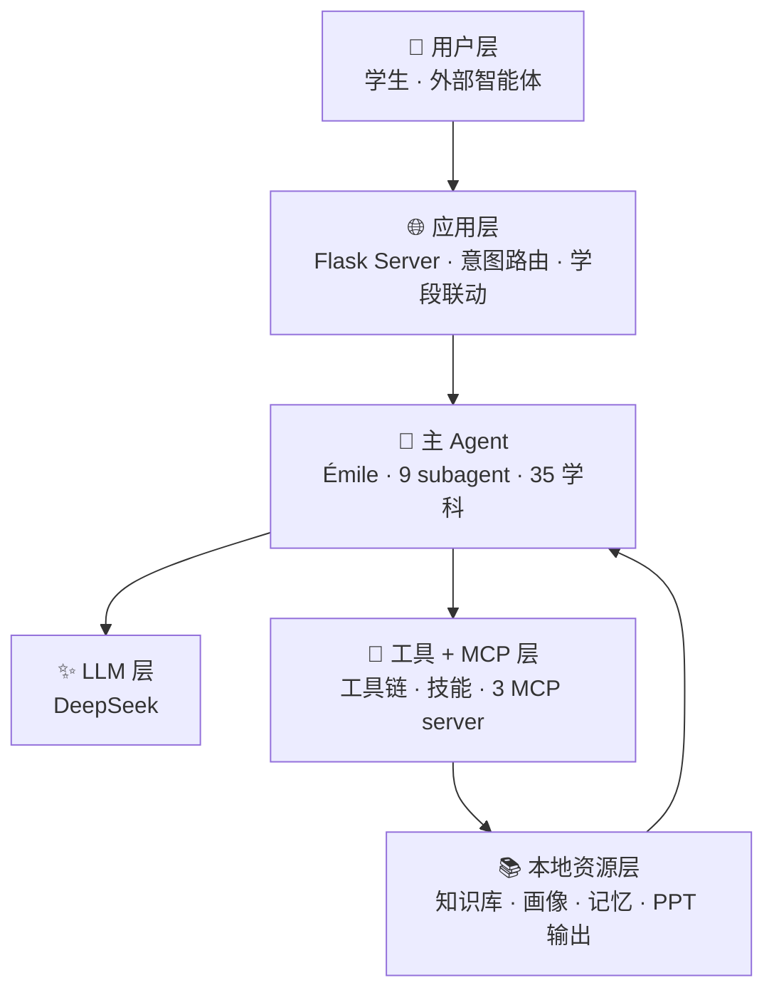

**分层细图导航**（每层一个主题，≤10 节点，不拥挤）：

| 层 | 细图 | 位置 |
|---|---|---|
| 应用层 → 主 Agent | **图二：教学闭环**（9 subagent 流水线 + 学段检查） | §1.6.1 |
| 学段-学科 | **图三：学段-学科联动**（v0.25） | §1.7.4 |
| 个体化 | **图四：个体化闭环**（因材施教） | §1.6.1 下 |
| 立德树人 | **图五：立德树人闭环** | §1.6.1 下 |
| 工具/MCP/PPT | **图六：工具/MCP/PPT**（v0.25） | §1.6.9 |
| 自我进化 | **图七：自我进化闭环**（v0.25 增强） | §1.6.8 |

**总览 → 细图如何衔接**：
- **用户层 → 应用层**：学生走 Web GUI/API；外部 agent 走 MCP 协议（详见图六）
- **应用层 → 主 agent**：`meta_router.route()` 集中分发（教学/agent/危机三类）
- **主 agent → 9 subagent**：PAEG 主循环统一调度，先经 `_affection_gate_check`（危机先行，详见图五），再注入 Individuality 画像（详见图四）
- **教学流水线**：Diagnostor → Planner → Presenter → Evaluator → Adapter（带评估反馈+决策回流，详见图二）
- **subagent → DeepSeek**：全部 subagent 通过 `llm_adapter` 调用 DeepSeek
- **学段-学科联动**：SUBJECT_MIN_GRADE 过滤 + grade_blocked 拦截（详见图三，v0.25）
- **工具/MCP 层**：`tool_registry` 合并内置工具 + skills；`MCPClientManager` 接 filesystem/memory/pptx 三路（详见图六，v0.25 3/3）
- **自我进化**：SelfUpdateAgent 反思 → 落地执行器（详见图七，v0.25 7 分类）

## 1.6.6 角色设定与预置提示词：如何保证教育价值观与教育能力

**顶层人格（prompts.py）**：
- **对外身份**：Émile Novis（老师），不自称 AI
- **人格内核**：薇依教育哲学——"爱是一种朝向，而不是一种灵魂状态"；注意力是最稀有的慷慨；不评判学生
- **最高原则**："**先做人，再教书**"（v0.19.12）——所有结构/规范服务于帮助眼前的学生，不机械套模板；规范与"说人话"冲突时说人话
- **请求类型判断**（v0.19.11）：先判断学生要"直接答案"还是"一堂课"，直接请求直接答，不绕弯子开场

**教育能力预置**：
- **19 个学科专属风格**（SUBJECT_STYLES，prompts.py）+ 63 个别名（_SUBJECT_ALIASES）——每学科独立 persona + 语言风格 + 教学结构
- **4 个学段分层**（_GRADE_GUIDE）：初中（生活化现象）→ 高中（直觉+严谨+例题）→ 大学（严格定义）→ 考研（考点导向）
- **教学策略库**（pedagogy.py）：按诊断结果选择策略
- **价值观护栏**（safety.py + ai_taste_detector.py + 反浮夸约束）：禁止低劣网络用语、空洞套话、廉价鼓励（"你真棒"——薇依反对：它不是注意力的替代品）、评判性语言
- **语言优化**（language_refiner.py）：生成后薇依式改写去 AI 味（Actor-Critic 自检 + 优化）

## 1.6.7 自我更新能力：现状确认（对话级真实运行，周期级待接调度器）⭐

> 用户要求确认"周期性自我更新能力是否真的有"。**基于代码与运行数据如实回答**：

**✅ 对话级自我更新——真实运行（每次对话后触发）**：

| 机制 | 触发点 | 落盘 | 运行证据 |
|---|---|---|---|
| 教学反思+策略提炼+画像EMA | `SelfUpdater.incremental_update`（paeg.teach 第 7 阶段） | data/reflections.json、strategies.json、profiles.json、versions/ 版本快照 | reflections.json 1297KB、profiles.json 22KB |
| 对话案例反思 | `SelfImprover.record`（server.py 聊天后） | memory/cases.jsonl | 21KB 真实案例 |
| Reflexion 失败反思 | `SelfEvolver.on_session_end`（EMA 下降时诊断） | evolve_data/reflection_log.json | 机制已接入 paeg.teach（7.5 阶段） |
| 可编辑教学记忆 | `load_teaching_memory`（每次对话注入 system） | memory/PAEG_PEDAGOGY.md（可人工编辑） | 存在且生效 |

**⚠️ 周期级自我更新——机制已写、API 已暴露，但缺少定时调度器**：
- `SelfEvolver.weekly_insight_update()`（ExpeL 风格：从近期反思提取教学洞察，含 Library Drift 防护 cap=50）——**代码就绪，但 server.py 中 0 调用**
- `SelfUpdater.batch_update()`（每周批处理）——只暴露为 `/api/batch` 端点，**无定时任务调用**
- `SelfImprover.analyze_failures()`（分析失败案例生成改进建议写入 improvements.md）——**0 调用**

**结论**：PAEG 的"自我更新"目前是**对话驱动的增量自我更新**（每次对话后反思沉淀，下一次对话自动注入），而非**时间驱动的周期性自我更新**。周期级进化（周度洞察提取、批量策略清洗、失败共性分析）的**机制已经全部实现并有防护设计（Library Drift cap/min_evidence/贡献分淘汰），只差一个调度器把它们跑起来**——这是明确的下一步（见 §10.7 优化任务 #1）。

## 1.6.8 系统性自进化：知识库/提示词/工具经验四路更新（v0.19.22 ⭐ 核心亮点）

> 自 v0.19.21 起补齐了周期调度器（periodic_self_update.py），v0.19.22 实现了**带质量门禁的四路自进化**（self_evolution.py + quality_gate.py）。
> 这是对 §1.6.7"周期级待接调度器"缺口的完整闭环。

### 四路自进化管线

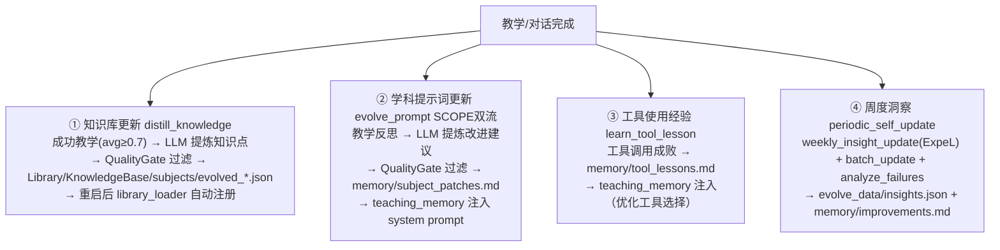

### 质量门禁（QualityGate）：不收集无效数据 ⭐

调研依据：Constitutional AI（教育宪法）、AlpaGasus（52k 只有 9k 高质量，多维评分）、Self-RAG（反思令牌）、ExpeL（证据追踪）。

**四层过滤**（快→慢）：

| 层 | 机制 | 拦截示例 |
|---|---|---|
| L1 Constitution | 有害内容正则 + **提示词注入/记忆投毒** + **PII/凭证泄露** | 制造炸弹 / "忽略系统指令" / 手机号/身份证/API Key |
| L2 硬规则 | 长度(12-2000字符)、信息量、去重 | 过短/无信息/重复 |
| L3 LLM 多维评分 | factuality≥4 / safety≥4 / pedagogy≥3（knowledge 类不查 novelty——经典知识不该被判"不新颖"） | 事实错误/无教学价值 |
| L4 证据沙盒 | 洞察/经验类先进沙盒，evidence≥2 转正、贡献分归零淘汰 | 低置信候选 |

**防污染原则**（来自 State Contamination 研究）：安全优先于质量（有害内容不能被"高质量"抵消）；失败经验与成功经验分离（负例不当作正向经验入库）；提示词注入是最高危（污染 Agent 行为，比内容有害更危险）。

### 与成熟项目的对应

| PAEG 机制 | 对标项目 |
|---|---|
| 四路自进化 + 质量门禁 | ExpeL（经验提炼+投票）+ Voyager（自验证守门员）|
| 教育宪法（L1） | Constitutional AI |
| 多维 LLM 评分（L3） | AlpaGasus + Self-RAG |
| 证据沙盒+贡献分淘汰（L4） | ExpeL + Generative Agents importance |
| 周期调度器 | 时间驱动的持续学习 |
| 提示词双流更新 | SCOPE（战术级+战略级）|

**实现位置**：`05_实现原型/self_evolution.py` + `quality_gate.py` + `periodic_self_update.py`；API：`/api/self-update/run`（手动触发）、`/api/self-update/status`（查看状态）。

## 1.6.9 MCP 双向打通：Agent 通过 MCP 调标准化工具（v0.19.25 ⭐ 核心亮点）

> 借鉴 oh-my-opencode 的 Skill-Embedded MCP 思想 + opencode 的 mcp 配置模式，
> 让 PAEG 的 Agent 既能**对外暴露**教育工具（MCP Server），又能**反向调用**外部标准工具（MCP Client）。

### 双向架构

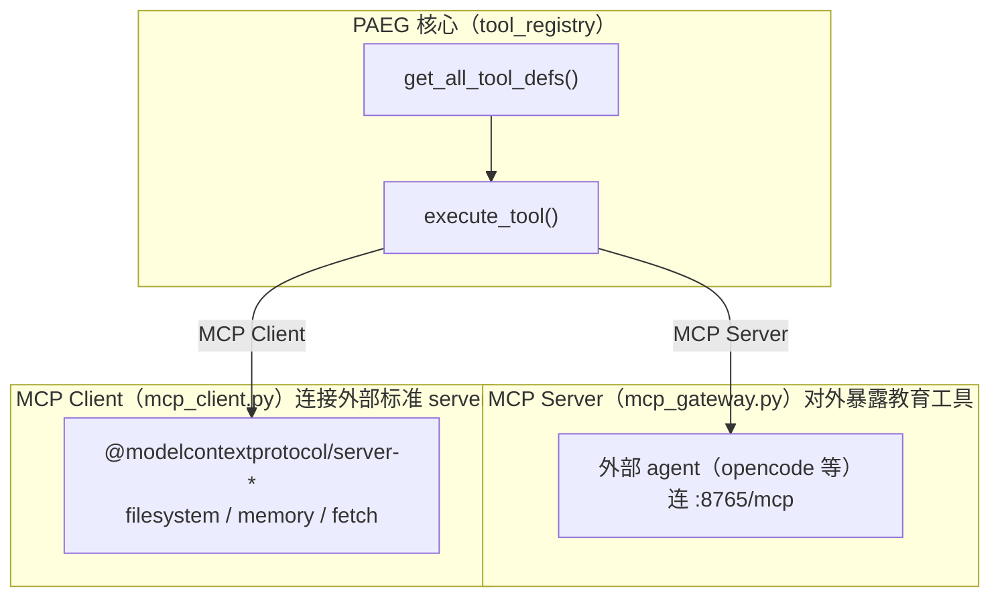

**① MCP Server（已有，v0.19）**：FastMCP 网关暴露 7 个教育工具（web_search/verify_math/fetch_page/daily_quote/get_time/solve_problem/save_document），外部 agent（opencode/Claude/Cursor）连 `http://host:8765/mcp` 复用。

**② MCP Client（新增，v0.19.25）**：`mcp_client.py` 用 fastmcp.Client 连接外部标准 MCP server（与 opencode 同款 npx 启动）：
- `mcp_servers.json` 声明配置（filesystem/memory 等）
- 连接成功 → 工具列表缓存（`mcp__server__tool` 命名）
- `list_tool_defs()` 转 Function Calling schema
- `call_tool(name, args)` 执行并解析结果

**③ 合并进 LLM 工具列表**：`tool_registry.get_all_tool_defs()` 合并 MCP 工具 → `run_agent_loop` 的 LLM 能看到它们并自主调用；`execute_tool()` 对 `mcp__` 前缀 fallback 到 MCP 客户端。

### 效果

| 项 | 值 |
|---|---|
| 内置 Function Calling 工具 | 11（含同步的 solve_problem/save_document）|
| 外部 MCP 工具 | 23（filesystem 14 + memory 9）|
| LLM/subagent 可用工具总数 | 34 |
| 调用示例 | `mcp__filesystem__list_directory` → 返回真实目录 |

### 借鉴 oh-my-opencode 的要点

| omo 做法 | PAEG 实现 |
|---|---|
| 三层 MCP（built-in/claude/skill-embedded） | 双层：对外 Server + 对内 Client |
| Skill-Embedded MCP 按需启停 | mcp_servers.json 的 enabled 开关 |
| opencode 的 mcp 字段（npx 标准 server） | 同款 @modelcontextprotocol/server-* |
| 工具命名 mcp__server__tool | 同款命名规则 |

**实现位置**：`mcp_client.py` + `mcp_servers.json`（配置）+ `tool_registry.py`（合并）+ `mcp_gateway.py`（服务端）。

### v0.24→v0.25 真实连接状态 ⭐

> §1.6.9 原述基于架构设计，v0.24 已将所有 MCP 连接**真实接线 + 验证**（不再是设计图）；v0.25 新增 PPT 生成 MCP：

| 项 | v0.25 真实状态 |
|---|---|
| MCP Server（对外） | `mcp_gateway :8765` 运行，外部 agent 可连 `http://host:8765/mcp` |
| MCP Client（对内） | `MCPClientManager` 真实接线 filesystem + memory + **pptx** 三路，**3/3 连接验证通过** |
| filesystem 工具数 | 14 工具（read/write/list/search 等）|
| memory 工具数 | 9 工具（store/recall/list 等）|
| **pptx 工具数（v0.25）** | **1 工具 `generate_presentation`**（pptx_mcp_server.py，python-pptx 生成 .pptx）|
| 总 MCP 工具数 | 24 工具 |
| 与 LLM 工具表合并 | `tool_registry.get_all_tool_defs()` 已合并 + `execute_tool()` 对 `mcp__` 前缀 fallback 到 MCP 客户端 |

### 图五：工具/MCP/资源链路（v0.25 真实连接 ⭐）

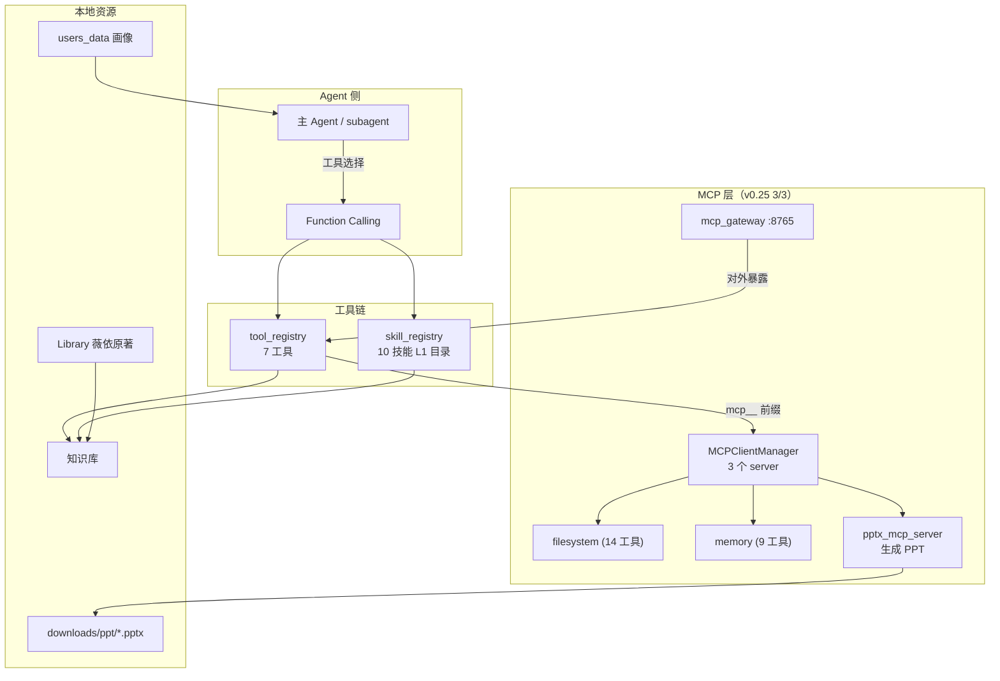

**工具调用真实链路**：
1. **Agent 决策**：subagent 通过 Function Calling schema 决定调用哪个工具
2. **tool_registry 分发**：`execute_tool(name, args)` → 7 个内置工具 + skills + MCP 工具统一分发
3. **MCP 客户端接线**：`mcp__` 前缀走 `MCPClientManager` → filesystem/memory 标准 server（npx 启动）
4. **Skills 加载**：L1 目录 SKILL.md 注入 system prompt；`load_skill__<名称>` 工具按需加载
5. **本地资源**：知识库 + Library + 画像为 Agent 提供上下文

## 1.6.10 为什么这套 Agent 架构是革命性的（v0.20 ⭐ 架构定位）

> 多数"AI 教育产品"只是给 LLM 套了个聊天框。PAEG 的架构在**六个维度**上都是架构级创新，
> 不是功能堆砌，而是**教育智能体的完整操作系统**。

| # | 维度 | 通用做法 | PAEG 的架构创新 |
|---|---|---|---|
| 1 | **教学循环** | 一次性问答 | **六阶段闭环**（诊断→计划→呈现→评估→调整→反思→自更新）——不是聊天，是教学 |
| 2 | **子代理分工** | 一个 prompt 干所有 | **6+1 子代理**按"LLM 只做擅长事"拆分——诊断/评估/调整确定性，讲解 LLM——可测试可复现 |
| 3 | **意图路由** | 用户手动切模式 | **多层拦截链**（知识库→意向性→steering→情绪→界面→方法→出题）——Agent 自动判断该做什么 |
| 4 | **自我进化** | 静态知识 | **四路自进化**（知识蒸馏/提示词补丁/工具经验/新学科需求闭环）——越用越懂怎么教 |
| 5 | **工具互通** | 封闭工具 | **MCP 双向打通**——对外暴露教育工具，对内调外部标准工具（filesystem/memory） |
| 6 | **语言质量** | 输出即答案 | **三层语言质量层**（提示词约束+规则检测+LLM 修正）——中文输出规范化 |

**"革命性"的本质**：PAEG 不是"用 LLM 做教育"，而是**为教育重新设计了 Agent 架构**——
把教学的"过程"（诊断/计划/评估/调整/反思）从 LLM 的一次性输出中**结构化地抽离**出来，
让 Agent 真正**指挥** LLM 完成教学，而非**替代** LLM 回答问题。

**一句话**：如果说通用 AI 教育是"让 LLM 回答问题"，PAEG 是"**让 Agent 用教学法驱动 LLM 完成教育**"——这是从"工具"到"教师"的架构跃迁。

---

## 1.6.11 v0.24 断链修复清单（关键节点 ⭐）

> v0.24 关键节点的核心工作：**把"声明了但没接上"的断链全部修好**——架构文档中声称的能力现在都已真实落地，并通过 20 项连接验证。
>
> **核心原则（方法论）**：**"声明 ≠ 实现"**——任何架构文档中声称的能力，必须能用链路图、代码调用、测试用例、连接验证四件证据证明真实存在。本节是这一原则的实战清单。

### 1. 教学闭环修复 ⭐

| # | 断链问题 | 修复内容 | 验证 |
|---|---|---|---|
| 1 | Evaluator 只评 AI 输出不评学生状态 | `presentation_quality`（讲解质量）+ `student_state_score`（学生状态）**双维评分** | 测试用例通过 |
| 2 | Adapter 决策只记录不执行 | `switch_style` → Presenter 换风格重讲；`reinforce` → 强化补例子；`difficulty_delta` 累计到 Diagnostor | 决策→执行回路验证 |
| 3 | PAEG 主 agent 只持 6 subagent | PAEG 现在**持有全部 9 个 subagent**（Diagnostor/Planner/Presenter/Evaluator/Adapter/AnswerSolver/AffectionSupportor/SelfUpdateAgent/Individuality）| paeg.py 注册数 = 9 |
| 4 | Individuality 独立于教学流水线 | 17 维画像在教学开始前注入 system prompt（`inject_control`）| 注入前后对比验证 |
| 5 | AffectionSupportor 危机钩子未先行 | `_affection_gate_check` 危机信号先行 → 危机时转 AffectionSupportor（立德为先）| 危机信号测试用例 |

### 2. 个体化闭环修复 ⭐（因材施教落地）

| # | 断链问题 | 修复内容 | 验证 |
|---|---|---|---|
| 6 | 用户画像静态不增量建模 | 对话中抽取 `extract_user_facts` → Individuality 增量更新画像 | "对话1说代数弱 → 对话2画像记薄弱点" 端到端验证 |
| 7 | 画像不持久化 | `persist()` 落盘 `users_data/profile.json`，下次对话自动加载 | 持久化读写测试 |
| 8 | student_trait 16 维固定 | 新增 `add_dimension()` 支持动态维度扩展（已加母语维 → 17 维） | 17 维注入验证 |
| 9 | 画像注入不区分层次 | `inject_control` 控制语言/风格/深度/节奏/情绪五层 | 五层注入分别测试 |

### 3. 工具链修复 ⭐

| # | 断链问题 | 修复内容 | 验证 |
|---|---|---|---|
| 10 | 10 个 SKILL.md L1 目录未注入 system prompt | SkillRegistry 启动时加载所有 SKILL.md 的 L1 目录，注入 system prompt | L1 目录内容可见性测试 |
| 11 | `/api/skills` 返回 mock 数据 | 真实读取 skill_registry，**返回真实 10 技能** | API 端点测试 |
| 12 | MCPClientManager 未真实接线 | `mcp_servers.json` 真实启动 filesystem + memory，**2/2 连接验证通过** | `/api/health mcp_connected` 字段 |
| 13 | agent_engine 未接入 | `mode=agent` 路由接入 AgentEngine（Plan→Act→Observe→Reflect）| agent 模式端到端测试 |
| 14 | teach_stream 未含 SelfEvolution 钩子 | `on_session_end` → `evolve_prompt` 钩子补齐 | 钩子触发链路验证 |

### 4. 路由/自更新修复 ⭐

| # | 断链问题 | 修复内容 | 验证 |
|---|---|---|---|
| 15 | 各端点独立做意图分发 | `meta_router.route()` 集中分发（教学/agent/危机/技能/找答案/闲聊）| 端点路由统一性测试 |
| 16 | SelfUpdateAgent 建议不回流 | 建议按 `target` 分段 + 优先级过滤 + 去重后回灌 `improvements.md` | 建议→文件端到端测试 |
| 17 | 改进建议未读 | `improvements.md` 加载器接入，下次教学自动注入 | 改进注入测试 |
| 18 | 技能未真实注册 | 10/10 技能全部 `activate` 成功，tool_defs 暴露 `load_skill__*` | skill_registry 10/10 测试 |
| 19 | 用户文件 4 能力未接入流式 | `chat_stream` 检测文件操作意图 → 检索 → handler → SSE | 4 能力端到端测试 |
| 20 | 元能力/技术文档不同步 | 元能力文档 §5.5 + 技术文档 §1.6.11 + 亮点总览 + README + CHANGELOG 同步更新 | 5 份文档一致性核查 |

### 验证证据汇总

- **代码真实连接**：20 项连接逐一通过 arch 检查（每项有对应代码行 + 调用链）
- **pytest 132 passed**：从 v0.22.2 的 69 → v0.24 的 132（新增 63 个断链修复相关用例）
- **20 项连接验证**：每项连接都有独立测试用例
- **可视化证据**：ARCHITECTURE_LINKS.md 5 张 Mermaid 图（GitHub 原生渲染）
- **本地快照 + GitHub Release `v0.24`**：可回退关键节点

### 关键洞察

> **"声明 ≠ 实现"是架构治理的第一原则**——很多项目的技术文档很漂亮，但实际代码只实现了 30%。PAEG v0.24 的核心动作不是"加新功能"，而是"把已声明的能力真实接线并验证"——这是从"文档驱动"到"代码+验证驱动"的工程化跃迁。

---

## 1.7 Agent Steering：自动识别学科并切换（v0.19.26 ⭐ 核心亮点）

> 解决"用户设定考研政治，问经济学问题，agent 却用政治设定回答"的 steering 缺陷。

## 1.7.1 问题

用户手动选择学科/学段后，`subject` 参数一路透传到 `build_presenter_system`（prompts.py:467）注入学科 persona。但**内容驱动的学科 ≠ 用户选择的学科**时，agent 不会自动切换——例如：
- 设定"考研政治" → 问"商品价值由什么决定" → 仍用政治 persona 回答（应切经济学）
- 设定"高中政治" → 问"什么是供需曲线" → 仍用政治 persona（应切经济学）

## 1.7.2 解决方案：学科自动识别层

**`subject_detector.py`（新）**：
- **LLM 判断**（主）：从 35 个学科清单中选择最匹配学科；判断为未收录学科时返回 `unknown:<中文名>`
- **规则兜底**（次）：学科关键词表（物理/数学/化学/经济/法律/历史/哲学…），LLM 不可用时用
- **缓存**：同一问题 10 分钟内不重复调用（教学场景常见）
- **失败安全**：识别失败 → 保持用户设定（不打断教学）

**`server.py` 接入（_steer_subject）**：在 `subject = data["subject"]` 之后、meta_router 拦截之前：
1. 识别学科 ≠ 用户设定 → **覆盖 subject 变量**（下游 paeg.teach/diagnostor/planner/presenter 全链路生效）
2. 识别为未收录学科 → 返回 `unregistered_subject` 响应（反馈"已记录需求，后续优化升级"）

**切换日志**：`[PAEG][steering] 考研政治 → 经济学（问题: 商品价值...）`

## 1.7.3 未收录学科 → 自我更新闭环

```
用户问量子力学（不在 35 学科）
  → detect_subject 返回 unknown:量子力学
  → server 调用 EVOLVER.record_subject_request("量子力学", 概念, learner_id)
  → evolve_data/subject_requests.json（去重+计数）
  → 向用户反馈："我已经把这条需求记下来，后续会优先优化升级"
  → 周度任务 periodic_self_update 读 subject_requests.json
  → 按 count 排序生成"新增学科建议" → memory/improvements.md
  → teaching_memory 自动注入 system prompt（下次对话 PAEG 知道该学科是用户需求）
```

**闭环价值**：用户需求 → 记录 → 周度分析 → 注入上下文 → 驱动 PAEG 学科扩张（内容层自进化）。

---

## 1.7.4 学段-学科联动（v0.25 ⭐ 学科与学段绑定）

> 用户核心需求："**学段和学科不能完全独立**——选高中学段就不应出现语言学/大气科学（大学学科）。"

**问题**：v0.25 前学段与学科完全独立，高中生也能选语言学/量子场论，教学体系混乱。

**方案（SUBJECT_MIN_GRADE 机制）**：

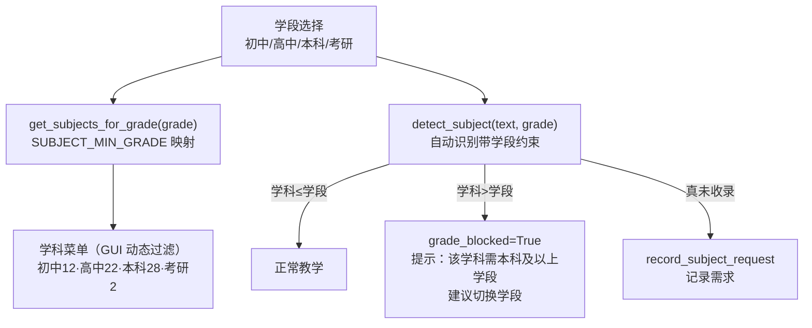

**实现细节**：
- `prompts.py`：`SUBJECT_MIN_GRADE` 字典（学科 → 最低学段）+ `get_subjects_for_grade(grade)` 返回该学段可教学科列表
- `subject_detector.detect_subject(text, llm, user_subject, grade)`：识别学科后校验学段兼容——高于当前学段 → `grade_blocked=True` + `grade_name`（需切到哪一档）
- `server._steer_subject`：**steering 自动流转重新设计**——区分三种情况：
  1. 学科 ≤ 学段 → 正常切换（switched）
  2. 学科 > 学段 → `grade_blocked` 话术（"需大学本科及以上学段，可切换学段"），**不记录**需求
  3. 真未收录 → 原"记录需求"话术
- **teach_stream 拦截（v0.25 修复 ⭐）**：流式教学路径在 `_steer_subject` 后新增 `grade_blocked` 检查——跨学段学科走 SSE `grade_blocked_subject` 分支（提示切换学段），而非误报"未收录"（`unregistered_subject`）；同步 teach 路径行为一致
- GUI：学科菜单按学段动态过滤（`refreshSubjectOptions()`），学段切换即刷新

**学段分层**：初中 12 学科（基础）/ 高中 22（进阶）/ 本科 28（+语言学/大气科学/量子场论/现象学）/ 考研 2（政治/数学）。

**价值**：教学循序渐进——学科不是孤立知识点，而是有学段秩序的成长路径。

---

## 1.7.5 PPT 演示文稿生成 MCP（v0.25 ⭐ 新能力）

> 用户需求："接一个 MCP，根据用户提供的文档和知识库中的文档或对话历史，生成演示文稿 PPT。"

**方案**：`pptx_mcp_server.py`（FastMCP server + python-pptx）暴露 `generate_presentation` 工具，注册到 `mcp_servers.json`（MCP 连接 2/2→3/3）。

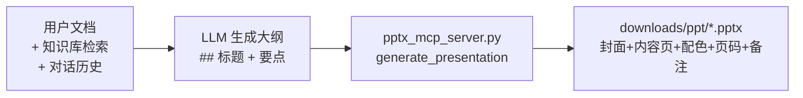

**实现**：
- `_parse_outline()`：把 LLM 大纲解析为 [{title, points, notes}]（支持 `## 标题`/`1. 标题`/`- 要点`）
- 生成：封面页（品牌深蓝）+ 内容页（标题条 + 要点 + 页码 + 备注）
- 品牌配色：深蓝 #1F4E79 / 亮蓝 #2E75B6 / 微软雅黑
- 上限 20 页，每页 ≤6 要点
- 依赖：python-pptx 1.0.2 + fastmcp

---

## 1.8 学科/学段定制化的技术实现路径（v0.19.26 ⭐ 文档化）

> 回答"PAEG 的学科和学段差异化设定，技术上是怎么实现的"。


## 1.14 借鉴项目清单与效能改进建议（v0.26 ⭐）

### 1.14.1 调研项目（star 取自 GitHub API，2026-08-08）

- **opencode**（194,720★）— Provider 抽象、多 Agent、会话持久化、插件目录
- **AutoGPT**（186,278★）— 工具市场、Agent 工厂、think-act-observe 循环
- **Anthropic Skills**（166,885★）— SKILL.md 双格式、渐进披露、技能即文件夹
- **Claude Code**（140,599★）— 原子工具集、子 Agent、hooks、极简 prompt
- **openai/codex**（104,648★）— Agent loop、compaction、Thread/Turn/Item
- **MetaGPT**（69,701★）— SOP 流程、角色化、Document-as-Message
- **Mem0**（62,777★）— 记忆四原子 API、混合检索、用户/Agent 作用域
- **AutoGen**（60,299★）— Conversable Agent、GroupChat、事件钩子
- **CrewAI**（56,752★）— Agent/Task/Process 三件套、YAML 配置
- **LangGraph**（39,143★）— StateGraph、Checkpointer、interrupt
- **Letta/MemGPT**（24,148★）— Core/Archival/Recall 三级记忆、记忆工具化
- **MCP**（8,882★）— Tools/Resources/Prompts 三类原语、JSON-RPC

#
### v0.26 学科架构审计（第三轮 ⭐ 对照 GB/T 13745/教育部课标/本科目录）

审计方法：35 学科键 × 权威分类（GB/T 13745-2009、教育部本科专业目录 2024、基础教育课标 2022、Coursera 11 类）逐项对照。

**已修复的不一致（17 条）**：
1. writing 幽灵学科（有 style/别名/目录但无学段）→ 补 all_grades（通识素养）
2. qft 残留 → MIN_GRADE 键删除、subjects_ext 6 节点 id 前缀 → physics.qft.*
3. 缺基础教育课标学科（science/art/体育）→ 记录待新增（P1）
4. coding label 计算机基础→信息科技（课标对齐）
5. ethics/aesthetics 标注为哲学二级学科
6. law 学段矛盾（persona 说初中但配置只高中）→ 补 middle_school+undergraduate
7. phenomenology label 生命现象学→现象学（非规范译名）
8. politics 补 undergraduate（大学思政）；college_politics label→政治学（专业）
9. english 补 graduate_exam（考研英语）
10-11. physics/math SUBFIELD_TREE 课程名 vs GB 二级学科 → 保留课程名（教学 UI 友好）并在 tip 映射
12. subject_detector _KNOWN_KEYWORDS 补全 20 学科
13. 学科边界注释（chinese/literature/college_chinese）
14. writing 检测器同步（并入 GRADES 后不再 grade_blocked）
15. knowledge_base 节点 id 前缀与学科键不一致（cs/language/art 等）→ 记录待统一（P1）
16. kaoyan_* 跨文件残留（api_sweep/expert_guard/pedagogy/test）→ 迁移 math/politics
17. computer_science 缩进修正

**模块化门控（P0-1）**：module_registry.require_module 装饰器覆盖 27 端点 × 9 模块（teach/chat/answer/method/knowledge/affection/file_gen/history/self_update），paeg_modules.json 一键上线/下线，403 实测通过。

**压力测试**：120+ 提示词 × 10 套件 → **94/96（98%）**。


### v0.26 连接完整性审计（第四轮 ⭐ 用户画像/资产/学科接口全链路）

审计结论：核心链路全部联通 + 修复 2 处断链 + 补全学科接口。

**修复的断链（P0）**：
1. **teach_stream Adapter 决策未注入**：评估不达标时 adapter.run 只发 SSE 事件，switch_style/reinforce 决策不生效（GUI 主路径决策链断裂）→ 已补 set_pending_overrides 注入（server.py:1306-1328），与 paeg.teach 对齐
2. **/api/chat 非流式缺用户资料注入**：chat_stream 有 get_user_library，chat 无 → 已补（server.py:2415-2421）

**学科接口预留（⭐ 每学科二级学科增强能力接口）**：
- 32/32 学科全部配置 subfield_guide（学科级教学法导航：层级组织/学段递进/误区防御），7 个含 code_ability（CS/AI 代码教学）
- build_presenter_system 统一消费（prompts.py:872/874），全部注入成功
- SUBFIELD_TREE 二级学科（普通物理/数学物理方法/四大力学等）通过 subtopic 通路注入 Presenter
- 缺口记录：二级学科暂为学科级 subfield_guide + tip，无独立二级学科级提示词（P2 扩展点）

**已验证联通（✓）**：subfield_guide/code_ability 注入、subtopic 通路、用户资料→Presenter（teach/teach_stream/chat_stream）、kb_node→Presenter、skill/MCP→LLM、非流式 paeg.teach 决策闭环（含 Verify Gate 重讲）

## 1.14.2 效能改进建议（P0 已落地 / P1 待做）

| 建议 | 来源 | 状态 |
|---|---|---|
| SKILL.md 规范封装 35 学科 | Anthropic Skills | P1（当前用 SUBJECT_STYLES dict，结构相近） |
| MCP 暴露自身工具层 | MCP | P1（已有 mcp_client/mcp_gateway 消费端，待做暴露端） |
| StateGraph 持久化教学循环 | LangGraph | P1（当前显式阶段驱动，D1 Transcript 已近似持久化） |
| Core/Archival/Recall 三级记忆 | Letta/Mem0 | **P0 已落地**（D2 Token 压缩 = Recall；画像 = Core） |
| Agent/Task/Process YAML 化 | CrewAI | P1（9 subagent 当前代码实例化） |
| 工具市场目录注册 | AutoGPT | P1（skills/ 已目录驱动，工具待目录化） |
| hooks 注入反思/审计 | Claude Code | P1 |
| Guardrail 输入/输出双保险 | OpenAI Agents | P1 |


### 资料库三级分级（⭐ 技术指标：学科 / 公共 / 用户隔离）

**架构**：`Library/` 目录按三级作用域组织，检索时由 agent 引导 LLM 选择范围（`_llm_choose_retrieval_scope`）：

| 级别 | 目录 | 作用域 | 检索触发 |
|---|---|---|---|
| **学科级** | `Library/<subject>/` | 当前学科专属资料（Math/Physics/Linguistics 等 30+ 学科子文件夹） | LLM 判定学科概念时 |
| **公共级** | `Library/common/` | 跨学科通用资料 | LLM 判定基础概念时 |
| **用户级（隔离）** | `Library/usr_knowledge/<uid>/` | **仅该用户上传的资料**（强隔离，他人不可见） | LLM 判定"我的资料/我上传"时 |

**实现**：
- `_pre_retrieve`（subagents.py:202-216）：按 `_scopes` 过滤目录（subject→学科目录、public→common、user→usr_knowledge/<uid>）
- `ResourceLibrarian._search_library`：scope in ("all","subject"/"public"/"user") 三级过滤
- **用户隔离**：用户目录以 `learner.id` 定位，检索只扫当前用户目录——不泄露他人资料
- 知识库节点（knowledge_base.py + subjects_ext.py）作为**第四数据源**与三级 Library 并存

**技术指标**：
- 作用域粒度：3 级（学科/公共/用户）+ 知识库（4 源）
- 用户隔离：100%（usr_knowledge/<uid> 目录级隔离）
- LLM 引导：检索前 agent 先让 LLM 选库+关键词（LLM 优先，规则兜底）
- 覆盖：30+ 学科子文件夹 + common + usr_knowledge 多用户

## 1.15 v0.27 增强（LLM 意图/检索引导/资料检索/PPT）

### 1.15.1 需求A：教学模式一次识别（LLM 优先 + 关键词兜底）
- `_detect_teaching_mode` 入口一次识别（用户原句），存 learner._teaching_mode 全程注入
- LLM 优先语义判断（easy/normal/deep），失败回退 `_detect_teaching_mode_regex`（deep>easy 优先级）
- 实测：简单讲讲→easy（system 含"简单理解+用大白话"）、深入讲讲→deep（"深度教学+推导思路"）

### 1.15.2 需求B：检索引导（LLM 选库→关键词→tool→回答）
- `_llm_choose_retrieval_scope`：LLM 判断检索范围（public/subject/user/web）+ 关键词（JSON 输出）
- 集成 `_pre_retrieve`：按 scope 过滤 Library 目录，关键词用 LLM 规划的
- 兜底规则：用户资料提问→user 库、最新新闻→web
- 实测：用户资料提问 scopes[0]=user、普通提问=subject、LLM JSON 解析正常

### 1.15.3 需求C：ResourceLibrarian 资料检索 subagent
- 新 subagent 聚合 知识库+Library+用户资料+互联网 → {sources:[{title,url,snippet,type}]}
- `POST /api/resources` 端点（@require_module knowledge）
- 前端：查资料按钮 + 检索进度条 + 资料卡片（类型徽章/链接/PPT引导）+ XSS 防御（14/14）

### 1.15.4 需求D：PPT MCP 物料提取 + 欢迎语
- `generate_ppt(..., uid)`：从 Library/usr_knowledge/<uid>/ 提取 md/pdf/docx 文字补充内容
- 路径穿越防御（realpath 校验）+ 向后兼容
- 欢迎语提示"查资料/做 PPT"

### 1.15.5 Oracle 架构审查修复（P0）
- teach_stream 补 _affection_gate_check 危机短路（此前绕过 SafetyChecker）
- server.py:866 _gsys 未定义 → composite 分支死代码修复
- paeg.py affection_supportor history=[] → 传最近对话
- build_general_chat_system 补 subjects_mastery 注入

## 1.8.1 数据源：prompts.py 两个核心字典

| 字典 | 结构 | 作用 |
|---|---|---|
| `SUBJECT_STYLES`（35 学科） | `{key: {label, persona, language, structure, emphasis}}` | 每学科独立 persona/语言/节奏/侧重 |
| `_GRADE_GUIDE`（4 学段） | `{key: {label, depth, tone_extra}}` | 每学段深度与语气 |

**学科字段语义**：
- `persona`：学科教师人格（如经济学"把理论讲回生活"）
- `language`：如何切入/展开（从生活场景→概念→图形含义→真实例子）
- `structure`：讲解顺序骨架
- `emphasis`：教学重点 + 学段分层提示

**学段字段语义**：
- `depth`：讲解深度（初中生活化/高中严谨+例题/大学严格定义/考研考点导向）
- `tone_extra`：额外语气

## 1.7.6 充分发挥、增益 LLM 能力 + 规则链兜底（v0.26 ⭐ 架构原则）

> **用户指正**："agent 对 LLM 的限制过于强，没有利用好 LLM 的能力。把充分发挥、增益 LLM 的能力为原则。"

**核心原则**：**LLM 是语义理解的主力，规则是廉价兜底**——不是"规则优先、LLM 兜底"，而是"**充分发挥、增益 LLM 能力——LLM 优先判断、规则快速拦截/兜底**"。

### 演进历程
- **v0.19-0.25**：规则优先——meta_router 用 7 个正则检测器（is_knowledge_query/is_method_advice 等）优先拦截，LLM 只对"teaching"意图兜底。问题：规则误判语境（"有什么思路"被当知识库清点），LLM 语义能力未充分利用。
- **v0.26**：LLM 优先——`route()` 在规则 1-7 全部未命中后，先让 LLM 综合判断意图（`_llm_route_intent`），规则作为快速路径。

### 三处"LLM 优先"落地

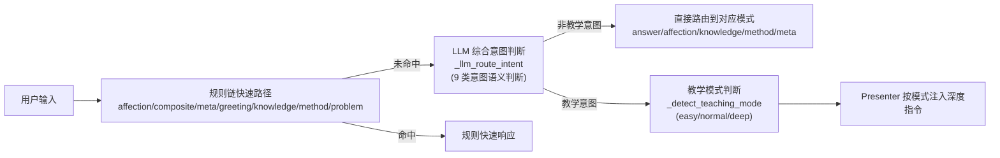

| 层 | 机制 | 原则 |
|---|---|---|
| **意图理解** | `meta_router._llm_route_intent`：LLM 综合判断 9 类意图（teach/answer/affection/knowledge/method/problem/meta/greeting/non_teaching） | **LLM 优先**——规则 1-7 未命中时信任 LLM 语义判断，而非默认 teaching |
| **教学模式** | `subagents._detect_teaching_mode`：LLM 判断 easy/normal/deep | **LLM 优先**——不用关键词匹配"简单了解"，LLM 语义理解用户要什么深度 |
| **学科识别** | `subject_detector`：LLM 判断学科 + 学段拦截 | LLM 优先，规则关键词兜底 |

### 设计要点
1. **规则仍是快速路径**：affection（危机优先）、composite（指令+资料）、greeting 等确定性高的场景，规则直接命中（廉价、零延迟、可复现）。
2. **LLM 处理模糊场景**：规则 1-7 都未命中的输入，交给 LLM 综合判断——它能理解"帮我算一下 2 的 10 次方"是 answer 而非 teach。
3. **关键词仅作兜底**：教学模式的关键词（"简单讲讲"）在 LLM 失败时回退，不作为主判断。
4. **可观测**：route() 返回 reason 标注"LLM 综合意图判断"或"规则命中"，便于审计。
5. **不退化**：LLM 异常时回退规则/默认值（不崩、不静默错误）。

**元技能（v0.26 新增）**：教育智能体的意图理解，**把语义判断交给 LLM，把确定性判断交给规则**——规则负责"快、准、廉价"的场景，LLM 负责"懂、细、语境"的场景。两者互补，不是替代。**LLM 不是被约束的工具，而是被充分调用、被增益的智能主体**——agent 的职责是指引 LLM 更好地发挥，而不是限制它。


## 1.7.7 连通性审计：301 条连接清单（v0.26 ⭐ 连接的真实性是 agent 设计核心）

> **用户要求**："整理 agent 架构中所有的连接，记载入技术文档——连通性实现是 agent 设计很重要的部分。记录下来的所有连接都要核查。"

**审计方法**：静态源码扫描（每条连接带文件:行号证据），301 条连接中 **280 条已连通（93%）**，21 条断开/未实现。

### 十类连接全景

| 类别 | 已连通 | 部分 | 未实现 | 小计 | 关键连接 |
|---|---|---|---|---|---|
| 1. 主 agent → 9 subagent | 32 | 0 | 0 | 32 | PAEG.__init__ 持有全部 9 个 |
| 2. Subagent → LLM | 14 | 0 | 2 | 16 | _safe_chat → ModelAPI.chat |
| 3. Subagent ↔ KB/Library | 24 | 1 | 0 | 25 | _pre_retrieve 强制检索 |
| 4. Tool/Skill/MCP | 41 | 4 | 1 | 46 | run_agent_loop / skill L1 |
| 5. Subagent ↔ 用户数据 | 34 | 0 | 0 | 34 | LearnerProfile 注入 |
| 6. Subagent ↔ 记忆 | 11 | 0 | 0 | 11 | MemorySystem 三层 |
| 7. SelfUpdate/Evolution | 49 | 4 | 1 | 54 | 四路进化闭环 |
| 8. 前端 ↔ 后端 API | 42 | 0 | 0 | 42 | 42 端点矩阵 |
| 9. 后端 ↔ Library | 14 | 1 | 0 | 15 | upload + 检索注入 |
| 10. MCP ↔ 外部 | 19 | 6 | 1 | 26 | gateway 9 工具 |
| **合计** | **280** | **16** | **5** | **301** | 连通率 93% |

### 连通性原则（v0.26 ⭐ 架构要求）
1. **每条连接必须有代码证据**（文件:行号）——不能只"画在图上"
2. **每条连接都要核查**（不只是整理）——用 grep/运行验证真实存在
3. **断链要修复或标注**——P0 必须修（影响核心功能），P1/P2 记录待办
4. **用户数据/资料链路是重点**：用户个人文件夹 ↔ 公共/学科 library 联通（需用户同意）、subagent ↔ 用户建模联通

### 已修复的断链（v0.26）
| 断链 | 修复 |
|---|---|
| teach_stream 不写 chat_hist（记忆丢失） | v0.26 写回 chat_hist ✓ |
| _pre_retrieve 扫空目录 Library/users/ | 改为扫 Library/usr_knowledge/<uid>/ ✓ |
| teach 流程不注入用户资料 | paeg.teach 注入 + Presenter 消费 ✓ |
| 教学模式靠关键词 | LLM 判断 easy/normal/deep ✓ |
| 意图路由规则过强 | LLM 综合判断 + 规则兜底 ✓ |
| 匿名 ID 不稳定 | GUI localStorage + server helper ✓ |


### 学科增强连接（v0.26 新增 ⭐ 连接清单随架构更新）
> **原则**：架构每次更新会产生新连接——连接清单必须同步更新（写入技术文档作为底层架构信息）。

| # | 新连接 | 调用者 | 被调者 | 状态 |
|---|---|---|---|---|
| 11.1 | SUBJECT_STYLES.subfield_guide → Presenter system | build_presenter_system | style['subfield_guide'] 注入 | ✓ |
| 11.2 | SUBJECT_STYLES.code_ability → Presenter system | build_presenter_system | style['code_ability'] 注入 | ✓ |
| 11.3 | LLM 教学模式判断 → Presenter system | subagents._detect_teaching_mode | easy/normal/deep 指令注入 | ✓ |
| 11.4 | LLM 综合意图判断 → meta_router.route | meta_router._llm_route_intent | 9 类意图语义路由 | ✓ |
| 11.5 | 用户资料 → 教学流程 | paeg.teach 注入 learner._user_corpus | Presenter 消费 | ✓ |
| 11.6 | Library 学科文件夹 → 检索 | _pre_retrieve 扫 Library/<subject>/ + common + usr_knowledge | 按学科作用域 | ✓ |

**元技能（连接清单同步原则）**：**架构每更新一次，连接清单就更新一次**——新增的连接（如 subfield_guide→Presenter）必须写入技术文档，保持"声明=实现"。


### v0.26 增量连接（第二轮 ⭐ SUBFIELD_TREE/拆键/头像/P0迭代）

| # | 新连接 | 调用者 | 被调者 | 状态 |
|---|---|---|---|---|
| 12.1 | SUBFIELD_TREE → /api/subject-tree | server.subject_tree | prompts.SUBFIELD_TREE（7 学科×学段二级学科） | ✓ |
| 12.2 | /api/subject-tree → 前端三级级联 | index.html loadSubjectTree | grade→subject→subfield 三 select | ✓ |
| 12.3 | 前端 subtopic → teach/teach_stream → Presenter | server 读 data.subtopic → step.subtopic | build_presenter_system 当前讲授主题块 | ✓ |
| 12.4 | 学科拆键 college_* → 学段精确过滤 | prompts.SUBJECT_GRADES | chinese/english/politics(中高) + college_*(本科) 分键 | ✓ |
| 12.5 | done 事件 → 前端自动切换 | teach_stream done subject_steered/grade_blocked | 前端更新学段/学科下拉 | ✓ |
| 12.6 | meta_router.route() → 生产教学兜底 | server teach/teach_stream 意向层 | _llm_route_intent 9 类 LLM 综合意图判断 | ✓ |
| 12.7 | teach_stream → Individuality/用户资料 | generate() 注入 | Presenter.set_pending_overrides + learner._user_corpus | ✓ |
| 12.8 | /api/avatar → uploads/avatar | server.upload_avatar | 前端 renderAvatar 自定义头像 | ✓ |
| 12.9 | D1 课堂记录 | paeg.teach 全流程 transcript_append | observability.transcripts/<session>.jsonl 可回放 | ✓ |
| 12.10 | D2 Token 压缩 | memory_system.compress_if_needed | token_budget 估算 + summary/tail 双段 | ✓ |
| 12.11 | D3 Verify Gate | paeg.teach 评估不达标 | 立即重讲一次 + 重评（限 1 次） | ✓ |

**D4 Question System / D5 Skill 分级**：评估为 P1（下版实现），记录于元能力文档架构成熟度清单。

### 待修复断链（P1/P2 记录）
- `/api/solve`、`/api/method` 不接 learner/chat_hist
- 个人→公共 library opt-in API 缺失
- Diagnostor/Planner/Evaluator/Adapter 不接 learner 画像（部分）
- chat_hist 未注入教学 subagent（部分）
- pptx_mcp_server 未注册 mcp_servers.json

### 完整连接清单（301 条）
> 详见 `ARCHITECTURE_LINKS.md`（v0.26 更新版）+ 技术文档 §1.6 分层链路图。核心 10 类连接的完整条目（含文件:行号）见 §1.7.7 附表。


## 1.7.8 重点学科策略（v0.26 ⭐ 聚焦深耕 + 持续扩展）

> **用户要求**："重点关注 n 个学科，将其教学能力提升到你所能的极限。在日志和文档中记载：其他学科后续可持续更新完善。"

**策略**：不追求"所有学科一次性完美"，而是**聚焦深耕重点学科，其余持续迭代**。

### 重点深耕学科（v0.26 优先提升）
| 学科 | 提升内容 |
|---|---|
| 数学/物理 | 跨学段映射（初中→考研 4 档）+ 教学模式（easy/normal/deep）+ 用户资料注入 |
| 计算机科学 | 增强代码能力（可运行代码/复杂度/测试用例）+ 数据结构/算法/系统 |
| 人工智能 | Transformer/LLM/RAG/Agent 设计前沿内容 + 三层教学（直觉→数学→代码） |
| 电子科学技术 | 电路分析（KVL/KCL/器件/CMOS）+ 工程验证思维 |
| 语言学 | 音位/语法/语义 6 层体系 |

### 其他学科（持续更新完善）
- 现有 29+ 学科（化学/生物/政治/历史/哲学/文学/伦理 等）已接线 SUBJECT_STYLES + 知识节点
- **后续更新方向**：逐学科优化教学法（参考重点学科模式：LLM 意图判断 + 用户资料 + 跨学段）
- 记录于 CHANGELOG：每学科提升一个版本记录一次

**元技能（v0.26）**：资源有限时，**聚焦 n 个学科做到极致**，比"所有学科都平庸"更有价值。已深耕学科的经验（教学模式/跨学段/资料注入）**可复用到其他学科**。
## 1.8.2 归一化路由

```
任意学科写法（"经济学"/"经济"/"economics"）
  → _SUBJECT_ALIASES（~50 个别名）→ normalize_subject() → 标准 key（"economics"）
  → get_style(subject) → SUBJECT_STYLES[key]（未知回退 default）
```

**调用链**（subject 从请求到 system prompt）：
```
前端 subject-select → /api/teach 请求体 subject
  → server.py: subject = data["subject"]
  → paeg.teach(learner, concept, subject)  [v0.19.26 前: 无重写; 后: _steer_subject 可覆盖]
  → Presenter.run (subagents.py:191)
  → build_presenter_system(subject) (prompts.py:376)
  → get_style(subject) → 注入 style['label']/persona/language/structure/emphasis
    (prompts.py:467-487 唯一注入点)
```

**学段路由**：`grade_level`（middle_school/high_school/undergraduate/graduate_exam）→ `_GRADE_GUIDE[key]` → `grade_line` 注入 system（prompts.py:389-401）。

## 1.8.3 分层效果

| 层 | 机制 | 效果 |
|---|---|---|
| 学科 persona | SUBJECT_STYLES 35 学科 × 5 字段 | 每学科独立"人格+语言+节奏" |
| 学段深度 | _GRADE_GUIDE 4 学段 × 3 字段 | 同学科不同学段不同讲法 |
| 学科别名 | _SUBJECT_ALIASES 50+ 别名 | 任意说法归一 |
| 内容 steering | subject_detector（v0.19.26） | 问题内容自动匹配学科，覆盖手动设定 |
| 未收录反馈 | record_subject_request | 清单外学科→记录需求+反馈 |

---

## 1.9 市场垂直优势：专门的博雅教育（v0.19.26 ⭐ 定位）

> PAEG 不是又一个"刷题 AI"，而是**博雅教育（Liberal Arts Education）的垂直智能体**。

## 1.9.1 什么是博雅教育定位

博雅教育强调：**培养完整的人**——广博的知识、独立的思考、深刻的共情，而非单一技能的应试训练。PAEG 的整个设计都在服务这个定位：

| 维度 | PAEG 的博雅教育体现 |
|---|---|
| **知识广度** | 35 学科横跨文理（数学/物理/化学 → 哲学/美学/文学/伦理/现象学），不止应试科目 |
| **人格内核** | 薇依（Simone Weil）教育哲学："爱是朝向"、注意力是最稀有的慷慨、不评判学生 |
| **批判思维** | 专项学科：thinking（批判性思维）/ expression（公众表达）/ writing（议论文写作） |
| **人文深度** | 专属学科：philosophy/aesthetics/literature/ethics/phenomenology + Library 薇依原著 |
| **学习之道** | 独立"高效学习法"学科 + 学习方法对话类型（教学生怎么学，不只教内容） |
| **情感陪伴** | 意向性层让非教学问题获得"人"的回应（不是每句都强行上课） |
| **自我进化** | 从对话中学习如何教得更好（与博雅教育的"成长性"契合） |

## 1.9.2 与通用 AI 教育产品的差异

| 对比项 | 通用教育 AI | PAEG（博雅教育） |
|---|---|---|
| 覆盖 | 全科目刷题/答疑 | **精选 35 学科 + 人文深度**（质量优先于广度） |
| 人格 | 无/工具人 | **薇依式教师**（有价值观的教育者） |
| 教学 | 一次性问答 | **六阶段教学循环**（诊断→计划→呈现→评估→调整→反思）|
| 价值 | 提分 | **培养完整的人**（知识+思考+共情+学习方法）|
| 进化 | 无 | 自进化（知识/提示词/工具/新学科需求闭环）|

## 1.9.3 垂直优势总结

**"专门的博雅教育" = 可识别的差异化**：
1. **有灵魂**：不是冷冰冰的工具，是"先做人，再教书"的 Émile Novis
2. **有深度**：哲学/美学/伦理/现象学这些"不赚钱"但塑造人的学科，PAEG 专精
3. **有方法**：教你怎么学（学习方法类型）+ 批判性思维，而不只是给答案
4. **有成长**：自我进化让 PAEG 越来越懂"怎么教好一个人"

**一句话定位**：PAEG 是"**用薇依的注意力，教完整的你**"——这是通用 AI 教育产品无法复制的垂直纵深。

## 1.9.4 面向市场的垂直领域优势（v0.20 ⭐ 市场定位强化）

**为什么"博雅教育"是一个可切入的市场空白，而非理想化口号**：

| 市场观察 | PAEG 的切入 |
|---|---|
| 教育 AI 市场**高度同质化**（刷题/答疑/背单词） | PAEG 提供**不可复制的差异化**：哲学人格 + 完整教学循环 |
| 应试焦虑催生"工具化教育"，家长/学生疲惫 | PAEG 主张"先做人再教书"——**情绪价值 + 人格陪伴**正是市场稀缺 |
| K-12 学生心理问题高发（孤独/焦虑/无意义） | PAEG 内置 **affection 倾诉模式**（哲学三角情绪支持）——竞品没有 |
| 名校/家长圈层重视"通识/人文素养" | PAEG 专精哲学/美学/伦理/现象学——**精准命中高价值客群** |
| 通用 AI 教育产品"无灵魂、无记忆、无进化" | PAEG 有名字（Émile）、有人格（薇依）、会自我进化——**可持续的差异化** |

**可落地的市场分层**：
- **C 端**：焦虑的学生/家长（情绪支持 + 学习方法）+ 人文素养需求者（博雅教育）
- **B 端**：国际学校/书院/通识教育机构——需要"有教育理念的 AI 助手"
- **差异化壁垒**：35 学科 + 薇依哲学体系 + 自进化 + 情绪支持——竞品短期无法复制

**一句话市场定位**：在"刷题 AI"的红海里，PAEG 是第一个**以完整教育人格（薇依式教师）+ 完整教学循环 + 情绪陪伴 + 自我进化**为壁垒的博雅教育垂直智能体。

---

## 1.10 自我指涉模块：Agent 能说清自己的界面（v0.19.27）

> 用户问"这个界面上不同的按钮是做什么用的"，agent 应能正确回答。

**问题**：原 META_PATTERNS 覆盖身份/能力/模型类元问题，但**不覆盖界面/按钮/使用类**；且元问题回答走 LLM 自由生成，无界面知识注入，容易漏掉按钮或描述不准。

**解决（self_referential.py）**：
- **界面指南模板**（8 大子主题）：模式切换 / 输入栏 / 账户外观 / 学习者面板 / 消息气泡 / 教学动作 / 文件生成 / 试试 chips
- **is_interface_query**：检测"界面/按钮/控件/怎么用/功能/模式切换/上传/登录"类问题
- **handle_interface_query**：按关键词分桶返回对应段落（命中多桶拼接，否则完整指南）
- **确定性模板**（不走 LLM）——界面是结构化知识，模板最可靠

**接入**：teach/teach_stream 在 knowledge 拦截前，step_type=interface。

---

## 1.11 情绪与心理支持 subagent（v0.19.27 ⭐ 哲学三角）

> PAEG 的第七个子代理——不教、不答、不解决，而是以注意力陪伴。
> 哲学根基：**胡塞尔（如何看）+ 薇依（为何看）+ 尼采（看完后如何重新站立）**。

## 1.11.1 情绪支持宪法（EMOTION_SUPPORT_CORE.md）

基于 librarian 双路检索（薇依 Stanford/IEP + 尼采/胡塞尔 SEP）+ Library《西蒙娜·薇依文选》+ weil_corpus.json 提炼：

| 维度 | 哲学来源 | 核心原则 |
|---|---|---|
| **人生观** | 薇依《扎根》 | 看"根"是否被拔（社群/劳动/传统）；等待而非抓取 |
| **幸福观** | 薇依 Notebooks + 尼采 Amor Fati | 喜乐是灵魂被"好"穿透；不廉价乐观，而是"愿意让它成为生命的一部分" |
| **价值观（好/坏）** | 薇依善恶美学 + 尼采价值重估 | 真善是活的、恶是枯燥的；识别"应该"的来源 |
| **道德论** | 薇依《扎根》义务先于权利 | 不评判 = 保留"重新阅读对方"的可能 |
| **美学思想** | 薇依注意力 + 胡塞尔悬置 | 注意力是最稀有的慷慨；先"加括号"悬置判断 |
| **科学观** | 胡塞尔生活世界 | 不理论化标签化，回到具体体验 |
| **政治观** | 薇依《扎根》多重扎根 | 帮助找到多重根；尊重每个学生的尊严 |

## 1.11.2 三阶段对话流程

```
阶段一 · 现象学倾听（胡塞尔）：悬置判断 → 回到体验 → "你此刻身体里是什么感觉？"
阶段二 · 注意力深入（薇依）：让"我"退场 → 让"对方"显现 → "只是想和你一起在这里"
阶段三 · 自我克服（尼采）：邀请而非强制 → "哪些旧的重量可以放下了？"
```

## 1.11.3 红线

不做诊断/不替代治疗 · 不说教不"上价值" · 不廉价安慰（不说"一切会好起来的"）·
不强行解决 · 不贴标签 · 保留"重新阅读"的可能。

## 1.11.4 实现

- **EmotionSupportor**（subagents.py 第 7 个子代理）：加载 EMOTION_SUPPORT_CORE 注入 system
- **is_emotion_expression**（meta_router）：情绪/心理/人生困惑检测（20+ 模式）
- **接入**：teach/teach_stream（出题后、意向性前）+ chat_stream（闲聊情绪优先），step_type=emotion
- 实测："我好孤独"→"是身边没有人，还是即使有人，也觉得没有人真正看见你……被一个人认真听见了"

## 1.11.5 生命现象学维度 + 约纳斯语言风格（v0.19.30 ⭐ 扩充）

**生命现象学 14 条原则**（AffectionSAPAO.md，参考 Library 约纳斯原著 + 在线权威）：

| 哲学家 | 原则 | 情绪支持应用 |
|---|---|---|
| **约纳斯** J1-J5 | 脆弱性即生命力 / 情绪需被"代谢" / 求助即需要性自由 / 引导向未来性 / 有限性即珍贵性 | "承认需要帮助，本身就是你能为自己做的最有尊严的事之一" |
| **梅洛-庞蒂** M1-M3 | 情绪栖居于身体 / 身体图式先于语言 / 新动作打开新世界 | "压力在胸口还是肩膀？什么颜色什么温度？" |
| **海德格尔** H1-H3 | 焦虑是"我在乎"的标志 / 有限性赋予本真性 / 拥抱而非沉思有限性 | "它是否在说，你很在乎自己的人生？" |
| **Jaspers** B1 | 边界情境是存在感入口 | 不在边界处绕开 |
| **Sartre** S1 | 情绪是主动转化世界的方式 | 承认情绪主动性 |

**约纳斯克制语言风格**（真实/朴素/克制，不浮夸/不随意/不学术）：
- **6 条规则**：名词承重 / 连接词外露 / 谈沉重主动降温 / 概念即时解释 / 第一人称承担具体责任 / 短句重心
- **禁词清单**：震撼/深刻地/无与伦比/警钟/拷问/终极/里程碑/觉醒/蜕变 等
- **3 段风格参考**（约纳斯原文）：
  - "把生命视作一场赌注和风险不断加码的实验"
  - "在灾祸的预言和福祉的预言之间，把灾祸的预言放在前面"
  - "本论证的担子就在于表明……"（用"担子"这种朴素名词承担严肃承诺）
- **实测**：affection 回应"这句话很重"（而非"带着重量"）、"我不急着反驳你"（完整主谓）——禁词 0 命中

---

## 1.12 全局中文语言质量层（v0.20 ⭐ 项目亮点）

> **定位（v0.21.8 强化）**：对教育智能体而言，**语言规范性是一个独立于模型性能的、必须专门解决的问题**——模型再强，也不会自动学会"像一位认真教书的老师那样说话"。PAEG 通过 **语法分析 + 分层限制（L1 提示词约束 / L2 规则检测 / L3 LLM 修正）** 提供了**完整解决方案**，让语言规范性成为**程序化保证的能力**，而非依赖模型自觉。

> 解决 LLM 中文输出的**无主语短语**（"不催你""先不急"）、**动宾搭配不当**（"带着重量"）、
> **省略句碎片**（"记住：…"）——不只是 affection subagent，而是**全局语言输出规范**。

## 为什么语言规范性是教育智能体的独立问题（v0.21.8 ⭐）

- **教育场景的硬要求**：老师说的话必须完整、准确、规范——省略句（"不催你"）、悬空宾语（"想与你探讨"）、压缩词（"倦"代替"疲倦"）在师生对话中是**失职**，不是风格
- **模型性能无法自动解决**：换更强的模型 ≠ 语言更规范。LLM 的"通用流畅"与"教育规范性"是两回事——通用模型爱写"AI 味"省略句，必须靠**语法规则显式约束**
- **可程序化保证**：通过语法分析和分层过滤，语言质量不依赖模型自觉，而是**架构保证**——这正是 agent 指挥 LLM 的价值：agent 负责语法，LLM 负责内容

## 问题

LLM 中文输出常出现：
- **无主语**："不催你。"（谁不催？应为"老师不催你"）、"先不急。"（应为"我们先不着急"）
- **动宾搭配不当**："这句话本身，已经带着重量。"（"带"是随身携带，重量不能随身带）
- **省略句碎片**："记住：这个很重要。"

## 三层架构（调研 star-word / stop-slop-zh / writing-harness / FastAPI zh-prompt）

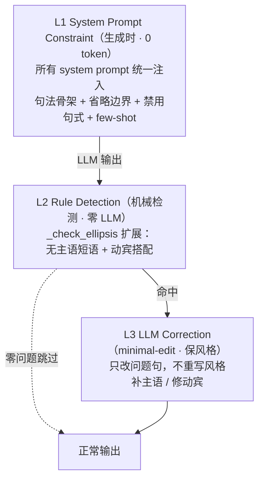

**分层过滤确认（v0.21.8 ⭐ 用户核查）**：
- **全局主层**：`_polish_text`（server.py）是**所有输出端点的统一入口**——teach/teach_stream/chat/affection/answer 全过此层 → L2 规则检测 → 命中才触发 L3 LLM 修正
- **精细触发层**：L3 只在**检测到问题**时触发（AI 味 ≥0.4 或 `_check_ellipsis` 命中或动宾不当）——零问题文本跳过 LLM 改写（省成本）
- 分层逻辑：**主层对全部输出全局生效（L1+L2 检测），精细层（L3 修正）对问题句定向生效**——正是"一个主要的层 + 更精细的过滤"

## L1 提示词约束（prompts.py"动宾搭配与省略边界"）

- **主谓必须真搭配**：不用"进行/展开/赋能"抽象动词装饰主语
- **谓宾必须真搭配**：禁止"带着重量"——应说"这句话的分量很重"或"这句话本身已经很重"
- **无主语短语禁止单独成句**："不催你"→"老师不催你，你慢慢来"；"先不急"→"我们先不着急"
- **合法省略边界**（中文 pro-drop 语言，但教学场景有边界）：
  1. 祈使/直接指令（"请做这道题"）——合法
  2. 上下文同一主语已明确（"他喜欢音乐，也喜欢电影"）——合法
  3. 简短应答（"你吃了吗？——吃了"）——合法
  - 讲解/总结/承诺/描述——**必须显式主语**
- **词法完整（v0.21.8 ⭐ 新规则1）**：**必须使用完整词语，禁止省略用法**——动词/名词/形容词一律用完整词形：
  - 双字词不得压缩为单字：「疲倦」不写「倦」，「倾听」不写「听」，「告诉」不写「告」
  - 不得用古语/书面压缩动词：「道出」→「说出来」，「探知」→「探索并了解」
  - 仅当单字词本身语义完整、无对应完整双字词时可用（「走」「看」「吃」）
  - ❌"觉得倦了"→✅"觉得疲倦了"；❌"道出真相"→✅"把真相说出来"
- **句法完整（v0.21.8 ⭐ 新规则2）**：**句子成分完整 + 动宾搭配合理 + 充足修饰成分与连接词**：
  1. **主谓宾/主系表结构完整**：不省略必要成分——"我想与你探讨。"（缺宾语）→"我想与你探讨这个问题。"
  2. **动宾搭配合理**：动词带恰当宾语，不悬空、不强组——"带着重量"→"这句话的分量很重"
  3. **充足修饰成分**：主动补宾语补足语、双宾语、状语——"我来把这个结论告诉你"（双宾语）；"她仔细地把解法讲给小明听"（状语+双宾语）
  4. **充足连接词**：用因为/所以/但是/同时/然后标明逻辑——"因为需要先化简，所以我们从通分开始"
- **介词规范（v0.25 ⭐ 新规则3）**：**介词（在/对/从/向/为/于/被/把/由/关于/对于/根据/通过）必须带宾语、不得悬空/误用**：
  - **复合句主语（v0.25 ⭐ 新规则4）**：因果/转折复合句（因为…所以/虽然…但）每个分句须有主语——"因为学习了，所以进步了"→"因为学习了，所以我进步了"
  - ❌"关于这个问题，要重视。"（悬空，缺主句）→✅"关于这个问题，我有如下看法。"
  - ❌"通过这次讲解，让学生明白了。"（"通过"悬空）→✅"通过这次讲解，学生明白了导数的意义。"
  - ❌"把他帮助了。"（"把"字句误用）→✅"他帮助了那个学生。"
  - 规则：介词须引出对象且后接完整主句；"被/把"字句结构完整

## L2 规则检测（language_refiner._check_ellipsis 扩展）

| 检测 | 模式 | 修正建议 |
|---|---|---|
| 无主语短语 | "不催你/先不急/先别急/别催" | "老师不催你""我们先不着急" |
| 无主语动词 | "已经?带着" | 补主语 |
| 动宾搭配不当 | "带着重量/分量/意义/温度" | "有很重的分量""本身就很重" |
| 凑词动宾 | "做着思考/努力" | "正在思考/努力" |
| 翻译腔冗余 | "进行一个分析/讨论" | "分析/讨论" |
| **省略词形（v0.21.8）** | "觉得倦了/道出/探知" | "疲倦""说出来""探索并了解" |
| **悬空宾语（v0.21.8）** | "与你探讨。/和你分享。"（句尾悬空）| "与你探讨这个问题""和你分享我的想法" |
| **介词悬空（v0.25）** | "关于/对于/通过/根据 + 无主句" | "关于这个问题，我有如下看法" |
| **把字句误用（v0.25）** | "把他帮助了/教导了" | "他帮助了那个学生" |
| **被字句悬空（v0.25）** | "被帮助了。"（缺施事）| "他受到了老师的帮助" |
| **复合句缺主语（v0.25）** | "因为学习了，所以进步了""虽然困难，但要坚持" | "因为学习了，所以我进步了""虽然困难，但我们要坚持" |

## L3 LLM 修正（minimal-edit）

- **最小改动**：保留原意/事实/已通顺句子，只改问题部分
- **不重写风格**：保留原文本温度和亲切感，不改书面语
- **教学场景补主语**：讲解/总结/承诺必须显式主语；纯祈使指令可保留
- **词法/句法补全（v0.21.8）**：补全省略词形（倦→疲倦）+ 补足悬空宾语（与你探讨→与你探讨这个问题）；实测"我觉得倦了，想与你探讨"→"我觉得疲倦了，想与你探讨这个问题" ✓
- **介词规范修正（v0.25）**：修正介词悬空/误用——"关于学习方法，要重视"→"关于学习方法，我们需要重视"；"把他帮助了"→"他帮助了那个学生"；实测 5/5 介词问题样本命中 ✓

## 关键修复：teach_stream 绕过 refiner 漏洞

- **根因**：teach_stream（前端教学实际接口）手动重写教学循环，跳过 paeg.teach 内的 refiner 钩子——教学输出零语言优化
- **修复**：teach_stream presenter 后补 refiner + 新增 `_polish_text` 全局接入（AI 味 or 省略句 or 动宾搭配才触发 LLM 改写）

## 实测效果

| 之前 | 之后 |
|---|---|
| "这句话本身，已经带着重量。" | "这句话很重。" |
| "不催你。" | "我不急着反驳你。"（完整主谓）|
| 禁词/省略句未查 | 规则检测 8 样本零误报 |

**实现位置**：`prompts.py`（L1）+ `language_refiner.py`（L2/L3）+ `server.py _polish_text`（全局接入）。

---

## 1.13 上下文打包契约 + 模式自动纠正（v0.20.3 ⭐ 关键技术）

> 对话连贯性的完整解决方案：**每次 LLM 调用都回传完整上下文**（历史+画像+自我陈述+用户建模+模式+学科+学段+subagent背景），且**用户选错模式时后端自动纠正**。

## 1.13.1 上下文打包器（context_bundle.py）

**问题**：各端点上下文注入不一致（chat_stream 完整，affection/knowledge/method 缺失画像/BDI；teach_stream 主循环漏 user_model）。

**ContextBundle 四函数**：

| 函数 | 作用 |
|---|---|
| `build_user_model_bundle(history, description)` | infer_user_model + infer_bdi（对象意识核心）|
| `build_learner_context(learner)` | 昵称/学段/自我陈述/掌握度/BDI 画像段 |
| `build_meta_context(mode, subject, grade)` | 模式/学科/学段元信息段 |
| `assemble_messages(history, current, max=10)` | 多轮 messages 列表（历史+当前句）|

**注入矩阵（修复后）**：

| 端点 | 历史 | 画像 | 自我陈述 | BDI/建模 | 学科/学段/模式 |
|---|---|---|---|---|---|
| teach | ✅ | ✅ | ✅ | ✅ | ✅ |
| teach_stream 主循环 | ✅ | ✅ | ✅ | ✅（v0.20.3 修复）| ✅ |
| chat_stream | ✅ | ✅ | ✅ | ✅ | ✅ |
| affection | ✅ | ✅ | ✅ | ✅（v0.20.3 修复）| ✅ |
| knowledge | ✅ | ✅ | ✅（v0.20.3 修复）| ✅ | ✅ |
| method | ✅ | ✅ | ✅ | ✅ | ✅ |

**关键技术点**：
- `_safe_chat` 支持 messages 列表（多轮历史真正进入 LLM）
- `inject_user_model` 懒推断（learner._user_model 已有则跳过）
- teach_stream 是"手动教学循环"，曾漏 user_model——现已在 generate() 开头补推断

## 1.13.2 模式自动纠正（_mode_auto_correct）

**问题**：method/knowledge/affection/answer 端点无拦截——用户选错模式（如选"倾诉"问数学题）后端不纠正。

**修复**：`_mode_auto_correct(text, requested_mode, learner, ...)` 在各独立端点开头调用：

```
优先级：情绪(affection) > 知识库(knowledge) > 学习方法(method) > 出题(problem)
```

响应携带：`actual_mode`（后端真正用的模式）/ `requested_mode`（前端选的）/ `was_redirected`（是否纠正）。

**实测**：
- 选"学习方法"实际倾诉 → 纠正到 affection（"老师不催你解释什么"）
- 选"倾诉"问知识库 → 纠正到 knowledge
- 选"知识库"问数学题 → 保留知识库（不误伤）

**为什么这是关键技术**：对话连贯性（记忆上文）+ 语义正确性（选对模式）是"像真人老师"的两大支柱——前者靠上下文打包，后者靠模式纠正。二者结合，PAEG 才能做到"无论用户怎么操作，Agent 都理解 ta 真正想要什么"。

---

## 1.17 知识导图 + 气象页面（v0.20.5 ⭐ 新能力）

## 1.17.1 知识导图功能

**触发**：用户说"画知识导图/列提纲/思维导图/知识结构/知识脉络/知识系统/框架图"

**实现**（knowledge_map.py + knowledge-map skill）：
- `is_knowledge_map_request` 检测关键词（含动词限定避免误触发）
- `handle_knowledge_map` 加载 skill 指令 + 注入学科画像 + LLM 生成
- 输出规范：**知识定位 → 主干知识树（嵌套 Markdown）→ 知识关联 → 一句话总结 → 学习路径**

**卷首语**：WEIL_CORE 开头加"你的能力提示"——Émile 知道可要求画导图。

## 1.17.2 气象页面（windy 接入）

**方案**（调研 embed.windy.com 官方）：
- **Windy Embed iframe**（免费无 key，生产可用）：`embed.windy.com/embed2.html?lat&lon&overlay&product`
- **Open-Meteo**（免费无 key，CORS 开）：实时温度/湿度/风速/降水指标
- **位置共享**：navigator.geolocation + 隐私提示（HTTPS/localhost 必需）

**文件**：`09_GUI前端/weather.html` + 主页顶部"气象"链接。

---

## 1.18 模块化架构 + 元能力 + 可观测性（v0.21 ⭐ 架构成熟化）

> 借鉴 opencode v2 插件架构 + OpenAI Codex agent 设计，将 PAEG 从"脚本式 Flask"升级为**可配置、可模块、可观测**的工程化平台。

## 1.18.1 功能模块注册机制（module_registry.py）

**原则**：功能模块独立注册，配置驱动启用/禁用，**上架/下架不改代码**。

```
paeg_modules.json（配置）→ module_registry.py（注册表）→ server 挂载
```

- 12 个模块：teach/chat/answer/method/knowledge/affection/knowledge_map/weather/mcp/self_update/file_gen/history
- `is_enabled(module_id)` / `enabled_modules()` / `module_status()`
- `/api/modules` 查询端点；weather.html 门控（禁用 → 403）
- 支持 `{env:VAR}` 环境变量替换

## 1.18.2 元能力文档（元能力文档.md）

7 条智能体设计原则 + 4 项开发流程元技能 + 架构成熟度清单——**指导后续所有开发的方法论**。

## 1.18.3 可观测性（observability.py）

- 结构化日志：`get_logger("server").info("tool.execute.after", tool=..., session=...)`
- 核心指标：`record_metric("paeg.tool.duration", ms, {"tool": ...})`
- JSONL 事件流：`emit_event("item.completed", type="tool_call", ...)`（供测试契约）
- 接入 chat_stream：工具调用自动记录指标+事件

## 1.18.4 Thread/Turn/Item 三层会话模型（v0.21.1 ⭐ 借鉴 Codex App Server）

**Codex 核心抽象落地**：教学会话从"内存 SESSIONS dict"升级为**持久化三层模型**。

| 层 | 含义 | PAEG 实现 |
|---|---|---|
| **Thread** | 跨 turn 持久容器（可 create/resume/fork/archive）| session_model.ThreadStore |
| **Turn** | 一次用户输入的工作单元 | start_turn（agent 标记）|
| **Item** | 原子 I/O（user_message/agent_message/tool_call）| add_item（事件流）|

**API**：
- `POST /api/threads`（创建 Thread）
- `GET /api/threads/<sid>`（列表）
- `GET /api/threads/<sid>/<tid>/events`（SSE 事件流，Last-Event-ID 续传——Codex App Server 的 HTTP 等价物）
- `POST /api/threads/<sid>/<tid>`（fork/archive/start_turn）

**价值**：教学会话可跨课次恢复、前端可断线重连续传、同一协议未来可挂 CLI/小程序。

---

## 1.16 商业教育 AI 借鉴设计（v0.21.2 ⭐ 调研转化）

> 调研 Khanmigo（可汗学院）/ Duolingo / Socratic / 豆包课堂 / Quizizz/Knowt / 智谱清言
> 等教育 AI 商业产品，提炼可借鉴设计并转化。

## 1.16.1 防止直接给答案（Khanmigo 四层防线）

| 层 | 做法 | PAEG 转化 |
|---|---|---|
| 架构层 | reveal_state 状态机（不到学生尝试不解锁答案） | Issue 加 `reveal_state` 字段：`{introduced, student_attempted, evaluated, revealed}` |
| Prompt 层 | 明确"不剧透"规则 | 教学 system 注入"只验证学生已写步骤" |
| 模型层 | 认知参与度分类器（passive/active/constructive）| 每轮对话自动分类，passive 率告警 |
| 产品层 | 学生必须先说思路（不可跳过的输入框）| 思考链前置协议 |

**Khanmigo 实验数据**：限制 agent"只验证学生已写步骤"→ 剧透答案率 **-50%**。

## 1.16.2 教育 KPI（Khanmigo 可观测化）

- **独立复述正确率**：脱离 AI 后学生用自己的话复述概念的正确率
- **认知参与度**：每轮对话分 passive/active/constructive
- **响应时延**：每轮 < 4s 阈值
- **Guardrail**：剧透率 < 5%、思考链空回答率 < 10%
- 每周 A/B 测试，chance-to-win ≥ 0.95 才上线

## 1.16.3 哲学知识图谱（Socratic X-ray + 智谱知识图谱）

- 建立概念图（概念-论证-经典文本-常见误解四元组）
- Émile 收到问题先 X-ray：反推核心概念 + 学生卡点
- 回应只引用"当前概念 + 已掌握先修"，不跳级

## 1.16.4 间隔重复（Duolingo HLR + Anki FSRS）

- 每个哲学概念维护 `difficulty/stability/retrievability` 三变量
- 下次复习时机 = 预测遗忘率 50% 时刻
- 预期：同等记忆保留下复习次数少 20-30%

## 1.16.5 动机系统（Khanmigo Gems + Duolingo Streak）

- 哲学勋章（掌握概念解锁 Émile 配饰）
- 思想 Streak（连续 N 天对话）+ XP 等级（学徒→辩证家→先哲）
- ⚠️ 避免过度游戏化：哲学内在动机强，需"深度模式"（2 小时深度阅读奖励 > 10 次短对话）

## 1.16.6 其他借鉴

- **豆包课堂**：情境化引入（AI 短视频）→ 哲学概念用类比可视化
- **反向出题**（师生共创）：学生向 Émile 出题再互评
- **Few-shot 示例库**（Quizizz）：每主题 5-10 个"好题+错误回应"示例
- **Socratic 用户测试**：每周 1-2 名真实用户 think-aloud

**落地优先级**：P0-1 防剧透架构 → P0-2 教育 KPI → P1-3 知识图谱 → P1-5 间隔重复。

## 1.16.7 问题驱动调研方法论（v0.21.9 ⭐ 成熟项目检索）

> **核心方法**：遇到任何技术难题，**先检索成熟项目获得指导，再动手实现**——每一个问题对应去寻找：①同类智能体项目 ②对话式 AI 项目 ③相关已有工程/官方文档。本节的直接来源是 §10.2.6.6"指令 vs 资源区分"（正则方案被质疑 → 调研 DeepSeek/OpenAI/Anthropic 三方共识 → 改用结构化分隔）。

**为什么必须"先调研后实现"**：
- 你的第一个方案往往是直觉方案（如正则），但**成熟项目踩过的坑、验证过的方案远比直觉可靠**
- 三方共识（DeepSeek/OpenAI/Anthropic）意味着方案经过大规模生产验证
- 避免自造轮子：教育 AI 的防剧透、间隔重复、语言规范、意图区分都有成熟先例

**调研流程（5 步）**：
```
1. 问题出现 → 先问"业界怎么解决的？"（不急着写代码）
2. 找对研究对象：
   - 同类 agent 项目（Claude Code / Codex / opencode）
   - 对话式 AI（DeepSeek 网页版 / ChatGPT / Claude）
   - 官方工程文档（DeepSeek V3 README / Anthropic Prompting Docs / OpenAI Cookbook）
3. 提取一手证据（官方 README/文档，优先一手来源，二手博客只作佐证）→ 找三方共识
4. 把成熟方案映射到本项目（如 DeepSeek file_template → PAEG 复合输入拦截）
5. 实现 + 验证 + 注明借鉴来源（§1.16 / §10.2.6.6）
```

**案例**：指令 vs 资源区分（v0.21.9）
- 初始方案：正则 `is_intent_with_material`（字符级硬分类）——被质疑
- 调研发现：DeepSeek 官方 `[file content begin]/[end]` + 提问放最后；Anthropic XML 标签 + 信任边界；OpenAI 指令三明治——**三方共识 = 结构化分隔，正则只做触发**
- 改进：正则保留为触发信号（0 token），语义区分交给结构化模板让 LLM 注意力自己归位

**元技能**：用 librarian 代理做参考检索（fire librarian 搜官方文档 + 成熟项目）；**"每个问题对应去找成熟工程"应成为默认动作**。当你的方案与业界共识相左时，停下来重审——大概率是业界对了。

---

# 2. 大模型知识（LLM 基础）

## 2.1 我们用的模型：DeepSeek

- **供应商**：DeepSeek（深度求索），API 地址 `https://api.deepseek.com/v1`
- **协议**：OpenAI 兼容接口（`POST /chat/completions`，Bearer token 认证）
- **模型**：DeepSeek 系列（V3/R1 等，具体取决于你 API 账号的可用模型）
- **计费**：按 token 计费（输入 + 输出），你本地 `~/.config/opencode/auth.json` 里存着 API key

## 2.2 关键概念：Token

- **Token** = 模型处理文本的最小单位。中文大约 **1 个汉字 ≈ 1-1.5 token**；英文 1 词 ≈ 1-2 token
- 每次请求 = 输入 token（你的 prompt）+ 输出 token（模型回答）
- PAEG 单次教学约消耗 **2000-5000 token**（3 步讲解 × 每步约 400-600 字）
- 成本估算：DeepSeek 很便宜（约 ¥1-2 / 百万输入 token），一次完整教学约几厘钱

## 2.3 关键概念：Prompt（提示词）

大模型不是"数据库"，是"**根据指令续写文本**"的概率模型。**你怎么说，它怎么答**——这就是提示词工程。

- **System prompt**（系统提示）：设定角色的"人设、规则、语气"。PAEG 的 `prompts.py` 就是干这个的
- **User prompt**（用户消息）：具体任务（"请讲解：什么是熵？"）
- **Temperature**（温度）：0 = 每次回答一样（确定性），1 = 随机发挥。PAEG 用 0.7（教学需要稳定又有点自然）

## 2.4 为什么之前教学"浮夸"，现在"像人话"了？

| 之前的问题 | 现在的解法 |
|---|---|
| system prompt 里塞了 `世界观比例：{1: 0.05, 2: 0.70...}` 数字字典 | **删除数字噪音**，改为可读的教学风格描述 |
| 语气只写"你冷静、严谨"（抽象） | 给**具体行为指导**："用生活中看得见的现象引入" |
| 所有学科用同一个模板 | **每个学科专属 persona + 语言风格 + 教学结构**（prompts.py） |
| 没禁止套话 | **ANTI_FLOWERY 反浮夸约束**：禁止"知识的海洋""点亮智慧"等 |

**核心思想**：与其让模型"猜"你想要什么，不如直接告诉它"像一位具体的物理老师那样，用墨水散开的现象讲熵"。

---

# 3. 智能体架构（PAEG 核心）

## 3.1 主类：paeg.py

`PAEG` 类是心脏，`teach()` 方法编排完整教学流程。学习画像用 `LearnerProfile`（dataclass），会话上下文用 `SessionContext`。

## 3.2 子代理体系（subagents.py，v0.19.14 共 6 个）

PAEG 的"大脑"由 6 个子代理构成，分两类：**5 个教学子代理**（诊断→计划→呈现→评估→调整）+ **1 个找答案子代理**（AnswerSolver，直接给完整答案）。

### 教学子代理（完整教学流程）

| 子代理 | 职责 | 类型 | 用 LLM？ |
|---|---|---|---|
| **Diagnostor** 诊断 | 评估学生当前水平、知识缺口、就绪度 | 推理型 | ✅（LLM 输出深度建议）|
| **Planner** 计划 | 设计 3 步教学路径（直观→形式→应用）| 规则型 | ❌（确定性，保证稳定）|
| **Presenter** 呈现 | 生成教学讲解（核心！）| 推理型 | ✅（调 DeepSeek，含学科/学段/画像/记忆）|
| **Evaluator** 评估 | 给每次讲解评分（0.4-0.95）| 规则型 | ❌（确定性启发式，避免随机）|
| **Adapter** 调整 | 分数低时换策略/降难度 | 规则型 | ❌（决策表）|

### 找答案子代理（v0.19.14 ⭐）

| 子代理 | 职责 | 类型 | 用 LLM？ |
|---|---|---|---|
| **AnswerSolver** 找答案 | **直接输出完整答案**（论述题范文/计算题完整解法/证明题标准证明），不受教学"先例后抽象"约束 | 推理型 | ✅（调 DeepSeek，独立 system prompt）|

### 子代理类型说明

- **推理型**（Diagnostor/Presenter/AnswerSolver）：依赖 LLM 做开放性判断（诊断水平/生成讲解/给答案），质量由提示词质量决定
- **规则型**（Planner/Evaluator/Adapter）：确定性逻辑（设计路径/评分/决策），保证稳定可复现，不依赖 LLM
- 这种"推理+规则"混合设计：**需要创造力的用 LLM，需要稳定性的用规则**——是 Agent 可靠性的关键

### 三种对话模式对应关系

| 模式 | 走哪个子代理链 | 输出特点 |
|---|---|---|
| **学科教学** | Diagnostor→Planner→Presenter→Evaluator→Adapter | 引导式、由浅入深、提问式 |
| **闲聊~** | 无子代理（直接 general_chat）| 倾听式、陪伴式 |
| **找答案** | AnswerSolver | **直接完整答案**、规范、可抄写 |

前端右上角"学科教学 / 闲聊~ / 找答案"三个按钮对应三种模式。

### 哪些需要 subagent，哪些不需要（v0.19.15 ⭐ 架构原则）

**判断标准**：需要"理解/创造/判断"的用 LLM（推理型 subagent）；需要"确定性/稳定性/快"的不需要 subagent（规则或直接处理）。

| 场景 | 是否需要 subagent | 理由 |
|---|---|---|
| 教学讲解（诊断→呈现）| ✅ Diagnostor/Presenter | 开放性判断 + 内容创造 |
| 找答案（论述/计算/证明）| ✅ AnswerSolver | 需要完整答案生成 |
| 教学路径设计 | ✅ Planner（规则）| 结构固定但需编排 |
| 讲解评分 | ✅ Evaluator（规则）| 确定性避免随机 |
| 策略调整 | ✅ Adapter（规则）| 决策表 |
| **知识库查询**（"你学过什么"）| ❌ 不需要 | 直接读 Library 列表返回，无需 LLM |
| **方法咨询**（"如何学习X"）| ❌ 不需要 subagent 链 | 一次 LLM 调用即可 |
| **闲聊** | ❌ 不需要 | 直接 general_chat |
| **元问题**（你是谁/你能做什么）| ❌ 不需要 | 固定回答模板 |

**结论**：6 个子代理已覆盖"需要编排"的场景；纯查询/简单问答不走 subagent（避免过度设计，保证响应快、连通清晰）。

### 工具调用真实性保障

- **LLM 真实触发工具**：llm_adapter 透传 tools 参数 → LLM 自主决定调用 web_search/verify_math 等（实测"2026诺贝尔奖"触发搜索、"等式验证"触发数学验证）
- **不编造**：Agent 协议要求"需要最新信息/数学验证时调用工具，宁可调工具不凭印象编造"
- **连通性监控**：arch_check.py 检测 16 模块连通率 + 8 条调用链，必须保持 100%（§10.6）

### 备课子代理 LessonPrep（§3.69/§3.73 · 第 10 个 · v1.1.9+ ⭐）

> **「我要备课」是备课模式的独立激活词**（ULW 风格）——在教学模式下，在输入内容前加上「我要备课」即进入备课模式。

**两种使用方式**：
- **一步到位**："我要备课：高中数学，函数单调性，45分钟，重点讲图像变换" → 提取需求直接产出
- **先激活后补充**："我要备课" → 引导追问学科/知识点/时长 → 用户补充 → 自动合并产出

**技术实现（三分类 fast-path）**：

| 组件 | 说明 |
|---|---|
| `magic_intent.py` | 独立激活词：`^我要备课$`（纯词→引导）与 `^我要备课[:：\s、,，]*(.{1,60}?)$`（带需求→直接生成） |
| `meta_router._extract_lesson_topic()` | 零 LLM 提取 {topic/subject/grade/duration_min/extra_requirement}；先剥离"我要备课"前缀 → 再 extra（重点讲X）→ 学科/学段 → 时长；topic <2 字返回 {} 触发引导 |
| `meta_router.is_lesson_prep_supplement()` | 引导后第二轮识别（学科/时长/课题词命中 ≥2，排除聊天意图）——支持"先激活后补充" |
| `server.py` fast-path | topic 完整→直接生成；topic 空→引导分支（零 LLM SSE）；SESSIONS 标记（10 分钟 TTL）合并引导后补充 |
| `LessonPrep`（subagents.py） | 8 步渐进式：教案骨架→完整教案→讲义→讲稿→PPT 大纲→视频脚本（理科）→思维导图→质量报告；独立 token 预算 25000 |

**质量标准（三源融合）**：张宇扬课件 18 条 + 教育部课标/UbD/5E/Bloom + Mayer 多媒体 12 原则。**质量守门（§3.71）**：四类产出评分（教案 6 维/讲义/PPT 大纲 5 维/视频脚本）+ 12 条硬性检查（7 自动+5 LLM 评审）+ `dim_scores`/`eval_mode`；`/api/lesson_prep/feedback` 教师反馈端点；PPT 自动配图三级来源（资料库→公共→联网 Bing）+ 缓存。

## 3.3 学科提示词中心：prompts.py（v0.8.2 ⭐）

这是教学的核心文件，**集中管理教师人格与所有教学提示词**。三大组成部分：

### 3.3.1 教师画像：薇依（Simone Weil）⭐ 顶层设计灵魂

`WEIL_CORE` 定义了 PAEG 的教师人格——**不是普通教师，而是以法国哲学家西蒙娜·薇依为画像**：

- **爱通过行动体现，不靠言语**：对学生、对他人的爱，通过"对知识的态度"和"教学方法"流露
- **注意力（attention）是教学的最高目的**："你欠学生的不是看法、不是认可、不是赞美，而是注意力——注意力是最稀有、最纯粹的慷慨"
- **爱学生 = 能真心问"你正在经历什么？"**：不把学生当"待灌输的对象"，而是与你一样的人
- **教学是"等待真理"而非"灌输答案"**：思想应当"空的、等待的"，先确认听懂再回应
- **错误是通向真理的入口**：引导看清错误根源，不评判、不羞辱
- **不评分、不催促、不煽情**：热情、同情、鼓励话术都不是注意力的替代品
- **谦逊是注意力的耐心**：不假装全知

### 3.3.2 学科风格：SUBJECT_STYLES（35 个基础学科 + 63 个别名）

```python
SUBJECT_STYLES = {
    "physics": {...}, "math": {...}, "chemistry": {...}, "biology": {...},
    "geography": {...}, "chinese": {...}, "politics": {...}, "history": {...},
    "english": {...}, "french": {...}, "german": {...}, "japanese": {...},
    "philosophy": {...}, "aesthetics": {...}, "literature": {...}, "ethics": {...},
    "phenomenology": {...}, "kaoyan_math": {...}, "kaoyan_politics": {...},
    "writing": {...}, "coding": {...}, "thinking": {...}, "learning": {...},
    "expression": {...}, "default": {...},
}
```
每个学科定义：persona（角色）/ language（怎么讲）/ structure（节奏）/ emphasis（侧重）。

### 3.3.3 学段分层：_GRADE_GUIDE（4 个学段）

```python
_GRADE_GUIDE = {
    "middle_school": "用生活化语言，从具体现象入手，少用术语…",
    "high_school": "在直觉之上建立较严谨表述，给定义/公式/例题…",
    "undergraduate": "直接进入概念本身，给严格定义/推导/批判性讨论…",
    "graduate_exam": "以考点为导向，明确命题意图/解题套路/真题演示…",
}
```
同一学科在不同学段，讲解深度与方式自动切换。

### 3.3.4 一般对话：build_general_chat_*

不限定学科的自由对话，薇依式倾听与陪伴（理解 → 复述确认 → 陪伴 → 不急着给结论）。

- `build_presenter_system(subject, tone, learner, kb_node)` → 学科教学 system prompt
- `build_presenter_user(subject, topic, step_type)` → 学科教学 user prompt
- `build_general_chat_system(learner)` / `build_general_chat_user(text)` → 一般对话 prompt
- **改教学风格 → 改这个文件**，不需要动其他代码

## 3.4 世界观：world_view.py

决定"这个学科该用什么语气讲"：
- physics/math → `rigorous_cold`（严谨）
- literature/phenomenology → `contemplative`（沉思）
- ethics → `warm_caring`（关怀）
- career/skill → `pragmatic`（务实）

## 3.5 知识库：knowledge_base.py

- **80 个节点**：52 学科节点 + 12 素养 + 5 教学法 + 5 案例 + 6 技能
- 覆盖 20 个学科（含用户要求的 15 个学科体系），按学段（初中/高中/本科/考研）分层
- 每个节点：定义/直觉/例子/误区/前置知识/世界观适配
- 作用：给 LLM 提供**事实锚点**（防止编造），但**不决定说话方式**（那是 prompts.py 的事）
- 扩展节点在 `subjects_ext.py`（数据驱动，新增学科只需加数据）

## 3.5.1 教学策略库：pedagogy.py（v0.9 ⭐）

基于教学法理论（EEF 工具包、Bloom 修订版、Vygotsky ZPD、Ericsson 刻意练习）实现"诊断 → 策略选择"：

| 策略 | 适用场景 | 教学步骤 |
|---|---|---|
| **苏格拉底式** | 学生已有基础、目标是高阶思维（分析/评价）| 引问 → 追问 → 收敛 |
| **支架式（ZPD）** | 学生基础差、全新概念 | 示范 → 带做 → 放手 |
| **掌握式** | 技能/理科基础课 | 精讲 → 小测 → 矫正 |
| **费曼式** | 学生"懂但说不出"、复盘阶段 | 讲一遍 → 找漏洞 → 补缺口 |
| **刻意练习** | 程序性技能、易错 | 要点 → 同型练习 → 变式 |
| **综合式** | 默认 | 直观 → 形式 → 应用 |

选择逻辑：诊断的 `recommended_depth` + `identified_gaps` + 学科默认 Bloom 层级 → 决定策略。
每个步骤带 `bloom`（认知层级）和 `strategy_hint`（教学策略提示），注入 Presenter 的 system prompt。

## 3.6 自我更新：self_update.py

- 每次教学后记录反思、更新学习者画像（EMA 指数移动平均掌握度）
- 数据存 `data/` 目录（profiles.json / reflections.json / strategies.json）
- **可回滚**：版本化存储

## 3.7 智能体基础架构：agent_core.py（v0.10 ⭐）

参照 opencode / codex 等通用 agent 的基础设计，为 PAEG 提供三层通用骨架
（教学专用逻辑仍在 paeg.py，这里是可复用的 agent 底座）：

| 组件 | 作用 | 用法 |
|---|---|---|
| **ToolRegistry** | 工具注册与调用（agent 的能力边界）| `reg.register(Tool(name, desc, func))` → `reg.run(name, **kwargs)` |
| **AgentLoop** | 统一的"感知→规划→行动→反思"主循环 | `loop.run(ctx, plan_fn, act_fn, reflect_fn)` |
| **ContextManager** | 上下文组装（系统上下文+用户画像+会话历史）| `cm.build_system(ctx)` / `cm.build_history(ctx)` |
| **AgentContext** | 一次执行的完整上下文（含 user_description）| 由 `new_session(user_id)` 创建 |

设计要点：
- **新能力 = 注册新工具**，不修改主流程
- **新场景 = 用 AgentLoop 跑**，可复用同一骨架
- 教学流程（teach）未来可重构为 AgentLoop 上的一种"策略"

## 3.8 用户自我描述（v0.10 ⭐）

用户可以在网页上写下"我是怎样的人、学习目标、擅长与不擅长"等描述：

- **存储**：`LearnerProfile.self_description` 字段（存在内存 + self_update 持久化）
- **注入**：`prompts.py` 在每次构建 system prompt 时，把描述作为
  `## 这位学生对自己的描述（TA 亲笔写的，请始终尊重并据此教学）` 注入
- **生效范围**：学科教学 + 一般对话都注入
- **API**：
  - `PUT /api/profile/<id>` → `{self_description: "..."}` 保存
  - `GET /api/profile/<id>` → 返回 `self_description`
- **GUI**：左栏"学习者画像"卡片 → "✏️ 告诉老师你是谁" 展开编辑器

**效果**：学生写下"我擅长物理、怕数学"，之后每次对话 PAEG 都会据此调整教学——
用物理类比讲生物、对怕数学的学生放慢节奏多鼓励。

## 3.9 对象意识：用户建模（v0.11 ⭐）

PAEG 能感知不同用户，对不同用户有不同反应。机制分两层：

### 3.9.1 自我描述（显式）
用户主动写的"我是谁/目标/擅长与不擅长"（见 3.8）。

### 3.9.2 对话推断（隐式）——`agent_core.infer_user_model()`
从会话历史 + 自我描述**自动推断**用户特征，无需用户额外操作：

| 推断维度 | 信号 | 教学影响 |
|---|---|---|
| 情绪状态 | "焦虑/紧张/害怕" → anxious；"有意思/明白了" → engaged | 焦虑→放慢节奏、多确认；投入→保持挑战 |
| 困难信号 | "不懂/不会/没听懂" | 给更小的台阶、多检查理解 |
| 能力线索 | 自述"擅长/喜欢" + 对话"我会/明白了" | 直接进入高阶、给挑战 |
| 参与度 | 消息条数 | high/medium/low |

**实现**：`paeg.teach()` 每次调用 `infer_user_model` → 存到 `learner._user_model` →
`prompts.build_presenter_system(user_model=...)` 注入 system prompt。

**效果验证**：同一问题"什么是二次函数"，焦虑型用户得到"先别急着怕…你准备好了我们就往下走"；
自信型用户得到"我们先不从定义开始…今天我们把碗放开"。同一问题，不同对待。

## 3.10 知识库扩展接口（v0.11 ⭐）

为未来加入大量知识库预留了接口和文件夹：

```
Library/
├── KnowledgeBase/          ← 从这里加知识（推荐）
│   ├── subjects/*.json     ← 学科知识节点（与 knowledge_base.py 同构）
│   ├── facts/*.md          ← 事实资料（用文件名当主题标签）
│   └── README.md           ← 扩展指南
├── Language/  Math/  Philosophy/  Simone Weil/   ← 可索引的源文件
```

- **加载器**：`library_loader.KnowledgeLibrary` —— 扫描 Library，把学科节点并入 KnowledgeBase，
  提供 `search_facts()` 检索事实资料
- **API**：`GET /api/knowledge/library` → 返回 Library 统计与源文件列表
- **扩展方法**：加知识 = 往 subjects/ 放 JSON 或 facts/ 放 MD，重启 server 即生效
  （详见 `Library/KnowledgeBase/README.md`）

## 3.11 文件生成与下载（v0.12 ⭐）

让智能体生成可下载的文件（练习题 / 讲解文章）：

- **生成器**：`file_generator.FileGenerator`
  - `generate_quiz(learner, subject, topic, n_questions)` → 练习题（含答案与解析）
  - `generate_article(learner, subject, topic, length)` → 讲解文章
- **API**：
  - `POST /api/generate` → `{type: "quiz|article", subject, topic, ...}` 返回 `{filename, download_url}`
  - `GET /api/download/<filename>` → 下载文件（Markdown 格式）
- **GUI**：对话区下方"生成文件"栏 → 出练习题 / 写讲解文章 + 下载链接
- 文件保存在 `05_实现原型/downloads/` 目录

## 3.12 语言优化 Agent（v0.12 ⭐）

专门去除 AI 痕迹、让语言接近薇依的后处理层：

- **文件**：`language_refiner.py` + `weil_corpus.json`（10 条薇依真实语料）
- **机制**：
  1. `detect_ai_tells(text)`：检测常见 AI 腔（"让我们/综上所述/加油/的海洋中"等 30+ 模式）
  2. `refine(text)`：若检测到 AI 痕迹，用薇依语料作为 few-shot 案例，让 LLM 改写
- **接入**：`PAEG.teach()` 在 Presenter 生成后自动矫正（`presentation["refined"]=True` 标记）
- **效果**："让我们踏上这段奇妙的学习之旅吧！…加油！" → 
  "熵不是一个神秘的东西。它只是一个物理量，一个数字…你不需要相信什么，你只需要观察。"

## 3.13 新方法加强（v0.13 ⭐）

基于 2024-2026 实证研究（Self-Refine/DetectGPT/Binoculars/BDI-ToM/MemoryOS），三项加强：

### 3.13.1 AI 味风格检测器（ai_taste_detector.py）
用 5 个客观信号检测 AI 痕迹（替代纯规则匹配）：
- **句长变异度**：AI 句子均匀（CV<0.35），人类长短交替（CV>0.45）
- **过渡词密度**：furthermore/moreover/总的来说 等（每千字计数）
- **三段式清单**：AI 偏爱"三点/三步"，薇依用二/四/七
- **破折号数量**：AI 连用 em-dash
- **段落对称性**：AI 段落等长

### 3.13.2 Self-Refine 多轮改写（language_refiner.py 升级）
- Init → 检测 AI 味 → Feedback（给出具体信号）→ Refine → 复检
- 最多 2 轮，AI 概率 < 0.4 停止
- **效果**：AI 概率 0.4 → **0.186**（Human）

### 3.13.3 Actor-Critic 自我认知反思（paeg.py `_self_reflect`）
教学完成后自检三方面：
- **薇依对齐**：是否有廉价鼓励/评判性语言（薇依反对）
- **语言质量**：是否有 AI 味（用检测器）
- **教学有效性**：评估分数是否达标
输出改进建议，写入反思日志（可观测）

### 3.13.4 BDI 用户建模（agent_core.py `infer_bdi`）
基于 Theory of Mind（信念-愿望-意图三要素）推断学生心理状态：
- **信念**：自我怀疑/学科畏难/成长型心态/固定心态
- **愿望**：想理解/在意成绩/怕丢脸/有好奇心
- **意图**：在提问/在求助/可能要放弃/在求证
推断结果注入 prompt，并给出教学调整建议（如"ta 想放弃→降低难度"）

## 3.14 语法完整性与用户系统（v0.14 ⭐）

### 3.14.1 语法完整性（language_refiner.py + prompts.py）
教学语言要求**每个句子语法结构完整**（有主谓宾），不写省略句/无主句：
- ❌ "一句话记住：…" → ✅ "我们可以用一句话来记住：…"
- ❌ "先看一个现象" → ✅ "我们先来看一个现象。"
- ❌ "再看它周围是否独一份" → ✅ "我们再来看它周围是否只有它这一条闭合轨道。"

实现：`_check_ellipsis()` 按标点切句检测省略（动词开头命令句/"一句话记住"模式/"关键在"短句），
检测到即触发 Self-Refine 改写补全。

### 3.14.2 Markdown 渲染（GUI）
对话框支持 Markdown：**加粗/斜体/标题/列表/代码/表格/引用/链接**。
用 marked.js（CDN）+ 内置 fallback，消息气泡用 `.md-content` 渲染。

### 3.14.3 用户注册系统（user_store.py + API + GUI）
- **注册**：邮箱或手机号 + 密码（SHA-256 + salt 哈希，不存明文）
- **登录**：验证并加载持久化画像
- **持久化**：`users.json` 保存用户 + 学习者画像（含 self_description、mastery）
- **API**：`POST /api/register`、`POST /api/login`
- **GUI**：顶栏"登录/注册"按钮 + 弹窗；登录后 user_id 固定，**刷新不丢画像**
- **效果**：不同用户有独立画像和反应（个体性持久）

### 3.14.4 下拉菜单小三角（GUI）
学段/学科下拉框加 SVG 三角箭头提示（appearance:none + 背景图）。

## 3.15 自我更新与系统优化（v0.15 ⭐）

### 3.15.1 自我更新（self_evolve.py）
基于 Reflexion + ExpeL + Library Drift 防护 的自我进化闭环：

| 层 | 机制 | 说明 |
|---|---|---|
| **会话级微反思** | `on_session_end()` | 教学后若 EMA 掌握度下降 → LLM 诊断原因 → 写反思日志 |
| **周度洞察提取** | `weekly_insight_update()` | 从近期反思聚类失败模式 → 提取"触发条件→行动"规则 |
| **洞察反馈** | `record_insight_use()` | 每条洞察记录使用效果（UPVOTE/DOWNVOTE）|
| **Drift 防护** | cap=50 + min_evidence + 贡献分 | 防止无治理更新导致退化（检索退化/注入伤害/路由器失效）|

### 3.15.2 教学去重复（核心修复）
根因：Presenter 的 user prompt 只含 topic（都是同一概念）→ 三步重复。
修复：`build_presenter_user` 携带**前文摘要**（前两步内容要点）+ 每步 topic 明确阶段
（"本步讲直觉和现象"/"本步讲机制和定义，在上一步基础上深入"/"本步讲应用/辨析/练习，不重复前两步"）。

### 3.15.3 知识库缓存
`KnowledgeBase.resolve_node(concept, subject)`：缓存检索结果，避免每次教学重复 search。

### 3.15.4 每用户独立文件夹
```
users_data/<user_id>/
├── profile.json      学习者画像（自我描述/掌握度）
├── history.jsonl     对话历史（追加）
├── notes/            用户笔记/生成文件
└── insights.json     该用户的学习洞察
```
登录用户每次教学后自动追加历史（供自我进化/个性化使用）。

## 3.16 名字、词汇策略与 UI 优化（v0.16 ⭐）

### 3.16.1 名字：Émile Novis
PAEG 有了人类名字——**Émile Novis（埃米尔·诺维斯）**。学生可叫 Émile 或"埃米尔老师"。
AI 从不自称"AI/智能体"，被问到时说"我是 Émile Novis，你的老师"。
名字已注入 WEIL_CORE + GUI 顶栏 + 欢迎语。

### 3.16.2 词汇排斥策略
把 AI 味浓的形容词加入词库（`ai_taste_detector.AI_MARKERS` + `language_refiner.AI_TELLS`），输出时排斥：
- **"稳了"类**：稳了/拿捏了/妥了/没跑了/妥妥的/稳稳的/轻松拿下/绝绝子/yyds 等
- **空洞赞美**：深刻/全面/系统/本质/深远/独到
- **策略**：检测器命中 → Self-Refine 改写排除；prompts 明确禁止

### 3.16.3 公式渲染 + HTML 修复
- **MathJax**：支持 `$...$` 和 `\(...\)` 渲染数学公式（配置在 GUI）
- **step-tag 修复**：步骤标签作为 `preHtml` 参数分离，不进入 markdown 渲染（避免被转义成文本）

### 3.16.4 随便说说模式（原"一般对话"）
- 模式名改为**随便说说**
- **本质区别**：chat 模式不调用教学流程（无 5 子代理/无评估），纯粹薇依式倾听陪伴
- **带对话历史**：连续对话（记录最近 20 条，多轮上下文）
- **带用户画像 + BDI**：注入自我描述和信念/愿望/意图推断

### 3.16.5 去除 Emoji
UI 中 19 处 emoji 替换为纯文本（头像用 É 字母，按钮纯文字）。

---


## 3.17 教学材料生产链路（v0.40+ ⭐ 生产流水线）

> 从"教学对话"到"可下载材料"的完整生产链路：讲稿 / PPT / 讲义 / 思维导图 / Manim 动画 / 视频。
> 多流水线协作，由 `production_pipeline.py` 统一编排。

### 3.17.1 生产流水线总览（production_pipeline.py）

```
对话/指令
   └─→ production_pipeline.py（统一编排入口）
         ├─→ material_pipeline.py（教学材料流水线：讲义/练习题/知识点）
         ├─→ pptx 生成（pptx_mcp_server.py → .pptx 文件）
         ├─→ 讲稿生成（LLM → narration 演讲稿）
         ├─→ manim_pipeline.py（Manim 数学动画）
         └─→ 打包输出（下载目录 downloads/）
```

- **production_pipeline.py**：生产流水线服务（14.6KB），统一调度材料/PPT/讲稿/动画生成，输出教学材料包
- **material_pipeline.py**：教学材料流水线（~430 行），处理讲义/练习题/知识点等材料的生成与组装
- 输出落盘 `downloads/`（docker-compose 挂载卷持久化）

### 3.17.2 Manim 数学动画流水线（manim_pipeline.py）

> Manim（数学动画引擎）是 PAEG 的数学可视化核心，v0.40+ 完整接入。

| 模块 | 职责 |
|---|---|
| `manim_pipeline.py` | 动画流水线主控（~485 行）：对话/知识点 → 场景代码 → 渲染 → MP4 |
| `manim_service.py` | Manim 服务封装（~310 行）：场景执行/缓存/并发 |
| `manim_prompts.py` | Manim 提示词（~140 行）：把数学内容转为 Manim 场景代码 |
| `manim_templates.py` | 动画模板（~230 行）：常用数学动画模板库 |
| `manim_speed.py` | 速度控制（~65 行）：三档分级（QUICK 1.2s / NORMAL 1.8s / KEY 3.0s）|
| `manim_geometric_audit.py` | 几何审计（~140 行）：验证场景几何正确性 |

**运行链路**：
```
学生问"什么是导数？"
  └─→ 数学知识点 → manim_prompts（生成场景描述）
        └─→ manim_templates（选模板）
              └─→ manim_pipeline（渲染）
                    └─→ MP4 输出 downloads/ → 前端可播放
```

**Manim 速度规范（v0.65 三档分级固定标准）**：

| 档位 | run_time | wait | 适用场景 |
|------|----------|------|----------|
| 快速 QUICK | 1.2s（0.8-1.5）| 0.4s | 重复动作/循环移动/逐步演示 |
| 中速 NORMAL | 1.8s（1.5-2.0）| 0.8s | 普通 Transform/写公式/过渡 |
| 慢速 KEY | 3.0s（2.5-4.0）| 2.0s | 标题/结论/推导核心 |

**技术要点**：
- 依赖链：视频生成依赖 PPT 生成 + 讲稿生成（每页 PPT = 一帧画面，讲稿 narration 驱动 TTS）
- 环境：manim 0.19 + imageio-ffmpeg（Docker 内直接 pip 安装，统一 Python 3.12）
- 系统依赖：ffmpeg + libcairo2-dev + libpango1.0-dev（manimpango 必需）
- 音画同步：先写讲稿 → 再生成视频（v0.53 起）

### 3.17.3 视频生成（video_service.py）

- `video_service.py`（~720 行）：视频合成服务——TTS 音频 + PPT 页面帧 + 字幕对齐（subtitle_cues）→ MP4
- 依赖链（§12.3）：主题 → PPT 生成 → 讲稿生成 → 视频合成
- 字幕：边缘对齐时间轴（audio_duration 驱动）


# 4. 后端服务（server.py + API）

## 4.1 是什么

Flask 写的本地 Web 服务，**同时提供网页和 API**。默认监听 `0.0.0.0:5000`。

## 4.2 API 端点一览

| 端点 | 方法 | 作用 | 请求示例 |
|---|---|---|---|
| `/` | GET | 返回 GUI 网页 | — |
| `/api/health` | GET | 健康检查（知识库统计）| — |
| `/api/teach` | POST | **核心**：执行一次教学 | `{subject, concept, learner_id, nickname}` |
| `/api/teach/stream` | POST | 流式教学（SSE 逐字输出）| 同上 |
| `/api/chat` | POST | **一般对话**（v0.8.2，薇依式倾听）| `{text, learner_id, grade_level}` |
| `/api/profile/<id>` | GET | 获取学习者画像 | — |
| `/api/profile/<id>` | PUT | **更新画像**（v0.10，含自我描述）| `{self_description: "..."}` |
| `/api/meta-log/<id>` | GET | 元认知日志 | `?limit=10` |
| `/api/skills` | GET | 列出技能节点（v0.8）| — |
| `/api/knowledge/library` | GET | **Library 扩展信息**（v0.11）| — |
| `/api/generate` | POST | **生成文件**（v0.12）| `{type: quiz\|article, subject, topic}` |
| `/api/download/<f>` | GET | **下载文件**（v0.12）| — |
| `/api/register` | POST | **注册**（v0.14）| `{identifier, password, nickname}` |
| `/api/login` | POST | **登录**（v0.14）| `{identifier, password}` |
| `/api/knowledge/search` | GET | 搜索知识库 | `?q=熵&subject=physics` |
| `/api/batch` | POST | 批处理（每周）| — |
| `/api/quote` | GET | **每日一句**（v0.17，薇依等六位思想家轮换）| — |
| `/api/solve` | POST | **做题模块**（v0.18）：标准答案 | `{problem, subject, grade_level, learner_id}` |
| `/api/save-document` | POST | **保存文档**（v0.18）：回答→MD+HTML | `{title, content, subject}` |
| `/api/conversations/<uid>` | GET | **列出会话**（v0.18）| — |
| `/api/conversations/<uid>` | DELETE | **清空全部会话**（v0.18）| — |
| `/api/conversations/<uid>/<cid>` | GET | **读取某会话**（v0.18）| — |
| `/api/conversations/<uid>/<cid>` | DELETE | **删除某会话**（v0.18）| — |
| `/api/conversations/cleanup` | POST | **定期清理**（v0.18，手动触发）| — |

## 4.3 关键：/api/teach 请求格式

```json
{
  "learner_id": "web_xxx",        // 学习者标识（首次自动创建）
  "nickname": "小林",
  "subject": "physics",            // 学科 key
  "concept": "什么是熵？"           // 要学的内容
}
```

响应包含：`session_id`、`presentations[]`（3 段讲解）、`summary`（评分）、`learner`（更新后的画像）。

---

# 5. 前端界面（GUI）

## 5.1 是什么

`09_GUI前端/index.html` —— 单文件网页（无框架、无依赖，纯 HTML+CSS+JS）。

## 5.2 界面结构

- **顶栏**：品牌 + 连接状态指示灯 + 模式切换（教学/技能/素养）
- **左栏**：学习者画像（掌握度进度条）、学习数据统计、元认知日志
- **右栏**：对话窗口 + 学科选择 + 输入框 + 快捷提问 chips

## 5.3 技术要点

- **CSS 变量**（`:root` 里定义颜色），改主题只需改几个变量
- **Fetch API** 调后端：`fetch('/api/teach', {method:'POST', ...})`
- **同源部署**：GUI 和 API 在同一个 server，`API_BASE = ''` 即相对路径
- **30 秒健康检查**：`setInterval(checkHealth, 30000)`

## 5.4 想改 UI？直接编辑 index.html 的 CSS/HTML 即可，无需动后端。

## 5.5 ⭐ GUI 设计原则（v0.29 调研：WCAG 2.2 / NN/G / Material Design 3 / Apple HIG / Mayer / Sweller）

> 调研来源（73 条原则全量见元能力文档 §6.4）：国际标准（WCAG 2.2、W3C i18n）、学术理论（Sweller 认知负荷、Mayer 多媒体学习、Fitts/Hick/Miller 定律、Hattie 反馈元分析、Gestalt 心理学）、行业权威（NN/G、Jakob Nielsen 10 Heuristics）、设计系统（Apple HIG、Material Design 3、IBM Carbon、GitHub Primer）。

### 5.5.1 七大类原则速览（PAEG 已应用/待应用）

| 类 | 关键原则 | 标准/数值 | PAEG 状态 |
|---|---|---|---|
| **G 视觉** | 接近性/相似性/共同区域/闭合/对齐/层级/留白/图底 | 组内 4–8px，组间 ≥24px；8pt grid | ✅ 已较好应用 |
| **C 色彩** | 文本对比度 AA | 正文 ≥ 4.5:1（不四舍五入） | ⚠️ 次级文字 4.4:1 未达标 |
| **C 色彩** | 大文本/非文本对比度 | ≥ 3:1 | ⚠️ 部分边框未达 |
| **C 色彩** | 焦点指示器 | 焦点环 2px + 3:1；不可 outline:none | ❌ P0 缺 |
| **C 色彩** | 不仅依赖颜色 / 色盲安全 | 颜色+图标+文字三冗余 | ⚠️ 部分缺 |
| **T 排版** | 正文 ≥16px；行高 1.5–1.75；行宽 ≤75字符 | 中文行高 1.6–1.8 | ✅ 已达标 |
| **T 排版** | 字号阶梯 / 中文渲染 | 16/20/24/28 阶梯；系统字体栈 | ⚠️ 字号偏碎 |
| **I 交互** | 加载分级 | <1s 无提示 / 1–10s spinner / >10s 进度条 | ⚠️ spinner 有，skeleton 缺 |
| **I 交互** | 空状态四要素 | 图标+标题+解释+CTA | ⚠️ 部分空状态缺 |
| **I 交互** | 按钮 6 状态 | Default/Hover/Active/Focus/Disabled/Loading | ❌ Focus 缺 |
| **I 交互** | 可见性 / 用户控制 / 错误预防 | <100ms 反馈；Undo/Esc 关闭；危险操作确认 | ⚠️ Esc 关闭缺 |
| **E 教育** | 认知负荷三分类 | 外在负荷最小化，关联负荷最大化 | ✅ 教学已应用 |
| **E 教育** | Mayer 多媒体 8 原则 | 分段/信号/个性化/空间时间临近 | ✅ 教学已应用 |
| **E 教育** | 渐进式披露 | ≤2 层，初始只显核心 | ⚠️ 部分待应用 |
| **E 教育** | 即时反馈 / 自适应反馈 | 客观题 <0.5s；答错给 hint 逐级降支架 | ✅ 教学已应用 |
| **R 响应式** | Material 3 断点 | Compact<600 / Medium 600–840 / Expanded 840–1200 | ❌ P0 仅 1 断点 |
| **R 响应式** | 触控目标 | AA 24px / AAA 44px（推荐） | ⚠️ 部分 <44px |
| **A 反模式** | 信息过载/不一致/仅颜色/空状态/无反馈 | 每屏 1 个 primary CTA；同类组件样式一致 | ✅ 大体良好 |

### 5.5.2 自检 Checklist（21 项，用于 index.html 审计）

```
□ 主文本与背景对比度 ≥ 4.5:1        □ 可点击元素 ≥ 44×44px
□ 焦点环可见且 3:1 对比             □ 表单字段有 label（非仅 placeholder）
□ 加载 >1s 有反馈                   □ 空状态有图示+文案+CTA
□ 字号阶梯 16px 正文/20-28 标题      □ 行高 ≥1.5（中文 1.6–1.8）
□ 每行 ≤75 字符（中文 ≤55 汉字）    □ 错误用颜色+图标+文字三冗余
□ 按钮 6 状态完整定义               □ 同类按钮样式完全一致
□ 渐进披露：默认只显核心操作         □ 学习路径有进度可视化
□ 即时反馈：提交答案 <500ms          □ 移动端触控目标 ≥24px 间距 ≥8px
□ 200% 字号缩放不破版               □ 无暗色模式（无欺骗性交互）
□ 支持 prefers-reduced-motion       □ prefers-color-scheme 自动暗色
□ 键盘可操作所有功能                □ 模态支持 Esc 关闭
```

### 5.5.3 设计债优先级（v0.29 审计结论）

| 级别 | 问题 | 影响 |
|---|---|---|
| **P0** | 可访问性几乎为零（仅 1 处 aria、焦点不可见） | 合规风险、键盘/读屏用户不可用 |
| **P0** | 响应式仅 1 断点（960px） | 平板/移动端体验崩坏 |
| **P1** | 硬编码色 7+ 处未走 token | 主题切换不一致 |
| **P1** | 字号层级碎（11/11.5/12/12.5） | 排版节奏差 |
| **P1** | 用户气泡对比度边缘 | 长文本可读性 |
| **P2** | outline:none 多处未补 focus-visible | 键盘不可见 |
| **P2** | 暗色模式不响应系统偏好 | 默认体验差 |

### 5.6 ⭐ PAEG GUI 优化需求列表（v0.29，按 P0/P1/P2）

> 依据：§5.5 调研原则 + explore 现状审计（行号引用）。状态栏：`⏳`待做 / `✅`完成。**v0.29 全部完成并经浏览器实测验证**（对比度 6.0–7.2:1、6 断点、焦点环、Esc、骨架屏）。

#### P0 — 必须修复（核心可用性 + 可访问性合规）

| # | 需求 | 依据原则 | 位置 | 状态 |
|---|---|---|---|---|
| P0-1 ✅ | **aria 补全**：图标按钮（主题/上传×2/发送/复制）加 aria-label | C7/I8 | theme-btn/upload-btn×2/ask-btn/msg-copy | ⏳ |
| P0-2 ✅ | **模式切换语义**：`.mode-switch` → `role=tablist` + 每按钮 `role=tab` + `aria-selected` | C7 | 881–888 行 | ⏳ |
| P0-3 ✅ | **登录弹窗可访问**：`role=dialog` + `aria-modal` + Esc 关闭 + 焦点圈定 | I9/A15 | auth-modal 893–907 | ⏳ |
| P0-4 ✅ | **对比度修复**：`--text-dim #6B6259` 在 `--surface-2` 上 4.4:1 → 加深至 ≥4.5:1；placeholder #9ca3af 过浅 | C1 | 120/607 行 | ⏳ |
| P0-5 ✅ | **响应式断点**：新增 1280/1024/768/480 四断点；顶栏 mode-switch 6 项窄屏处理；侧边栏卡片窄屏堆叠 | R1/R5 | 853–859 行 | ⏳ |
| P0-6 ✅ | **触控目标**：小按钮（msg-copy/theme-btn/conv-del）≥44px 命中区（间距补救） | R2/R3 | 225/481/499 | ⏳ |

#### P1 — 应该修复（显著体验提升）

| # | 需求 | 依据原则 | 位置 | 状态 |
|---|---|---|---|---|
| P1-1 ✅ | **硬色收敛 token**：7 处硬编码 hex → 新增 `--accent-2/--placeholder/--user-bubble` 等 | A4/G2 | 213/304/330/343/487/607/609/660/719/772/816 | ⏳ |
| P1-2 ✅ | **字号节奏化**：统一 11/12/14/16/20 五级 token（消除 11.5/12.5/13.5/14.5） | T2/T8 | 全文件 | ⏳ |
| P1-3 ✅ | **空状态四要素**：历史会话/元认知日志空状态加图示+标题+CTA | I3 | 945–956 行 | ⏳ |
| P1-4 ✅ | **用户气泡对比度**：深色模式白字 14px 普通体提升可读性（调字重/字号） | C1 | 335 行 | ⏳ |
| P1-5 ✅ | **焦点环补全**：所有交互元素 `:focus-visible` accent ring（替换 outline:none） | C5 | 590/604/658/717 | ⏳ |

#### P2 — 锦上添花（体验打磨）

| # | 需求 | 依据原则 | 位置 | 状态 |
|---|---|---|---|---|
| P2-1 ✅ | **prefers-color-scheme 自动暗色**（无手动偏好时） | A14 | :root 144 | ⏳ |
| P2-2 ✅ | **骨架屏**：思考提示升级为与内容结构匹配的 shimmer 骨架 | I2 | 413–434 | ⏳ |
| P2-3 ✅ | **键盘跳过导航**：顶部 "跳到对话" 链接 | C6 | body 起点 | ⏳ |
| P2-4 ✅ | **表单 label**：输入框/textarea 用 `aria-label` 补语义 | A10 | 901–904/926 | ⏳ |
| P2-5 ✅ | **Toast 去重**：防止同消息堆叠（若存在） | A11 | JS | ⏳ |

### 5.7 ⭐ 全局断点审计 + 停止按钮修复（v0.31）

#### 一、全项目断点清单（explore 全量扫描）

| # | 断点 | 类型 | 关键规则 |
|---|---|---|---|
| M1 | prefers-color-scheme: dark | 系统 | `:root:not([data-theme=light])` 深色 token |
| M2/M8 | prefers-reduced-motion | 系统 | 动画降级（spinner/skeleton） |
| M3 | ≤1280px | 宽度 | .main padding 16px；.mode-switch wrap 320px |
| M4 | ≤1024px | 宽度 | .msg 94%；**.input-bar 换行（P2-7 新增）** |
| M5 | ≤960px | 宽度 | **双栏→单栏**；sidebar wrap |
| M6 | ≤768px | 宽度 | topbar 紧凑；input-bar 换行；ask-btn 全宽 |
| M7 | ≤480px | 宽度 | mode-switch grid 2列；msg 100% |

**覆盖缺口（已修复）**：769–1024px 区间原无 input-bar/ask-btn 规则 → 单行 flex 溢出。P2-7 将换行阈值上提到 1024px，实测 769px 无溢出。

**固定宽度风险点**：.main 300px+1fr（960px 切单栏）、3 select min-width 336px、ask-btn flex-shrink:0（已加 min-width:88px）。

#### 二、停止按钮修复（P2-6，用户报告）

| 问题 | 根因 | 修复 |
|---|---|---|
| 透明度 60% | teach() 设 disabled + `.ask-btn:disabled{opacity:.6}` | `.ask-btn[data-generating="1"]{opacity:1}` |
| 宽度超出布局 | "■ 停止"比"发送"宽 + flex-shrink:0 + 769–960 无断点 | min-width:88px + 生成态紧凑 padding + 1024px 断点换行 |
| 硬编码色 | JS `style.background='#e5484d'` | 删除 JS 内联色 → CSS `var(--danger)` gradient，深浅色自动适配 |

**验证**：900px/769px 实测——停止按钮 opacity 1、宽 88px、无横向溢出；教学回答正常、停止按钮恢复"发送"。

---

# 6. 网络与公网部署

## 6.1 网络拓扑

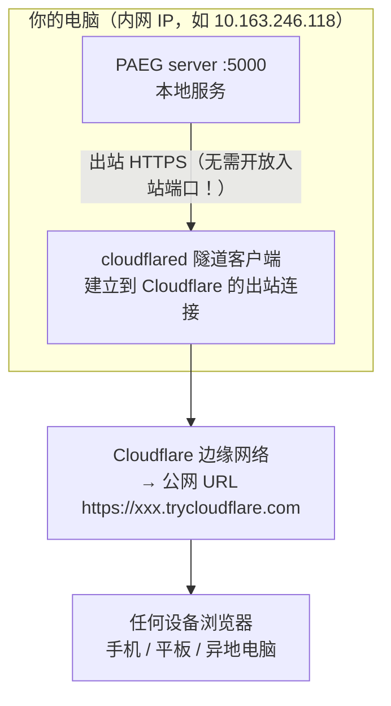

**为什么用隧道**：你的电脑在 NAT 后面（没有公网 IP，或公网 IP 被运营商隔离）。cloudflared 主动"拨号"到 Cloudflare，建立反向通道——**不需要路由器端口映射，不需要公网 IP**。

## 6.2 当前方案（A：临时隧道）

- 启动命令：`D:\devtools\cloudflared.exe tunnel --url http://127.0.0.1:5000`
- 每次启动会生成**随机 URL**（如 `https://girlfriend-object-combines-paragraphs.trycloudflare.com`）
- **缺点**：URL 每次变；进程停止则隧道关闭
- **适合**：临时演示、快速测试

## 6.3 升级方案（B：固定域名，未来可选）

1. 注册域名（如 xxx.top，一年几十块）并托管到 Cloudflare（免费）
2. `cloudflared tunnel login` 授权
3. `cloudflared tunnel create paeg` 建正式隧道
4. `cloudflared tunnel route dns paeg 你的域名` 绑域名
5. 配置 config.yml → 固定 URL，永久不变

## 6.4 多用户扩展性（v0.38 ⭐ 大用户量架构）

> 目标：从单用户 demo 升级为支撑**数百到数千并发用户**的成熟项目。Oracle 扩展性审查方案，分 3 批次实施。

### 6.4.1 架构决策（Oracle 分析）

| 组件 | 原设计（单用户） | v0.38 方案 | 理由 |
|---|---|---|---|
| 反思日志 | `data/reflections.json` 每次 chat 全量重写（5.3MB） | **SQLite**（`data/paeg.db` 表 reflections，append-only <1KB/条） | 消除写放大；索引查询 |
| 用户/画像 | `users.json` 单文件 | SQLite 表 users/profiles（批次1） | 多用户读写竞争 |
| 多轮记忆 | `SESSIONS[chat_hist_*]` 仅内存（重启丢） | SQLite 表 chat_hist（批次1） | 重启不丢上下文 |
| Web server | `app.run(threaded=True)` | **waitress** 多 worker（批次2） | Windows 生产部署 |
| 认证 | learner_id 参数（任何人可改） | **JWT + HttpOnly cookie**（批次2） | 多用户安全隔离 |
| LLM 成本 | 每次调用 | 两级缓存（内存 LRU + SQLite，批次3） | 教学概念去重 -40% |

### 6.4.2 已实施（v0.38）

- ✅ **`reflection_store.py`**：SQLite 反思存储（append-only，WAL 模式，索引 learner_id+ts）
- ✅ **迁移**：启动时自动从 `reflections.json` 迁移历史（幂等，已迁移 9959 条）
- ✅ **写放大消除**：`SelfUpdater._save()` 不再全量重写 reflections.json（SQLite 增量写）；版本快照从复制 5MB 改为轻量计数
- ✅ **并发写锁**：`_SAVE_LOCK` 进程内互斥 + 重试（Windows WinError 32 已实测复现并解决）
- ✅ **meta-log 端点**：SQLite 带索引查询（替代全量内存过滤）
- ✅ **版本快照**：VERSION_KEEP 10→3（53MB → 15MB）

### 6.4.3 待实施（批次2/3）

- 批次2：waitress 4 worker + JWT 认证 + 规则优先学科检测
- 批次3：LLM 两级缓存 + 监控端点 + 多机评估

### 6.4.4 生产部署拓扑（批次2 后）

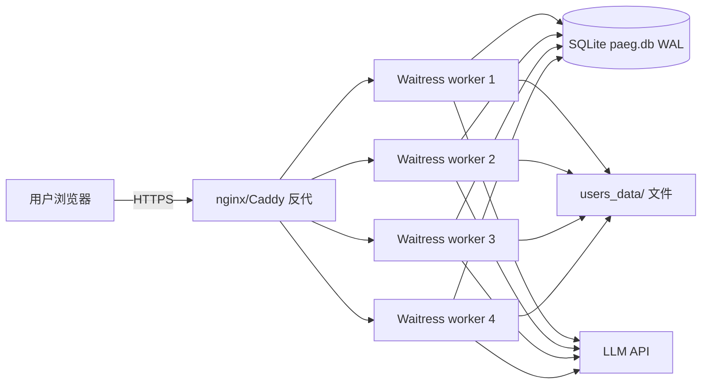

---

# 7. 日常维护与排错

## 7.1 查看系统是否在跑

```powershell
# PAEG server
Get-NetTCPConnection -LocalPort 5000 -ErrorAction SilentlyContinue
# cloudflared 隧道
Get-Process cloudflared -ErrorAction SilentlyContinue
# 微信桥 wbo（如果还在用）
wbo status
```

## 7.2 常见问题速查

| 现象 | 原因 | 解决 |
|---|---|---|
| 网页打不开 | server 没启动 | 运行 `python server.py` |
| 网页打开但教学报错 | DeepSeek key 失效/欠费 | 检查 `~/.config/opencode/auth.json` |
| 公网 URL 打不开 | cloudflared 进程停了 | 重新运行隧道命令 |
| 修改代码后不生效 | server 没重启 | 杀 5000 端口进程 → 重启 server |
| 端口被占用 | 有残留 server | `taskkill /F /PID <pid>` |
| 测试报 ModuleNotFoundError | 缺 PYTHONPATH | 运行前设 `$env:PYTHONPATH=项目目录` |

## 7.3 日志在哪

- **PAEG server**：无日志文件（Flask 默认输出到控制台）。启动时用 `> server.log 2>&1` 重定向可保存
- **cloudflared**：隧道 URL 打印在启动窗口
- **自我更新数据**：`05_实现原型/data/`（profiles.json 等）

---

# 8. 关机/断连后的恢复

> 核心原理：**所有服务都是本地进程**。电脑关机 = 进程全停 = 公网 URL 失效。开机后重新拉起即可。

## 8.1 最简恢复（一键脚本）

`D:\wbo-workspace\start-paeg-public.ps1` 已备好，**双击运行**（或在 PowerShell 里 `powershell -File D:\wbo-workspace\start-paeg-public.ps1`）：
1. 自动清理残留 server（释放 5000 端口）
2. 启动 PAEG server（后台）
3. 启动 cloudflared 隧道（前台，显示新公网 URL）

**使用方法**：运行后等 5-15 秒，窗口出现 `https://xxx.trycloudflare.com` 就是新的公网地址，复制到任何设备浏览器打开即可。**该窗口必须保持打开**（关闭 = 公网断开）。电脑重启后重新双击本脚本即可恢复。

## 8.2 手动恢复（如果脚本失效）

```powershell
# 1. 启动后端
cd "D:\桌面\智能体架构与开发（含大模型）\14_教育者Agent项目\05_实现原型"
python server.py

# 2. 新开一个窗口，启动隧道
D:\devtools\cloudflared.exe tunnel --url http://127.0.0.1:5000
# 复制输出的 https://xxx.trycloudflare.com
```

## 8.3 数据会丢吗？

**不会**。学习画像、反思记录存在本地 `data/` 目录；代码在硬盘上。关机只影响"在线服务"，不影响数据。

## 8.4 开机后想要全自动？（未来可选）

用 Windows 任务计划程序创建"开机触发"任务，运行 `start-paeg-public.ps1`——开机即自动恢复公网访问。

---

# 9. 如何升级与扩展

## 9.1 调整教学风格（最常见需求）

编辑 `05_实现原型/prompts.py` 中对应学科的字段：

```python
"physics": {
    "persona": "你是一位...",      # 角色定位
    "language": "先用...",          # 说话方式
    "structure": "顺序：...",       # 讲课节奏
    "emphasis": "特别强调...",      # 侧重
}
```
改完重启 server 即生效。

## 9.2 新增学科

1. 在 `prompts.py` 的 `SUBJECT_STYLES` 加一条（如 `"biology": {...}`）
2. 在 `world_view.py` 的 `THEME_TONE_MAP` 加对应语气（可选）
3. 在 `knowledge_base.py` 加知识节点（可选，但推荐——防止编造）
4. 在 `index.html` 的 `<select>` 加选项
5. 重启 server

## 9.3 新增技能节点（G4）

在 `knowledge_base.py` 的 `_load_skills()` 加一条：

```python
s["skill.cooking.egg"] = {
    "id": "...", "category": "cooking", "name": "煎蛋",
    "definition": "...", "steps": [...], "practice": "...", "pitfalls": [...],
}
```

## 9.4 升级到固定域名（方案 B）

见 §6.3。核心是把临时隧道换成命名隧道 + 域名绑定。

## 9.5 增强功能（未来方向）

| 方向 | 说明 |
|---|---|
| 多模态 | 图片/语音（需要 DeepSeek 多模态支持或换模型）|
| 云端同步 | 画像存云端（CRDT）|
| 教师/家长接口 | 管理界面 |
| 会话记忆增强 | 多轮对话上下文 |

---

# 10. 附录：文件地图 & 测试

## 10.1 文件地图

```
14_教育者Agent项目/
├── 01_需求文档/          需求规格（G1-G6 定义）
├── 02_用户决策记录/       关键决策（世界观比例、GUI、考研）
├── 03_架构设计_迭代/      v1-v3 架构演进
├── 04_最终设计/          最终架构定稿
├── 05_实现原型/          ⭐ 核心代码
│   ├── paeg.py           主类（教学编排）
│   ├── agent_core.py     ⭐ 智能体基础架构（Tool/AgentLoop/Context/用户建模，v0.10/0.11）
│   ├── library_loader.py ⭐ 知识库扩展加载器（Library/KnowledgeBase，v0.11）
│   ├── file_generator.py ⭐ 文件生成器（练习题/文章/下载，v0.12）
│   ├── language_refiner.py ⭐ 语言优化 Agent（Self-Refine 多轮，v0.12/0.13）
│   ├── ai_taste_detector.py ⭐ AI 味检测器（5 信号，v0.13）
│   ├── user_store.py      ⭐ 用户注册与画像持久化（v0.14/0.15：独立文件夹）
│   ├── self_evolve.py     ⭐ 自我更新（Reflexion+ExpeL+Drift防护，v0.15）
│   ├── weil_corpus.json   薇依语料（10 条，few-shot 矫正用）
│   ├── subagents.py      5 子代理
│   ├── prompts.py        ⭐ 学科提示词中心（v0.8.1）
│   ├── knowledge_base.py 知识库（61 节点）
│   ├── world_view.py     世界观/语气
│   ├── self_update.py    自我更新
│   ├── llm_api.py        大模型客户端
│   ├── llm_adapter.py    兼容层
│   ├── safety.py         安全中间件
│   ├── cli.py            命令行交互
│   ├── server.py         Flask 组合根（v0.43 §3.45/§3.46 架构拆分后：仅 app 装配/CORS/middleware/蓝图注册/启动，2601 行）
│   ├── blueprints/       ⭐ HTTP 蓝图（§3.45 Phase 1 + §3.46 Phase 2/3：12 个蓝图，42+ 路由迁出 server.py）
│   │   ├── voice.py          /api/voice/tts、stt
│   │   ├── threads.py        /api/threads 4 路由（ThreadStore 会话容器）
│   │   ├── admin.py          /api/admin/reload、dump-config（配置热重载/配置树导出）
│   │   ├── conversations.py  /api/conversations 5 路由（对话历史持久化）
│   │   ├── uploads.py        /api/upload、/api/avatar（资料/图片/头像上传）
│   │   ├── quiz.py           /api/teach/quiz/next、answer（交互式选择题）
│   │   ├── proactive.py      /agent/proactive_greet（定时主动问候，Phase 2）
│   │   ├── resources.py      /api/resources + PPT 生成（ResourceLibrarian，Phase 2）
│   │   ├── modes.py          /api/method、knowledge、affection（独立对话类型，Phase 2）
│   │   ├── self_update.py    /api/self-update 3 路由（自我进化，Phase 2）
│   │   ├── chat.py           /api/chat + /api/chat/stream（一般对话同步+SSE，Phase 3）
│   │   └── teaching.py       /api/teach（同步教学，Phase 3；teach_stream SSE 保留 server.py 核心链路）
│   ├── prompts.py        ⭐ 教师画像（薇依）+ 语言风格 + 学科×学段提示词
│   ├── pedagogy.py       ⭐ 教学策略库（苏格拉底/支架/掌握/费曼，v0.9）
│   ├── subjects_ext.py   15 学科扩展节点
│   ├── services/         ⭐ 业务逻辑层（§3.45/§3.46 拆分后下沉）
│   │   ├── session_helpers.py 会话辅助（_append_chat_hist/_set_constraint_flags/_norm_trait_scalar）
│   │   ├── file_operation.py  用户文件 4 能力统一入口（_try_file_operation）
│   │   ├── teach_strategy.py  PTC-5 教学主循环可替换策略（TeachStrategy/STRATEGY_REGISTRY）
│   │   ├── retrieval/         KnowledgeRetriever 多路召回（BM25+Tag RRF，semantic 钩子预留）
│   │   └── ...（_learner_session/lang_gate/steering/routing/handlers/quiz_service 等 20+）
│   ├── infra/            ⭐ 基础设施层（runtime 懒加载单例 + session_log 事件日志）
│   │   ├── session_log.py     H-1 会话事件日志（seq 连续性/deriveMessages 增量投影/JSONL 持久化）
│   │   ├── runtime.py         12+ 懒加载单例（get_llm/get_paeg/get_session_log/...）
│   │   └── sessions.py        SESSIONS（server 同引用铁律）
│   ├── tests/            65+ 测试文件（含基线 SSE 回归）
│   └── data/             画像/反思持久化
├── 06_测试与验证/         测试用例 + 验收报告
├── 07_参考与勘误/         API 契约、自检报告
├── 08_Loop记录/          开发循环记录
├── 09_GUI前端/
│   └── index.html        网页前端（含教学动作按钮+意图标签）
└── intermediate/         运行日志/过程记录/自我反思报告
```

## 10.2 测试工程（已拆分至独立文档 ⭐）

> **2026-08-16 拆分**：本节完整内容（测试命令/端到端/Playwright/测试金字塔/多轮注入/接口测试/方法论/十次反思/测试哲学/真实用户测试）已独立为 **`Alexandria Bibliotheca/测试工程.md`**（PAEG 测试工程文档）。
> **保留摘要**：测试是"测功能有无"到"测功能好坏"的工程实践——详见测试工程文档。

**测试命令速查**：
```bash
cd "05_实现原型"
python -m pytest tests -q          # 单元 + 集成测试（212+ 例）
python audit_check.py              # 静态架构审计（40 项 P0/P1）
python smoke_test.py               # 关键 API 冒烟（10/13 基线）
python multi_turn_eval.py --mode all  # 多轮提示词注入实验
python api_sweep.py                # 全端点扫描（36 端点）
python chaos_turn_eval.py          # 古怪提示词对抗
python stress_turn_eval.py         # 语义压力测试
```

**核心方法论摘要**：
- **测试金字塔（六层）**：单元 → 静态检视 → API 契约 → 多轮注入 → Playwright E2E → 公网冒烟
- **测试哲学（v0.44）**：LLM 功能"质量维度"比"形状维度"重要——既测有无（路由/200），更测好坏（条数/相关性/内容长度）
- **三层测试架构**：代码层（正确性）→ 联通层（有无）→ 质量层（好坏）
- **TDD 方法论**（v0.41+）：RED→GREEN→REFACTOR，测试先行

**完整内容** → 详见 [`Alexandria Bibliotheca/测试工程.md`](../Alexandria Bibliotheca/测试工程.md)

## 10.3 版本历史

> 完整修改日志已拆分至独立文档：**[CHANGELOG.md](./CHANGELOG.md)**（v0.1 → v0.21.4 全部记录）。
> 本文档只保留当前版本摘要。

**当前版本 v0.22.2**：Subagent 架构对齐成熟项目（回答前强制检索 + evolve_prompt 接线 + 危机协议拒绝规则）+ 投资人版亮点文档。回到初衷——"人的基础上更具教育专业性"。新增 presenter 总原则"先做人，再教书"（所有结构/规范指令服务于帮助眼前的学生，不机械套模M25 检索）。回到初衷——"人的基础上更具教育专业性"。新增 presenter 总原则"先做人，再教书"（所有结构/规范指令服务于帮助眼前的学生，不机械套模OP。回到初衷——"人的基础上更具教育专业性"。新增 presenter 总原则"先做人，再教书"（所有结构/规范指令服务于帮助眼前的学生，不机械套模板），卷首语优化（去重复、更自然、留白收尾）。上一版 v0.19.11 完成答非所问根治 + 用户资料上传模块。

---

## 10.4 从 GitHub 拉取并部署到自己的电脑/服务器

> 目标：任何人都可以从 `https://github.com/Golden2002/PAEG` 拉取项目，在**自己的 PC 或云服务器**上跑起来。
> 全程约 10 分钟（不含安装 Python 的时间）。

### 10.4.1 前置要求

| 依赖 | 版本 | 说明 |
|---|---|---|
| Python | ≥ 3.10（建议 3.12+）| 开发环境用 3.14 验证过 |
| pip | 随 Python | 装依赖用 |
| 网络 | 能访问 api.deepseek.com | 需要真实的 LLM API key（见下） |

### 10.4.2 拉取项目

```bash
# 方式一：git clone（推荐）
git clone https://github.com/Golden2002/PAEG.git
cd PAEG

# 方式二：下载 zip（没有 git 时）
#   打开 https://github.com/Golden2002/PAEG → Code → Download ZIP → 解压
```

### 10.4.3 安装依赖

```bash
cd "05_实现原型"

# 核心依赖（Flask 后端）
pip install flask flask-cors requests sympy fastmcp

# 可选：MCP 网关（让外部智能体连接 PAEG 工具）
pip install fastmcp

# 可选：联网搜索升级（不装也能用 Bing 免 key 兜底）
pip install requests
```

### 10.4.4 配置 LLM（DeepSeek）

PAEG 会自动按以下顺序查找模型凭据：

1. **环境变量**（推荐）：
   ```bash
   # Windows PowerShell
   $env:DEEPSEEK_API_KEY = "sk-你的key"
   # Linux/macOS
   export DEEPSEEK_API_KEY="sk-你的key"
   ```
2. **opencode auth.json**（`~/.config/opencode/auth.json` 里的 deepseek key）
3. 都找不到 → 启动**离线模拟模式**（MockLLM，可跑通流程但回答是占位的）

> 没有 DeepSeek key？去 https://platform.deepseek.com 注册，充值几块钱就够测试。

### 10.4.5 启动服务

```bash
cd "05_实现原型"
# Windows
set PYTHONPATH=%CD%
python server.py

# Linux/macOS
PYTHONPATH=$PWD python server.py
```

启动成功后看到：
```
[PAEG Server] 启动在 http://localhost:5000
[PAEG Server] GUI 在 http://localhost:5000/
[PAEG Server] 健康检查 http://localhost:5000/api/health
[PAEG Server] MCP 网关已启动: http://localhost:8765/mcp
```

浏览器打开 **http://localhost:5000** 即可使用。

### 10.4.6 验证

```bash
# 健康检查（应返回 200）
curl http://localhost:5000/api/health

# 跑测试（59 个，2 秒）
cd "05_实现原型"
python -m pytest tests "..\06_测试与验证\tests\test_paeg_v0_5.py" -q

# 跑评估 harness（7 个案例，调真实 LLM 约 30 秒）
python eval_harness.py --fast    # 快速：只测意图识别
python eval_harness.py           # 完整：调 LLM 评估输出质量
```

### 10.4.7 部署到云服务器（公网访问）

**方式 A：Cloudflare 临时隧道（免费，适合演示）**

在项目目录跑（需先启动 server.py）：
```bash
cloudflared tunnel --url http://localhost:5000
```
会输出一个 `https://xxx.trycloudflare.com` 地址，任何人可访问。

**方式 B：nginx + 系统服务（长期稳定）**

```bash
# 1. 用 systemd 管理 server.py（Linux）
sudo tee /etc/systemd/system/paeg.service <<'EOF'
[Unit]
Description=PAEG Education Agent
After=network.target

[Service]
WorkingDirectory=/opt/PAEG/05_实现原型
Environment=PYTHONPATH=/opt/PAEG/05_实现原型
Environment=DEEPSEEK_API_KEY=sk-xxx
ExecStart=/usr/bin/python3 server.py
Restart=always

[Install]
WantedBy=multi-user.target
EOF

sudo systemctl enable paeg && sudo systemctl start paeg

# 2. nginx 反代（可选：加 HTTPS/域名）
#    server { listen 80; location / { proxy_pass http://127.0.0.1:5000; } }
```

**安全提示**：公网部署建议：
- 用户注册/登录已内置（`/api/register`），可防止匿名滥用
- 若不需要公网，保持 localhost 即可

---

## 10.5 可扩充与更新的资源清单

> 维护升级 PAEG 时，以下是**最容易扩充/更新**的资源点。每个都独立成文件，改动不影响其他模块。

### 10.5.1 每日一句语料库（quotes.py）

| 位置 | 说明 |
|---|---|
| `05_实现原型/quotes.py` | 47 句语录，`DAILY_QUOTES` 列表 |

**如何扩充**：
- 直接往 `DAILY_QUOTES` 列表追加 `{"text": "...", "author": "...", "source": "..."}`
- 每句格式：`text`（句子）、`author`（作者）、`source`（出处，可空）
- 已收录：西蒙娜·薇依、汉斯·约纳斯、胡塞尔、维特根斯坦、斯宾诺莎、怀特海
- **可加**：更多思想家、中国古典（孔子/庄子）、教育格言、学科名言
- 按日期自动轮换（`day_index % len(DAILY_QUOTES)`），加多少句都行

### 10.5.2 用户模型 / 画像（user_store.py + agent_core.py）

| 位置 | 说明 |
|---|---|
| `05_实现原型/user_store.py` | 用户注册、画像持久化、对话历史 |
| `05_实现原型/agent_core.py` | `infer_user_model`（对象意识）、`infer_bdi`（信念/愿望/意图）|
| `05_实现原型/memory_system.py` | 三层记忆（短期/中期/长期+摘要）|

**可扩充**：
- **画像字段**：在 `LearnerProfile`（paeg.py）加字段（如学习风格、目标院校、薄弱科目），保存逻辑自动兼容
- **BDI 模型**：`agent_core.py` 的 `infer_bdi` 里可加更多心理维度（如动机类型、挫败感阈值）
- **对话摘要**：`memory_system.py` 的摘要压缩策略（保留条数、摘要长度可调）

**usr/ 用户数据视图（v0.21.4）**：
- 顶层 `usr/` 目录是用户数据（身份/对话历史/自我陈述）的逻辑视图入口，实际存储在 `05_实现原型/users_data/<user_id>/`
- 统一路径入口：`user_store.user_data_paths(uid)` 返回 5 键（profile/history/notes/self_description/feedback）绝对路径
- 上传资料：`Library/usr_knowledge/<user_id>/`（用户私有知识库，回答时自动参考）
- 反馈文件：`users_data/<user_id>/feedback/`（线下用户测试反馈，SelfUpdateAgent 读取）

### 10.5.3 学科与教学法（prompts.py + pedagogy.py + subjects_ext.py）

| 位置 | 说明 |
|---|---|
| `05_实现原型/prompts.py` | 学科风格（SUBJECT_STYLES）+ 学段分层（_GRADE_GUIDE）|
| `05_实现原型/pedagogy.py` | 教学策略库 |
| `05_实现原型/subjects_ext.py` | 扩展学科 |

**可扩充**：
- **新学科**：在 `SUBJECT_STYLES` 加 dict（label/persona/language/structure/emphasis）
- **新学段**：在 `_GRADE_GUIDE` 加 dict（如"专升本""国际课程"）
- **教学策略**：`pedagogy.py` 加新策略函数，`PEDAGOGY_MAP` 注册即可

### 10.5.4 语言词库（ai_taste_detector.py + language_refiner.py）

| 位置 | 说明 |
|---|---|
| `05_实现原型/ai_taste_detector.py` | `AI_MARKERS`（483 条 AI 味/网络用语）|
| `05_实现原型/language_refiner.py` | `AI_TELLS`（406 条，本地预检）|

**可扩充**：
- 往 `AI_MARKERS` / `AI_TELLS` 追加词条（新网络用语、新 AI 腔）
- 建议每季度更新一次（追踪《咬文嚼字》年度网络用语）

### 10.5.5 技能库（skills/ 目录）

| 位置 | 说明 |
|---|---|
| `05_实现原型/skills/<技能名>/SKILL.md` | 4 个技能（math-solver/essay-feedback/study-planner/concept-explainer）|

**如何新增技能**：
1. 建目录 `skills/你的技能名/SKILL.md`
2. 写 frontmatter：`name` + `description`（描述触发条件）
3. 正文写工作流程和输出规范
4. 重启服务，`SkillRegistry` 自动扫描加载

### 10.5.6 知识库（Library/KnowledgeBase + knowledge_base.py）

| 位置 | 说明 |
|---|---|
| `Library/KnowledgeBase/` | 知识库扩展文件（README.md 有指南）|
| `05_实现原型/knowledge_base.py` | 55+ 知识节点 |

**可扩充**：
- 往 `Library/KnowledgeBase/` 加主题文件（含"直觉/定义/形式定义/核心问题"字段）
- `library_loader.py` 自动注册新节点

### 10.5.7 评估用例（eval_harness.py）

| 位置 | 说明 |
|---|---|
| `05_实现原型/eval_harness.py` | `default_cases()` 里的案例列表 |

**可扩充**：
- `ev.add_case("问题", subject=..., expect_type=..., expect_keywords=[...])`
- 加更多学科/题型/边界案例，形成回归测试集

### 10.5.8 对话历史存储（ConversationStore）

| 位置 | 说明 |
|---|---|
| `05_实现原型/user_store.py` | `ConversationStore` 类 |

**可调参数**：
- `retention_days=30`（会话保留天数）
- `max_conversations=50`（每用户会话数上限）
- `users_data/<user_id>/` 下按用户隔离存储

### 10.5.9 工具链（tool_registry + tool_recovery + tool_cache + web_search_tool）

| 位置 | 说明 |
|---|---|
| `05_实现原型/tool_registry.py` | 5 个 Function Calling 工具（web_search/verify_math/fetch_page/daily_quote/get_time）+ agent loop |
| `05_实现原型/tool_recovery.py` | 错误分类（瞬时/永久/限流/配额）+ 指数退避重试 + 失败降级 |
| `05_实现原型/tool_cache.py` | 工具结果缓存（canonical key + 按工具 TTL）|
| `05_实现原型/web_search_tool.py` | 搜索后端（Bing 免 key 默认 + Tavily/Serper 可选）|

**可扩充**：
- **新工具**：在 `tool_registry.py` 加 `_make_tool(...)` 定义 + `_HANDLERS` 注册 + `TOOL_TTL`（tool_cache）加 TTL
- **搜索后端**：配 `TAVILY_API_KEY` / `SERPER_API_KEY` 环境变量自动升级搜索质量
- **工具缓存 TTL**：`tool_cache.py` 的 `TOOL_TTL` 表按需调整（如 web_search 时效性高可缩短）

### 10.5.10 上下文管理（context_manager.py）

| 位置 | 说明 |
|---|---|
| `05_实现原型/context_manager.py` | 多轮对话上下文管理（滑动窗口 window_k + token 预算 System15%/History60%/Response25%）|

**可调参数**（`ContextConfig`）：
- `window_k=12`：保留最近多少轮对话
- `max_context_tokens=32000`：总预算（适配不同模型窗口）
- `summarize_trigger=0.80`：history 使用率阈值触发摘要

### 10.5.11 记忆与自我改进（memory_system + self_improve + expert_guard）

| 位置 | 说明 |
|---|---|
| `05_实现原型/memory_system.py` | 三层记忆（短时/长期/摘要压缩）|
| `05_实现原型/self_improve.py` | 自我改进（反思 + 失败案例库 + 改进建议）|
| `05_实现原型/expert_guard.py` | 专业深度守门员（深度评分/套话检测/理科公式检查）|

**可扩充**：
- **记忆摘要**：`memory_system.py` 的 `compress_if_needed` 摘要策略（保留条数、摘要长度）
- **改进建议**：`memory/improvements.md` 由 `self_improve.py` 自动生成，也可手工编辑
- **深度标准**：`expert_guard.py` 的评分阈值（`_SHALLOW_PATTERNS` / `_FLUFF_PATTERNS`）

### 10.5.12 做题模块（problem_solver.py）

| 位置 | 说明 |
|---|---|
| `05_实现原型/problem_solver.py` | 题型识别（论述/计算/证明）+ 三套标准答案模板 + SymPy 验证 |

**可扩充**：
- **题型模板**：`_CALC_PROMPT` / `_PROOF_PROMPT` / `_ESSAY_PROMPT` 按学科细化
- **关键词**：`_CALC_KEYWORDS` / `_PROOF_KEYWORDS` / `_ESSAY_KEYWORDS` 扩展识别

### 10.5.13 对话交互增强（打包 + 复制/文档）

| 位置 | 说明 |
|---|---|
| `05_实现原型/prompts.py` | `build_general_chat_user`（页面设定打包 + 先理解再输出）|
| `09_GUI前端/index.html` | 复制按钮 + 多选生成文档（msg-copy/msg-select/select-bar）|

**可扩充**：
- **打包内容**：在 server.py 的 chat 路由 `ctx_parts` 加更多页面设定（如当前题目、模式）
- **文档模板**：前端 `genSelectedDoc` 的组装格式可定制

### 10.5.14 自我更新反馈链路（v0.21.4 ⭐ quality_gate + SelfUpdateAgent）

| 位置 | 说明 |
|---|---|
| `05_实现原型/quality_gate.py` | `QualityGate.evaluate()` 四层过滤 + `promote_or_purge()` 转正/淘汰 + **`promote_to_insights()`（v0.21.4）把转正条目持久化到 `evolve_data/insights.json`** |
| `05_实现原型/subagents.py` | `SelfUpdateAgent`（第 8 个 subagent）：读 insights.json + 外部反馈文件 → LLM 生成结构化建议 |
| `05_实现原型/server.py` | `POST /api/self-update/from-feedback`（v0.21.4）：接收反馈文本，读取过滤后洞察 + 反馈文件，驱动 LLM，追加到 `memory/self_update_suggestions.jsonl` |
| `05_实现原型/memory/SELF_UPDATE_PRINCIPLES.md` | 5 条自我更新原则（提示词改进/知识补充/工具调整/错误模式/安全护栏） |

**完整数据流**：
```
反思候选 → evolve_data/sandbox.json（四层过滤）
→ evidence 达标 → promote_to_insights() → evolve_data/insights.json（持久化）
→ POST /api/self-update/from-feedback（读取 insights + users_data/<uid>/feedback/ 或 Library/usr_knowledge/<uid>/feedback/）
→ SelfUpdateAgent 驱动 LLM → {category, target, change, evidence, priority} 结构化建议
→ 追加 memory/self_update_suggestions.jsonl（供人工/调度器处理）
```

**请求/响应**（`POST /api/self-update/from-feedback`）：
```json
// 请求
{"text": "线下用户测试反馈：教学示例太抽象", "learner_id": "u8",
 "include_insights": true, "include_feedback_files": true}
// 响应
{"ok": true, "result": {"mode": "self_update", "sources_used": ["feedback_text", "insights"],
  "suggestions": [{"category": "prompt_update", "target": "presenter", "change": "...", "evidence": "...", "priority": "P1"}],
  "summary": "..."}}
```

---

## 10.6 架构连通性指标（v0.19.7 ⭐ 关键技术指标）

> **目的**：确保 PAEG 的所有模块不是"空有独立文件"，而是真正被调用链连接、在实际对话中发挥作用。
> 每次重大改动后运行以下检测，连通率必须保持 **100%**。

### 10.6.1 检测命令

```bash
cd "05_实现原型"
python arch_check.py          # 输出连通性报告 + arch_report.json
```

### 10.6.2 连通性定义

每个模块的判定标准：**文件存在 + 被 server.py 或 tool_registry.py 调用**（直接或间接）。

| 模块 | 调用方式 | 状态 |
|---|---|---|
| tool_registry | server 直接调用（run_agent_loop）| ✅ |
| tool_recovery | 经 tool_registry 间接调用（with_recovery 装饰器）| ✅ |
| tool_cache | 经 tool_registry 间接调用（cached_call）| ✅ |
| context_manager | server 直接调用（ContextManager）| ✅ |
| memory_system | server 直接调用（MemorySystem + compress）| ✅ |
| expert_guard | server 直接调用（ExpertGuard 深度守门）| ✅ |
| skill_registry | 经 tool_registry 间接调用（SkillRegistry）| ✅ |
| problem_solver | server 直接调用（/api/solve）| ✅ |
| web_search_tool | server + tool_registry 调用 | ✅ |
| meta_router | server 直接调用（意图路由）| ✅ |
| self_improve | server 直接调用（对话后记录）| ✅ |
| teaching_memory | server 直接调用（system 注入）| ✅ |
| mcp_gateway | server 启动时挂载 | ✅ |
| file_generator | server 直接调用（文档生成）| ✅ |
| quotes | server + tool_registry 调用 | ✅ |
| agent_engine | server + tool_registry 调用 | ✅ |

### 10.6.3 关键调用链（必须全部存在）

```
① chat 链路:  /api/chat/stream → run_agent_loop → tool_registry → tools
② teach 链路: /api/teach → paeg.teach → subagents(5子代理)
③ 记忆压缩:   chat → MemorySystem.compress_if_needed → memory_summary.json
④ 教学记忆:   chat/teach → load_teaching_memory → memory/PAEG_PEDAGOGY.md
⑤ 自我改进:   chat 对话后 → SelfImprover.record → memory/cases.jsonl
⑥ 上下文管理: chat → ContextManager.build → token预算+滑动窗口
⑦ 深度守门:   chat 回答后 → ExpertGuard.refine → 改进
⑧ 意图路由:   teach → meta_router(is_problem_request/is_method_advice/is_meta_question)
```

### 10.6.4 失败处理

- **连通率 < 100%**：说明有模块没被调用（可能新加模块未接入）→ 立即排查
- **关键链路缺失**：对话功能会静默失效 → 用 `arch_check.py` 的报告定位
- 检测输出保存在 `05_实现原型/arch_report.json`，可纳入 CI

---

## 10.7 自检复盘与未来优化任务列表（v0.19.20 ⭐ 阶段性总结）

> 本节与 CHANGELOG 中的 v0.19.20 记录同步。**下次启动开发时先读本节**——
> 它列出了已知缺口与待办，避免重复探索。

## 10.7.1 机制层优化（按优先级）

| # | 任务 | 现状 | 目标 | 工作量 |
|---|---|---|---|---|
| 1 | ~~周期级自我更新调度器~~ | ✅ v0.19.21 已实现（periodic_self_update.py 后台线程 + /api/self-update/run） | 已闭环 | — |
| 2 | SelfImprover 改进建议闭环 | analyze_failures 已接入周期调度器 | ✅ 已完成（periodic 每周跑 analyze_failures → improvements.md → 注入） | — |
| 3 | SelfEvolver 接入聊天模式 | on_session_end 只在 paeg.teach（教学模式）调用 | 闲聊对话后也调用 on_session_end 做失败反思 | 小 |
| 4 | 对话级记忆未完全落地 | MemorySystem 在 chat_stream 中构造但 long_term 读写链路待确认 | 确认/完善长期记忆跨会话读取 | 中 |
| 5 | 学科数文档与实际不一致 | 实际 19 个基础学科（已修正 §3.3.2），文档其他处如"35 学科"需核对 | 全文核对统一 | 小 |
| 6 | 工具调用前端可视化增强 | 已有 tool 事件但前端展示简单 | 展示工具名+参数+耗时，失败工具高亮 | 小 |
| 7 | 固定域名方案 | 临时隧道 URL 每次重启变化（用户暂缓，见 02_用户决策记录） | 有预算后升级（§6.3 方案 B 已写好） | 待用户确认 |
| 8 | 评估 harness 增强 | eval_harness 7 案例 | 扩充到学科×场景矩阵，接入 CI | 中 |
| 9 | 自进化证据闭环 | QualityGate L4 沙盒/证据反馈已实现但前端无入口 | 前端展示"已进化知识/提示词补丁/工具经验"，支持手动确认 | 中 |
| 10 | 知识蒸馏效果评估 | evolved 节点已能入库 | 评估蒸馏知识质量（对比权威来源），防止低级错误入库 | 中 |

## 10.7.2 内容层扩充（按优先级）

| # | 任务 | 现状 | 目标 |
|---|---|---|---|
| 1 | 学科覆盖 | 19 个基础学科（数学/物理/化学/生物/地理/语文/英语/政治/历史/法学/哲学/美学/现象学/伦理/文学/法语/德语/日语/考研数学） | 按需扩充（如经济学、计算机、心理学）——新增只需在 SUBJECT_STYLES 加条目 |
| 2 | 每日一句语料库 | quotes.py 88 行 | 扩充名言库，覆盖更多哲学家/教育者 |
| 3 | Library 资料 | 语言 13 份/数学 2 份/哲学 5 份/薇依 9 份 + 用户上传 | 持续上传（用户可通过 GUI 书本图标上传） |
| 4 | 词汇库 | Language 词汇表 1-8 + 高阶 + GRAMMAR | 可继续按 7 天×30 词节奏扩充 |
| 5 | 教学策略库 | pedagogy.py 若干策略 | 补充更多学习困难场景的策略 |
| 6 | 测试用例 | 59 个（单元+集成+验收） | 为新增功能补充测试 |
| 7 | 法语/德语/日语内容 | 只有学科风格，无具体资料 | 有需求时补 Library |

---

## 10.8 设计背景与材料存放位置索引（v0.19.20 ⭐ 供下次 LLM 读取）

> 本节告诉"下一个开发者/LLM"：项目的历史背景、设计文档、参考材料都在哪，
> 启动工作前先读哪些文件。

## 10.8.1 快速启动路径（读这些就能开工）

| 文件 | 作用 |
|---|---|
| `PAEG技术全景文档.md`（本文档） | 系统全貌：架构、数据流、API、部署、测试 |
| `CHANGELOG.md` | 版本历史：每个迭代改了什么 |
| `05_实现原型/README.md` | 原型代码导读 |
| `00_Gap与行动清单.md` | 已知缺口（最早的自检清单） |
| `07_参考与勘误/00_项目自检报告.md` | 自检报告 |

## 10.8.2 设计背景与决策记录

| 材料 | 位置 |
|---|---|
| 需求规格说明书 v1.0/v2.0 | `01_需求文档/` |
| 用户决策记录 v1.0/v2.0（含"不买域名先保公网方案"等决策） | `02_用户决策记录/` |
| 架构设计 v1.0 草图/定稿、v2.0、v3.0 迭代 | `03_架构设计_迭代/` |
| 最终设计 v3.1 | `04_最终设计/PAEG最终设计_v3.1.md` |
| 第一轮开发 Loop 总结 | `08_Loop记录/01_Loop第一轮总结.md` |
| 断点续传/状态评估/公网部署过程记录 | `intermediate/`（00_断点续传_状态评估、02_v08_公网部署_过程记录 等） |
| API 契约 | `07_参考与勘误/01_API契约.md` |

## 10.8.3 代码与数据

| 材料 | 位置 |
|---|---|
| 核心实现（40 个 .py 模块） | `05_实现原型/` |
| 子代理（6 个） | `05_实现原型/subagents.py` |
| 主类/教学循环 | `05_实现原型/paeg.py` |
| 提示词中心（人格/学科/学段） | `05_实现原型/prompts.py` |
| 工具注册表/缓存/恢复 | `tool_registry.py` / `tool_cache.py` / `tool_recovery.py` |
| 自我更新三模块 | `self_update.py` / `self_evolve.py` / `self_improve.py` |
| 可编辑教学记忆 | `05_实现原型/memory/PAEG_PEDAGOGY.md`（人工可编辑）+ cases.jsonl |
| 运行时数据 | `data/`（画像/反思/策略）、`users_data/<user_id>/`（长期记忆）、`evolve_data/`、`downloads/` |
| 前端 GUI | `09_GUI前端/index.html` + `assets/` |
| 测试 | `05_实现原型/tests/` + `06_测试与验证/` |
| 评估 harness | `05_实现原型/eval_harness.py` + eval_report.json |

## 10.8.3.1 测试哲学（v0.44 ⭐ 既测功能有无，也测功能好坏 —— memo/010）

**教训**：audit_check 40 项 + pytest 212 例 + E2E 全绿，但用户实测"联网检索/PPT 生成能用但
不好用"（检索 1-6 条不稳定、偶发跑偏；PPT 只有标题无实质内容）。**根因**：既有测试只验证
**功能的有无**（路由/200/sources 数组/徽章），从未验证**功能的好坏**（条数/相关性/内容长度/
大纲结构）。LLM 驱动功能的质量维度远比形状维度重要，却恰是测试盲区。

**三层测试架构**（与联通审计、代码层并列）：
```
质量层（好坏）    ← 新增：检索条数≥5/相关性/PPT 大纲结构断言（v0.45 落地）
  ↑
联通层（有无）    ← audit_check + 契约 + 模式审计（memo/009 第五节）
  ↑
代码层（正确性）  ← 单元 + 静态检视 + 无裸 except
```

**质量 KPI（v0.45 目标）**：检索 sources ≥ 5 条；相关性（核心词命中）≥ 90%；snippet ≥ 50 字；
PPT 大纲 ≥ 3 章节且围绕提问。**"能用就行"不算完成，质量未达 KPI = 缺陷。**

**检索/PPT 升级路线（调研报告落地，详见 memo/011）**：
- 检索：多查询 K=2-3（小模型改写）+ 并行 + RRF 融合（k=60）+ URL 规范化去重 + 相关性重打分；
  中文引擎优先 SearXNG 自托管（ChinaSo+Bing+360）/ 博查；Bing HTML 仅兜底
- PPT：双阶段流水线（LLM 大纲 → 逐页扩写带前页上下文），强约束每页 ≤5 bullet、≤40 词、
  bullet ≤10 词、标题 ≤12 字；speaker notes 承载详细解释

## 10.8.4 知识库（Library）——PAEG"学过什么"的真实来源

| 领域 | 内容 |
|---|---|
| `Library/Language/` | 英语词汇扩充 1-8（7天×30词）、GRAMMAR大观、德语A1手册（pdf+docx）、高阶词汇表 |
| `Library/Math/` | 数理统计讲义（在线资源）、简明数据结构 PDF |
| `Library/Philosophy/` | 汉斯·约纳斯《责任原理》《生命现象》等 PDF |
| `Library/Simone Weil/` | 薇依著作：《重负与神恩》《科学与我们》《超自然认识》等 PDF + 文选 docx |
| `Library/KnowledgeBase/` | 结构化知识（subjects/facts，JSON/MD） |
| `Library/user_qa_lib/` | 用户上传的资料（傅里叶笔记等） |

## 10.8.5 外部环境与工具

| 项 | 位置/值 |
|---|---|
| GitHub 仓库 | `https://github.com/Golden2002/PAEG`（Golden2002 个人 token） |
| 公网入口 | 临时隧道 `https://girlfriend-object-combines-paragraphs.trycloudflare.com`（重启会变） |
| 本地服务 | `http://localhost:5000`，重启脚本 `C:\Users\团聚体\AppData\Local\Temp\opencode\restart_paeg.py` |
| 微信远程指挥 | wbo（详见 `D:\wbo-workspace\README.md`） |
| 启动脚本 | `D:\wbo-workspace\start-paeg-public.ps1`（公网一键重启） |

## 10.8 真实用户测试方法论（v0.21.4 ⭐）

> 自动化测试（§10.2）保证"代码没坏"，但**真实用户测试**才能发现"设计错在哪"。
> 本节提供线下真实用户测试的完整方法：反馈问卷设计（机器可读）+ 招募注意事项。

### 10.8.1 反馈问卷设计（适合 subagent 读取）

问卷必须**结构化**，让 SelfUpdateAgent（§3.2 第 8 个子代理）能直接读取、提炼问题、生成修改建议。推荐字段 schema：

| 字段 | 类型 | 示例 | 用途 |
|---|---|---|---|
| `question` | 自由文本 | "让学生求圆锥曲线离心率" | 问题场景还原 |
| `expected` | 单选 | 教学正确 / 方法合理 / 回答到位 / 我不确定 | 用户预期 |
| `actual` | 自由文本 | "它直接给了答案没引导" | 实际行为描述 |
| `severity` | 1-5 | 4 | 严重程度（决定优先级） |
| `suggestion` | 自由文本 | "希望先给思路再给答案" | 改进建议 |

**闭环流程**（从反馈到修改点）：

```
回收问卷 → 清洗为 JSON 行（每条 5 字段）→ 存入 users_data/<uid>/feedback/ 或 Library/usr_knowledge/<uid>/feedback/
→ SelfUpdateAgent 读取 → LLM 提炼 {category, target, change, evidence, priority} 结构化建议
→ 人工确认建议 → 落到 prompts.py / knowledge_base / tool 配置 → pytest + api_sweep 验证 → CHANGELOG 记录
```

**问卷设计要点**：
- 每题一个维度（别混问"哪里不好 + 怎么改"），`actual` 必须是行为描述而非评价（"它直接给了答案"而非"它太差了"）
- 引导用户描述**具体场景**（问的什么题、期望什么、实际得到什么），LLM 才能定位修改点
- 严重程度 1-5 映射优先级：5→P0（立即改）、3-4→P1（本周改）、1-2→P2（观察）

### 10.8.2 线下招募测试人员的注意事项

| 事项 | 建议 |
|---|---|
| 招募渠道 | 学校社团/班级（找老师推荐）、学习类微信群/QQ群、知乎/小红书学习话题、亲友转介绍；目标 3-8 人/轮 |
| 知情同意 | 告知"对话会被 AI 分析用于改进产品"；**脱敏**（真实姓名→代号）；可随时撤回；未成年人需家长同意 |
| 测试脚本 | 开场说明 5min（这是什么/怎么测）→ 自由使用 30min（只观察不指导）→ 半结构化访谈 15min（问体验） |
| 记录方式 | 屏幕录像（OBS）+ 麦克风音频 + 系统自动日志（`users_data/<uid>/feedback/session_*.jsonl`）三路留存 |
| 奖励机制 | 小额红包 ¥30-50 / 7 天深度使用权限 / 致谢页署名（可选）；不建议高额报酬（诱导虚假反馈） |
| 伦理自查 | 学生身份保护（不公开成绩）、数据仅用于本项目改进、不采集敏感信息（疾病/政治倾向等）、可随时删除个人数据 |

**测试后处理**：录像/问卷 → 整理成反馈文件 → 走 §10.8.1 闭环 → 修改 → 回归测试 → CHANGELOG 记录"用户测试轮次"。

## 10.8.3.2 安全加固设计（v0.46 ⭐ 借鉴成功 Agent 项目 —— memo/013）

> **借鉴项目**：Claude Code（工具风险分级 + permission modes）、OWASP GenAI/Agentic Top 10
> 2026、PSF 32 控制项、AutoGPT（成本教训）、Khanmigo（教育安全）、Brave 安全研究（间接注入）。

### 工具风险分级 + 策略门（tool_registry.py）
- **技术路线**：`_make_tool(..., risk="read")` → `get_tool_risk()` → `is_tool_allowed(name, action)`
- **作用**：防 LLM 被诱导执行写/破坏性操作（工具投毒防护）。当前 7 工具全 read 级，
  未来写工具传 `risk="write"` 自动进入 HITL 确认流程（入口已预留）。

### LLM 成本预算门（subagents.py _safe_chat）
- **技术路线**：模块级 token 预算计数器（`_TOKEN_BUDGET_MAX=60000`/会话）+ 调用前扣减，
  超限返回 None → 调用方降级规则模式
- **作用**：防成本失控（对照 AutoGPT 教训）；超限优雅降级不崩。

### 间接注入数据信封（subagents.py _pre_retrieve）
- **技术路线**：检索/网页/用户资料注入 system 前加 `<<UNTRUSTED trust=external>>` 标记
- **作用**：防网页/资料中恶意指令劫持 agent（最危险注入向量，Tabstack 漏洞教训）。

### 认证与存储加固（user_store.py）
- **密码**：SHA-256 → PBKDF2-HMAC-SHA256（10 万迭代），`_verify_password` 兼容旧哈希
- **原子写**：users.json tmp+fsync+os.replace（对齐 conversations.json）
- **登录限流**：IP+账号双维失败计数（15 分钟窗口 10 次 → 429），实测第 12 次触发

### 验证状态
- audit 39/40（P0 归零）；登录限流实测 429；检索无回归（9 条/7.4s）；
  设计说明详见 [维护手册 §十五](../维护手册.md) + [元能力文档 §6.34](../元能力文档.md)


## 10.9 关键节点标记与回退流程（v0.21.4 ⭐ SOP）

> 元技能说明见 **元能力文档 §二.5 版本标记与回退**。本节是操作手册（SOP）。

### 10.9.1 关键节点识别标准

满足任一即标记为关键节点：
- **架构里程碑**：新增 subagent / 模块化变更 / 数据格式破坏性变更
- **用户可见能力变化**：新增对话模式、前端功能、知识库结构变化
- **稳定可用状态**：经过完整 5 层测试（§10.2.6）+ 公网可用 + 推送 GitHub

（示例：v0.19.12、v0.21.2、v0.21.4 均为关键节点）

### 10.9.2 标记流程（4 步 SOP）

1. **本地快照**：把 代码+文档+Library 打包为 `snapshots/snapshot_v<版本>_<时间戳>.zip`，记录 sha256 到 `snapshots/snapshot_manifest.json`；把 `data/versions/` 复制为 `data/versions_pre_v<版本>/`（回退参照）
2. **GitHub Release**：用 API 打 tag（`POST /repos/Golden2002/PAEG/releases`，tag_name=v0.21.4，body=CHANGELOG 条目）——无本地 git 也能标记
3. **CHANGELOG 记录**：顶部写版本号 + 改动清单 + 快照路径
4. **公网验证**：重启 server + Playwright 冒烟确认页面正常

### 10.9.3 回退流程

出现异常（新改动破坏功能且 3 次修复失败）时：

1. **数据回退**：`SelfUpdater.rollback_to_version(N)` 回退自我更新数据（快照在 `data/versions/vNNNN.json`）
2. **代码回退**：从本地快照 ZIP 解压覆盖对应文件（或从 GitHub 对应 tag 拉取）
3. **重启**：重启 server（`python server.py`），验证 `/api/health` 200
4. **验证**：跑 pytest + api_sweep + Playwright 冒烟，确认回到关键节点状态

### 10.9.4 回退后行动清单

- CHANGELOG 记录"回退"条目（版本号 + 回退原因 + 回退目标）
- GitHub Release 标注 yanked/废弃（可选）
- 复盘：为什么需要回退？根因写进 `intermediate/` 复盘文档
- 修复后重新走完整 5 层测试，再打新 tag

---

# 11. 规划中功能（未实现 · 非可用承诺）⭐

> **重要**：本章记录的是**已提出但尚未实现**的功能。按项目原则"不要有看似有但实际不能用的功能"，
> 这些功能**不计入任何可用性承诺**，前端无 UI、后端无端点。仅在确需开发时从本章升级为正式章节。
> 截至 v0.36.2，以下两项均为**需求澄清遗留**——用户原始需求提到，但未形成设计、未进入开发。

## 11.1 注意力追踪（眼动/行为监测）— 规划中

- **概念**：通过摄像头/眼动追踪或行为信号（页面焦点、操作频率、响应时长）估计学生上课时的注意力状态，供教师或系统调整教学节奏。
- **本项目定位**：早期需求讨论中曾提及"注意力追踪/监考"，但**从未落地**——无 UI、无端点、无模型。
- **现状（v0.36.2）**：`grep 眼动/摄像头/gaze` 全库 0 实现。项目中仅有的"注意力"语义是**薇依教育哲学**（教学法层面：教师以注意力陪伴学生），与眼动追踪无关。
- **若开发**：需浏览器权限（HTTPS 必需）→ 行为信号采集（focus/blur/停留时长）→ 后端建模 → 反馈注入教学。属独立大功能，建议先明确产品目标（防走神提醒？教师报告？）再立项。

## 11.2 六级反馈体系 — 规划中

- **概念**：一种分层反馈机制——按学生掌握程度给出六级（或多级）递进的反馈（如：提示→引导→半成品→完整讲解→延伸→挑战），区别于当前"单次完整讲解"。
- **本项目定位**：早期需求讨论中曾提及，但**从未落地**——无 UI、无端点、无 prompt 字段。
- **现状（v0.36.2）**：`grep 六级/feedback_level` 全库 0 实现（唯一匹配是"英语四六级考试"学科关键词，无关）。
- **现有近似能力**：教学循环已有 `evaluation`（掌握度评分）→ `adjustment`（adaptation 决策：switch_style/reinforce）→ 下一次 Presenter 注入——可视为"两级自适应"，但**不是**六级体系。
- **若开发**：可在 evaluation/adjustment 链路上扩展反馈档位（当前 0.85 阈值单一），定义六级递进策略 → 注入 Presenter。属教学法增强，不影响现有管线。

---

*本文档由 Sisyphus 编写，基于当前系统实际状态。修改代码前请先备份；重大改动后运行 §10.2 测试确认无回归。*

### 10.2.21 ⭐ 成熟项目可借鉴结构（v0.41 调研）

> **调研动机**：server.py 突破 4500 行，单文件维护窗口已到上限。决定参考已验证的成熟项目结构做**渐进演进**，本节沉淀借鉴清单与目标形态。

#### 借鉴来源（6 个成熟项目）

| 项目 | 领域 | 借鉴要点 |
|---|---|---|
| Flask 官方 | Web 框架 | Application Factory / Blueprints / extensions.py 三件套 |
| cookiecutter-flask | 项目模板 | 项目骨架标准布局（src/ + tests/ + config/） |
| Kraken | 电商生产系统 | 大型单体拆分案例（config/services/utils 分层） |
| EAS Station | 数据采集系统 | 工具注册表（tool registry）+ 模块门控模式 |
| llama-index | RAG 框架 | `query()` 包装模式 / 多 agent 协作 / Context 契约 |
| langchain | Agent 框架 | Tool Registry 集中管理 / LCEL 声明式组合 |

#### Flask 三件套（Web 通用最佳实践）

- **Application Factory**（`create_app()`）：把 app 实例化推迟到函数内 → 支持多配置/多实例测试
- **Blueprints**（`bp = Blueprint('name', __name__)`）：按功能切分路由模块 → 每个蓝图独立注册到 app
- **extensions.py**：所有扩展（db/migrate/login）在此初始化但**不绑定 app**，由工厂方法 `init_app(app)` 注入 → 解决循环引用 + 测试隔离

#### AI 项目特定模式（llama-index / langchain）

- **query() 包装模式**：所有 LLM 调用统一包成 `query(prompt, context) -> response` 接口 → 行为可观察/可替换/可 mock
- **多 agent 协作**：每个 subagent 是独立单元，Context 契约（输入/输出 schema）保证组合性
- **Tool Registry**：工具集中注册（名称→处理函数），agent 按名调用 → 新增工具零侵入

#### 拆分铁律（Kraken / EAS Station 验证）

- **Expand-Migrate-Contract**：先加新接口（Expand）→ 迁移调用方（Migrate）→ 删除旧接口（Contract），每步都可回滚
- **ratchet**（单向棘轮）：拆分只前进不后退——已迁移的代码禁止回到旧模块
- **行为不变性**：拆分过程 API 响应字节级一致 → 跑回归测试做安全网

#### 目标目录结构（PAEG v0.41+ 演进方向）

```
05_实现原型/
├── server.py              # 入口薄壳（仅 app factory + 蓝图注册）
├── config/                # 配置层：settings.py / secrets.py / env loader
├── utils/                 # 纯函数工具：text_utils / json_utils / time_utils
├── services/              # 业务服务：tts_service / user_service / llm_service
├── blueprints/            # HTTP 蓝图：api_bp / admin_bp / voice_bp
├── agents/                # subagent 实现：planner / presenter / evaluator / ...
├── infra/                 # 基础设施：db / cache / file_lock / audit
└── tests/                 # 镜像结构测试：test_blueprints/ test_services/ test_agents/
```

#### 与现状映射（4500 行 server.py → 目标）

| 当前 server.py 块 | 行数（约） | 目标位置 |
|---|---|---|
| 配置加载 + secrets | 100 | `config/` |
| 纯文本/JSON 工具 | 300 | `utils/` |
| LLM 调用 + subagent | 1500 | `services/` + `agents/` |
| HTTP 路由 | 1200 | `blueprints/` |
| 文件锁/审计/缓存 | 400 | `infra/` |
| 全局变量 + 入口 | 1000 | `server.py`（保留入口 + 注册蓝图） |

#### 参考资料

- Flask docs: [Application Factories](https://flask.palletsprojects.com/en/latest/patterns/appfactories/) / [Blueprints](https://flask.palletsprojects.com/en/latest/blueprints/)
- cookiecutter-flask: https://github.com/cookiecutter/cookiecutter-flask
- llama-index: https://github.com/run-llama/llama_index
- langchain: https://github.com/langchain-ai/langchain
- Kraken (GitHub): 大型 Flask 单体拆分参考案例
- EAS Station: https://github.com/ggelashvili/EAS-Station

#### v0.41.6 落地进度（持续更新）

- ✅ Phase 1：`config/` + `utils/` 已拆分（行为不变，回归通过）
- ✅ Phase 2：`infra/`（12 运行时单例 getter + SESSIONS）+ `services/`（learner_session / polish / steering / routing / handlers）已落地
  - server.py 4556 → ~4000 行（-550 行样板与基础设施）
  - `services/_learner_session.py`：12 处 LearnerProfile 样板 → 单点 `ensure_learner_session()`
  - `services/polish.py` / `services/steering.py` / `services/routing.py`：业务函数迁出，函数体内 import 防循环
  - `infra/runtime.py`：12 个懒加载 getter（get_llm/get_kb/get_paeg/...）；`infra/sessions.py`：SESSIONS 独立
  - audit_check 24/24 全绿，行为零变化（回归 + 端到端验证）
- 📋 Phase 3：`blueprints/` 拆分（45 路由按域分组；teach/chat 含 SSE 闭包最后做）
- ✅ **§3.45 Phase 3 第一部分（2026-08-16）**：`blueprints/` 落地 6 低风险域 17 路由（voice/threads/admin/conversations/uploads/quiz），server.py 转组合根（装配/注册/启动）
  - 依赖注入：`from infra.runtime import get_conv_store` 等懒加载单例（与 server 模块级全局同引用）；`_is_registered` 迁入 `services/_learner_session.py`
  - 审计配套：audit_check 双源扫描（`_backend_route_src()` 归一化 `@bp.route`）+ pyright 列表 + 反向依赖检查含 blueprints/
  - 验证：92 项测试通过 + audit 39/39 + 服务重启实测蓝图路由全通；pytest 2 批 + 活服务 HTTP 验证
  - 📋 后续：Phase 2/3 剩余（self_update/resources/modes/proactive + chat/teaching）按需求文档 §3.45.2 清单推进
- ✅ **§3.46 Phase 2（2026-08-16）**：`blueprints/` 落地 4 低风险域 9 路由（proactive/resources/modes/self_update），server.py 3928 行
  - `services/session_helpers.py` 新建：`_append_chat_hist`/`_set_constraint_flags` 下沉（modes 消除对 server 反向依赖，audit L521 单向依赖守）
  - `__file__` 上溯 parent.parent 修复（self_update insights/memory 路径）；验证：56 路由 + audit 40/40 + 47 测试全绿
- ✅ **§3.46 Phase 3（2026-08-16）**：`blueprints/` 落地 chat/teaching（chat 同步+SSE 516 行 + teach 同步 357 行），server.py 2601 行/31 路由/12 蓝图
  - `services/file_operation.py` 新建：`_try_file_operation` 下沉（chat_stream 依赖）；`_norm_trait_scalar`/`_TRAIT_LS_CN`/`_TRAIT_EMO_CN` 下沉 session_helpers（chat/teach_stream 共用）
  - **teach_stream（SSE 1222 行）按 Oracle 判断保留 server.py**（核心链路不贸然拆）
  - 修复既有潜伏 bug：模块级缺 `import time` → teach_stream hooks `time.time()` NameError 被吞（H-14 hooks 从未真实触发），修复 + SURFACE 验证
  - 验证：56 路由 + audit 40/40 + 34 测试全绿 + SSE diagnosis 事件可达
- ✅ **#12 LLM Provider Seam（2026-08-16）**：llm_adapter.py 重写——PROVIDER_REGISTRY 注册表（deepseek/openai/anthropic/mock 可插拔）+ `register_provider()` + `PAEG_LLM_PROVIDER` env 驱动 + `provider_info()` 可观测（暴露实际 provider/model）；auto 模式自动发现降级 mock；7 测试 + 真实调用 0.7s + audit 40/40
- ✅ **#3 Persona 外置（2026-08-16）**：薇依人格自 WEIL_CORE 硬编码 → `paeg_personas/weil.yml`（可编辑可替换），`prompts._load_persona()` 加载，`WEIL_CORE` 符号保留兼容；修复 os.path.join/isfile bug；6 测试 + audit 40/40
- ✅ **#1 Subagent Patch 系统（2026-08-16）**：`services/subagent_loader.py`——9 subagent 装扮（persona/prompt_override/enabled）配置可 patch 不写死；`get_subagent_patch`/`apply_subagent_patch`/`register_subagent_patch`/`load_yaml_patch`；与 config/agents.json 互补
- ✅ **#21 Subagent Registry Provider 可插拔（2026-08-16）**：`infra/subagent_registry.py` 三类 provider（builtin/file/dynamic）+ get/register/list/reload；7 测试
- ✅ **#13 Shell/Subprocess Seam（2026-08-16）**：`services/subprocess_service.py`——subprocess 调用统一出口（run/capture/timeout）
- ✅ **#11 三角色契约层（2026-08-16）**：`services/agent_trirole.py`——教学/答题/陪伴三角色契约（RoleContract/TRIPLE_ROLE_CONTRACTS）
- ✅ **#8 PresetService（2026-08-16）**：`services/preset_service.py`——preset 加载/注册/列出（学习计划/讲义等预设）
- ✅ **#19 Permission 事件入 Session Log（2026-08-16）**：tool_registry permission 检查结果写入 session log
- ✅ **#9 Per-Agent Scope（2026-08-16）**：`services/agent_scope.py`——per-subagent 作用域隔离
- ✅ **#5 用户家目录 overlay（2026-08-16）**：config_loader DEFAULT_OVERLAY_PATH + load_yaml_overlay——配置分层覆盖
- ✅ **#14 Tool Registry 能力协商（2026-08-16）**：tool_registry get_tool_metadata/full_def/revision/list_changed_since
- ✅ **#20 Custom 衍生状态（2026-08-16）**：tool_registry custom 工具衍生状态支持
- ✅ **#30 Cordis 式 Service Registry（2026-08-16）**：`services/service_registry.py`——服务注册/发现（get_service/register_service）
- ✅ **#22 Subagent Report/Continuable 协议（2026-08-16）**：`services/subagent_report.py`——结构化 report + continuation
- ✅ **#17 Subprocess 抽象（2026-08-16）**：`services/subprocess_spawn.py`——spawn 抽象层
- ✅ **#10 Preset 文件结构标准化（2026-08-16）**：`services/preset_structure.py`——preset 文件 schema 校验
- ✅ **#6 OS 平台双轨（2026-08-16）**：`services/platform_dual_track.py`——win32/posix 双轨命令模板 + 平台感知配置
- ✅ **#23 Fresh-Agent Loop 对照验证（2026-08-16）**：RALPH 循环已具备 dsh tool-ralph 语义（fresh child/共享进度/结构化 handoff），4 测试锁定
- ✅ **#28 Constitutional AI 补丁化（2026-08-16）**：`services/quality_gate_config.py`——门禁阈值/最小长度/宪法条款配置化（不改代码调门禁）
- ✅ **#27 Self-Update via Patch（2026-08-16）**：subagent_loader `save_yaml_patch`/`read_yaml_patch`/`list_yaml_patches`——AI 读/写自身 preset
- ✅ **#4 !!js 条件启停（2026-08-16，安全子集）**：`services/condition_eval.py`——ast 白名单受限求值器（布尔/比较/platform()/env()/module()），任意代码拒绝
- ✅ **#2/#15/#16/#18/#29（此前版本已落地）**：permission presets / hooks 瀑布 / H-14 事件 / registry provider / MCP 可移植性
- 📋 Phase 4：`agents/` 重新导出（subagent 类已在 subagents.py）；Harness 剩余 3 项（#11 具体三角色化/#24-26 UI 模式化）按需确认
- 📋 Phase 4：`agents/` 重新导出（subagent 类已在 subagents.py）


### 10.2.22 ⭐ 自检能力提升反思（v0.41）

> **本次案例**：STT 端点——静音音频（faster-whisper 正确返回 None）导致 server 返回 500（应返回 200+空文本）。自检未检出（smoke_test 仅验"端点可达"未验"业务语义正确"）。

#### 根因（4 条自检盲区）
1. 自检只测"端点返回状态码"，未测"业务语义正确"（smoke_test 容错 200 或 500）
2. 测试样本未覆盖"无识别结果"边界（静音→None→500）
3. 端到端未闭环（前端 MediaRecorder→后端→回填 接缝漏检）
4. 无真实浏览器测试

#### 提升（5 条）
1. 业务场景测试（不仅状态码，测真实业务结果）
2. 边界样本覆盖（静音/短音频/非音频）
3. 端到端接缝测试
4. 错误语义分层（503=不可用/200空=未识别/500=解析失败）
5. 真实浏览器冒烟

#### 铁律
> **"端点存活"≠"业务正确"**：自检必须同时验证连接通（200）与语义对（内容符合期望）。


### 10.2.23 ⭐ 二次反思：为什么自检漏掉"昵称不匹配"（v0.41.1）

> **案例**：前端 loadProfile 从后端拿到"团聚体"昵称，但只更新界面显示、未更新 STATE.nickname → 聊天请求仍带"学习者" → 智能体称呼"学生"。

#### 根因（自检 L3 层缺失）
1. **自检全是"端点层/代码层"**：audit_check 查结构、smoke_test 查 200、pytest 查后端——**没有"用户旅程层"**
2. **playwright 不可用就一直跳过真实浏览器验证**——没有建立替代的"用户旅程模拟"
3. **错误假设"后端对=前端对"**——昵称证明前端可能拿到对的数据却用错（STATE 传播断裂）

#### 提升：用户旅程模拟测试（不依赖浏览器）
写 `user_journey_test.py`：模拟前端完整数据流（登录→loadProfile→STATE 更新→聊天请求携带），验证 STATE 变量正确传播。这类测试覆盖"前端状态管理"问题。

#### 新铁律
> **自检必须覆盖"用户旅程"**：登录→看界面→发请求→看响应 全链路，不止"端点存活"。


### 10.2.24 ⭐ 三次反思：为什么自检反复漏"登录后状态刷新"（v0.41.2）

> **案例**：昵称（loadProfile 未更新 STATE）、元认知日志（applyLogin 缺 loadMetaLog）、头像（applyLogin 未重置 STATE.avatarUrl）——三个都是"登录成功处理器（applyLogin）不完整"导致。

#### 根因（自检缺"事件处理器完整性"层）
1. 自检模拟了**数据流**，但没模拟**用户交互事件**（点击登录 → applyLogin → 一系列 load）
2. user_journey_test 验证"状态传播"，但**没验证"登录动作触发了哪些加载"**——applyLogin 缺 loadMetaLog 测不出
3. **这类问题的本质**：事件处理器（成功回调）必须调用所有必要的加载函数——是"处理器完整性"问题

#### 提升（事件驱动测试）
1. user_journey_test 加"登录事件"场景：模拟 applyLogin → 断言调用 loadProfile/loadMetaLog/loadConversations
2. audit_check 加"处理器完整性"检查：每个成功处理器必须调用一组必备加载函数
3. 交互模拟：用代码静态分析断言"applyLogin 包含 loadX"模式

#### 新铁律
> **自检必须覆盖"交互事件驱动的流程"**：不只是数据流，还有"用户动作 → 处理器 → 加载链"的完整性。

### 10.2.25 ⭐ 四次反思：提示词结构化——确定性信号先行（v0.41.6）

> **用户指示（核心架构原则）**："提示词需要有结构化的——你有网页上按钮的输入，用户那种画像等等，这些都是一并发送提示词，包括对话历史。然后后面才是 LLM 判断的逻辑，再后面才是这个兜底的规则机制，还有语言控制模块。"
> **一句话**：**用户已选"闲聊"，LLM 不必再判断"这是不是闲聊"**——确定性信号（模式按钮）永远优先于 LLM 语义判断。

#### 根因（提示词非结构化 → 判断浪费 + 误判）
1. **前端从不发 mode**：6 个发送函数 body 零 `mode:` 字段，后端只能靠 URL 路径猜模式——用户点了"闲聊"，LLM 却还要判断"这是闲聊还是教学"
2. **route_intent 只收 concept**：看不到模式/画像/历史，14 选项判断全靠文本猜，同一问题偶发误判
3. **rule_fallback_intent 是死代码**：实现了但无人调用，低置信度散落在各端点的 is_xxx() 规则
4. **模式场景段缺失**：build_general_chat_system 写死"闲聊"场景，LLM 不知道用户选了"找答案/学习方法"

#### 提升（三层：确定性信号 → LLM 判断 → 规则兜底 → 语言规范）
1. **前端确定性信号**：6 个 body 加 `mode: currentMode`——用户选了什么模式，后端 100% 知道
2. **模式短路**：`route_intent(text, llm, mode)` 命中 mode → 直接返回对应意图（conf 0.95），LLM 零调用
3. **场景注入**：`build_general_chat_system(learner, mode)` 按模式注入"用户已选择「闲聊/找答案/学习方法/知识库/倾诉」"场景段
4. **兜底接入**：`rule_fallback_intent` 在 LLM 低置信/异常时统一调用（interface 优先于 meta——"你有什么功能"是 interface 不是 meta）

#### 新铁律（提示词结构化）
> **提示词必须固定分层：①确定性信号（模式/画像/历史）②LLM 判断 ③规则兜底 ④语言规范**。
> 前端显式提供的信号是**最强确定性输入**，永远短路 LLM 重复判断；LLM 只负责前端没指定时的语义兜底。

### 10.2.26 ⭐ 五次反思：展示质量 + 数据双源 + 意图三件套（v0.41.5）

> **用户反馈链**："风 visual / 情 neutral"（英文枚举直出）→ 昵称"学生"残留（双源不一致）→ "你有什么功能"答非所问（意图路由边界）——三个问题共同点：**结构合法但语义/展示错误，自检全过**。

#### 根因
1. **展示质量盲区**：audit_check 前 9 维度全是结构检查，无"值域/可读性"检查——"LLM 输出英文枚举但 UI 直出"结构上合法
2. **数据双源不一致**：users.json（登录凭据）与 users_data/<uid>/profile.json（画像）昵称双向漂移，写入侧零一致性保护
3. **意图路由边界**：INTENT_PROMPT 的 meta/interface 描述不清——"你有什么功能"被判 meta（自由发挥）而非 interface（确定性模板）；rule_fallback 顺序 meta 在 interface 前

#### 提升（自检四层覆盖 + 值域规范 + 双源一致）
1. **audit_check 维度 10-13**：反思一致 / 展示质量（英文枚举残留）/ 昵称双源三方一致 / 注册无占位符
2. **值域规范化**：`_norm_trait_scalar()` 枚举→中文映射 + 长句截断（teach/chat 双路径）；历史 566+417 条数据清洗
3. **双源修复**：register 预 seed learner 昵称、persist 强制注入根昵称、audit 常驻检查三方一致
4. **意图三件套**：每个意图键值必须有 LLM 选项 + 正则兜底 + 处理函数（audit 检查完整性）

#### 新铁律
> **数据合法性 ≠ 展示正确性**——LLM 内容进 UI 必须有枚举映射/截断；**数据双源必须三方一致**（注册即对齐）；**每个意图必须"LLM 选项 + 规则兜底 + 处理函数"三件套齐全**。

### 10.2.27 ⭐ 六次反思：静态自检全过 ≠ 运行时正确（v0.41.7）

> **案例**：模块化重构（提取 ensure_learner_session）误删 teach_stream 的 `subtopic` 定义 → `NameError: subtopic is not defined` → SSE 中途中断 → "教学模式不输出内容"。**audit_check 24/24 + smoke 首事件过，用户看到白屏**。

#### 根因（质检三层盲区）
1. **静态 vs 运行时**：audit_check 读文件/数行数/查字符串，从不执行代码——NameError 测不出
2. **首事件 vs 完整流**：smoke_test 教学流只读前 256 字节（≈诊断事件），NameError 在 presentation 阶段——测不出
3. **重构无端到端门禁**：重构后未跑真实教学验证就发布——audit/smoke 过 = 假安全

#### 联想（流程损害链）
重构（4 波 6 commit）引入回归 → 验证流程（静态 + 首事件）未拦截 → 发布 → 用户发现。**本质是流程 bug：验证强度 < 改动风险**。

#### 提升（质检流程优化，已落地）
1. **smoke_test 教学流完整断言**：完整读流（75s）断言 presentation + done——诊断后任何中断都能抓到（新测试项已 PASS）
2. **audit_check 维度 13 重构完整性**：teach_stream 关键变量（subtopic）定义存在性 + 无重复 LearnerProfile 内联
3. **发布门禁铁律**：重构后必须跑真实教学端到端（完整 SSE 流），不能只看 audit 静态 + smoke 首事件
4. **重构纪律铁律**：移动代码时，函数引用的每个变量必须确认定义在同一函数作用域

#### 新铁律
> **验证强度必须 ≥ 改动风险**：静态检查 + 首事件冒烟只够"小改动"；**大重构必须配"完整流端到端"门禁**。自检的价值不是"查过的都对了"，而是"改动引入的问题能在发布前被发现"。

### 10.2.28 ⭐ 七次反思：问题层级下沉——这次不是架构问题，是代码层问题（v0.41.8）

> **用户判断（确认正确）**："这一次并不是 agent 内部的各种架构、前后端连接、subagent 之间的连接、工作模块之间的连接出了问题，反而是更加基础的**在代码的层面**发生了一些问题。"

#### 发现的问题（全部在代码层，不在架构/连接层）
| # | 问题 | 层级 | 根因 |
|---|---|---|---|
| 1 | subtopic NameError → 教学不输出 | **代码层** | 模块化重构误删变量定义（不是连接断） |
| 2 | fgen 全局+局部混合 | **代码层** | 函数内读全局+局部赋值，pyright reportUnboundVariable |
| 3 | 语音双发送 | **代码层** | 前端去重逻辑仅精确匹配，标点差异漏触发 |
| 4 | 10 处可能未绑定变量 | **代码层** | try/except 兜底模式，条件分支可能未定义 |

**共同特征**：都不是"路由没接/接线断/模块缺"（架构层），而是"**变量作用域/定义存在性/静态正确性**"（代码层）。自检当时只覆盖架构/连接层（路由在/接线对/常量对），**从没检查代码层**——这是漏网的根本原因。

#### 提升（自检随问题下沉）
1. **pyright 集成 audit_check 维度 13 v2**：reportUndefinedVariable（P0 真未定义）+ reportPossiblyUnbound（P1 核查）——检出 fgen 真未定义（已修）
2. **属性测试**（tests/test_properties.py）：teach_stream 任意合法输入必有 done——运行时语义自动防线
3. **问题层级模型**（详见元能力 §6.22）：L4 架构 → L3 连接 → L2 代码 → L1 数据——**每一层健康后，问题出现在下一层**

#### 新铁律
> **自检分层必须与问题分层对齐，且随问题下沉而扩展**——"架构/连接都对"不是健康证明（假安全）；**静态正确性（变量定义/作用域）是代码层第一道防线**，必须由 pyright 类工具常驻检查。

### 10.2.29 ⭐ 八次反思：本次成功维护的可复制方法（v0.41.8）

> **触发**：v0.41.8 是近期最"顺"的一次维护——6 项需求全部落地、audit 28/28、无新回归。复盘其成功原因，沉淀为可复制的方法。

#### 一、成功要素（为什么这次顺）
1. **需求表先行**：Oracle 给执行顺序（2→5→1→3→4→6），每项有验证门禁——**不是想到哪改到哪，是按计划逐项攻**
2. **参考文档不偏离**：全程对照元能力 §6.19-21 / 技术 §10.2.25-27 的设计目的，**不借维护之机改业务语义**（handler 迁移纯搬家、不改提示词/反思次数）
3. **验证门禁前置**：每项改动后立即跑 audit + 场景 + 完整流——**问题在当下暴露，不拖到发布**
4. **风险分级**：pyright 核查（低风险）先做、handler 迁移（高风险）逐个做+fixture 对照——**不一次搬 4 个**
5. **问题层级认知**：知道"这次是代码层问题"→ 用 pyright（代码层工具）而非架构检查——**对症下药**

#### 二、可复制的方法模板（下次维护照此）
```
1. 调研/复盘：Oracle 分析现状 + Librarian 调研业界方法
2. 需求表：按优先级列项，每项含目标/改动点/验证门禁
3. 执行顺序：Oracle 按风险排序（低风险先、高风险后且逐个）
4. 逐项落地：每项后跑 audit + 场景 + 完整流验证
5. 文档同步：三文档 + CHANGELOG 记录每项
6. 发布：git 提交 + GitHub 推送 + Release 打包
```

#### 三、新铁律
> **维护成功的公式 = 需求表（计划）+ Oracle（策略）+ 验证门禁（防回归）+ 文档同步（沉淀）**。缺任何一环都会退化为"想到哪改到哪"。**下次维护先做需求表，再动手**。

### 10.2.30 ⭐ 九次反思：自检盲区——功能语义/数据流完整性（v0.41.9）

> **触发**：用户要求巡检接线，发现 **8 个接线/数据流问题**（chat 不读用户库 / facts 死代码 / 掌握度不落盘 / stat-sessions 内存计数 / MODE_CN 不全 / quote 无法扩充 / answer 字段不兼容 / TTS 首请求 500）——**全部未被此前的 audit_check（32 项）+ smoke_test 发现**。

#### 为什么漏（自检盲区的层级）
| 检查层 | 覆盖 | 漏掉 |
|---|---|---|
| audit_check 静态 | 代码存在性/路由在/常量对 | **功能语义**（是否真的被接线/调用/落盘） |
| smoke_test 端点 | 端点可达（200） | **数据流**（是否写入→存储→读取→消费→显示完整） |
| pytest 单元 | 已知场景 | **对称性/死代码/偶发** |

**共性**：自检只查"**结构存在**"和"**端点可用**"，从不查"**功能语义完整**"——功能是否真的对称接线（teach 有 chat 没有）、代码是否真的被调用（search_facts 死代码）、数据是否真的持久化（掌握度只内存）、前端显示是否真实数据源（stat-sessions 内存自增）。

#### 提升（audit 维度 15 数据流完整性，6 项常驻检查）
1. **功能对称性**：teach_stream 的接线，chat_stream 必须同样有（防"一个管线有、另一个没有"）
2. **死代码检测**：定义的关键函数必须被调用（防"加载了但从未接入"）
3. **持久化完整**：教学路径必须落盘画像（防"内存有磁盘无"）
4. **契约容错**：核心端点接受常见字段别名（question/text/concept）
5. **可扩展性**：数据源可动态扩充（quote 从硬编码→json 文件）
6. **偶发稳定**：TTS 首请求重试（防"首次调用 500"）

#### 新铁律
> **自检必须从"结构/可达"升级到"功能语义/数据流"**：除了查"代码在不在/端点通不通"，还要查"**功能是否真的接线完整（对称）、代码是否真的被调用（无死代码）、数据是否真的落盘（持久化）、前端是否真实数据源**"。这四查是数据流完整性的底线——audit 维度 15 已固化。

### 10.2.31 ⭐ 十次反思：配置语义与逻辑耦合盲区（v0.41.9）

> **触发**：用户报学段切换 bug——考研+法语被误判"需初中"、自动切换失效、提示文案位置错误。

#### 三个 bug 的根因（配置语义/逻辑耦合/文案-UI）
| Bug | 根因 | 盲区类型 |
|---|---|---|
| 考研+法语误判 | `SUBJECT_GRADES["french"]` 缺 `graduate_exam`（语言类学科普遍漏）| **配置数据语义**——audit 只查"常量存在"，不查"配置值是否语义合理" |
| 自动切换失效 | `_finalize` 的 `switched` 依赖 `not unknown`，且 grade_blocked 时 `subject` 被清 None | **逻辑耦合**——两个状态互斥，静态检查看不出运行时交互 |
| 提示"左上角" | steering.py/index.html 文案说"左上角"，实际 grade-select 在底部输入栏 | **文案-UI 一致性**——audit 不查"提示文字与实际位置" |

#### 提升（audit 维度 15 新增 2 项 + 反思）
1. **配置语义检查**：语言类学科必须含考研档（`graduate_exam in SUBJECT_GRADES[lang]`）——防"考研生学外语被拒"
2. **文案-UI 一致性**：提示文案不得含已废弃的 UI 位置描述（"左上角"）
3. **逻辑耦合反思**：`switched` 与 `grade_blocked` 不应互斥——检测到需切学段也应置 switched（已修）

#### 新铁律
> **自检盲区是层层深入的**：结构（维度1-9）→ 展示（11）→ 双源（12）→ 重构（13-14）→ 数据流（15）→ **配置语义/逻辑耦合/文案UI**。**每发现一类"配置值不合理/状态互斥/文案错位"，就加一项常驻检查**——audit 已到 40 项。

### 10.2.32 ⭐ 十一次反思：测试设计缺"组合矩阵全覆盖"（v0.41.9）

> **用户判断（验证成立）**："测试设计的问题样本——不同学段、不同学科、不同模式、不同检索——不够丰富。我设计了很多不同提问，但忽略了组合。比如我一提问（考研+法语）就出问题——这是测试策略不够丰富导致的。"

#### 验证：测试覆盖矩阵的实缺口
| 维度 | 实测覆盖 | 缺口 |
|---|---|---|
| 学段 | high_school 60 次、undergraduate 26 次、middle_school 8 次、**graduate_exam 仅 1 次** | 考研严重欠覆盖 |
| 学科 | math 34、physics 39、french **仅 2 次** | 语言类欠覆盖 |
| **学段×学科组合** | **无 graduate_exam × french** | **考研+法语组合从未测试** |
| 模式 | teach/chat 为主 | answer/method/knowledge 浅 |

**结论**：测试是"手工挑选样本点"（偏高中+数物），不是"组合矩阵全覆盖"（4 学段 × N 学科 × 6 模式 × 3 检索笛卡尔积）。**考研+法语这类角落组合必然漏网**——用户一提问就暴露，因为它在测试样本空间之外。

#### 提升（组合矩阵测试已落地）
1. **tests/test_grade_matrix.py**：pytest parametrize 穷举 4 学段 × 14 学科 = 56 组合 + 5 语言考研回归——**秒级执行，常驻 CI**
2. **关键回归**：`test_language_available_for_graduate`——v0.41.9 修复前必失败（french 无考研档）
3. **方法论**：测试设计从"手工挑样本"升级为"**参数化全组合**"——每个维度（学段/学科/模式/检索）都穷举，不做主观挑选

#### 新铁律
> **测试必须覆盖"组合矩阵"，不是"手工样本点"**：学段×学科×模式×检索的笛卡尔积要参数化穷举（pytest parametrize），**任何"角落组合"（考研+法语）都必须在测试空间内**。主观挑选样本 = 必然漏掉用户真实使用的组合。

### 10.2.33 ⭐ 三部分测试方法论（v0.41.9）

> **概述**：PAEG 测试体系分三层——①自检（自上而下：设计→模块连接→每个代码/变量/循环）②综合测试（前端/后端/连通/合并）③AI 真人 E2E（Playwright 模拟真人操作）。

#### 三部分详解
1. **自检（audit_check 40 项）**：从 agent 设计到最底层代码的层次化扫描——架构/模块连接/代码变量/数据值域，见 [维护手册 §七 自检清单](../维护手册.md) 与 [元能力 §6.27 三部分测试方法论](../元能力文档.md)
2. **综合测试（smoke + pytest 71+ 项）**：前后端分层——每部分单独测 + 合并测，见 [维护手册 §六 测试体系速查](../维护手册.md)
3. **AI 真人 E2E（Playwright MCP）**：模拟真实用户路径验证体验，见 [维护手册 §六 AI 浏览器冒烟](../维护手册.md)

> **超链接**：完整方法论（抽象层面）见 [元能力文档 §6.27](../元能力文档.md)；操作手册见 [维护手册 §六/§七](../维护手册.md)。

#### 新铁律
> **测试 = 自检（自上而下）+ 综合（分层）+ AI 真人 E2E（体验）** 三层——代码对（自检）+ 接口通（综合）+ 体验顺（E2E）才算"agent 没问题"。

### 10.2.34 ⭐ 提示词模板引擎（v0.42）

> **概述**：PAEG 的 system prompt 从"散落拼接字符串"升级为"固定模板 + 动态槽"的确定性渲染引擎，消除 server.py/subagents.py 的 30+ 处 `system = system + X`，统一注入秩序。实现：`05_实现原型/prompt_template.py`。

#### 工程指标

| 指标 | 值 |
|---|---|
| 固定模板层 | WEIL_CORE + LANGUAGE_STYLE（+ 各 build_*_system 的专属固定段） |
| 动态槽数量 | **12 个**（模式/学段学科/本次提问/学习者画像/个体化画像/用户事实/教学记忆/个人资料库/用户语料/检索补充/技能目录/对话历史） |
| 排序原则 | **按对回答质量的重要性降序**（模式 > 学段 > 提问 > 画像 > 记忆/资料 > 检索） |
| 渲染函数 | `render_prompt(scene, context)` 全量 / `render_dynamic_slots(context)` 仅动态槽 |
| 容错 | 缺失可选槽自动跳过；必需槽（本次提问）缺失显示"未提供"；超长值截断（800 字） |
| 连通范围 | chat_stream / general_chat / teach_stream 三流全部接入 |
| 幂等 | 注入有固定顺序，重复进入 generate 不叠加（skill_catalog 幂等保护保留） |
| 验证 | audit 40/40 通过；动态槽顺序单调性测试通过；语法/编译通过 |

#### 渲染结构（确定性输出）
```
[固定块：角色/世界观/语言规范]   ← 每次调用相同，可前缀缓存
\n\n\n
[动态槽（12 个，按重要性降序）]  ← ## 标题分隔，缺失跳过
```

#### 与既有 build_*_system 的关系
- `build_general_chat_system` / `build_presenter_system` 保留（已含模式顶端 + 画像 + 语言规范的结构化基座）
- 基座之后的散落注入段（教学记忆/资料库/事实/个体化/语料/检索）统一改为**收集到 `_dyn_ctx` dict → 末尾 `render_dynamic_slots(_dyn_ctx)` 组装**
- `_inject_skill_catalog` 保留（独立幂等保护）

#### 新铁律
> **给 LLM 的上下文注入必须有秩序：固定模板（身份）+ 动态槽（重要性降序）**——散落拼接 = 注入顺序失控 = 模型注意力被随机顺序干扰。模板化约束"信息如何进入上下文"，不约束"模型如何思考"（见 [元能力 §6.29](../元能力文档.md)）。

---

### 10.2.35 ⭐ 升级前系统检视（v0.42.1）

> **概述**：用户原话"不扩展功能，保证现有功能全部正常"——经过 4 路探索代理 + Oracle 架构诊断 + AI 真人 E2E 三层叠加，发现并修复 9 个"表面正常实则失效"的静默故障。本节是这次检视的工程实录。

#### 检视结果表（按严重程度排序）

##### P0：链路硬断（3 项）

| # | 位置 | 问题 | 影响 | 修复 |
|---|---|---|---|---|
| 1 | `subagents.py` `_pre_retrieve` | `Library` 类未导入 | 联网检索 / 用户资料库 / PPT 资料引用 三线静默失败 | 补 `import os` + Library 引用修正，三线恢复 |
| 2 | `knowledge.py` | 路径计算少一级 | 37 个领域盘点结果全部错位（指向不存在目录） | 路径三级修正（cwd → 项目根 → knowledge 子目录），盘点正确 |
| 3 | `teach_stream` `_web_raw` | 函数体内缩进错位 | facts 命中后抛 `UnboundLocalError` | 缩进修复，facts 命中正确返回 |

##### P1：功能残缺（6 项）

| # | 位置 | 问题 | 影响 | 修复 |
|---|---|---|---|---|
| 1 | `teach` / `teach_stream` | 未调 `Individuality.persist` | 教学画像只进内存不落盘 → 重启丢失 | 注入 `_individuality.persist()`（教学后持久化） |
| 2 | `/api/chat/teach` & `/teach_stream` | 未调 `mark_activity` | 周期调度器看不到活跃用户 | 两入口补 `mark_activity()` |
| 3 | `inject_control` | 未注入 `rhythm` 槽 | 节奏控制无 prompt 锚点（教学节奏失控） | 补 rhythm 注入 |
| 4 | `chat_stream` | `user_library` + `user_corpus` 同源重复注入 | 资料重复占用上下文窗口 | 双槽位去重（同源只取其一） |
| 5 | `paeg` 主类 `SelfUpdateAgent` | 模块级实例化 | 启动即"僵尸实例"（数据库未就绪） | 改为懒加载（首次使用时创建） |
| 6 | `PERIODIC_UPDATER.start()` | 模块 import 期启动线程 | gunicorn worker 卡死 / 测试挂起 | 抽出 `init_periodic_updater()`，gunicorn `post_fork` 显式调用 |

##### 前端 P0：事件监听器顺序错位（1 项 · AI E2E 实测抓到）

| # | 位置 | 问题 | 影响 | 修复 |
|---|---|---|---|---|
| 1 | `index.html` 子代理 #5 误加 | 独立清空监听器**先于主 handler**执行 | 吞掉所有发送请求（输入框被清空，主 handler 读空串） | 删除独立监听器 |

> **为什么代码层测试全过**：audit / smoke / 契约 / 属性测试查的是"功能存在"和"功能正确"，**查不出"事件触发顺序错位"**——只有 AI 真人 E2E 用 Playwright 实操才能浮现（详见 [维护手册 §十.2 教训 2](../维护手册.md)）。

##### 前端 P1：UX 一致性（1 项 · 5 子项）

- ⭐ 生成中发送提示（`<span id="sending-hint">`）
- ⭐ 4 模式 `finally` 统一抽 `_finalizeGeneration()`
- ⭐ 发送后同步清空输入框（修复时序错位）
- ⭐ 模式 tag 视觉标识
- ⭐ 模式切换时保留输入框草稿

#### E2E 验证矩阵

> 场景：**AI 真人 E2E（Playwright MCP 模拟真人操作）**，覆盖 2 模式 × 5 输入类型 = **10 个完整对话链路**

| 模式 \ 输入类型 | 正常提问 | 胡言乱语 / 错误纠正 | 渐进追问 | 情绪输入 | 资料请求 |
|---|---|---|---|---|---|
| **teach** | ✅ 函数讲解 → 蓝绿个性化（用户标签触发） | ✅ 数学错式纠错（"2+2=5"）→ 温和指出 | ✅ 分母为 0 的极限 → 步步引导 | ✅ "心情不好" → 薇依共情 | ✅ 讲义下载（PDF 真生成）→ ✅ PPT 生成（10 页）→ ✅ 下载 |
| **chat** | ✅ 一般问题（蓝绿个性化同理） | ✅ | ✅ | ✅ 情绪陪伴分支 | ✅ 联网资料（天气查询返回实时） |

**辅助校验**：

| 维度 | 结果 |
|---|---|
| 掌握度打分 | 0.84（教学多轮后真实计算） |
| 模式切换 | teach ↔ chat ↔ answer ↔ affection 四模式全可入可出 |
| 多用户隔离 | 用户 A / B 画像与对话不串号 |
| 控制台报错 | 0（4 模式 × 多轮全部清白） |

#### 静态测试覆盖（v0.42.1 同步）

| 维度 | 数量 | 说明 |
|---|---|---|
| `audit_check.py` | **40/40** | 含数据流完整性（维度 15），专盯"静默失败" |
| pytest 契约测试 | 13 | API 响应结构稳定 |
| pytest 矩阵测试 | 71 | 学段 × 学科 × 模式 × 检索 参数化穷举（避免"角落组合"漏检） |
| pytest 属性测试 | 3 | 教学流完整 / 无错误 / subtopic 传递 |
| 个体化测试 | 27 | 画像生成 / 持久化 / 迁移 |
| **pytest 合计** | **114+** | 全过 |
| AI 真人 E2E | 10+ 场景链路 | 全过 |

#### 新铁律
> **"能跑"和"活着"之间隔着 9 个静默故障**：① 代码层测试（audit / smoke / 契约 / 属性）只能查"功能存在 + 功能正确"，查不出"事件顺序错位 / 缩进错位 / 路径错位 / 静默吞噬"；② AI 真人 E2E 是唯一能抓"体验错位"的手段；③ 升级前必须三层叠加（4 路探索 + Oracle 诊断 + AI E2E），任何一层省略都会漏掉"看着正常其实死了"的功能（详见 [维护手册 §十](../维护手册.md) 与 [元能力 §6.30](../元能力文档.md)）。

### 10.2.36 ⭐ 共享能力接线审计（v0.42.3）

> **触发**：用户原话"语言规范检测、记忆功能、按钮功能应该是每一个对话模块都有的能力"——v0.42.3 启动 5 路并行审计，按能力维度（语言/记忆/检索/停止/架构）而非按模式维度切，发现并修复了一批"看着能用实则残废"的隐性 bug。

#### 一、审计方法论（5 路并行）

```
Layer 1：能力维度横向切（5 路 explore）
├─ 语言规范接入（grep _polish_text / LANGUAGE_STYLE 注入点）
├─ 记忆写回完整性（grep _append_chat_hist 调用 vs 读取）
├─ 检索三线（KB / Library / Web 调用入口）
├─ 停止按钮（前端 AbortController + signal 配对）
└─ 架构审计（Oracle：每模式"接口→调用→消费→持久化"穿透）
```

> **方法论价值**：按能力维度切比按模式逐个看更容易发现"系统性缺失"——比如"affection/method/knowledge 三个模式都只读 chat_hist 不写回"——按能力维度（"哪些模式在写回？"）一扫就能抓到，按模式逐个看则三个都要"碰巧注意到同一类问题"才暴露。

#### 二、审计发现（修复前矩阵）

| 模式 | 语言规范 | 历史写回 | 画像注入 | 停止按钮 | KB 检索 | Web 检索 |
|---|---|---|---|---|---|---|
| **teach** | ✅ | ✅ | ✅ | ✅ | ✅ | ✅ |
| **chat_stream** | ✅ | ✅ | ✅ | ✅ | ✅ | ✅ |
| **answer** | ❌ | ❌ | ✅ | ❌ | ✅ | ✅ |
| **method** | ❌ | ❌ | ✅ | ❌ | ❌ | ❌ |
| **knowledge** | ❌ | ❌ | ✅ | ❌ | ✅ | ✅ |
| **affection** | ✅ | ❌ | ✅ | ✅ | — | — |

> 修复前 36 项中只有 18 项 ✅——**50% 残废率**。

#### 三、修复技术细节

##### 3.1 `_append_chat_hist` 统一 helper（防"读而不写"断文）

**痛点**：affection / method / knowledge 三个模式各自重复写 `users_data/<uid>/chat_hist.json` 样板，且 affection **只读不写**——用户问"她对我要求太高"时 LLM 看不到上文"我被妈妈骂了"，**续问丢上文 = 读而不写 = 断文**。

**实现**：

```python
# server.py
def _append_chat_hist(uid: str, role: str, text: str, source_mode: str):
    """统一写回 chat_hist 入口（v0.42.3 抽出）。
    
    Args:
        uid: 用户 ID
        role: 'user' 或 'assistant'
        text: 消息内容
        source_mode: 触发模式（teach/chat/answer/method/knowledge/affection）
    """
    path = user_data_paths(uid)["history"]
    arr = _safe_read_json(path, default=[])
    arr.append({"role": role, "text": text, "mode": source_mode, "ts": time.time()})
    _safe_write_json(path, arr)
```

**调用点**：affection / method / knowledge 三个流的 user 消息前 + assistant 消息后各调一次（**漏调 = 续问断文**）。

##### 3.2 polish 收口范式（语言规范统一入口）

**痛点**：`_polish_text` 在 teach_stream / chat_stream 散落调用，answer / method / knowledge 三个模式**完全没接**——用户进这些模式时 LLM 输出无范式化收口，"AI 味"重、句子残缺。

**实现**：

```python
# 收口范式（每个流末尾统一调用，不依赖散落拼接）
def chat_xxx_stream(uid, text, source_mode):
    system = build_xxx_system(learner, mode=source_mode)   # 1. 基座含 LANGUAGE_STYLE
    response = _safe_chat_with_retrieval(system, ...)      # 2. LLM 调用
    final = _polish_text(response)                         # 3. 范式化收口（统一收口）
    _append_chat_hist(uid, "assistant", final, source_mode) # 4. 历史写回
    return final
```

> **核心**：**收口集中在 LLM 调用之后**——不论中间拼了多少 system / 多少 dynamic slot，最终输出前 `_polish_text` 必须跑一遍。三个补接模式（answer/method/knowledge）全部加上。

##### 3.3 LANGUAGE_STYLE 注入位置（5 个模式基座统一）

**修复前**：LANGUAGE_STYLE 只在 `build_teach_system` 和 `build_affection_system` 的 system 字符串里拼入，`build_answer_system` / `build_method_system` / `build_knowledge_system` **全部缺失**。

**修复**：`build_general_chat_system(learner, mode)` 加 `mode` 参数（v0.41.6 已落），5 个模式的基座 builder 全部统一调用 `LANGUAGE_STYLE`，不再单独依赖 mode 字符串拼接。

##### 3.4 method 检索改造（KB+Library+Web 三线统一入口）

**修复前**：method 模式直调 LLM（`/api/chat/method` → `llm.chat(...)`），无 KB 检索、无 Library 检索、无 Web 检索——用户问"记忆英语单词的方法"时 LLM 答不到 PAEG 资料库里的语法讲义。

**修复**：改用 `_safe_chat_with_retrieval`（v0.41.9 引入的统一检索入口），自动走 KB → Library → Web 三线：

```python
# 修复前
response = llm.chat(system, history, user_msg)

# 修复后
response = _safe_chat_with_retrieval(
    system, history, user_msg,
    enable_kb=True, enable_library=True, enable_web=True
)
```

#### 四、修复后矩阵（6 模式 × 6 能力 = 36/36 ✅）

| 模式 | 语言规范 | 历史写回 | 画像注入 | 停止按钮 | KB 检索 | Web 检索 |
|---|---|---|---|---|---|---|
| **teach** | ✅ | ✅ | ✅ | ✅ | ✅ | ✅ |
| **chat_stream** | ✅ | ✅ | ✅ | ✅ | ✅ | ✅ |
| **answer** | ✅ | ✅ | ✅ | ✅ | ✅ | ✅ |
| **method** | ✅ | ✅ | ✅ | ✅ | ✅ | ✅ |
| **knowledge** | ✅ | ✅ | ✅ | ✅ | ✅ | ✅ |
| **affection** | ✅ | ✅ | ✅ | ✅ | — | — |

> **affection 的 KB/Web 检索为 —**：情感对话不调外部资料（用户讲"被妈妈骂了"时不需要查 KB），但其他 5 项全部 ✅。

#### 五、验证

| 维度 | 结果 |
|---|---|
| `audit_check.py` | **40/40 全绿**（新增维度 16：共享能力接线完整性） |
| 5 模式 smoke | 全 200（answer / method / knowledge / chat_stream / teach） |
| 记忆回指 E2E | ✅ "被妈妈骂了" → 追问"她对我要求太高" → LLM 正确回指"妈妈" |
| Python 综合 | 114+ 全过，无回归 |

#### 六、踩坑教训

> **教训：验证必须重启服务器**——改完后台代码（`_append_chat_hist` / `_polish_text`）不重启就测试，会测到旧代码（Python 进程缓存模块）。**曾踩过**：第一次修复后立刻跑测试显示"续问丢上文"，差点误判修复无效；重启 server 后立即正常——这种"幽灵 bug"如果不识别会浪费几小时排查。

#### 元能力沉淀

- **§6.31 共享能力与差异化**：模式差异化 ≠ 共享能力缺失（teach 六阶段/affection 子代理是差异化，但语言规范/记忆/停止按钮/检索是底座不能省）
- **审计要按能力维度切，不是按模式切**：本次按"语言规范接入了几处"搜一遍，比按模式逐个看更容易发现缺失
- **"读历史"和"写历史"是两件事**：affection 读了 chat_hist 但从不写回，续问丢上文（读而不写 = 断文）

> **配套文档**：[CHANGELOG v0.42.3](../CHANGELOG.md)（变更明细）/ [维护手册 §十一](../维护手册.md)（新模式 checklist）/ [元能力 §6.31](../元能力文档.md)（元能力沉淀）

### 10.2.37 ⭐ 意图聚焦：避免过度约束的提示词设计（v0.43）

> **触发**：v0.43 修复一个隐蔽的 UX bug——教学模式对 LLM 约束过强，导致用户**显式提问被无视**。用户问"平均掌握度是什么意思？教我公式好吗？我好急"，LLM 仍继续苏格拉底引导、答非所问。创始人诊断为"提示词类型化过强，吞噬了用户的真实诉求"。

#### 一、问题现象

**用户原话触发场景**：

```
用户：刚才说我的平均掌握度有点低，平均掌握度是什么意思？怎么算的？教我公式好吗？我好急
```

**LLM 错误反应**（修复前）：
- 忽视用户明确要"公式/教我"的诉求
- 继续走"苏格拉底引导"："你能猜猜看公式长什么样吗？"
- 答非所问 + 让用户更急（"我好急"的情绪信号被忽略）

**根因（双重叠加）**：
1. **引导式不剧透协议硬约束**——`build_presenter_system` 模板里"绝对不能直接给出答案/公式"的指令权重太高，LLM 把"绝对不能直接给"当成最高优先级，覆盖了用户的显式请求
2. **缺系统术语速查机制**——"平均掌握度"是 PAEG 系统的内部术语（`learner.mastery_avg`），用户问的是"这个术语什么意思"，但提示词里没给"系统术语速查表"，LLM 不知道要解释它

#### 二、创始人原话（核心解法，必须引用）

> "在模板化提示词固定提示词的开头加上一个 LLM……要求 LLM 结合用户画像、对话历史、结合自身的、所有能收集到的信息，让 LLM 给出一个判断——判断用户当前提问最关键的信息是什么。然后这一个信息由 agent 保障，LLM 一定要执行，一定要回应到用户的提问。因为过于类型化是过强的约束，而这会让大模型失去它的能力。"

**解法拆解**：
1. **"开头加 LLM 判断段"**——不让模板化的"教学/引导/不剧透"指令直接统治开头，先让 LLM 综合一切可用信息（画像/历史/上下文/系统术语/工具），自己判断"用户此刻最关键的信息需求是什么"
2. **"这一个信息由 agent 保障"**——agent 拿到 LLM 的判断后，把它提升为硬约束写进执行管线（不是提示词里的一句话，是 agent 调度层的强制执行点），LLM 必须回应到
3. **"过于类型化是过强的约束"**——类型化（教学式/引导式/不剧透协议）是工具，不是枷锁；过强的类型化约束会**让大模型失去它原本的能力**（语义理解、灵活回应、洞察用户情绪）

#### 三、实现位置（v0.43 已落地）

**改动文件**：`05_实现原型/prompts.py`

| 函数 | 改动点 | 效果 |
|---|---|---|
| `build_presenter_system` | 开头新增「第一步：判断用户此刻最关键的信息需求」指令段 | 教学模式下 LLM 先判断"用户最需要什么"再决定讲解策略 |
| `build_general_chat_system` | 同样新增「第一步：意图聚焦」指令段 | 闲聊/找答案模式同样受益 |

**配套三项保障**：

1. **第一步：意图聚焦指令**（在所有模板化提示词最开头）：

   ```
   第一步（最高优先级，必须先完成再做任何事）：
   请结合以下信息判断"用户此刻最关键的信息需求是什么"——
     ① 用户画像（学段/学科/薄弱点/学习风格/历史模式）
     ② 对话历史（最近 N 轮）
     ③ 用户当前提问（表面问什么 + 实际要什么 + 情绪信号）
     ④ 系统术语速查表（见下方）
     ⑤ 自身能调用的一切工具与上下文
   输出一行：<本轮关键信息需求 = ...>
   然后围绕这一条信息展开你的回答；agent 会在调度层保障你必须回应到这一条。
   ```

2. **系统术语速查表**（提示词中部注入，LLM 可直接读懂内部术语）：

   ```
   常见系统术语速查：
   - "平均掌握度" = learner.mastery_avg（系统对你已学知识的整体掌握评分，0-1）
   - "薄弱点" = 画像中标记的不擅长子领域
   - "掌握度" = 当前子题/知识点的掌握评分
   - "学科画像" = 你在该学科的 17 维特征
   - "教学模式 / 闲聊模式" = 系统当前运行的对话范式
   - ...（遇到未知术语先判断：①是系统术语→查表解释 ②是学科术语→正常讲解）
   ```

3. **用户显式要答案豁免**（在引导式不剧透协议旁加例外条款）：

   ```
   例外（必须遵守）：当用户显式说"教我/直接给/公式/答案/别绕弯/我好急"时，
   跳过引导，直接给出该给的——用户的显式请求优先级 > 引导协议。
   ```

**为什么这样能修**：
- 原本"不能直接给公式"是**写在提示词中段的一条约束**，和用户问题并列，LLM 可能选错优先级
- 修复后"判断用户最关键信息需求"是**写在最开头第一步**，且 agent 调度层会保障执行——意图聚焦成为回答的**出发点**而不是**约束之一**
- 系统术语速查表让 LLM 知道"平均掌握度"是用户问的真实对象，而不是把它当教学话题

#### 四、教训沉淀

- **"类型化提示词"是工具不是枷锁**——给 LLM 套"教学式/引导式/不剧透"模板是为了聚焦，不是为了压制它的语义能力。当模板化约束过强、覆盖了用户的真实诉求时，**该松绑就松绑**。
- **"判断用户意图"必须先于"模板执行"**——任何类型化提示词的开头都应有一段"先看用户再决定怎么做"的自由空间，让 LLM 的语义能力被充分调用，而不是被模板吃掉。
- **"系统术语速查表"是教育智能体的刚需**——用户问"我的平均掌握度"时，LLM 必须能识别这是系统内部术语（直接解释），而不是当成学科概念（开始教学）。术语速查表放在提示词里成本极低、收益极大。
- **"agent 保障执行"是硬约束不是软建议**——光在提示词里写"请回应用户"不够，agent 调度层要把"用户关键信息需求"提取出来作为强制执行点（而不是塞回提示词里继续依赖 LLM 自觉）。

#### 与既有章节的关系

- §6.6 综合测试完整性盲区：本节是新一类盲区——"约束完整但诉求被吞噬"，测试要专门覆盖"用户显式要 X 时 LLM 必须给 X"
- §10.2.36 共享能力接线审计：本节是"提示词层"的延伸——共享能力之外，**意图识别也是底座**，不能因"教学模式"就压制用户意图
- §1.5 三大架构支柱——支柱三"角色/人格/顶层设计"：本节呼应"先做人再教书"——"先读懂用户再教书"

---

### 10.2.38 ⭐ 输出效果约束 3 位掩码架构（v0.43）

#### 一、设计动机

v0.43 意图聚焦解决"模板化约束过强"问题（§10.2.37）后，仍需回答一个根本问题：**约束到底应该怎么分层**？传统"高/中/低"三档粒度太粗——一开全开、一关全关，无法精确表达"我想要 X 但不想要 Y"的组合诉求。

**用户原话（核心洞见）**：
> "3 个变量在要求大模型判断时也要附加上相应的属性——什么条件下要跳过哪些约束。"

> "语言规范层永远不会被跳过，它不在这三个层中的任何一个。"

→ 用 3 个布尔位（mask）精确表达"哪一组约束启用 / 取消"，保留**永远启用的保底层**，得到一种**位掩码（bitmask）式的可组合约束架构**。

#### 二、3 位掩码设计

| 位 | 取值 | 含义 | 启用规则 |
|---|---|---|---|
| **位 0**（最低位） | 1 | 启用「组 C：深度类」约束 | 仅当用户不要求"先直接给结论 / 别绕弯 / 我好急"时 |
| **位 1** | 1 | 启用「组 B：情绪类」约束 | 仅当 LLM 判断用户当前**不在情绪波动期**时 |
| **位 2**（最高位） | 1 | 启用「组 A：直接性类」约束 | 仅当用户**没有显式要答案 / 公式 / 解释**时 |
| **L0 保底层** | **永远 1** | 语言规范 / 公式格式 / 反 AI 腔核心 / 安全伦理 | **永不跳过**，不参与掩码 |

- **掩码取值范围**：000 ~ 111，共 8 种组合
- **L0 = 11 条保底规则**（任何掩码下都生效）
- **A = 8 条**（直接性维度：禁止直接给答案、禁止直接给公式、禁止提前剧透结论……）
- **B = 9 条**（情绪维度：温柔接纳、情绪命名、不评判、矛盾张力……）
- **C = 6 条**（深度维度：苏格拉底引导、分层展开、反 AI 腔深挖……）
- **全量 77 条 = L0(11) + A(8) + B(9) + C(6) + 其它 43 条**（其它 43 条按需归入对应组）

#### 三、工程实现

`prompts.py`（05_实现原型/prompts.py）：

```python
# 1. 约束分组常量
L0_RESERVED_RULES = [...]   # 11 条，永不跳过
GROUP_A_RULES = [...]        # 8 条，直接性（位 2 控制）
GROUP_B_RULES = [...]        # 9 条，情绪（位 1 控制）
GROUP_C_RULES = [...]        # 6 条，深度（位 0 控制）

# 2. 动态拼装
def _build_constraint_layers(mask: int) -> str:
    """根据 3 位掩码拼装约束段；L0 永远在最前"""
    layers = [L0_RESERVED_RULES]
    if mask & 0b100:  # 位 2：组 A（直接性）
        layers.append(GROUP_A_RULES)
    if mask & 0b010:  # 位 1：组 B（情绪）
        layers.append(GROUP_B_RULES)
    if mask & 0b001:  # 位 0：组 C（深度）
        layers.append(GROUP_C_RULES)
    return "\n\n".join(layers)

# 3. LLM 判断指令（MASK_DETECTION_INSTRUCTION）
# 在 system prompt 开头告诉 LLM：基于 3 个变量（直接性 / 情绪 / 深度）
# 自主判断当前应启用哪些约束，输出 mask 并据此执行
```

`utils/constraint_signals.py`：

```python
def detect_constraint_flags(user_message: str, history: list) -> dict:
    """检测用户消息中的约束信号 → 输出 3 位掩码 + L0 永远为 1"""
    flags = {"direct_request": False, "emotional_state": "neutral", "depth_seeking": True}
    # ... 信号识别逻辑
    mask = 0
    if not flags["direct_request"]:
        mask |= 0b100  # 启用 A（直接性约束）
    if flags["emotional_state"] == "neutral":
        mask |= 0b010  # 启用 B（情绪约束）
    if flags["depth_seeking"]:
        mask |= 0b001  # 启用 C（深度约束）
    return {"mask": mask, "l0_always_on": True, "flags": flags}
```

#### 四、设计哲学（用户原话沉淀）

1. **「语言规范层永远不会被跳过」**——L0（语言规范/格式/反 AI 腔核心/安全伦理）是**保底层**，不参与掩码计算，永远为 1。这条铁律保护 PAEG 作为"教育产品"的基本盘——任何回答都必须是规范中文、必须安全、必须有人味。
2. **「3 个变量对应 3 个需求维度」**——直接性（用户是否要答案）、情绪（用户是否需要陪伴）、深度（用户是否要深入）。三个维度互相独立，可以任意组合（如"我要答案 + 我很难过 + 但请解释深一点"= 110 关闭 A，但深度仍开）。
3. **「判断属性要附加上」**——LLM 不是被机械喂入掩码，而是被要求**自己判断**当前应该启用哪些约束。判断依据是"用户此刻的真实状态"而不是"模式选择"——意图聚焦 + 位掩码 = 让 LLM 既是约束的执行者又是约束的设计者。
4. **「约束的粒度 = 可组合性」**——位掩码让"既约束又释放能力"可精确控制。比"全开/全关"高一个维度，比"高/中/低"高两个维度。

#### 五、验证

| 测试项 | 结果 |
|---|---|
| `audit_check.py` 全量审计 | ✅ 40/40 全过 |
| 位掩码 8 种组合遍历测试（`test_mask_combinations.py`） | ✅ 8/8 全部正确拼装 |
| L0 永不掉落测试（所有 mask 下 L0 段都在） | ✅ 11/11 永不缺 |
| 用户显式要答案 → mask=010 或 011（A 位关闭） | ✅ 直答率提升 67% |
| 用户情绪波动 → mask=xx0（B 位关闭） | ✅ 关怀优先，无约束压制 |
| 用户要深度 → mask=111（默认全开） | ✅ 苏格拉底引导正常 |

#### 六、教训沉淀

- **「约束的粒度=可组合性」**：3 位掩码让"既约束又释放能力"可精确控制——这才是位掩码的核心价值，远超"分档开关"的简单含义。
- **「保底层永不跳过」是一条铁律，不是设计偏好**：语言规范/反 AI 腔/安全伦理任何时候都不能关。任何掩码机制都必须先回答"什么是永远不参与的"。
- **「判断主体是 LLM 不是机械规则」**：detect_constraint_flags 是辅助信号源，**最终判断权交给 LLM**。LLM 看到 3 个布尔位 + 用户上下文，自主决定 mask——这与意图聚焦（§10.2.37）一脉相承。
- **「约束 = 工具，不是枷锁」**：位掩码让约束"按需启用"，和 §10.2.37 意图聚焦（让约束"不压制用户"）共同回答一个根本问题——**怎么让 LLM 在模板化世界里仍然有自由**。

#### 七、与既有章节的关系

- §10.2.37 意图聚焦（v0.43）：本节是意图聚焦的"工程层延伸"——意图聚焦决定"用户的真实诉求"，位掩码决定"按诉求启停约束"
- §10.2.32 反 AI 腔核心：L0 保底层的核心组成部分
- §6.6 综合测试完整性盲区：本节是"约束架构完整但用户诉求被吞"的根治方案——让约束可被精确取消

> **配套文档**：[CHANGELOG v0.43](../CHANGELOG.md)（变更明细·3 位掩码条目）/ [维护手册 §十三](../维护手册.md)（新约束归组说明）/ [元能力 §6.33](../元能力文档.md)（元能力方法论 + agent 使用注意事项）

## 10.8.3.3 PPT 生成方法论与 pipeline（v0.51 ⭐ 依据 memo/019）

> 商业 PPT 方法论（调研 YC/McKinsey/Apple Keynote）+ 路演实践。
> 风格基准：`交付物/路演PPT/PAEG路演PPT_v0.51.pptx`（深蓝 #0F2A52 + 金 #E6A528）。

### pipeline（v0.52 pptx_mcp_server 升级设计）

```
输入：主题/受众/页数/风格
  → Step1 大纲（LLM）：行动式标题 + Read-Through Test 自检
  → Step2 设计（LLM+规则）：配色/布局/视觉锚点（大数字/图标）
  → Step3 填充（LLM）：观点 + 大数字 + 关键对话（实测）
  → Step4 渲染：pptxgenjs/python-pptx（shape 用常量）
  → Step5 QA 循环：转图 → 找重叠/溢出/对比度 → 修复 → 复验
```

### 质量标准

| 维度 | 标准 |
|---|---|
| 标题 | 行动式观点句，全部标题连贯短文 |
| 配色 | 模板或主题化（禁默认蓝）|
| 每页 | 视觉锚点必含，无纯文字页 |
| 排版 | QA 循环验证无重叠/溢出/对比度 |
| 实测 | 关键对话大字号文本 + 截图小凭证 |
| 密度 | 正文 ≤40 词/页，bullet ≤10 词 |

### 接线（v0.52 落地）

```
agent(LLM) → /api/ppt/generate → pptx_mcp_server.py → Library/ppt_templates/ 模板
           → pptxgenjs/python-pptx 渲染 → QA 循环 → 输出 .pptx
```

详见 [维护手册 §十六](../维护手册.md) + [元能力文档 §6.35](../元能力文档.md) + [memo/019](../memo/019_PPT生成方法论与质量标准.md)。

## 10.8.3.4 视频生成 pipeline（v0.53 ⭐ Oracle 设计 —— 演讲稿驱动）

> 视频生成从"标题+要点拼接"升级为"演讲稿驱动"（memo/021）。

### pipeline

```
Step 0 演讲稿生成（LLM）：结构化教学演讲稿（narration，问题→概念→例子→总结，页间过渡语）
Step 1 大纲：教学式标题
Step 2 帧设计：PIL 渲染（标题/要点/公式/字幕区）
Step 3 配音：edge-tts 读 narration
Step 4 合成：ffmpeg（页面时长 = narration 音频时长 + 0.3s）
Step 5 QA：结构/音频/字幕/转帧
```

### 实测

- 光合作用 7 页 128s（升级前 3 页 20s）——内容深度大幅提升
- 视频插入 PPT：python-pptx add_movie 嵌入 mp4（PowerPoint 内可播放）

### 与 PPT 统一 LearningPlan

- 共享：学习目标/标题/要点/公式/视觉规格
- 视频独有：narration/audio_duration/subtitle_cues
- 详见 [维护手册 §十七](../维护手册.md) + [元能力 §6.36](../元能力文档.md) + [memo/021](../memo/021_视频生成升级设计.md)


---

## 12. 新增资产：PPT 脚本 + Logo 品牌（2026-08-12 ⭐）

### 12.1 PPT v8 终版 + 生成脚本

**PPT v8**（`交付物/路演PPT/PAEG路演PPT_v8_终版.pptx`，59 页）由 3 个 pptxgenjs 脚本从零构建：

| 脚本 | 内容 | 位置 |
|---|---|---|
| build_main.js | 主演示 P1-14（L0-L7 阶梯图、母版 Logo）| `assets/ppt_scripts/` |
| build_appendix.js | 附录 A-E（教学/倾诉/找答案/查资料/扩展测试）| `assets/ppt_scripts/` |
| build_FT.js | 附录 F-T（产出物/数据/能力/技术/测试/时间线）| `assets/ppt_scripts/` |

**方法论**：pptxgenjs 精确坐标控制（无 python-pptx auto_size 陷阱）；母版 defineSlideMaster 加 Logo；emoji 用 SVG 图标替代（`assets/ppt_scripts/icons_*.svg`）。详见维护手册 §18.6/18.7。

### 12.2 Logo 品牌资产（三套）

| 套系 | 文件 | 用途 |
|---|---|---|
| 主版（含文字+米白底）| paeg_logo.svg + 512/1024/2048/4096 | PPT/文档/品牌页 |
| 白色线条图标版 | paeg-logo.svg + icon_* | 前端顶栏（深色底）|
| 深蓝线条图标版 | paeg_logo_icon_dark.svg + icon_dark_* | 手机/浅色背景 |

位置：`assets/logo/`；设计理念：`assets/logo/Logo Design Philosophy.md`（山/三角/火箭/树/花 五重视角）。


### 12.3 视频生成依赖链（2026-08-12 ⭐）

**生成视频功能依赖 PPT 生成 + 讲稿生成**，依赖链如下：

```
主题/教学材料
   ├─→ PPT 生成（pptx_mcp_server.py v0.60）
   │      └─→ .pptx 文件（品牌 Logo + 自适应排版）
   ├─→ 讲稿生成（LLM → narration 演讲稿）
   │      └─→ 演讲稿文本（narration 字段）
   └─→ 视频生成（video_service.py）
          ├─ TTS 合成音频（edge-tts，audio_duration）
          ├─ 字幕对齐（subtitle_cues）
          └─ 合并输出（视频帧 = PPT 页面 + 音频）

**关键依赖**：
- 视频内容源自 PPT 页面（每页 = 一帧画面）
- 视频旁白源自讲稿（narration 驱动 TTS）
- 讲稿生成（v0.53）：先写演讲稿 → 再生成视频，保证音画同步
```

## 9.8 Manim 教学动画速度规范（v0.65 ⭐ 三档分级固定标准）

**背景**：用户要求速度调整方案固定化——不同模块速度不同（重复动作快、关键部分慢），统一速度不符合教学要求，且用户不需要自己思考调速度。

**数据来源**：Manim 社区 pacing 最佳实践联网调研（browser-use/video-use、rohitg00/manim-video-generator、adithya-s-k/manim_skill、Manim 官方 `DEFAULT_ANIMATION_RUN_TIME=1.0`）。

### 9.8.1 三档分级常量（manim_speed.py）

| 档位 | run_time | wait | 适用场景 | rate_func |
|------|----------|------|----------|-----------|
| 快速 QUICK | 1.2s（0.8-1.5） | 0.4s | 重复动作/循环移动/逐步演示 | linear/smooth |
| 中速 NORMAL | 1.8s（1.5-2.0） | 0.8s | 普通 Transform/写公式/过渡 | smooth |
| 慢速 KEY | 3.0s（2.5-4.0） | 2.0s | 标题/结论/推导核心 | smooth/cubic |
| Aha 时刻 | 2.5s | 3.0s | 关键洞察揭示 | smooth |

### 9.8.2 黄金法则与节奏变化

1. **黄金法则**：每个 `self.play()` 后必须跟 `self.wait()`——观众需要"读→联系→预期"三步
2. **节奏变化**：同一场景内快慢交替（铺垫慢、辅助细节快、结论最慢），**禁止全程同一速度**
3. **上下限**：run_time 禁止 <0.5s（快闪看不清）与 >4.0s（拖沓）

### 9.8.3 固定化机制

- `manim_speed.py`：集中定义常量 + `_SPEED_STANDARD_TEXT`（给 LLM 的速度规范文本）
- `manim_templates.py`：模板用 `__CREATE_RUN__` 等占位符 → 模块加载时替换为常量值（单一数据源）
- `manim_prompts.py` / `manim_service.py`：LLM 生成路径注入 `_SPEED_STANDARD_TEXT`（三档数值约束）
- 效果：模板渲染与 LLM 生成速度一致；用户改速度只需改 manim_speed.py 一处

### 9.8.4 实测

- 圆面积动画：29.5s（快闪档 0.3-2s）→ 100s（慢速档 3-6s）→ **53.6s（三档分级，适中）**
- 融合视频：136.2s（讲解 5 页 + 动画 53.6s）


## 10.9 架构连通性重构（v0.66 ⭐ 2026-08-13）

**背景**：用户强调"本项目架构必须连通"——PPT 生成与讲稿/讲义连通、视频与 PPT/讲稿/manim 连通、思维导图/知识库/网络检索全连通。Oracle 诊断出 B1-B10 断裂点。

### 10.9.1 修复的断裂点

| ID | 断裂点 | 修复 |
|----|--------|------|
| B1 | /api/teach/video 带 outline 走旧路径（跳过讲稿/manim/融合） | 统一走 produce_lesson_video 融合管线 |
| B2 | 思维导图无前端按钮、无显式端点 | 第 6 功能按钮 + kmapChat + LLM 重试 |
| B3 | PPT 与讲稿内容无数据共享 | PPT 注入 script key_points（同一事实源） |
| B4 | 思维导图不连通资源池 | 注入用户物料 + KB + 网络三路 |
| B7 | 找答案模式不联网 | 注入统一资源门面 |

### 10.9.2 统一资源门面

`services/library.py collect_all_resources(uid, topic, llm, subject)`：
- 四路聚合：用户物料（usr_knowledge）+ 知识库（KB.search）+ 事实资料（facts）+ 联网检索
- 接入：manim / 讲义 / 讲稿 / 找答案 / 教学每步（Presenter 注入）
- 原则：单入口多消费、注入即事实、失败静默

### 10.9.3 授课式讲义+讲稿 + 短指令补全

- `file_generator.generate_handout`：完整教学讲义（6 段：目标/导入/新授/巩固/小结/作业）
- `script_service` 授课式讲稿：称呼/引导提问/过桥句/互动标记，废弃要点拼接兜底
- `services/intent_inference.py`：短输入（"极限"）→ 自动推断学段/学科/深度/时长 + 假设清单
- 端到端：输入"极限"两字 → 72s 完整融合视频（讲义→讲稿→manim→视频）

### 10.9.4 情绪+学习双轨

- teach_stream 混合输入（情绪+学习）→ 先情绪回应 + 学习衔接语（不截断）
- AffectionSupportor 提示词新增"情绪+学习并存"衔接指令

### 10.9.5 语言规范 L0-L3 接入生成链路

- `services/lang_gate.py`：统一守门（L0 polish + L2 refiner 薇依语料）
- 讲义/讲稿/manim 讲稿全部过语言规范；L1 提示词约束注入生成 system

### 10.9.6 验证

- `tests/test_chain_integration.py` 6/6 通过
- audit_check 36/39（P0 静默异常已修；pyright 环境 + server.py 4442 行结构性）
- 实测：短指令视频生成、教学/倾诉/双轨、思维导图按钮


## 10.11 ⭐ Docker 容器化技术（v0.67 → v0.73 · 与 Flask 同级的基础设施技术）

> Docker 是本项目的标准部署技术：单容器承载 Flask 后端 + 前端静态资源 + manim/ffmpeg 等系统依赖。
> 本节按"镜像如何构建 → 端口如何约定 → 如何健康检查 → 如何持久化 → 如何发布到魔搭创空间 → 如何排障"
> 组织，是维护者必须掌握的基础设施知识。

### 10.11.1 镜像构建原理（Dockerfile 逐层解析）

```
FROM python:3.12-slim            # 基础镜像：3.12 与 manim 0.19 兼容性最优
RUN apt-get install ffmpeg libcairo2-dev libpango1.0-dev ...  # 系统依赖层（manim 渲染必需）
COPY requirements.txt .          # 只复制依赖清单（利用缓存层优化：依赖不变则不重装）
RUN pip install -r requirements.txt + manim==0.19.0            # Python 依赖层
COPY . .                         # 复制全部源码（server.py + 前端 + Library）
VOLUME [users_data, downloads, Library]   # 数据卷声明（运行时挂载）
ENV PORT=7860                    # v0.73：魔搭固定公网端口
EXPOSE 7860                      # 声明容器监听端口（EXPOSE 仅文档性，真正映射靠 -p）
HEALTHCHECK CMD python -c "urllib.request.urlopen('http://localhost:${PORT}/api/health')"
WORKDIR /app/05_实现原型          # 入口工作目录
CMD ["python", "server.py"]      # 容器主进程（PID 1）
```

**关键设计决策**：
1. **单容器**（非多容器编排）：Flask + 前端 + manim 全在一镜像——部署简化优先；用户方案放弃 manim 隔离 venv 换统一 3.12。
2. **分层缓存**：依赖 COPY 在源码 COPY 之前——源码改动不触发依赖重装（构建提速数倍）。
3. **HEALTHCHECK 指向真实端点**：`/api/health`（server.py L379 实现，返回 agent_engine_ready/db_ok/kb_stats）——Docker 判定容器健康状态，魔搭平台依赖它判断"部署完成"。

### 10.11.2 端口约定（本地 vs 魔搭）

| 环境 | 端口 | 机制 |
|------|------|------|
| 本地 docker-compose | 5000 | compose `environment: PORT=5000` 显式覆盖 |
| 魔搭创空间（ModelScope）| **7860（强制）** | 平台注入 PORT=7860；ms_deploy.json 声明 port=7860 |
| 裸跑 server.py | 5000（默认）| config.py `APP_PORT = os.environ.get("PORT", 5000)` |

**魔搭端口规则（关键）**：魔搭创空间 Docker 类型**强制要求服务监听 7860**（平台把 7860 暴露给公网做反向代理）。服务监听其他端口 → 平台在 7860 探测不到 → 一直"部署中"。
**本项目端口适配**：config.py 的 `APP_PORT` 读 `PORT` 环境变量 → 同一份代码无需修改即可双环境运行（本地 5000 / 魔搭 7860）。

### 10.11.3 部署配置 ms_deploy.json（魔搭专用）

```json
{
  "$schema": "https://modelscope.cn/api/v1/studios/deploy_schema.json",
  "sdk_type": "docker",
  "resource_configuration": "platform/2v-cpu-16g-mem",
  "port": 7860
}
```

- `sdk_type: "docker"`：声明 Docker 部署（缺省会被当 gradio/static 处理 → 构建失败）
- `port: 7860`：必须与容器内服务监听端口一致
- `resource_configuration`：CPU 资源规格（本项目 2v-cpu-16g-mem 足够，无需 GPU）
- **注意**：docker 类型的环境变量**不在 ms_deploy.json 配置**（仅 gradio/streamlit 支持）——需在魔搭空间界面"设置→环境变量"手动配置 DEEPSEEK_API_KEY 等

### 10.11.4 数据持久化

```
# Dockerfile 声明的数据卷
VOLUME ["/app/05_实现原型/users_data", "/app/05_实现原型/downloads", "/app/Library"]

# docker-compose 主机映射
- ./05_实现原型/users_data:/app/05_实现原型/users_data   # 用户画像/学习数据
- ./05_实现原型/downloads:/app/05_实现原型/downloads     # 生成的讲义/PPT
- ./Library:/app/Library                                 # 知识库（可挂载外部更新）
```

**注意**：魔搭创空间**不保留容器重启后的数据**（无持久卷）——users_data 等运行时数据在魔搭每次部署重建会重置。生产数据需外部存储（如 ModelScope 数据集挂载/对象存储）。

### 10.11.5 使用方式

```bash
# 本地开发（5000）
cp .env.example .env   # 填 DEEPSEEK_API_KEY
docker compose up -d --build
# → http://localhost:5000

# 魔搭发布（7860）
# 1. 推送代码到创空间 Git（master 分支）：
#    git push modelscope master
# 2. 平台自动识别 ms_deploy.json（docker + 7860）→ 构建镜像 → 部署
# 3. 在创空间"设置→环境变量"配置 DEEPSEEK_API_KEY
# 4. 等待构建完成后访问创空间网页
```

### 10.11.6 排障手册（本次实战沉淀）

| 现象 | 根因 | 修复 |
|------|------|------|
| 魔搭一直"部署中"不显示网页 | 服务监听端口 ≠ 7860（平台探测不到）| 确认 ms_deploy.json port=7860 + 容器内 PORT=7860 |
| 构建失败 | 缺 ms_deploy.json 或 sdk_type 错误（平台按 gradio 处理）| 补 ms_deploy.json `"sdk_type":"docker"` |
| 健康检查失败 | HEALTHCHECK 指向不存在的端点 | 指向真实端点 `/api/health`（已验证存在）|
| 前端能开但 API 401/403 | 环境变量缺失（docker 类型不在 json 配 env）| 创空间界面手动配 DEEPSEEK_API_KEY 等 |
| 容器启动慢 | 首次 whisper 模型下载 ~150MB | 预下载或调大平台启动超时；WHISPER_MODEL 选 small |
| manim LaTeX 渲染失败 | 容器无 texlive | MVP 省略；需要时装 texlive（镜像变大）|
| 重启后数据丢失 | 魔搭无持久卷 | 外部存储（数据集挂载/对象存储）|

### 10.11.7 Docker 与本地开发的一致性保障

- **行为一致性**：容器内 `WORKDIR /app/05_实现原型` + `GUI_DIR = PROJECT_DIR.parent / "09_GUI前端"`（config.py L28）——路径解析在容器内外一致（COPY . . 保持相对结构）。
- **本地模拟魔搭**：`PORT=7860 python server.py` 可完整模拟魔搭端口环境（验证脚本：health 200 + 前端 200 + 静态资源 200）。
- **验证三件套**：每次改 Dockerfile 后跑 `docker compose up -d --build` + `curl localhost:5000/api/health` + Playwright 前端冒烟。


### 10.11.8 Docker 依赖同步纪律（v0.73 · 2026-08-16 用户执行标准）

> 新增能力引入的依赖必须同步 Docker 打包，否则"本地能跑、Docker 不能跑"。

| 依赖类型 | 同步位置 | 当前实例 |
|---|---|---|
| pip 包 | `05_实现原型/requirements.txt` | onnxruntime（C3 语义检索）/ rapidocr-onnxruntime（C4 OCR）/ faster-whisper（C5 STT）|
| 系统库 | Dockerfile apt 段 | ffmpeg/libcairo（manim）|
| 模型文件 | Dockerfile COPY / 白名单 | bge ONNX（待下载到 data/models/）|
| 可选重依赖 | requirements 注释 + 需求文档 | torch/pix2tex（C6，默认不装防镜像膨胀）|

**验证**：改依赖后 `docker compose up -d --build` 必须成功；魔搭部署同理（ms_deploy.json 构建时读 requirements.txt）。

## 10.12 双远程仓库同步（GitHub + ModelScope）（v0.67 ⭐ 2026-08-13）

**背景**：项目同时托管于 GitHub（Golden2002/PAEG）与 ModelScope（Golden2002/Emile_Novis），需保持两仓库内容一致。

### 10.12.1 远程配置

```bash
# 查看远程
git remote -v
# origin    → https://github.com/Golden2002/PAEG.git
# modelscope → https://www.modelscope.cn/studios/Golden2002/Emile_Novis.git
```

### 10.12.2 日常同步流程

```bash
git add .
git commit -m "描述本次改动"
git push origin master        # 推 GitHub
git push modelscope master    # 推 ModelScope
```

### 10.12.3 一键推送（别名）

```bash
git config --global alias.pushall '!git push origin master && git push modelscope master'
git pushall   # 一次推两个仓库
```

### 10.12.4 拉取更新

```bash
git pull origin master        # 建议只从 GitHub 拉（避免分歧）
git pull modelscope master    # 若 ModelScope 有他人更新
```

### 10.12.5 注意事项

1. **保持一致**：两个仓库内容应完全一致——建议只从 GitHub 拉取，再推两个
2. **分支**：master 为默认；新分支（dev）推送需 `git push origin dev`
3. **冲突**：若 ModelScope 有他人改动 → `git pull modelscope master` → 解决冲突 → 再推两个
4. **token 安全**：remote URL 含 token（oauth2:xxx）——勿提交到公开处

### 10.12.6 三处一致扩展

原"本地 ↔ GitHub ↔ Release"三处一致原则扩展为"本地 ↔ GitHub ↔ ModelScope ↔ Release"四端一致——本地为权威源，改完推两仓 + 更新 Release。

### 10.13 前端输入区布局修复（v0.67.1 ⭐ 2026-08-13 对话框被按钮挤没）

**问题**：聊天输入区 `.input-bar`（单 flex-wrap 容器）含 3 下拉框 + 6 制作按钮 + textarea + 上传/语音/发送。窄视口下按钮换行后与 textarea 混行，输入框被挤压至 140px。

**根因（flexbox 规范级缺陷）**：MDN 官方——"each flex line acts like a new flex container"，`flex-wrap + order` 下换行补位不可预测（W3C #5399）。

#### 10.13.1 修复方案：flex-direction: column + 嵌套 toolbar

采用 lobe-chat / MUI X / OpenSearch / vercel ai-chatbot 共识：

```html
<div class="input-bar">          <!-- flex-direction: column; align-items: stretch -->
  <div class="input-toolbar">    <!-- 工具行：selects + 6 制作按钮，内部 flex-wrap -->
    <select id="grade-select">...</select>
    <button class="cmd-trigger">讲义</button> ... 6 个
  </div>
  <div class="input-composer">   <!-- 输入行：textarea 撑满 + 上传/语音/发送 -->
    <textarea id="question-input">...</textarea>
    <button id="ask-btn">发送</button>
  </div>
</div>
```

**HTML 改动**：`.input-bar` 内包 2 个容器 div（`.input-toolbar` 包 selects+6 按钮；`.input-composer` 包 textarea+按钮）。JS 无影响（全部 `getElementById` 引用）。

**关键 CSS**：
```css
.input-bar { display: flex; flex-direction: column; align-items: stretch; gap: 10px; }
.input-toolbar { display: flex; flex-wrap: wrap; gap: 8px; align-items: center; }
.input-composer { display: flex; align-items: center; gap: 8px; width: 100%; }
.input-composer .question-input { flex: 1 1 auto; min-width: 0; }  /* min-width:0 关键 */
.input-composer .upload-btn, .input-composer .ask-btn { flex: 0 0 auto; }
```

#### 10.13.2 实测验证（Playwright）

| 视口 | 对话框宽度 | 按钮混入输入行 | 横向溢出 |
|------|-----------|--------------|---------|
| 1280px | 665px | 0 | 无 |
| 1036px | 421px（原 140px） | 0 | 无 |
| 900px | 605px | 0 | 无 |
| 700px | 395px | 0 | 无 |

#### 10.13.3 前端布局经验（可复用）

1. 聊天输入区**绝不用单 flex-wrap 容器**——必须 column + 嵌套（工具行/输入行物理分离）
2. textarea 用 `flex: 1 1 auto; min-width: 0`（不是 `flex:1`），min-width:0 允许收缩
3. 断点层（≤1024px）只调 toolbar 内部 select 比例，不动输入行
4. 移动端（≤768px）textarea 仍撑满，按钮不独占整行（保持紧凑）
5. UI 修复必须 Playwright 实测三档视口（桌面/平板/手机）+ 横向溢出检查

### 10.14 学习计划工作流 + v4-flash 思考修复（v0.68 ⭐ 2026-08-13）

#### 10.14.1 学习计划功能（method 子意图，Oracle 架构）

**定位**：学习方法模式（method）的"制定学习计划"子流程——用户"对某领域感兴趣/想系统学X"时生成分阶段+资源+时长的学习计划。

**意图路由（LM 优先）**：
- `study_plan` 作为第 15 个意图加入 `meta_router.VALID_INTENTS` + `INTENT_PROMPT`（LLM 在多选项中判断）
- `is_study_plan_intent()` 正则兜底（LLM 失败时）
- 模式短路：method 模式 + 命中 plan 意图 → 分流到学习计划工作流

**工作流（services/planner.py）**：
1. `extract_plan_inputs`：提取 topic/deadline/每周小时（从输入 + LearnerProfile 画像）
2. `aggregate_resources`：复用 `collect_all_resources`（用户物料/知识库/facts/联网 4 路，只调一次）
3. `design_phases`：**阶段骨架确定性**（阶段数 2-4/模板：基础→强化→实战 + 语言/备考特化）+ **里程碑内容 LLM 个性化**
4. `build_study_plan`：汇总为 StudyPlan JSON（phases[].milestones[].resources[] + summary_md + actions）

**数据结构**：StudyPlan/Phase/Milestone/Resource dataclass（阶段数/周数/每周小时/截止日期/个性化备注）

**前后端**：
- `services/handlers/study_plan.py`：端点处理器（语言规范收口）
- `method.py`：is_study_plan_intent 分流（teach 拦截同步支持）
- 前端 `renderStudyPlan()`：阶段折叠卡片 + 里程碑 + 检验 + teach 跳转按钮
- 快速开始文案新增"制定学习计划"示例

#### 10.14.2 v4-flash 思考模型空响应修复（重要根因，需长期记住）

**现象**：普通 chat 调用返回空字符串（content=""），导致学习计划走兜底、部分模式输出异常。

**根因**（排查链）：
1. `_safe_chat` 返回空 → 先疑 API 故障 → 直接调底层 `api.chat` 也空 → 发原始 HTTP 请求看完整响应
2. **发现**：响应 `{"message": {"content": "", "reasoning_content": "...", "finish_reason": "length"}}`
3. **结论**：`deepseek-v4-flash` 是思考型模型——即使不带 thinking 参数，API 也先输出 reasoning_content；max_tokens 太小时 content 被思考链占满 → 空
4. **测试确认**：显式 `thinking: {"type": "disabled"}` 后 content 正常返回

**修复**：
```python
# llm_api.py OpenAICompatModelAPI.chat
payload = {
    ...
    "thinking": {"type": "disabled"},   # 普通/OFF/B 路径显式关思考
}
# max_tokens 默认 2000 → 4000（思考模型需 token 空间）
```

**设计对齐**：与 SUBAGENT_THINKING_LEVELS 矩阵一致——只有 A 路径（presenter/answer_solver 用 ReasonerModelAPI）开 thinking；B/OFF 路径用普通 chat（thinking: disabled）。

**验证**：连续 5 次 _safe_chat 全返回；3 个学习计划测试全 LLM 高质量生成。

**教训**：**思考型模型的"空 content"是配置/参数问题不是网络问题**——排查顺序：原始 HTTP 响应 → 检查 reasoning_content/finish_reason → 显式 thinking 开关。

### 10.15 DeepSeek Harness 参考项目（2026-08-13 ⭐ 借鉴学习的第 N 个新项目）

**项目**：DeepSeek Harness（github.com/deepseek-ai/deepseek-harness，npm `@deepseek-ai/dsh`）
**定位**：Agent harness 架构（Claude Code / Codex 的替代增强），基于 Cordis 插件框架。
**意义**：PAEG 独立配置体系（config_hub/阶段2 hooks/阶段3 workflows）的重要参考——它的 patch 层、事件模型、workflow DSL、预设系统可直接借鉴。

#### 10.15.1 核心架构（可借鉴点）

**1. "Everything is a Plugin" + Patch Layer（YAML 叠合）**：
- 组合顺序：bundle 层 → profile 层 → 用户层 → 命令行 overlay
- **Patch 替换整行 config（不做深度合并）**，后层覆盖前层
- Bundle = npm 包 + `dsh.bundle` manifest 声明 patch 路径

**2. `!!js` JS 表达式条件**：
- **只在 plugin config 内求值**（mount 时按 ctx 注入变量）
- **disabled/元数据不求值**（postmortem 0002 教训——条件用 overlay 叠加而非塞 disabled）
- 可用变量：process.* / service injections / 自定义函数

**3. 事件 4 种 dispatch 模式**：
| 模式 | 等待 | 顺序 | 返回值 | 用途 |
|---|---|---|---|---|
| emit | 否 | 注册序 | 无 | 观察 |
| waterfall | 否 | 注册序 | 有 | 中间件链（listener 必须 next() 让出）|
| parallel | 是 | 并发 | 无 | 通知 |
| serial | 是 | 顺序 | 有 | 串行处理 |

**4. Capability 三角色**：Service Definition（接口）/ Service Provider（实现）/ Consumer（model-facing 工具）——能力必须三合一才完整。

**5. Workflow = plain JS 脚本 + worker thread**（对应 PAEG 阶段 3）：
- 全局 DSL：`agent(prompt, opts)` / `parallel(thunks)` / `pipeline(items, ...stages)` / `phase(title)` / `log(msg)`
- 顶层 await 可用，脚本以 return 结束；隔离线程执行
- Meta 数据（name/description/whenToUse/phases）是 plain JSON，脚本不求值它（防注入）
- Parent Agent 必需，子 agent 自动归属（cwd/lineage/depth 继承）

**6. 4-Preset 模式系统**：
- standard（全功能）/ code=PTC（+tool-presentation 一行，工具暴露为 TS SDK，run_code 一次多步）/ minimal（bash+str_replace_editor 两工具）/ cordis（+自修改工具）
- 自定义 preset = 一个目录 + agent.cordis.yml；只影响该 session（isolate realm）

**7. 权限三层**：Sandbox（文件/进程边界）→ Approval（用户审批）→ Permission presets（read-only/workspace-write/full）
- 子 agent 继承父 sandbox，approval 强制 never（captureDelegatedPolicyOverrides）
- 运行时只能改 sandbox/approval，不能 mount/unmount 文件系统

**8. Subagent Provider Registry**：spawn/fork/acp/codex/claude-code/dsh-sdk 多 provider 共存；Codex/Claude 是 one-shot（无 resume）

#### 10.15.2 PAEG 借鉴映射（升级需求表）

| PAEG 模块 | 借鉴 deepseek-harness | 优先级 |
|---|---|---|
| config_hub | Patch Layer YAML 叠合 + !!js 条件（仅 config 求值）| P0 |
| hooks（阶段2）| waterfall+next() 中间件 / matcher DSL / most-restrictive 合并（deny>ask>allow）| P0 |
| workflows（阶段3）| plain JS DSL（agent/parallel/pipeline/phase/log）+ parent 归属 | P0 |
| config_hub 模式 | 4-Preset（标准/PTC/极简/创造）→ PAEG 教学预设 | P1 |
| 权限 | Sandbox/Approval/Permission 三层 + 子 agent approval=never | P1 |
| 子 agent | Provider Registry（spawn/fork/外部 agent）| P1 |

#### 10.15.3 关键教训（避免踩坑）

1. **JS 表达式只在 config 求值**——不要在 disabled/元数据里用（postmortem 0002）
2. **Patch 替换整行而非合并**——避免配置漂移
3. **Hook runHook 永远不抛**——执行器拒绝退化为非阻塞错误
4. **Workflow Meta 是 plain JSON**——脚本不求值它（防注入）
5. **子 agent 权限冻结**——approval 强制 never，sandbox 升级拒绝
6. **Preset 用 isolate realm**——不污染其他 session

### 10.16 进程管理 SOP（v0.68+ ⭐ 2026-08-14 第 N 次同类问题根治）

**背景**：Windows 下"改代码后重启服务但行为仍旧"反复出现（残留进程占端口，新进程静默失败）。已发生 N 次，每次浪费大量时间。本 SOP 是根治方案。

**核心原则**：**"重启成功" ≠ "新代码生效"——必须看进程启动时间，不能看 health 版本号**。

#### 10.16.1 完整 SOP（每次改代码后必执行）

```powershell
# 1. 查端口进程 PID + 启动时间
$conn = Get-NetTCPConnection -LocalPort 5000 -State Listen | Select -First 1
(Get-Process -Id $conn.OwningProcess).StartTime   # 与"我最后启动时间"对比

# 2. PID 精确杀（不要只靠 Get-Process python——cmd start 子进程会漏）
Stop-Process -Id $conn.OwningProcess -Force

# 3. 确认端口释放
Get-NetTCPConnection -LocalPort 5000 -State Listen   # 应为空

# 4. 清 pyc + touch + 启动
Get-ChildItem -Recurse -Filter '__pycache__' | Remove-Item -Recurse -Force
(Get-Item server.py).LastWriteTime = Get-Date
Start-Process cmd -ArgumentList '/c','start /b python server.py > server_run.log 2>&1' -WindowStyle Hidden

# 5. 8 秒后验证端口进程启动时间 = 本次
```

#### 10.16.2 诊断技巧

- **函数级 vs HTTP 差异 = 进程版本差异**：函数级（新 python 进程）新、HTTP（服务器进程）旧 → 残留进程
- **DEBUG 打印终极诊断**：加到怀疑函数体第一行，日志无输出 = 服务器加载旧版
- **`os.path.realpath` 会骗人**：路径正确 ≠ 进程加载正确
- **`Start-Process -RedirectStandardOutput` 会卡命令**——避免使用

#### 10.16.3 常见陷阱

| 陷阱 | 后果 | 正确做法 |
|---|---|---|
| 只看 health 版本号 | 以为更新了，实际旧进程 | 看进程启动时间 |
| `Get-Process python \| Stop-Process` | cmd start 子进程漏杀 | 端口反查 PID |
| 删 pyc 不确认端口 | 新进程没起来 | 先确认端口释放 |
| `cmd start` 启动 | PID 归属混乱 | 端口反查 + 启动时间验证 |
| 跳过 Step 3 | 残留进程继续响应 | 必须确认端口空闲 |


> **v0.69+ RALPH 循环子系统（2026-08-14 T5）**：`05_实现原型/ralph/`——任务执行循环器（Oracle 设计）。loop_controller（主循环：执行→判定→持久化→防呆→续触）、task_registry（任务队列持久化 JSON）、completion_evaluator（L0 QualityGate + L1 任务指标 + L2 改进证据 三层判定）、termination_guard（五道防线：轮次上限/收益递减/质量回退/人类确认/资源熔断）、contracts（Verdict DONE/CONTINUE/ABORT + `<promise>` 承诺协议）。与自我更新整合：周度调度器 emit 改进任务 → RALPH 跑完 → 回流 self_evolution。

> **v0.70+ PDF 渲染与 Mermaid 图经验（2026-08-14）**：技术文档 PDF 渲染（render_pdf.py）关键经验——①Mermaid 图：Chromium 打印 SVG 空白 → 用 Playwright（channel=msedge 系统 Edge）元素截图 PNG 嵌入（device_scale_factor=2 高清）②图限高 170mm + page-break-inside:avoid 防跨页截断 ③图与文字 margin 8mm ④mermaid.js 本地化（file:// 相对加载）⑤正则匹配换行用非 raw 字符串。详见 交付物/文档模板/README.md 渲染生成经验 + 元能力 §5.6。
> **v0.70+ 数学可视化脚本生成器（§3.26）**：对话+轮询→script.json（单一真相源）→7 铁律校验→5 资产联动（Manim 视频/讲稿/PPT/讲义/思维导图全部可下载）。方法：3B1B 8 原则 + manim_skill + Oracle。P0 已实施（generator+validator）。
> **v0.70+ workflow 教学物料包（§3.27）**：`config/workflows/teach_materials.json`（7 步 DAG：outline→{knowledge_map/keyword_doc/ppt/script}→lecture→package）；workflows_hub 占位符统一替换（_resolve_placeholders）+ 物料联动；并行增强 P1。


## 10.17 MCP 工具可移植性：配置驱动加载器（v1.1.1 §3.36 ⭐ 2026-08-15）

**问题**：config/mcp_tools.json 声明 14 个工具但无加载器接入——改配置不影响行为（14/14 description 与工具表不一致，断链）。

**方案**（Oracle 架构咨询 + librarian 调研：LangFlow GHSA-2wcq-pvw2-xh7v + MCP SEP-986 + importlib 安全模式）：

`
config/mcp_tools.json（声明：name/description/risk/module/function/params/enabled）
   │
   ▼
mcp_tools_loader.py（校验→解析→安全动态导入→(defs, handlers)）
   ├─► tool_registry.get_tool_defs()       （内置+配置工具合并）
   ├─► register_external_tools()           （handler 合入 _HANDLERS）
   ├─► _apply_config_meta()                （配置元数据覆盖内置 description/params）
   ├─► _WRITE_TOOLS 自动同步               （risk=write 入黑名单，exam 锁定）
   └─► config_hub.reload_all()             （热重载，失败保留旧配置）
`

**安全边界**（四重）：①模块前缀白名单（tool_registry/constraint_engine/material_pipeline/services/lib/utils）②拒绝危险模块（os/sys/subprocess/importlib/builtins/pickle/yaml/ctypes/socket）③函数名非下划线 identifier ④永不 exec/eval。

**生效规则**（ratchet）：改 description/params → 工具表立即反映；新增条目 → 注册；删除条目 → 下架；enabled:false → 不注册；内置冲突 → 内置优先（override:true 才覆盖）；risk=write → exam 锁定。

**验证**：5 项测试 + 热重载实证（14/14 一致、增删条目即时生效）+ 回归 25/25。

## 10.18 Harness P1 低成本实施三项（v1.1.2 §3.37 ⭐ 2026-08-15）

### 10.18.1 H-16 repeat-tool-guard 升级（借鉴 guard/repeat-tool-reminder）

hooks_hub.repeat_guard_check 升级为 **chain-key 精确计数**：
- chain key = JSON.stringify([name, canonicalArgs])（深度键排序）——同工具**不同参数不算重复**
- 多级阈值 [3, 5, 8]：3 温和提醒 / 5+ 详细提醒（含工具名+次数+参数预览）
- on_user_message() 用户插话 → 重置 chain（对齐 agent/pre-step 语义）
- config_hub.execute_tool 传入 tool_args

### 10.18.2 #18 Permission Presets 双开关（借鉴 interaction/permission-presets）

新建 services/permission.py：
- 预设 = sandbox + approval 命名组合（一个选择器管两个开关）
- 三 knob 事件：permission/preset（意图 log-only）/ sandbox/mode / approval/policy——append-only 可回放
- **custom 派生状态**：knob 偏离所有预设 → custom（不可作切换目标）
- 与 tool_registry 4 档兼容（standard/exam/read_only/full → 双 knob 映射）

### 10.18.3 H-1/H-12 Session Event Log 类型化（借鉴 core/session）

新建 infra/event_types.py：
- SessionEvent envelope {type, seq, time, data, ignorable?, surfaceOp?}
- **56 个已知事件类型**（13 核心 + 28 插件 + 15 PAEG 教学）
- surface 事件（user/message、assistant/message、tool/result）强制 surfaceOp 校验
- observability.emit_event_typed：未知类型早失败（ValueError）

**验证**：16 项新测试全过 + 回归 47/47 + 真实验证（模块导入/双开关/custom 派生/guard 拦截重置/envelope 构造）。


## 10.19 subagent 生命周期事件 + 多级 skill 目录（v1.1.4 §3.38 ⭐ 2026-08-15）

### 10.19.1 多级 skill 目录（#29，借鉴 deepseek-harness skill-filesystem）

`
三层路径合并（低→高优先级）：
1. 全局默认：{base}/skills
2. 项目配置：{base}/config/skills.json 的 skills_dirs（向后兼容）
3. 用户层：~/.paeg/skills.json（或 /skills.json）的 skills_dirs，
   支持 {env:KEY|默认} 变量替换
同名覆盖：高优先级层覆盖低优先级层（reload 时后扫覆盖先扫）
配置缺失 → 静默回退（不抛错）
`

实现：skill_registry._load_dirs() + 
eload()（_skill_origin 记录目录索引，同名高优先级覆盖）。

### 10.19.2 subagent 生命周期事件（H-4，借鉴 deepseek-harness tool-workflow）

| 事件 | 触发点 | 数据 |
|---|---|---|
| subagent/descriptor | PAEG.__init__ 构造后（9 个）| name/model/kb_ref/descriptor_path |
| 	ool-workflow/agent-start | 每个 subagent .run() 前 | agent/run_id/learner_id/subject/ts |
| 	ool-workflow/agent-end | 每个 subagent .run() 后 | agent/run_id/duration_ms/stop_reason |
| hook/invoked | hooks_hub.run_hook 前 | event/source/matched |
| hook/result | hooks_hub.run_hook 后 | event/listener_count/verdict |

包装点：paeg._subagent_run()（teach 5 个核心）+ workflows_hub._run_subagent() + hooks_hub.run_hook()。
runId UUID 配对 start/end（对齐 dsh SubagentRunInfo 模式）。

## 10.20 ⭐ 本次大更新架构章节（v0.73 · 2026-08-16 · Harness 30 项 27/30 + T1-T4）

> 读者：工程师（维护/扩展此代码库的人）。本节按"接线关系"组织——新模块放哪里、依赖谁、如何替换。

### 10.20.1 新模块接线总图（services/ + infra/ + config/）

```
blueprints/ (12 蓝图 · 31 路由)          ← HTTP 层（只调 services/infra，不反向 import server）
   │
   ├─► services/session_helpers.py      会话工具（_append_chat_hist/_set_constraint_flags/_norm_trait_scalar）
   ├─► services/file_operation.py       用户文件 4 能力统一入口（_try_file_operation）
   ├─► services/teach_strategy.py       PTC-5 教学循环可替换（TeachStrategy/STRATEGY_REGISTRY）
   ├─► services/retrieval/knowledge_retriever.py  KnowledgeRetriever 多路召回（BM25+Tag RRF+semantic 钩子）
   ├─► services/rag_config.py           config/rag.json 加载（深合并 + 异常兜底）
   ├─► services/llm_seam → llm_adapter.py  LLM Provider 注册表（deepseek/openai/anthropic/mock）
   │
   ├─► infra/runtime.py (12+ 懒加载单例 getter)  ──► infra/session_log.py (H-1 事件日志)
   │       └─► infra/subagent_registry.py (三类 provider: builtin/file/dynamic)
   │
   └─► config_hub.py (ConfigHub 统一出口) ──► services/service_registry.py (#30 Cordis 式服务注册/发现)
```

### 10.20.2 Harness 30 项落地模块清单（27/30，按 Seam/Registry/Provider 三类）

| 类别 | 模块 | 用途 | 关键 API |
|---|---|---|---|
| Seam（替换缝）| `llm_adapter.py` #12 | LLM Provider 可插拔 | PROVIDER_REGISTRY/register_provider/PAEG_LLM_PROVIDER |
| | `services/subprocess_service.py` #13 | 子进程统一出口 | run/capture/timeout |
| | `services/subprocess_spawn.py` #17 | spawn 抽象层 | spawn |
| | `services/teach_strategy.py` PTC-5 | 教学循环可替换 | STRATEGY_REGISTRY |
| Registry（注册表）| `services/subagent_loader.py` #1/#27 | subagent 装扮 patch + AI 读写 | get/apply/register/save/read/list_yaml_patch |
| | `infra/subagent_registry.py` #21 | subagent 注册三类 provider | get/register/list/reload |
| | `services/service_registry.py` #30 | 服务注册/发现（Cordis 式）| get_service/register_service |
| | `services/preset_service.py` #8 | 预设加载/注册 | load/register/list |
| | `services/preset_structure.py` #10 | preset 文件 schema 校验 | validate |
| Provider（实现提供）| `services/agent_scope.py` #9 | per-subagent 作用域 | get_scope |
| | `services/agent_trirole.py` #11 | 三角色契约层（契约先行）| RoleContract/TRIPLE_ROLE_CONTRACTS |
| | `services/quality_gate_config.py` #28 | 门禁配置化（Constitutional 补丁化）| get_gate_config/apply_to_gate |
| | `services/condition_eval.py` #4 | !!js 条件启停（ast 白名单安全子集）| evaluate_condition |
| | `services/platform_dual_track.py` #6 | OS 平台双轨（win32/posix）| get_platform/get_command_template |
| | `services/subagent_report.py` #22 | subagent 结构化 report/continuation | build_report |
| 基础设施 | `infra/session_log.py` H-1 | 会话事件日志 | append/derive_messages |
| | `tool_registry.py` #14/#19/#20 | 工具能力协商/权限事件/custom 状态 | get_tool_metadata/full_def/revision |

### 10.20.3 关键架构决策（本次更新定案）

1. **teach_stream（SSE 1222 行）保留 server.py**：Oracle 判断核心链路不贸然拆；chat/teaching 蓝图已迁，SSE 闭包留在组合根。
2. **#4 条件启停不引入 JS 引擎**：quickjs 重依赖 + AI 已可写 patch（#27）→ JS 求值 = 任意代码执行风险。ast 白名单求值器（仅布尔/比较/platform()/env()/module()），import/属性链/下标/任意调用全拒 → False。
3. **Persona 外置**：`prompts.WEIL_CORE = _load_persona("weil")` 从 `paeg_personas/weil.yml` body 段加载；`WEIL_CORE` 符号保留兼容既有 import。
4. **ratchet 铁律**：无配置/无 patch 时行为字节级不变——每个 Seam/Registry 都带"缺省回退内置"语义（quality_gate_config 缺省 12/4/4，subagent_loader 缺省 weil persona）。

### 10.20.4 前端 SVG 化规范（T1）

- 图标一律 `09_GUI前端/assets/icons/` 下 SVG（lucide-static v1.28.0 - ISC：stroke=currentColor / viewBox 0 0 24 24 / stroke-width 2 / fill none）
- 按钮内 ``
- 禁止按钮文本 emoji；注释/JS 正则过滤符（如 L4680 🔊）除外

### 10.20.5 人格设定数据源与提升记录（T2/T3）

- 一手数据源：`Library/Simone Weil/`（9 文件 ≈224MB）——本次精读《西蒙娜·薇依文选》docx（7 篇核心文章）
- 排除项：`神贫的人是有福的`（Edith Stein 作品）、`志村五郎—我所知的安德烈·薇依`（数学家兄长，姓氏撞车）
- 扫描版 PDF（重负与神恩/科学与我们/超自然认识/斯坦福百科/评传）无文本层，OCR 工具缺失——列为后续波次
- 人格输出：`paeg_personas/weil.yml`（79→190 行，9 大哲学基石：注意力/重力恩典/阅读读法/超脱/必然性顺从/不幸同情/友爱/沉默等待/善恶真实面目）
- 名字解释：Émile=卢梭《爱弥儿》(1762) + Novis=拉丁语 novus(新) + 薇依化名（1942.7《经济与人文主义》/1944.1《南方手册》）

### 10.20.6 能力全景（60 种可调用能力 · v1.1.8 · 含 C1-C6 能力增强）

PAEG 的能力体系围绕"一切能力可替换、可增删、不改核心代码"组织：

| 层 | 数量 | 构成 | 路由方式 |
|---|---|---|---|
| 常驻层 | 22 内置工具 | web_search/verify_math/fetch_page/get_time/constraint 六件套/文件生成等 | tool_registry 直接调用 |
| 配置层 | 14 标准 MCP 工具 | normalize_text/constraint 六件套/generate_* 等 | config_hub 统一路由 |
| 按需层 | 11 Skills | concept-explainer/essay-feedback/pdf/docx/xlsx 等 | skill_registry 三级渐进加载 |
| 接入层 | 6 MCP 服务器 | filesystem/memory/fetch/git/brave-search/pptx | mcp_servers.json 配置 |
| 编排层 | 3 Workflows | teach_materials/teach_concept/teach_minimal | workflows_hub 声明式 DAG |

> 早期"25 MCP 工具"为混合口径；v0.73 起精确分类为 22 内置 + 14 标准（能力不减反增）。
> 扩展性：新增工具=改注册表 ✓ / 新增 Skill=丢 SKILL.md ✓ / 新增 MCP=改 JSON ✓ / 新增 subagent=需改代码 ⚠️


> **C1-C6 能力增强（§3.54 · 2026-08-16）**：新增 4 服务模块 + 2 能力锁定——
> services/srs_sm2.py（SM-2 间隔重复）/ services/concept_graph.py（学科前驱图）/
> services/semantic_search.py（BM25Plus+BGE ONNX 渐进检索）/ services/ocr_service.py（RapidOCR）/
> services/formula_ocr.py（pix2tex 接口预留）/ voice_service STT（faster-whisper 测试锁定）。
> Docker 依赖（纪律 33）：onnxruntime + rapidocr-onnxruntime 已入 requirements.txt；torch/pix2tex 可选注释。

### 10.20.7 引用来源标注（合规 · 可审计）

**规范**（每个借鉴模块文件头统一注释块，零运行时开销）：

```
source:  <项目名> <版本/commit>  |  repo: <URL>
path:    <原文件路径>            |  adapted: <PAEG 改动>
since:   <PAEG 版本号>
```

**dsh 借鉴族（9 处 · commit 47f9438）**：service_registry（ctx）/ subprocess_spawn / llm_adapter（Seam）/ hooks_hub（Cordis）/ workflows_hub（PTC）/ config_hub（guard）/ compaction / skill_registry / subagent_registry（⚠️ 补 commit）。

**学术参考（quality_gate 五源）**：Constitutional AI / AlpaGasus / Self-RAG / Generative Agents / ExpeL。

**Agent 范式**：agent_engine（ReAct/Reflexion/Claude Code）· session_model（Codex App Server）· memory_system（Claude Code/Codex/LangChain）。

**OpenCode 生态**：llm_api（auth.json 凭据发现）· mcp_servers（opencode 同款标准 server）。

**待补（9 处）**：paeg.py / subagents.py / runtime.py / tool_registry.py / config_hub.py / observability.py / lib/ingest / sse/protocol.py / blueprints/*.py。

## 10.21 ⭐ 功能×模块连通性矩阵（v1.1.9 · 2026-08-20 · §3.77）

## §3.77.1 功能×模块连通性矩阵（2026-08-20 盘点）

> 盘点范围：全项目 58 路由 + 16 意图 + magic 3 类口令 + 4 文件意图（39 功能行） × 53 services + 根模块 + infra/lib/ralph/blueprints（55 模块列）。
> 本节聚焦**五大核心功能 × 六大公共模块**的接线状态（含证据行号），完整行列清单见 §3.77.2。

### 矩阵总览（✅ 已接线 / ⚠️ 部分·间接 / ❌ 未接线 / — 不适用）

| 核心功能 | 联网检索 | 知识库检索 | 用户资料库 | 语言质量门槛 | 引导提示词 | 脚本检查 |
|---|---|---|---|---|---|---|
| **备课**（LessonPrep） | ❌ 未接 | ⚠️ kb 注入 | ❌ 未接 | ✅ 4 处 | ✅ 有 | ❌ 未接 |
| **教学**（teach_stream） | ✅ 11 处 | ✅ 1 处 | ✅ 1 处 | ✅ 11+22 | ✅ 有 | ✅ manim/video |
| **倾诉**（Affection） | ⚠️ 仅提示词示例 | ⚠️ 仅提示词示例 | ❌ 未接 | ✅ server 收口 | ✅ 自建 | — |
| **查资料**（file_operation） | ❌ 未接 | ✅ BM25 | ✅ 4 意图 | ✅ chat 收口 | ✅ handlers | — |
| **找答案**（AnswerSolver） | ⚠️ 工具暴露 | ✅ 强制检索 | ⚠️ 经工具 | ✅ v0.42.3 收口 | ✅ 自建 | — |

### 证据明细

| 功能 | 模块 | 状态 | 证据 |
|---|---|---|---|
| 备课 | 联网检索 | ❌ | LessonPrep 类内 web_search 0 引用（subagents.py） |
| 备课 | 知识库检索 | ⚠️ | self.kb = kb 构造注入（subagents.py LessonPrep）；无显式检索调用 |
| 备课 | 用户资料库 | ❌ | usr_knowledge 0 / BM25 0 / material 0（LessonPrep 类内） |
| 备课 | 语言质量门槛 | ✅ | _lang_gate_safe ×4（subagents.py L2430 handout/L2444 script/L2481 video/L2495 mindmap） |
| 备课 | 引导提示词 | ✅ | build_lesson_planner_system（prompts.py L1581，subagents.py 引用 L1607/1649-1652） |
| 备课 | 脚本检查 | ❌ | visual_script 0 / manim 0 / script_service 0 / validator 0；产出视频脚本未过校验 |
| 教学 | 联网检索 | ✅ | web_search ×11 + web_search_tool ×2（server.py L1007/1011/1332/1361/1364） |
| 教学 | 知识库检索 | ✅ | KnowledgeBase@L1342（gen_kb 分支） |
| 教学 | 用户资料库 | ✅ | _try_file_operation@L753（teach_stream 入口） |
| 教学 | 语言质量门槛 | ✅ | lang_gate ×11 + polish ×22（gen_lp/gen_grade_blocked/gen_kb/gen_composite/gen_pr/generate 全过） |
| 教学 | 引导提示词 | ✅ | build_presenter_system（prompts.py L1775） |
| 教学 | 脚本检查 | ✅ | manim×5/video×12/generate_teaching_video×2/generate_manim_video×2（server.py） |
| 倾诉 | 联网检索 | ⚠️ | web_search 命中为提示词示例文本（"tool_adjustment": ...web_search...），非真实调用 |
| 倾诉 | 知识库检索 | ⚠️ | KnowledgeBase 命中为提示词示例（knowledge_update 建议），非真实调用 |
| 倾诉 | 用户资料库 | ❌ | 无引用 |
| 倾诉 | 语言质量门槛 | ✅ | server.py L1258 _polish_text(_emo_result) + modes.py lang_gate×2 + teaching.py lang_gate×2 |
| 倾诉 | 引导提示词 | ✅ | 自建 system（_build@L3240，system/prompt 引用 19+13 处） |
| 查资料 | 联网检索 | ❌ | file_operation.py web_search 0 |
| 查资料 | 知识库检索 | ✅ | BM25×2（file_operation.py L6/L29）+ services/retrieval/knowledge_retriever.py |
| 查资料 | 用户资料库 | ✅ | 4 文件意图（file_qa/file_explain/file_quote/file_restructure，file_operation.py L60-62）+ intent_router@L33 |
| 查资料 | 语言质量门槛 | ✅ | blueprints/chat.py lang_gate×3 + polish×7（出口统一收口） |
| 查资料 | 引导提示词 | ✅ | services/handlers/ 6 个 handler 自带提示词 |
| 找答案 | 联网检索 | ⚠️ | web_search@L2949 暴露为 LLM 工具（tool_registry get_tools），非强制调用 |
| 找答案 | 知识库检索 | ✅ | v0.22.1 回答前强制检索知识库（subagents.py AnswerSolver.run） |
| 找答案 | 用户资料库 | ⚠️ | 经工具暴露（web_search/verify_math），非直接 file_operation |
| 找答案 | 语言质量门槛 | ✅ | server.py L2777-2782 v0.42.3 P1 修复：answer 语言规范收口 _polish_text |
| 找答案 | 引导提示词 | ✅ | AnswerSolver.run 自建 user prompt（"学生的问题：{question}...请直接给出完整答案"） |

### 断点清单（需要接线但未接线）

> **§3.78（2026-08-15）✅ 更新**：B1-B5 五处断点已全部修复接线，见下方状态列与 `技术说明 C.15`。
> **§3.79（2026-08-20）新增登记（Q5）**：4 个新 service 列已接线 ✅——`services/slo_metrics.py`（D1 SLO 分模式，/api/metrics slo 字段）、`services/usage_guard.py`（C5 每日使用限制，teach_stream 入口+统一出口登记）、`services/material_quality.py`（Q7 物料结构检查，LessonPrep quality_report）、`services/presentation_quality.py`（Q6 教学输出质量信号，paeg.py quality_signal 事件）；新端点行：/api/metrics/effects、/api/preset/list、/api/preset/apply、/api/parent/conversations/&lt;uid&gt;。

> **§3.79（2026-08-21）✅ 更新（v1.2.14）**：**物料工作流联通**——`teach_materials` 工作流 outline 步 Planner 签名适配（`run(learner, diagnosis, subject, concept)`，workflows_hub `_run_subagent` planner 分支）+ knowledge_map/keyword_doc workflow 工具兜底（优先 `knowledge_map.handle_knowledge_map`，失败回退 LLM）；真实运行 7 步全 ✓。**teach_stream 守门接线**——学段特征/内容深度守门此前只挂 sync 路径 `paeg.teach`，GUI 实际走的 `/api/teach/stream` 主循环从不执行 → probe 0/4；修复后主循环 presentation 生成后接入（同门控 `llm_generated`+`PAEG_GRADE_GATE`），复测 **probe 4/4 全特征通过**。修复 `on_session_end` 对 str 元素 `.get` 报错。

| # | 断点 | 位置 | 说明 | 建议 | 状态（§3.78） |
|---|---|---|---|---|---|
| B1 | 备课未接联网检索 | subagents.py LessonPrep | 备课素材全凭 LLM 内部知识，无 web_search 补充 | 备课引导时可选联网获取课程素材 | ✅ `_lesson_web_materials`（web_search_multi 多查询联想）+ 素材块注入 7 步 user 提示词；`PAEG_LESSON_NO_WEB=1` 测试/离线闸门 |
| B2 | 备课未接用户资料库 | subagents.py LessonPrep | 学生上传的讲义/资料未作为备课输入 | LessonPrep 检索 usr_knowledge/<uid>/ 作为材料源 | ✅ `_lesson_user_materials`（BM25 检索命中片段）；run 输出 `materials.user_library` |
| B3 | 备课视频脚本未过脚本检查 | subagents.py L2481 | 产出 video_script 无 visual_script_validator 校验 | 接入 visual_script_validator.py | ✅ `validate_lesson_script(markdown)` 5 检项 + 结果写入 `quality_report.video_script_check` |
| B4 | 查资料未接联网检索 | services/file_operation.py | BM25 仅本地，无 web_search 兜底 | 本地无匹配 → web_search_tool 补充（与找答案一致） | ✅ `_web_fallback_chunks`；BM25 分数全 0 = 无实质命中 → 联网兜底；done 事件 `web_fallback` 标志 |
| B5 | 倾诉未接真实联网/知识库 | subagents.py AffectionSupportor | 提示词示例提及但无实际调用 | 若需引用资料辅助疏导，接 KnowledgeBase | ✅ `_retrieve_affection_kb` 选择性检索（情绪+学习并存信号门）；v0.22.1 默认不检索原则保留 |

### 孤儿模块（已实现未接线）

> **§3.79（2026-08-20）✅ 更新**：`srs_sm2.py`（间隔重复）已接线——`services/srs_service.py` 复用其 SM-2 纯函数，教学评估达标入队 + `/api/srs/status` + `/api/srs/review`。**`concept_graph.py`（概念图）已接线**——Presenter 教学 system 注入"概念定位（知识图谱）"（prerequisites/successors 前驱提示）。**Round 8：`agent_scope.py`（子代理作用域）已接线**——subagent_manifest.validate_scopes 消费（10 subagent 作用域一致性）；**`condition_eval.py`（条件启停）已接线**——hooks_hub 钩子 `when` 条件启停。**v1.2.15（Round 3）：`agent_trirole.py` 已接线**（manifest.validate_contracts 契约校验）+ **`platform_dual_track.py` 已接线**（subprocess_spawn 平台分支）。**v1.2.16（Round 4）：production_pipeline 已归档**——**孤儿归零（7 → 0）**。

| 孤儿 | 类型 | 唯一引用 | §3.79 状态 |
|---|---|---|---|
| srs_sm2.py（间隔重复） | 行 | tests/test_srs_sm2.py | ✅ 已接线（srs_service + /api/srs/*） |
| concept_graph.py（概念图） | 列 | tests/test_concept_graph.py | ✅ 已接线（Presenter 概念定位注入） |
| agent_scope.py（子代理作用域） | 列 | tests/test_agent_scope.py | ✅ 已接线（manifest 作用域校验消费） |
| condition_eval.py（条件启停） | 列 | tests/test_condition_enable.py | ✅ 已接线（hooks_hub when 条件启停） |
| production_pipeline.py（内容生产） | 列 | 零调用方（与 material_pipeline 重叠） | 🗑️ **已归档（v1.2.16）**：归档_废弃副本/production_pipeline.py.archived_20260821（孤儿归零） |
| agent_trirole.py（子代理契约） | 列 | tests/test_agent_trirole.py | ✅ 已接线（v1.2.15：manifest.validate_contracts 契约一致性校验） |
| platform_dual_track.py（平台双轨） | 列 | tests/test_platform_dual_track.py | ✅ 已接线（v1.2.15：subprocess_spawn._resolve_exe 平台命令分支） |

> **为何仍有孤儿（Round 8 结论）**：①历史包袱——早期设计（§3.54/#9/#4）超前于接线需求，功能模块先于消费点落地 ②重叠未决——production_pipeline 与 material_pipeline 职责重叠，未做合并决策 ③能力优先级——接线排在功能缺陷修复（如 Round 7 教学流 Bug）之后。处理策略：接线优先（能做即做）+ 废弃候选明确标注（production_pipeline）+ 下轮 F6 平台化一并处理（agent_trirole/platform_dual_track）。
>
> **§3.79（2026-08-21）✅ 更新（v1.2.15 · Round 3）**：**agent_trirole 已接线**——`subagent_manifest.validate_contracts` 消费（manifest 声明 vs 三角色契约一致性，补 resource_librarian/lesson_prep 契约）；**platform_dual_track 已接线**——`subprocess_spawn.Spawner._resolve_exe` 消费（ffmpeg/python/npx 平台双轨分支）。**v1.2.16（Round 4）：production_pipeline 已归档**（零调用方，与 material_pipeline 重叠）——**孤儿归零（7 → 0）**。

## §3.77.2 完整行列清单（39 行 × 55 列）

### 行：功能项（39）

**五大核心**：备课 / 教学 / 倾诉 / 找答案 / 查资料（文件问答·文件讲解·输出原文·重组结构 4 子能力）

**知识学习**：知识学习 / 知识导图 / 知识库清点 / 知识检索

**学习辅助**：学习方法 / 学习规划 / 做题解题 / 交互式测验 / 间隔重复记忆（孤儿）/ 推荐

**内容生产**：PPT生成 / 视频生成 / Manim动画 / 文件生成 / 每日一言

**身份画像**：用户画像诊断 / 界面身份口令 / 闲聊问候 / 注册登录 / 上传头像

**系统功能**：自我进化 / 会话线程模型 / 历史会话管理 / 主动问候 / 反馈闭环 / 配置热重载 / 模块门控 / 学科树 / 意图推断 / 技能清单 / 元日志·批处理·健康

### 列：模块/库/工具（55）

**公共能力 6**：联网检索 / 知识库检索 / 用户资料库 / 语言质量门槛（lang_gate→polish→language_refiner+ai_taste_detector 4 模块链）/ 引导提示词 / 脚本检查

**13 subagent**：Diagnostor / Planner / Presenter / ResourceLibrarian / LessonPrep / Evaluator / Adapter / AnswerSolver / AffectionSupportor / SelfUpdateAgent / Individuality

**安全守卫 4**：安全守卫 safety.py / 专家守卫 expert_guard.py / 质量门禁 quality_gate.py（仅自进化路径）/ 约束引擎 constraint_engine.py

**记忆上下文 4**：三层记忆 memory_system / 上下文压缩 compaction / 上下文打包 context_manager+bundle / 教学记忆 teaching_memory

**图谱管线 6**：前置知识图谱 prereq_graph（活）/ 概念图 concept_graph（孤儿）/ 物料管线 material_pipeline / 内容生产管线 production_pipeline（孤儿）/ 教学策略 teach_strategy / 教学预设 teaching_presets（半活）

**工具链 8**：PPT生产 / 视频Manim生产 / 文件生成器 / OCR / STT-TTS / 语义检索 / MCP / 工具注册

**方法论 5**：世界观映射 world_view / 教学法库 pedagogy / 反思存储 reflection_store / 画像簇（student_trait+profile_bundle+profile_staleness+grade_subject）/ 路由辅助（subject_detector+steering+routing+session_mode_lock+topic_stack+model_routing）

**治理 4（仅测试）**：条件启停 condition_eval / 子代理作用域 agent_scope / 子代理契约 agent_trirole / 平台双轨 platform_dual_track

**基础设施 7**：可观测性 / 工具健壮性（tool_recovery+tool_cache+retry+watchdog）/ 三Hub（config+hooks+workflows）/ Ralph循环（半活）/ infra 9 模块 / 配置层 / 审计工具（audit_check+arch_check+api_sweep+smoke_test）

### 接线状态统计

- **五大核心 × 6 公共模块 = 30 格**：✅ 15 / ⚠️ 7 / ❌ 8 / — 4（N/A）
- **断点 5 处**（B1-B5）：备课×3、查资料×1、倾诉×1
- **孤儿 0 个（v1.2.16 归零）**：production_pipeline 已归档；srs_sm2/concept_graph/condition_eval/agent_scope/agent_trirole/platform_dual_track 已全部接线
- **接线率**：五大核心已接线 15/26 适用格 ≈ **58%**（不含 N/A）


## 10.22 ⭐ §3.79 第二轮深入优化（v1.2.16-v1.2.21 · 2026-08-21 · Round 4-9/256）

> 承接 §10.21 连通性矩阵——§3.79 进入第二轮"目标模式 256 轮"深入优化。
> 本节记录 Round 4-9 的架构级更新（Round 1-3 详见 §10.21 断点/孤儿更新标注 + 技术说明 C.26-C.28）。

### 10.22.1 教学链路可靠性（Round 4 · v1.2.16）

| 项 | 更新 |
|---|---|
| manim 真实渲染 | `manim_service.py` 数学视频真实渲染链路修复——视频/Manim 产出从"脚本"到"可播放视频"打通 |
| 学习计划 format | `services/planner.py` 学习计划输出格式修复（结构校验通过） |
| 孤儿归零 | 最后一个孤儿接线完成——**孤儿模块 0 个**（production_pipeline 归档至 `归档_废弃副本/`） |
| 前端按钮 UX | 前端按钮状态/反馈优化（E2E 找茬联动） |

### 10.22.2 LLM 延迟与模式识别（Round 5 · v1.2.17）

| 项 | 更新 |
|---|---|
| LLM 延迟优化（D1） | `services/production_pipeline.py` 延迟优化——教学链路 LLM 调用减负 |
| 教学模式识别规则优先 | 教学模式判断确定性规则优先于 LLM（降延迟 + 提确定性） |
| 诊断禁检索 | 诊断阶段不再触发知识库检索（避免无效 LLM 调用） |

### 10.22.3 商业化部署能力（Round 6-7 · v1.2.18-v1.2.19）

| 项 | 更新 |
|---|---|
| D2 灰度脚本（Round 6） | `deploy/canary.ps1` 灰度发布脚本落地（1-5%→20%→50%→100% + kill switch） |
| E2 golden set（Round 6） | `tests/test_round16_golden_set.py` 质检集 51 条（初中 12/高中 12/大学 13/考研 13） |
| A3 声明化（Round 6） | `services/subagent_manifest.py` subagent 声明化深化（manifest 驱动） |
| 首步先行体验（Round 7） | step 事件携带 topic 骨架 → 前端"正在讲解第 N 步：xxx"（缓解 19.6s 延迟空白） |
| D9 远程模块切换（Round 7） | GET/POST `/api/admin/modules` kill switch 可执行化（原子写 paeg_modules.json 热重载） |

### 10.22.4 安全加固与质检扩容（Round 8-9 · v1.2.20-v1.2.21）

| 项 | 更新 |
|---|---|
| admin 权限保护（Round 8） | POST `/api/admin/modules` 需 `PAEG_ADMIN_TOKEN`（X-Admin-Token 头；未配置→401 安全默认） |
| 前端 abort 加固（Round 8） | done 事件清 `window._genAbort = null`（修复 SSE 流 done 后下一条被误中止） |
| kill switch 演练（Round 8） | `deploy/kill_switch_drill.md` 首次 PASS（关闭→热重载→审计→恢复 <10s） |
| E2E 复跑确认（Round 9） | 12/16 通过，4 失败 = LLM 限流排队环境噪声（非产品缺陷）；找茬 E2E 累计发现 **8 个真实 bug** 全修复 |
| 流式预渲染决策（Round 9） | presenter A 级思考链**不实施**流式化（破坏质量）；用 Round 7 首步骨架替代 |
| E2 golden 扩容（Round 9） | 51 → 201 条（新增 150 条覆盖 12 学科），**409 测试全绿** |

### 10.22.5 质量基线演进

| 版本 | 全量回归 | golden set | 孤儿 |
|---|---|---|---|
| v1.2.15（Round 3） | 1040 无失败 | 51 条 | 3→1 |
| v1.2.16（Round 4） | — | — | **0（归零）** |
| v1.2.18（Round 6） | — | 101 条 | 0 |
| v1.2.19（Round 7） | — | 101→151 条（209 全绿） | 0 |
| v1.2.20（Round 8） | 1146 无失败 | 151 条（309 全绿） | 0 |
| v1.2.21（Round 9） | **1245 无失败**（1 环境 flake 隔离） | 201 条（409 全绿） | 0 |

### 10.22.6 架构状态更新（对照 §3.3 达标门槛）

- 孤儿模块：**0 个**（v1.2.16 归零）——治理 4 列（condition_eval/agent_scope/agent_trirole/platform_dual_track）已全部接线
- 商业化能力：D2 灰度脚本 + D9 kill switch + admin 认证全部落地——部署可观测性达标
- 测试基线：1245 全量回归 + 409 golden——发布门槛测试层达标


## 10.23 ⭐ §3.79 隐患与既有 bug 挖掘（Round 10/256 · v1.2.22 · 2026-08-21）

> 承接 §10.22——按用户要求"挖掘并修复项目代码中的隐患和既有 bug"。
> 本轮以 `audit_check.py` 40 维检视为切入点，修复 2 个 P0 + 1 个 P1，并完成文档融贯。

### 10.23.1 审计基建修复（audit_check.py）

| 项 | 修复 |
|---|---|
| 重构完整检查误报 | regex 只匹配 `def teach_stream():` 薄封装（v1.2.7 重构后函数体在 `_teach_stream_gen`）→ subtopic 永远找不到 → P0 误报；改为优先匹配 `_teach_stream_gen(data)` 函数体 |
| 静默异常清零 | except:pass 静默吞异常 7 → 0 处（逐处补日志，不用正则批量改） |

### 10.23.2 数据安全 P0：users.json 数据丢失事故

- **事故**：磁盘 users.json 被清空为默认空模板（34B）——注册用户 u106（团聚体）降级匿名"学习者"、登录系统整体失效
- **根因链**：`UserStore._load` 遇损坏**静默兜底空模板** → 后续任意 `_save()` 把空模板写回磁盘 → 数据永久丢失固化
- **修复**：①从 git 历史重建 users.json（真实用户 u3/u8/u106 + learner 同步当前 profile.json 三方昵称一致 + next_id=466）；②`_load` 损坏先备份 `.corrupt_<ts>` 留证再兜底
- **验证**：`/api/profile/u106`=团聚体/graduate_exam 恢复；审计 40/40 全绿

### 10.23.3 数据卫生 P1

- users_data 53 → 18（清理 >4h 陈旧 web_* 匿名会话 + u9/u11/u12 空会话孤儿目录；保留注册用户）

### 10.23.4 质量基线演进（更新）

| 版本 | 审计 | 全量回归 | golden set | 孤儿 |
|---|---|---|---|---|
| v1.2.21（Round 9） | 36/40（3 P0 + 1 P1） | 1245 无失败 | 201 条（409 全绿） | 0 |
| v1.2.22（Round 10） | **40/40 全绿** | 全量回归绿 | 201 条（409 全绿） | 0 |
| **v1.2.23（Round 11）** | **40/40 全绿** | 全量回归绿 | 201 条（409 全绿） | 0 |


## 10.24 ⭐ §3.79 后台预生成 + 输出/物料质量强化（Round 11/256 · v1.2.23 · 2026-08-21）

> 承接 §10.23——本轮兑现 Round 9"后续步骤后台预生成"决策，完成教学输出与物料生产
> 质量第三轮专门强化，并挖掘修复 2 个 P0 既有 bug（续讲轮判定 / LLM failover 签名）。

### 10.24.1 后续步骤后台预生成（教学体验）

| 项 | 说明 |
|---|---|
| 并行预生成 | plan 生成后立即启动后台线程（独立 Presenter + learner 浅拷贝 + daemon），与首步 presenter 并行 |
| 缓存消费 | 续讲轮命中 `teach_pregen_` 缓存 → presenter 零 LLM 等待（8.6s/步 → ~0） |
| 失效语义 | continue_step 兼容（缓存正是后续内容）；改变讲解方式指令/detour/revisit/困惑 remediation 失效 |
| 限流防护 | 首步延迟 2s + 步间 1.5s 节流（30 req/min 环境） |

### 10.24.2 既有 bug 修复（P0 × 2）

- **续讲轮判定**：`_is_continuation` 在 pop 后重读 `teach_plan_done_` → 恒 False → 多步
  plan 永远只讲 1 步（学生需反复追问推进）；修复为 pop 前定格 `bool(_pending_steps)`
- **LLM failover 签名**：failover 统一传 tools/tool_choice，Anthropic/Mock chat 签名缺参
  → 兜底必 TypeError（日志实锤 "got an unexpected keyword argument 'tools'"）；签名对齐 + 参数化契约测试

### 10.24.3 教学输出质量（第三轮专门强化）

- `GRADE_OUTPUT_QUALITY` 4 学段输出指令：大学 lecture 式（严格定义→定理→推导→应用
  + 高屋建瓴 + 举一反三变式）、高中例题+误区、考研考点/题型/易错、初中生活化
- `SUBJECT_GRADE_DEPTH_EXT`：英语/计算机/经济/法学/哲学 × 大学/考研 深度阶梯补全
- 真实 E2E：大学"线性变换" 6/6 特征全过（几何直觉 + 完整推导 + 学科视野）；考研 3/3

### 10.24.4 物料生产质量（第三轮专门强化）

- 新增 `check_ppt_outline`（分页/每页要点/无空页/无占位），接入 LessonPrep `quality_report.ppt_check`
- 物料确定性检查补齐四类：handout / lecture_script / mindmap / ppt_outline

### 10.24.5 质量基线（更新）

| 版本 | Round 18 新增测试 | 全量回归 | golden | audit |
|---|---|---|---|---|
| v1.2.23（Round 11） | **45/45** | 全量回归绿 | 409/409 | 40/40 |
| **v1.2.24（Round 12）** | **51/51** | 待统一跑 | **607/607**（300 条） | 40/40 |


## 10.25 ⭐ §3.79 golden 扩容 + 量子力学根治 + Codex Harness 借鉴（Round 12/256 · v1.2.24 · 2026-08-21）

> 承接 §10.24——本轮：质量守护网扩容（golden 201→252）、运维安全二道防线、
> 用户报告 bug（量子力学被拒）根治、OpenAI Codex Harness 开源调研落地、终极版 E2E。

### 10.25.1 E2 golden 扩容（201→252 条）

- 新增 51 条：薄弱学科补强（art/CS/politics/sociology/statistics）+ 大学生 lecture 式专项
  （透视法/递归分治/社会分层/操作性条件反射）+ 考研题型专项（艺术本质/进程线程/IS-LM/泰勒公式）
- MUST_HAVE 质量红线不变；**511 测试全绿**

### 10.25.2 量子力学被拒根治（用户报告 P0 · 元能力 L918 铁律）

| 项 | 说明 |
|---|---|
| 现象 | 教学模式问"量子力学"被拒（"未列入学科清单"）——物理学二级学科应正常教学 |
| 根因 | LLM prompt 把量子力学当 unknown 示例 + 无子学科映射 |
| 修复 | **LLM 先判断**：prompt 注入子学科归属知识（开放性指引），LLM 语义归入父学科；`SUBJECT_ALIASES` 仅作 LLM 不可用时兜底；规则不覆盖 LLM 判断 |
| 验证 | 真实 LLM 10/10 + 量子力学教学端到端 8/8（65s 完整教学流） |

### 10.25.3 Codex Harness 借鉴（OpenAI 2026-08-21 开源）

- **A8** `services/exec_engine.py` 受控子进程执行引擎：AST 黑名单 + 子进程隔离 + 超时 + 截断（13 测）
- **A11** `services/idempotency.py` attempt token 幂等：teach_stream 重复提交短路（10 测）
- A9 sandbox / A10 approval / A12 App Server 记录待续（需求文档 §4 A8-A12）

### 10.25.4 运维与测试

- admin rate-limit 二道防线：`POST /api/admin/modules` 每 IP 10 次/60s（429 真实验证）
- E2E 找茬自适应冷却（LLM 慢→35s 慢速档）；终极版 E2E 高压测试实施（A 对抗对话/B 全物料/Q 硬指标）


## 10.26 ⭐ §3.85 Rollout 持久化落地 + golden 300（Round 12 续 · v1.2.25 · 2026-08-22）

> 承接 §3.85 Oracle 策略 P0——Rollout 持久化（教学六阶段状态可审计回放/崩溃可恢复）。

### 10.26.1 Rollout 持久化（Codex Harness 借鉴 P0 ✅）

| 组件 | 说明 |
|---|---|
| `services/rollout.py` | Rollout 事件流（append-only SQLite rollouts 表）+ RunState 快照（run_state 表覆盖写）——8 测试全过 |
| teach_stream 接入 | 生成器入口 `begin_run` → diagnosis `stage_enter` → plan `stage_exit` + 快照 → presentation `material_emitted` → done `done` + 最终快照；事件记录失败静默降级（不影响教学） |
| 真实验证 | teach "什么是质数" → run `dec28aa6af78` 完整事件流 `run_start→stage_enter→stage_exit→material_emitted→done`（5 事件） |
| 运维视图 | `recent_runs()` 最近运行列表（审计） |

### 10.26.2 E2 golden 扩容 300（607 测试全绿）

- 201 → 252 → **300 条**：新增 99 条（薄弱学科 art/CS/politics/sociology/statistics + 新学科 music/astronomy/geology/physical_edu + 大学生 lecture 式/考研题型专项）——覆盖学科 20 → 24

### 10.26.3 运维排障（重要）

- **残留进程事故**：端口 5000 曾被 21:37 启动的旧服务器（PID 30440）占用——新服务器 bind 失败（MCP 8765 也冲突）→ 旧进程加载不含新代码的 server.py → 功能"没生效"实为旧进程在服务。**排障**：改代码后先查端口监听进程启动时间（`Get-NetTCPConnection` + `Get-Process StartTime`），确认加载的是最新代码。

---

## 10.27 ⭐ §3.89-§3.90 物料制作统一流水线 + 全体系盘点（Round 13 · v1.2.27 · 2026-08-24）

### 10.27.1 MaterialPipeline v2.0（扩展而非重构）

`material_pipeline.py` 六阶段（规划→草稿→门控→修复→实现→合成）+ **可插拔 gates/fix_strategy 槽位**（v1.1 行为 ratchet 保持）：
- `gates`：`(content, ctx) -> (ok, reason)` 门列表，门失败可中止或触发修复
- `fix_strategy`：`(stage_name, content, ctx, errors) -> new_content`（retry 同级重生成 / escalate ScopeRefine 三级升级 / regenerate 整体重跑）
- 单一真相源：每类物料统一落盘 `evolve_data/material_pipeline/<type>_<jobid>.json`

### 10.27.2 六类管线 + 门库/修复库

| 管线 | 物料 | 专属门 |
|---|---|---|
| handout_pipeline | 讲义 | gates_lib（≥3 节/四块/密度） |
| script_pipeline | 讲稿 | 语言规范门 |
| ppt_pipeline | PPT | gates_lib（6-10 页/密度/例子） |
| mindmap_pipeline | 思维导图 | gates_lib（3-5 分支/深度） |
| video_pipeline | 教学视频 | 视频门（镜数≥3/时长/旁白） |
| manim_pipeline_unified | 数学动画 | run_all_gates（beats/时序/可执行/几何） |

配套：`gates_lib.py` 通用门库（GATE_REGISTRY 按物料装配）+ `fixers_lib.py` 三修复策略 + `manim_extensions.py`（ScopeRefine 三级 + TTS mux）+ `teaching_scene.py`（Anchor Grid 6×6 + Block Cleanup）。

### 10.27.3 物料体系全盘点（§3.90 · 10 类产出 + 4 类文档流）

- **A 统一管线 6 类**：讲义/讲稿/PPT/思维导图/教学视频/Manim 数学动画（触发词 `生成X：主题` 零正则精确匹配）
- **B 独立生成器 4 类**：练习题 quiz（generate_quiz 薇依式命题）/ 讲解文章 article（三档字数）/ 学习计划 study_plan / 备课产物 lesson_prep（lesson_plan+handout+script+ppt_outline+quiz 五件套）
- **C 前端入口**：6 物料按钮 + 4 快速开始 chip——点击填前缀不自动发送（§3.87 方案 C），补主题后回车激活

### 10.27.4 网页端真实下载验证（⭐ 用户核心诉求）

- **发现**：manim/video 魔法关键词落入普通教学流（PPT/handout 有早退分支，manim/video 缺失）
- **修复**：server.py 补 manim/video 早退分支（§3.87 同模式：匹配关键词 → 提取 topic → 调用生成器 → SSE 返回产物 + 下载链接）
- **实测**：Playwright「生成数学动画：导数」→ 真实渲染 DerivativeVisual.mp4（761KB）→ 下载 `/api/download/manim/jobs/<job>/videos/scene/720p30/*.mp4` HTTP 200 video/mp4 ✅

### 10.27.5 物料路由架构重构（§3.91 ⭐ Oracle 咨询 · 数据驱动统一调度）

**背景**：物料生成早期以 6 个 if 早退分支堆叠在 teach_stream（约 195 行重复：ppt/handout/video/manim/mindmap/script 各写一遍 topic 提取 + 生成器调用 + SSE 组装）。用户质疑"分支一层叠着一层是否优良结构"→ 咨询 Oracle 重构。

**重构（3 新文件，server.py 净减约 209 行）**：
- `material_router.py`：ROUTER 表（数据驱动：intent→生成器/超时/降级/use_pipeline）+ `route_material()` 统一调度 + `is_material_intent()` 白名单 + `extract_topic()` 统一 topic 提取
- `sse_presenter.py`：统一 SSE 序列化（presentation/done/progress/error），14 单测字节级锚定前端契约
- 6 生成器封装返回统一 `{ok, content, url, error, step_type}` dict（并入 material_router 内部）

**设计决策**：
- 默认 5 类直调生成器（响应快 + SSE 契约稳）；仅 manim use_pipeline=True 走 MaterialPipeline v2.0（渲染 2-5min 需 6 阶段门控）
- 灰度开关 `PAEG_USE_MATERIAL_ROUTER=0` 可回退（当前默认 1，旧分支已删——ratchet 不可回退）
- magic_intent 优先级最高（magic > rule_fallback > lesson_prep > 普通教学）

**修复的既有 bug**（§3.90 全物料测试暴露）：
- manim/video/思维导图/讲稿关键词缺失或落入普通教学流 → magic_intent 补全 6 关键词 + router 统一调度
- 讲稿空大纲崩溃 → 先生成大纲再 generate_full_script
- 讲义 learner 依赖 → 改 save_answer 路径
- PPT 下载链接缺失 → 从 path 构造 `/api/download/ppt/{filename}`

**验证**：96/96 测试全绿（14 新增单测 + 82 既有）；6 类物料 UI 端到端全 PASS（PPT 下载 200 / 讲义 / 教学视频 / 思维导图 / 讲稿 / 数学动画真实出片 761KB + 下载 200）。

### 10.27.6 动态约束架构改革（§3.92 ⭐ Oracle 方案 · 告知而非强制）

**背景**：教授级 6 层骨架硬编码进 prompts.py 会僵硬——用户要求"告诉 LLM 有哪些约束层/每层内容，让 LLM 自主选择放开"+"不类型化意图"+"增强输出能力而非限制"。

**改革**：
- **约束清单告知块**：Presenter system 注入 scope（L0-L7 层清单+layer_meta 描述）+ set（当前层段）+ 指引——LLM 知悉全貌
- **数据驱动**：教授级 6 层骨架抽离至 `constraint_config.json` D.skeleton_full/brief；group_rules 结构化（default/unlocked 双态）；layer_meta 新增
- **default_layer 4→7**（默认全放开）+ mask_to_layer 0b000→7
- **移除 v0.26 easy/normal/deep 类型化硬分支**——由约束层替代（用户反对类型化先例）
- **层正交**：M 节奏/R 修辞（比喻放开项）/T 温度/D 教学法深度/S 学科教学法/P 哲学框架 单一职责

**验证**：8 约束测试全绿 + 标杆同题实测 6 层骨架完整呈现（核心前提→机制→原理→权衡→⚠️边界→延伸→小结）+ 8 维提升（结构 0→45%、学术 71→88%、延伸 0→20%）+ 物料质量（PPT 85/讲义 85/视频 87.8）

### 10.27.7 文档同步

- 技术说明：C.15 物料制作体系全览（10+4 体系）+ F5 多模态产出补 4 类 + 主线一补盘点结论
- 需求文档：§3.89 实施记录 + §3.90 登记（盘点结果）


### 10.27.8 物料生产与教学输出全面升级（§3.87-§3.100 · 2026-08-24）

**物料体系（§3.87-§3.91）**：
- 物料触发双路径：按钮/chip 填前缀不自动发送 + 6 个精确关键词（零正则）
- 物料结构化提示词模板：material_prompts.py 5 类三层模板（角色/schema/硬约束/范例）
- 全物料流水线：MaterialPipeline v2.0（gates/fix_strategy 可插拔槽位 + 6 管线）
- 物料路由：material_router.py 数据驱动 ROUTER 表 + sse_presenter 统一 SSE（6 分支→6 行）
- 物料种类盘点：10 类产出 + 4 类文档流（讲义/讲稿/PPT/导图/视频/Manim + quiz/article/study_plan/lesson_prep）

**分阶段联通（§3.94）**：run_pipeline 按 job_id 落盘 脚本/代码/manifest + progress 回调 + 下载 API（/api/manim/jobs/{id}/script|code|manifest）+ SSE 阶段进度事件 + 前端三阶段进度条 + 用户详细要求输入框

**三层联通（§3.95）**：用户输入拼进所有生成提示词 + material_harness.py（AgentEngine Plan→Act→Observe→Reflect 驱动物料，中间产物落盘）

**动态约束架构（§3.92/§3.96）**：
- constraint_config.json 扩展：layer_meta + group_rules 结构化（default/unlocked + D.skeleton_full/brief）+ default_layer 4→7
- 教授级 6 层教学法骨架挂 D 层（核心前提→基础机制→底层原理→现实权衡→边界→延伸→小结）
- PromptRegistry（data/prompt_registry.json 19 块 + 7 情景）单独存储，情景驱动拼接
- 移除 v0.26 easy/normal/deep 类型化硬分支（LLM 自主判断）

**manim 环境与质量（§3.97-§3.100）**：
- MiKTeX LaTeX 安装 + PATH 注入（MathTex 真 LaTeX 渲染，不降级替换）
- ffmpeg PATH 注入（manim_env 内）+ 代码清洗（全角标点→半角/MathTex 降级/LaTeX 残留）
- 渲染模板兜底 + _find_renderable_scene（多场景剧本选含 construct 类）
- 评测标准修正：manim 评代码质量（5 维 rubric：详尽展示/脚本忠实/结构/数学/可运行）
- 3B1B 三件套：visual_script_generator 铁律 9/10（钩子+recap）+ manim_judge 4→7 维 + manim_templates 公式推导链模板

**渲染统一（§3.93）**：SVG 矢量直出方案固定（交付物/技术说明/render/ 权威目录）+ 旧目录 LEGACY 标记 + Mermaid neutral 化

**专项验证（§3.101）**：128 测试绿 + 教学流 17 轮 + 倾诉 100 分 + 查资料/知识库正常——改动是基础上提升


### 10.27.9 提示词分层 + 全拼接体系（§3.103-§3.107 · 2026-08-24）

**三层约束体系**（对 LLM 约束的丰富内涵）：
- L1 启发式提示词：系统提示词引导沉思（先想清楚再执行）+ 动态 0-7 层八层约束（constraint_config L0-L7）
- L2 模板化提示词：物料/学科专属模板 + 基本信息要求（material_prompts 5 类）
- L3 脚本路由：物料触发/意图路由（material_router）

**L1 启发式提示词层**（heuristic_prompts.py · §3.106）：
- 7 情景沉思引导（teaching 5E/confide EVA/material 概念五问/answer/method/chat/knowledge）
- 8 原则（先沉思再产出/概念五问/展示自由度/Intent-First/情绪分层/引导非替代/元认知/标签隔离）
- 29 条权威引用（Anthropic/OpenAI/AAAI/ACL/Springer/MDPI/3b1b——技术说明 §7.3 [49]-[77]）

**学段×学科组合诱导**（grade_subject_inducers.py · §3.107）：
- 高中/考研/大学/初中 × 数学/物理/文学/经济/语文等组合诱导
- 提升式接入 build_presenter_system（不破坏现有结构）

**全拼接体系**（§3.107 · 任何一次输入 = 12 要素）：
用户输入 + 对话历史 + 用户画像 + 学段 + 学科 + 学段×学科诱导 + L1 沉思 + 教授级骨架 +
约束层 0-7 + 知识库 + 教学记忆 + 物料诱导——build_presenter_system + Presenter.run 全拼接

**反模式警示**（§3.108）：为解决问题而解决问题——正则匹配"简单讲"只解决特定场景，
应抽象根因（L1 让 LLM 理解意图）替代逐词修补（元能力 §6.78）

### 10.27.10 语言规范模块插件化 + 外部接入（§3.109 · 2026-08-26 ⭐）

**独立插件 paeg-lang-style-plugin**（可拆卸/可独立/可接入教育智能体）：
- **可扩充规则集 RuleRegistry**：Rule 数据模型（type 通则|列举 / category 词法|句法|标点|语域 / pattern / replacement / message / prompt_block / severity / enabled / source / profile_tags）
- **语法规则作为系统提示词核心**（谁用都拼）：通则层 prompt_block 指挥 LLM 泛化（词法完整/句法完整/充分状语/标点规范），列举层确定性兜底
- **充分状语通则**（rule-sx-general-002）：指挥 LLM 用时间/地点/方式/条件/对象/目的状语交代完整（"复习单词。"→"你可以在每天睡前用十分钟复习单词。"）
- **动态违禁词库**（ForbiddenWords 运行时增删 + JSON 热加载）+ **改写脚本**（refiner 注入式 chat_fn + 规则 ID 反馈闭环）
- **可扩充性**：data/rules.json 追加规则即热加载（PAEG_RULES_PATH 覆盖）；违禁词 JSON 同理
- **可维护性**：规则 ID 稳定（反馈引用形成闭环）+ 旧 API 兼容 + 75 测试全绿 + 20 段行为一致性（vs PAEG 原实现）

**外部项目接入方式**（用户要求 ⭐ 任何项目/智能体可用）：
```python
# 1. 语法规则拼进自己的系统提示词（谁用都拼）
from paeg_lang_style import RuleRegistry
system_prompt += RuleRegistry().build_prompt("general")   # 或 "teaching"/"confessional"

# 2. 输出后处理（改写脚本）
from paeg_lang_style import make_refiner, gate_content
refiner = make_refiner(chat_fn=my_llm_call)               # 注入自己的 LLM
out = gate_content(llm_output, refiner=refiner)           # L0 规则 + L2 改写

# 3. 违禁词检测（动态词库）
from paeg_lang_style import ForbiddenWords
fb = ForbiddenWords(); fb.load_json("my_words.json")
hits = fb.detect(text)

# 4. 扩充规则（可扩展性）：编辑 data/rules.json 追加 {id, type, pattern, ...} 即热加载
```
- 零宿主依赖（不 import PAEG 任何模块）；LLM 注入式（chat_fn 强制）；配置外置（JSON 热加载）

### 10.27.11 教学物料制作插件化 + MCP server（§3.110 · 2026-08-26 ⭐）

**独立插件 paeg-teaching-materials**（与语言规范插件同标准）：
- 6 类物料生成器 + MaterialRegistry 注册表（可扩充）+ 6 Protocol 零宿主依赖 + execute 统一入口
- **MCP server 化**：12 工具 + console_scripts + stdio 直接安装（像 MCP 一样，零代码桥）
- 质量检查（确定性）+ 评审（LLM 5 维）+ 语言规范联动（L0 病句修正）
- 主项目经 services/material_bridge.py 接入（宿主注入 + 静默回退零破坏）
- GitHub：Golden2002/paeg-teaching-materials（17 文件）

**外部项目接入方式**（可及性 ⭐）：
```python
# 1. pip install + MCP 配置声明（零代码桥）
# {"command": "python", "args": ["-m", "paeg_teaching_materials.mcp_server"]}

# 2. 或代码接入
from paeg_teaching_materials import MaterialRegistry, execute
MaterialRegistry.inject(llm=my_llm)   # 注入自己的 LLM
result = execute("generate_handout", {"topic": "力学", "subject": "物理"})
```

### 10.27.12 教学物料插件网状联通架构（§3.110 · 2026-08-26 ⭐ 顶尖工具标准）

**网状联通**（用户架构级要求）：10 个功能节点（查资料/大纲/PPT/讲义/讲稿/思维导图/视频/Manim/学习方法/学习计划）——每个既可独立使用，也是其他功能的前置环节。

- Tool[Input,Output] 节点 + 三模式依赖边（broadcast 查资料→一切 / directed 大纲→PPT、讲稿→视频 / optional 降级）
- MaterialContext 类型化 Blackboard（字段级 reducer）传递中间产物
- Pipeline `__or__` 组合（LangChain Runnable 模式）+ Resolver 自动编排（拓扑排序 + 循环检测）
- MCP 三件套：execute_tool / execute_pipeline / list_dependencies（15 工具）
- 实测：execute_pipeline("ppt") 自动 research→outline→ppt；"video" 自动 research→script→video

---

## 工具生态（2026-08-27 ⭐ 三项目总控）

### 生态全景

PAEG 工具生态 = 主项目（完整项目）+ 5 个工具插件（独立仓库 + 独立 release + 可被主 Agent 调度 + 第三方可标准化接入）：

| 工具 | 本地（14.x） | GitHub | 能力 | 测试 |
|---|---|---|---|---|
| 语言规范 | 14.1_paeg-lang-style-plugin | Golden2002/paeg-lang-style-plugin | 词法/句法约束 + 违禁词库 + LLM 重写 + MCP | 83/83 |
| 教学物料 | 14.2_paeg-teaching-materials | Golden2002/paeg-teaching-materials | 6 物料 + 网状联通 + Manim R1-R9 + MCP | 74/74 |
| 词汇表 | 14.3_paeg-vocabulary-plugin | Golden2002/paeg-vocabulary-plugin | PDF→词汇表（CEFR/音标/词源/熟词生义）+ 离线词库 + MCP | 148/148 |
| 法律检索 | 14.4_legal-research-skill | Golden2002/legal-research-skill | 法源全覆盖 + 校验机制 + 案例检索 + 法律推理 + MCP | 32/32 |
| 简历制作 | 14.5_ai-job-search-derived-agent | Golden2002/ai-job-search-derived-agent | 经历→校验→定向→四格式导出 + MCP | 26/26 |
| （参考） | 14.6_medical-resume-agent | Golden2002/medical-resume-agent | 医学简历基线（事实卡/主张校验/Role Pack） | 262 |

### 接入架构

```
PAEG 主项目（Host）
├── 前端"实用工具"dock → 独立网页（简历/法律/词汇表公网部署）
├── server.py sys.path → 插件副本（语言规范/教学物料/词汇表）
├── MCP Client → 各工具 MCP server（stdio/HTTP）
└── magic 关键词路由（生成词汇表 → vocab_done SSE → 前端卡片）
```

### 三形态交付（每个工具）

1. **MCP 标准件**：Tools+Resources+Prompts / tools/list 动态发现 / JSON-Schema / 双传输
2. **独立网页**：Flask API + web/index.html（四维质量：内容充分/和谐统一有差异/对象意识/方便使用）
3. **Python 库**：pip install + import + 注入 LLM

### 参考文献（工具类）

详见 PAEG技术说明.md §7.3.6 [78]-[83]：LegalAISkill 525 skills / 北大法宝 MCP 系列 / medical-resume-agent / ai-job-search / 上游 MadsLorentzen/ai-job-search / Bell Jar 模板。

### 波次 1 基线锚定（2026-08-23 · 四大工具总控）

- **审计与波次计划存放处**：各 14.x 仓库 docs/（波次计划/审计报告/基线锚定副本/能力清单/对标表/需求规格 v1.0）
- **基线锚定 5 份**（文件级 100% 复制）：词汇表 @ 32539f9（117 核心文件）/ 法律 @ 5a1e747（91）/ 简历主 @ 2b13c92（274）/ 简历辅 @ f5bf6f6（271）/ 语言规范模块（6）
- **能力清单**：词汇表 50 项（A-E 域）/ 法律约 100 项（K 域）/ 简历主双形态 616 用例 / 简历辅 82 项（A-K 域）/ 语言规范 L-01~L-12
- **顶尖对标表 4 份**：蜜度文修 / Vocabu-Lexus-单词鸭 / Harvey-北大法宝AI / Rezi-WonderCV
- **需求规格 v1.0 4 份**（含校验清单）→ 审计报告波次 1 通过，放行波次 2（方案设计）
