# PAEG 教育智能体 — 简明技术说明（v0.70）

> 面向项目所有者：快速恢复对 PAEG 技术实现的全貌认知。
> 结构：TL;DR → 能力全景（每个功能：技术路线 + 实现方法）→ 分层架构 → 关键流程 → 扩展指南。

---

## 第 0 章 TL;DR（快速概览）

**PAEG 是什么**：一个**多 Agent 架构的学科教学智能体**——不是"给 LLM 套聊天框"，而是让 LLM 扮演"有教学法、有过程、有陪伴、能自我成长"的教师，完成诊断→计划→讲解→评估→调整→自我进化的完整教学闭环。

**三大核心能力**：
1. **智能教学**：像老师一样因材施教（诊断学情→规划路径→逐步讲解→评估掌握→调整策略）
2. **学科专精**：35 学科 × 4 学段各有专属教学法（哲学文献论证/大学物理拆键/外语母语迁移…）
3. **自我进化**：越用越好——从教学中自动蒸馏知识、沉淀教学经验、热更新知识库，还能用 RALPH 循环持续改进自身

**技术底座**：Python + Flask（SSE 流式）+ 多种 LLM（DeepSeek/OpenAI 兼容）+ MCP 工具链（25 工具）+ Skills + Workflows + 自我更新引擎。

---

### 先认识 5 个关键名词（快速速查）
- **subagent**：专科老师——每个负责一个领域（诊断/讲解/评估…），职责单一
- **MCP**：工具调用标准——让 AI 能联网、读写文件、调用外部工具（25 个）
- **Skill**：按需加载的能力包——需要时才加载的专业流程（11 个）
- **SSE**：流式推送——AI 边想边输出，像打字机一样逐字显示
- **TRUTH_GROUNDING**：防幻觉底线——10 条规则强制 AI 不准编造，宁可说"不知道"

## 第 1 章 项目概览

| 项 | 内容 |
|---|---|
| 定位 | 个性化自适应教育智能体（v0.69） |
| 入口 | Web UI（index.html）/ REST API（server.py）/ 微信桥 |
| 技术栈 | Python 3.12 / Flask / SSE / MCP / FastMCP / SQLite / JSON 持久化 |
| 核心模块 | meta_router（意图路由）/ paeg（教学编排）/ subagents（9 专家）/ prompts（提示词库）/ self_evolution（自我更新）/ config_hub（配置体系）/ ralph（循环器） |

---

## 第 2 章 能力全景（F1-F7，每功能含技术路线+实现方法）

### F1 智能教学对话

| 功能 | 用户场景 | 技术路线 | 实现方法 |
|---|---|---|---|
| **流式教学讲解** | 问"什么是导数" | 意图路由→Diagnostor→Planner→Presenter→Evaluator | `teach_stream`（SSE 流式）：diagnosis→plan→step→presentation→evaluation→adjustment 事件序列；Presenter 调 `build_presenter_system` 组装学科 system + LLM 生成分段讲解，60 字分片 yield |
| **交互式理解检查** | 讲完一步问"听懂了吗" | checkpoint 事件 + 前端问答面板 | teach_stream 每步 presentation 后发 `event: checkpoint`（携带复述问题）；前端显示"我理解了/不太清楚/有疑问"按钮，回答走教学续问 |
| **学情诊断** | 教学前评估学生水平 | Diagnostor subagent | 前置知识规则检查 + LLM 判断（recommended_depth/identified_gaps），输出 JSON |
| **教学策略选择** | 决定用苏格拉底/支架式/掌握式 | pedagogy.choose_strategy | 基于诊断（缺口/深度）+ 学科 Bloom 起点 + 画像（学段/认知风格/目标考试）选策略，生成差异化步骤 |
| **掌握度评估** | 判断学生是否学会 | Evaluator（纯确定性） | `score = 0.6*讲解质量 + 0.4*学生状态`；`_student_signal` 浅层语义分析（理解度/困惑/参与/情绪） |
| **教学调整** | 学生困惑时换讲法 | Adapter（纯确定性） | 根据 score/confusion/mastery 输出 switch_style/reinforce/continue + 6 种风格选项（类比/例子优先/苏格拉底/视觉…） |
| **倾诉陪伴** | "我压力好大" | AffectionSupportor | 三阶段对话（现象学倾听→薇依注意力→尼采自我克服）；注入完整 WEIL_CORE + TRUTH_GROUNDING；危机识别（自伤信号） |
| **找答案** | "直接告诉我答案" | AnswerSolver | 直接输出完整答案模板（不走教学引导）；强制检索知识库 + 暴露工具 |

### F2 学科能力矩阵

| 功能 | 用户场景 | 技术路线 | 实现方法 |
|---|---|---|---|
| **35 学科×4 学段教学法** | 各学科因材施教 | SUBJECT_STYLES 字典 | `prompts.py` 35 学科独立配置（persona/language/structure/emphasis/subfield_guide/method_guide/worked_example），`build_presenter_system` 按学科条件渲染注入 |
| **哲学专项** | 精读哲学文献 | philosophy method_guide | 文献论证结构分析（6 步法）+ 概念分析（6 步法：概念区分/关系/对子）+ 洞穴寓言 worked_example；考研档解锁 |
| **大学物理拆键** | 大学物理 vs 中学物理 | college_physics 独立键 | 普通物理/四大力学/数学物理方法 subfield_guide + 解题方法论 + 典型例题 |
| **外语母语迁移** | 英语/法语/德语学习 | NATIVE_TRANSFER_BLOCK | 正迁移（搭桥）/负迁移（防御）/易错点（口诀）/跨文化意识，仅语言学科注入 |
| **考研数学** | 考研备考 | graduate_exam 学段 | SUBJECT_GRADES 门控 + SUBFIELD_TREE 二级学科（考研数学/马原/西哲史…） |

### F3 学习辅助工具

| 功能 | 用户场景 | 技术路线 | 实现方法 |
|---|---|---|---|
| **个性化学习计划** | "制定考研数学 90 天计划" | services/planner.py | 5 阶段工作流（提取参数→聚合资源→阶段划分→个性化→结构化输出）；阶段骨架确定性 + 里程碑 LLM 个性化；推荐资料附录（用户物料/知识库/联网 4 路聚合） |
| **学习方法建议** | "怎么学物理" | services/handlers/method.py | method 意图 → 单次方法建议（非完整计划），注入问卷+约束分层 |
| **知识导图** | "画知识导图" | knowledge_map + skill | load_skill__knowledge-map 技能 + knowledge_map.py 主动加载 |
| **出题/例题** | "出一道经典题" | services/handlers/problem.py | 出题模板（经典题+完整解答+考查点）；薄弱点优先 |
| **文档生成** | "生成讲义/要点/例题/笔记" | services/handlers/keyword_doc.py | 4 类 doc_type 模板切换，教学对话中关键词触发 |
| **学习测评** | 出选择题 | services/quiz_service.py | 概念→单选题 JSON（题干/选项/正确索引/解析） |
| **用户反馈** | 消息气泡 👍/👎 | /api/feedback | 前端按钮→feedback_log.jsonl→自我更新消费 |

### F4 自我进化闭环

| 功能 | 用户场景 | 技术路线 | 实现方法 |
|---|---|---|---|
| **知识蒸馏** | 教学后沉淀知识点 | distill_knowledge（G1/G2/G7） | 教学会话→LLM 提炼→QualityGate L1-L3（含事实评分）→evolved_*.json→G3 热加载→KB 可检索；流式教学 done 后从对话历史抓取（G1） |
| **学科教学补丁** | 反思改进教学法 | subject_patches（G5） | 教学反思→战术/战略补丁→memory/subject_patches.md→teaching_memory 注入下次教学 |
| **工具经验** | 工具使用经验沉淀 | tool_lessons（G4/G6/G8） | 工具调用→LLM 提炼经验（成功信号词判定 G4）→tool_lessons.md（40KB 限长 G8） |
| **知识热加载** | 更新即时生效 | reload_library（G3） | evolved 写入后刷新 KB，无需重启 |
| **知识老化归档** | 旧知识整理 | SEL-7 | evolved 日文件 >90 天归档 Archive/ |
| **用户反馈学习** | 根据点赞/👎改进 | /api/feedback（SEL-8） | 反馈日志→自我更新消费 |
| **RALPH 循环** | 持续改进任务 | ralph/ 子系统 | 任务执行循环：执行→三层判定（L0 门禁/L1 指标/L2 证据）→承诺协议→防呆五防线（轮次上限/收益递减/质量回退/人类确认/资源熔断） |
| **周度自我更新** | 定期自动优化 | periodic_self_update | 洞察/改进建议/学科需求/建议回流/知识归档（时间触发） |

### F5 多模态产出

| 功能 | 用户场景 | 技术路线 | 实现方法 |
|---|---|---|---|
| **讲义/PPT/视频/manim/思维导图** | 制作教学材料 | 文件生成器 + MCP | 能力清单注入（_build_capability_manifest）→ LLM 判断何时生成 → manim 动画（manim_service）/PPT（mcp__pptx）/讲义（keyword_doc）/视频脚本（script_service）/思维导图（knowledge_map） |
| **MCP 工具链** | 联网/文件/检索 | 25 个 MCP 工具 | filesystem/memory/brave-search/pptx 等；config_hub 统一路由（mcp__ 前缀），spill 溢出防护（超 12000 字符截断） |
| **语音朗读** | 播放回复 | /api/voice/tts | 前端朗读按钮→TTS |
| **数学可视化视频** | 生成高质量数学动画 | visual_script_generator + manim_service | 对话+轮询→script.json（3B1B 原则）→Manim 渲染；脚本+讲稿+PPT+讲义+思维导图联动可下载 |
| **教学视频** | 授课视频生成 | script_service（视频讲稿）+ 视频管线 | 大纲→口语化讲稿（秒数控制）→合成视频 |
| **PPT** | 教学 PPT 生成 | pptx 管线 | 大纲→LLM 排版→.pptx |
| **讲义/要点/例题/笔记** | 教学文档生成 | keyword_doc | 4 类 doc_type 模板，教学对话关键词触发 |

### F6 配置与扩展体系

| 功能 | 用户场景 | 技术路线 | 实现方法 |
|---|---|---|---|
| **统一配置中心** | 配置 MCP/skills/hooks/workflows | config_hub.py | 四子模块统一加载/路由/热更新（/api/admin/reload） |
| **技能库** | 按需加载专业能力 | skill_registry.py | 11 个 skill（teaching-capability/essay-feedback 等）；L1 目录注入 + L2 按需激活；inject_catalog 统一幂等 |
| **钩子系统** | 事件拦截扩展 | hooks_hub.py | 7 事件（session/message/llm/tool）+ waterfall 链 + repeat-tool-reminder Guard + timeout 隔离 |
| **工作流** | 声明式流程 | workflows_hub.py | teach_minimal/teach_concept DAG（诊断→计划→实施→评估），run_workflow__ 路由 |
| **权限预设** | 考试模式锁写工具 | Permission Preset | read_only/standard/exam/full 四档，exam 禁写工具 |
| **动态提示词拼接** | LLM 主动调取自我更新补丁 | compose_dynamic_prompt tool | LLM 调用返回 subject_patches/tool_lessons/教师笔记 动态段合并 |
| **语言规范 MCP 化** | 语言质量成为可治理服务 | lang_gate + forbidden_words.json | 统一入口（13 处收敛 lang_gate_content）+ 违禁词数据化（内嵌 AI_TELLS 去重 555+外部 18）+ MCP 三工具（normalize_text/language_policy_check/forbidden_words），外部 agent 可调用 |
| **约束引擎 MCP 化** | L0-L8 约束可治理/自演进 | constraint_engine.py | 6 API（layer_get/set/compose/always_active/self_evolve/feedback_adjust）+ 数据化落盘（constraint_layers.json/always_active.json/feedback_log） |

### F7 安全与质量保障

| 功能 | 用户场景 | 技术路线 | 实现方法 |
|---|---|---|---|
| **防幻觉底线** | 不编造事实 | TRUTH_GROUNDING | 10 条底线（绝不编造/信源为绝对命令/允许说不知道）注入全模式（presenter/general_chat/affection），幂等 |
| **质量门禁** | 自我更新入库审核 | QualityGate | L1 宪法（有害/注入/PII）→L2 硬规则→L3 LLM 多维评分（factuality/safety/pedagogy）→L4 证据沙盒 |
| **语言规范** | 输出像人话 | LANGUAGE_STYLE + lang_gate + refiner | L1 提示词约束（主谓宾/词法/介词）+ L0/L2 规则+薇依语料矫正 + 违禁词兜底（内嵌 AI_TELLS + 外部 forbidden_words.json 合并）——统一入口 lang_gate_content，MCP 工具化（§3.28） |
| **安全协议** | 危机/有害内容 | safety.py | 危机识别（自伤/自杀）→ 注入指引不短路；有害内容 L1 拦截 |
| **事实锚定** | 真实信息优先 | 知识库检索 + 联网降级栈 | web_search（Brave→Tavily→Serper→Bing 降级）；知识库优先 |

---

## 第 3 章 系统架构（六层）

### 架构多尺度图（从最大尺度到精细尺度）

**图 1 · 全景尺度（PAEG 与外部世界）**

| 参与方 | 与 PAEG 的关系 | 数据方向 |
|---|---|---|
| 👤 学生（浏览器/微信） | 服务对象 | HTTP/SSE → PAEG |
| ☁️ LLM（DeepSeek/OpenAI） | 算力提供者 | Prompt → LLM；生成/工具调用 ← |
| 📚 知识库（Library/） | 记忆与素材 | 双向（检索/写入） |
| 🌐 外部世界（搜索/论文） | 信息源 | 双向（联网） |
| 💾 持久化（users_data） | 画像/历史存储 | 双向 |
| 🛠️ 开发者 | 维护者 | 热加载注入改进（虚线） |

> 一句话：PAEG 是大脑，LLM 是算力，知识库/外部/持久化是记忆与耳目，学生是服务对象，开发者通过热加载持续改进。

**图示（Mermaid 渲染）**：

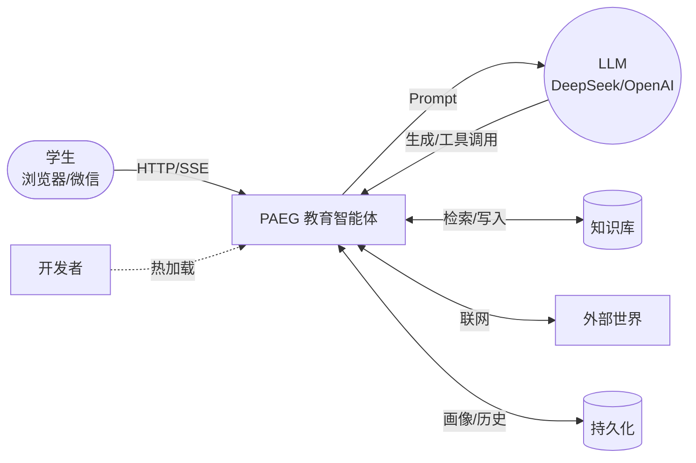

**图 2 · 系统尺度（六层 + 一次请求数据流）**

| 层 | 职责 | 核心组件 | 本次请求的角色 |
|---|---|---|---|
| L1 用户入口 | 接收请求 | Web UI / REST API / 微信桥 | 收到提问，发起请求 |
| L2 意图路由 | 识别意图 | meta_router（15 意图） | 判定 intent=teach |
| L3 教学编排 | 流程控制 | paeg.teach / teach_stream（SSE） | 五阶段编排 + 流式输出 |
| L4 Subagent | 领域执行 | 9 个领域专家 | 诊断/计划/讲解/评估协作 |
| L5 能力组件 | 可复用能力 | 25 MCP / 11 Skills / Workflows | 按需调工具 |
| L6 基础设施 | 底层支撑 | LLM 适配 / 知识库 / config_hub / 持久化 | 提供算力与数据 |
| **L0 横切** | 质量保障 | TRUTH_GROUNDING / QualityGate / 语言规范 | **约束每一层** |

**一次请求的路径**：学生提问 → L1（POST /api/teach/stream）→ L2（判定 teach）→ L3（五阶段）→ L4（subagent 协作）→ L5（工具按需）→ 全程受 L0 约束。

**图示（Mermaid 渲染）**：

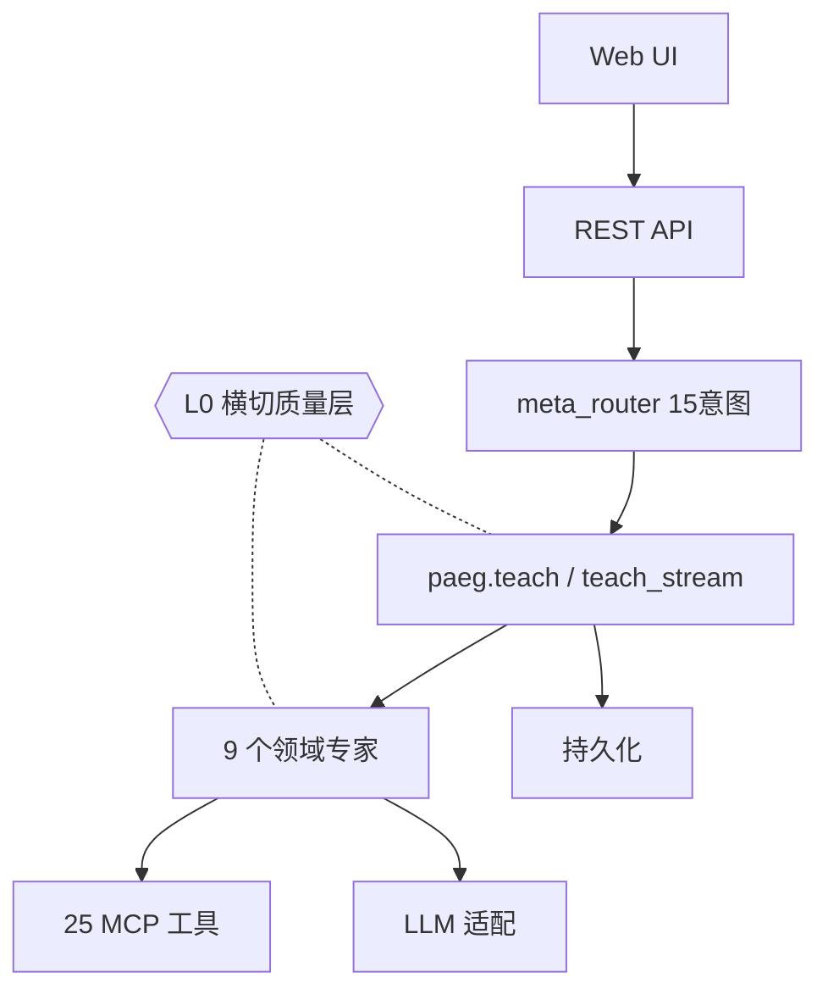

**图 3 · 教学流尺度（五阶段 + checkpoint 互动）**

| 阶段 | 执行者 | 做什么 | 产出 |
|---|---|---|---|
| ① 诊断 | Diagnostor | 前置知识检查 + LLM 深度建议 | recommended_depth/identified_gaps |
| ② 计划 | Planner | 策略选择 + 差异化步骤 | 3 步教学计划 |
| ③ 讲解 | Presenter | LLM 流式生成（60 字分片） | event: presentation |
| ↳ checkpoint | teach_stream | 每步后发理解检查问题 | event: checkpoint（前端 3 按钮） |
| ④ 评估 | Evaluator | score = 0.6·讲解 + 0.4·学生信号 | 掌握度/困惑信号 |
| ⑤ 调整 | Adapter | switch/reinforce/continue | 下一轮策略 |
| → 自我进化 | self_evolution | 蒸馏/补丁/工具经验 | evolved 写入 → 热加载 → 知识库可检索 |

**互动循环**：讲解 → checkpoint（听懂了吗）→ 学生回答 → 评估（_student_signal）→ 调整 → 继续或重讲；教学完成后自动进入自我进化（蒸馏知识点、沉淀教学补丁、积累工具经验）。

**图示（Mermaid 渲染）**：

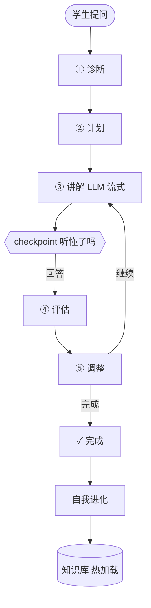

**图 4 · 组件尺度（Presenter 内部装配）**

| 装配块 | 内容 | 作用 |
|---|---|---|
| WEIL_CORE | 薇依人格基线 | 身份与教育信念锚定 |
| TRUTH_GROUNDING | 防幻觉 10 条底线 | 不编造/信源为绝对命令 |
| SUBJECT_STYLES | 35 学科风格（persona/语言/方法论） | 因材施教 |
| LANGUAGE_STYLE | 语言规范三层 | 输出像人话 |
| 动态补丁 | compose_dynamic_prompt | 注入自我更新建议 |

**内部流程**：确定性装配（上述块）→ system prompt → LLM 调用（重试+超时）→ 60 字分片 → SSE yield；如需工具则经 config_hub 路由到 mcp__ 工具，结果回灌 LLM。

> 设计原则：**确定性骨架（装配/分片/路由）由 Agent 负责，生成由 LLM 负责**——这是"教学交给 Agent、生成交给 LLM"的具体实现。

**图示（Mermaid 渲染）**：

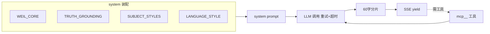

### 核心调用链（用户问"什么是导数"）
用户输入 → L1(POST /api/teach/stream) → L2(meta_router → intent=teach) → L3(teach_stream：诊断→计划→讲解→checkpoint→评估→调整) → L4(subagent 协作) → L5(工具按需调用) → L0(防幻觉全程约束)

### 架构图集（尺度分级 · 从全景到模块）

**图集总览**：

| 尺度 | 图 | 覆盖 |
|---|---|---|
| L0 全景 | 图1 全景（PAEG 与外部世界） | 系统边界 |
| L1 系统 | 图2 六层架构 | 分层+数据流 |
| L2 教学流 | 图3 五阶段+checkpoint | 一次教学 |
| L3 组件 | 图4 Presenter 装配 | subagent 内部 |
| L4 机制 | 图5-9（自我进化/RALPH/意图路由/配置体系/checkpoint 时序） | 关键机制细节 |
| L5 事件 | 图9 时序（SSE 事件序列） | 流式协议 |

**图 5 · 自我进化闭环（G1-G11）**

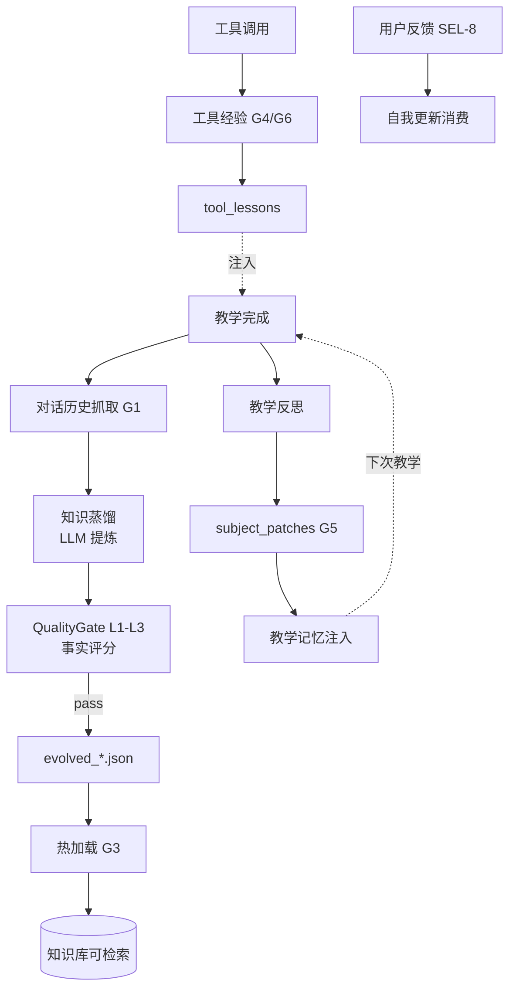

**图 6 · RALPH 循环（任务驱动持续改进）**

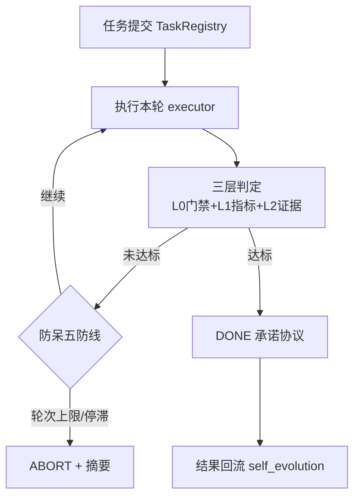

**图 7 · 意图路由（meta_router）**

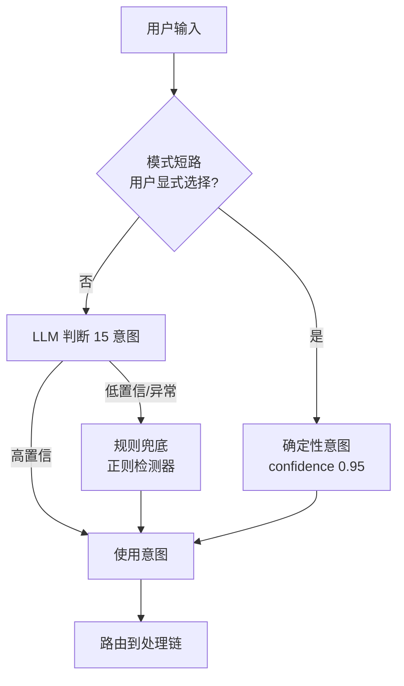

**图 8 · 配置体系（config_hub）**

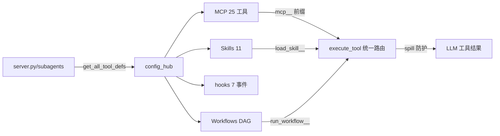

**图 9 · checkpoint 互动时序（深入版教学互动）**

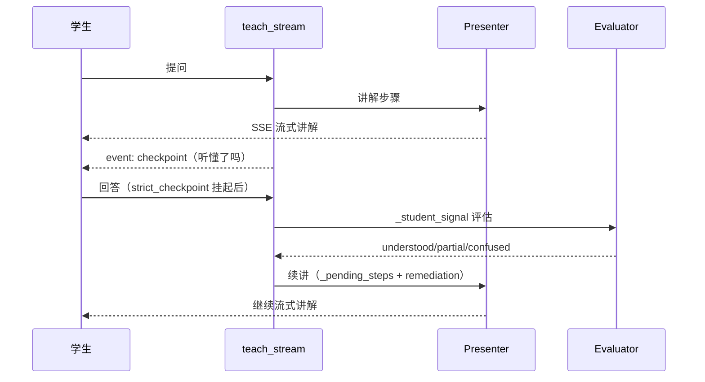

**图 10 · 17 维学生画像正交模型**

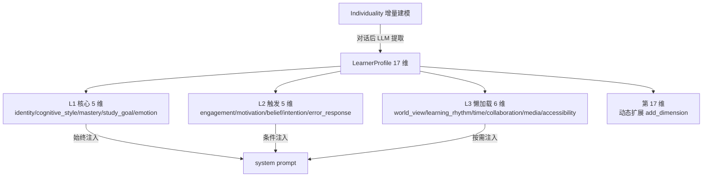

**图 11 · 三层记忆生命周期**

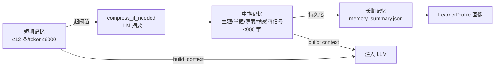

**图 12 · 教学策略决策树（choose_strategy）**

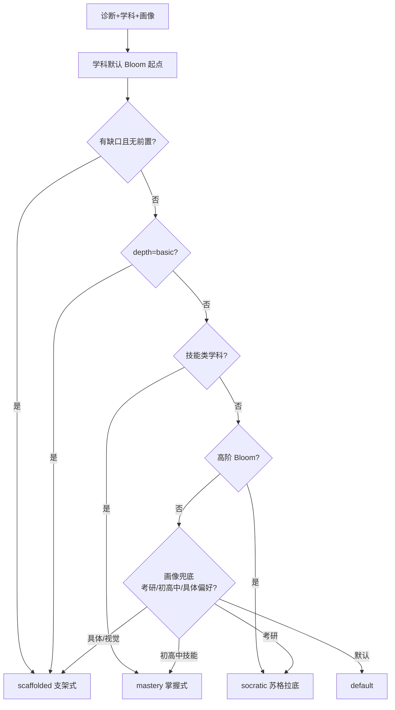

**图 13 · 单步教学续讲（_pending_steps 状态机）**

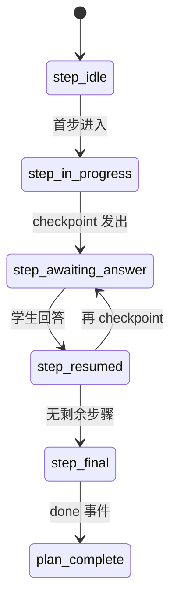

**图 14 · QualityGate L1-L4 四层过滤**

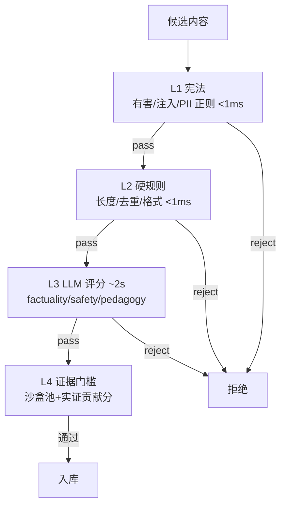

**图 15 · 周期自我更新调度（periodic）**

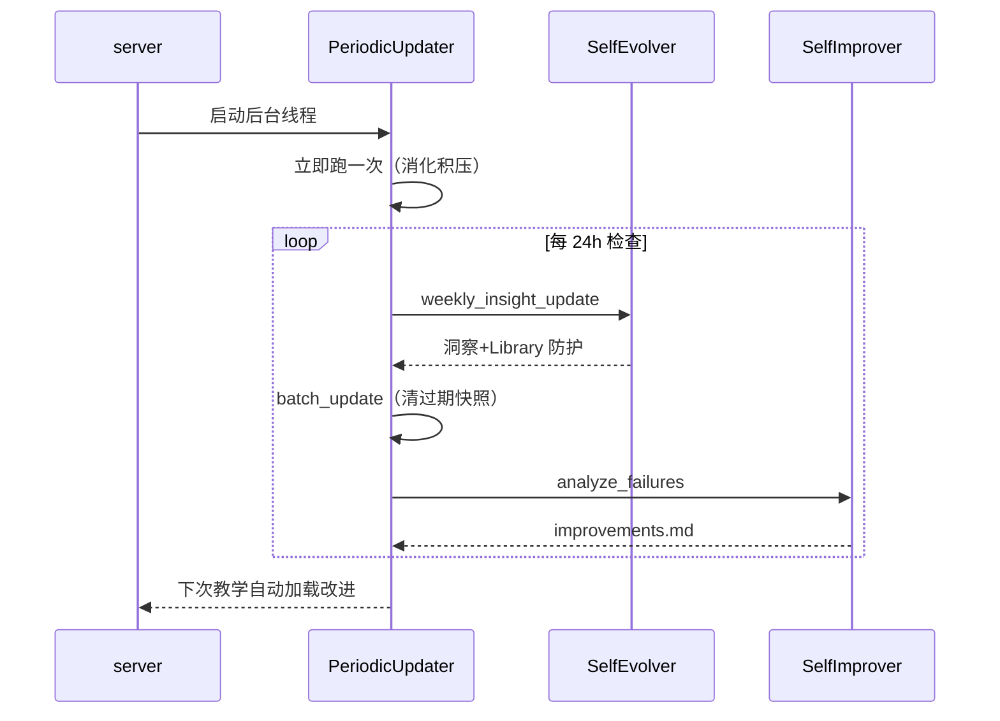

**图 16 · SSE 流式协议事件序列**

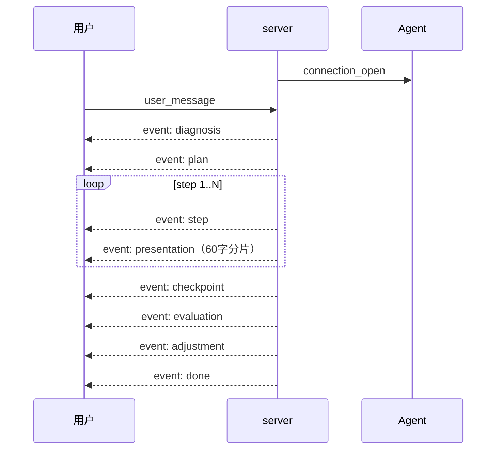

**图 17 · hooks 事件链（横切关注点）**

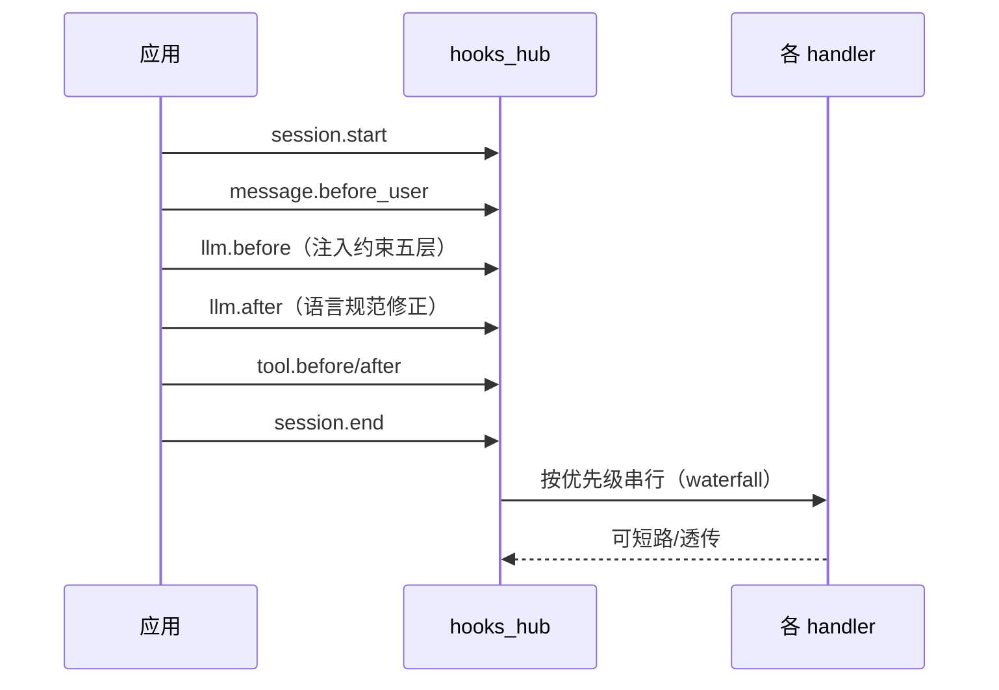

**图 18 · 危机信号拦截协议（affection_gate）**

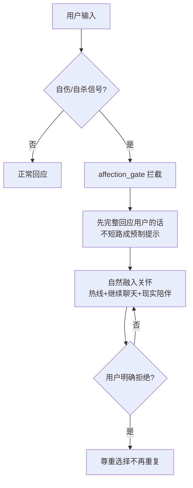

**图 19 · spill 防护（上下文溢出+注入防御）**

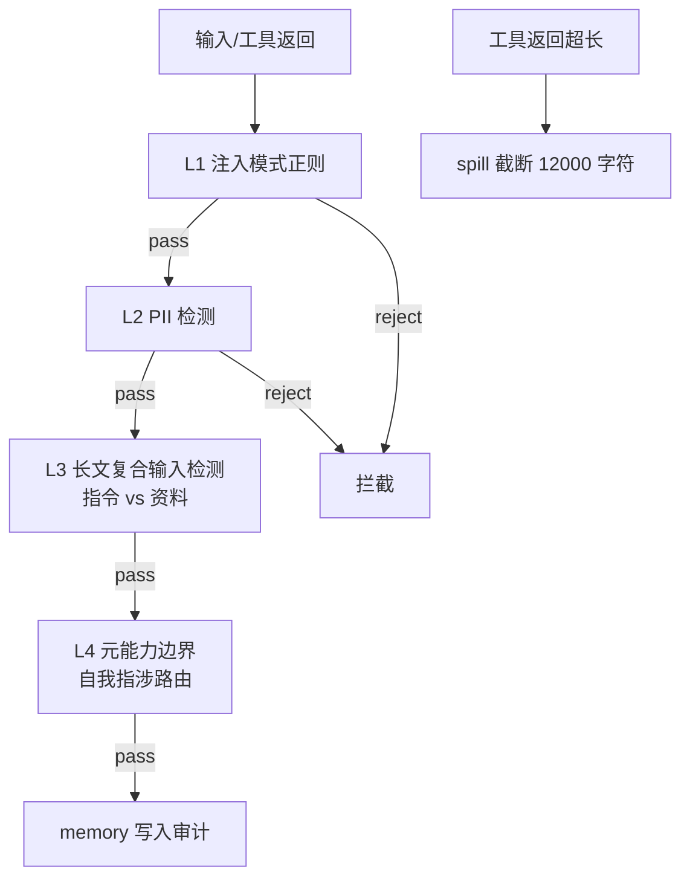

### 数学可视化脚本生成器（v0.70+ §3.26 开发中）

**流程**：对话+轮询（选择题/填空题收集主题/学段/时长/风格/核心直觉/前置概念）→ **生成 script.json**（单一真相源）→ 校验修补（7 铁律，最多 2 轮）→ **5 资产联动**（Manim 视频 + 讲稿 + PPT + 讲义 + 思维导图，全部可下载）。

**方法来源**：3Blue1Brown 8 大原则（直觉先于形式化/单一聚焦/空间承载含义/慢而稳/停顿/文字最小化/回看锚点）+ manim_skill 社区库（scenes.md 模板/ManimCE 颜色语义与节奏规范）+ Oracle 设计。

**script.json 结构**：meta（标题/受众/时长/风格）+ narrative_arc（hook/直觉先行/进阶路径）+ visual_system（调色板/语义绑定）+ scenes[]（concept/duration/narration/mobjects/animations/keyframes/prerequisites）+ qa_self_check。

**核心模块**：visual_script_generator.py（系统提示词+生成）+ visual_script_validator.py（7 铁律校验+自动修补）+ manim_renderer（模板渲染，P1）+ 资产联动（P1-P2）。

**可靠性**：脚本→确定性模板渲染（非 LLM 直出代码），LLM 只补 lambda/文案/keyframes；三级降级（自动修复→简化场景→静态分镜卡片）。

## 第 4 章 关键流程

### 4.1 教学生命周期（序列图要点）
诊断(前置+LLM) → 计划(策略+步骤) → 讲解(学科风格+流式) → 检查(理解) → 评估(掌握度) → 调整(下一轮) → 反思(自我更新)

### 4.2 自我进化闭环（G1-G11）
教学完成 → 对话历史抓取(G1) → distill 蒸馏(门禁 L1-L3) → evolved 写入(G3 热加载) → KB 可检索；反思 → subject_patches(G5) → 注入下次教学；工具经验(G4/G6/G8) → 反馈学习(SEL-8) → 老化归档(SEL-7)

### 4.3 RALPH 循环
任务提交(TaskRegistry) → 每轮：执行(executor) → 判定(L0 门禁+L1 指标+L2 证据) → 持久化(快照) → 防呆(五防线) → DONE/ABORT；承诺协议 `<promise>DONE</promise>`

### 4.4 热加载与配置更新
改 config/*.json → POST /api/admin/reload → config_hub.reload_all() → MCP/skills/hooks/workflows 热更新；evolved 写入 → reload_library → KB 即时可见

### 4.5 防幻觉锚定
TRUTH_GROUNDING 全模式注入（幂等）→ LLM 必须：不编造/信源为绝对命令/允许说不知道 → QualityGate L3 factuality 评分把关自我更新

---

## 第 5 章 扩展指南

| 想做什么 | 怎么做 |
|---|---|
| 新增学科 | `prompts.py` SUBJECT_STYLES 加键（persona/language/structure/emphasis + 可选 subfield_guide/method_guide/worked_example）+ SUBJECT_GRADES/SUBFIELD_TREE |
| 新增 subagent | `subagents.py` 建类（run 方法组装 system + 调 _safe_reason_chat）+ 注册到 paeg.py |
| 接入 MCP 工具 | `config/mcp_servers.json` 加 server 声明 → 重启/`/api/admin/reload` → mcp__ 前缀自动路由 |
| 新增 skill | `skills/<name>/SKILL.md`（frontmatter: name+description + Markdown 正文）→ 自动注册 |
| 编写 workflow | `config/workflows/<name>.json`（DAG：steps+depends_on）→ run_workflow__ 路由 |
| 新增钩子 | `config/hooks.json` 加 {event, module, function} → 事件触发 |
| 维护违禁词 | `normalize_text`/`language_policy_check`/`forbidden_words` MCP 工具（或直接编辑 data/forbidden_words.json 三类）——动态增删，不改代码 |
| 调整约束层 | `constraint_layer_set` MCP 工具（教学/考试/自由层 0-7）或 `constraint_always_active` 固定永远生效规则 |
| 约束自演化 | `constraint_self_evolve` 把教学洞察写入指定层组（落盘 data/constraint_layers.json） |

---

## 第 5A 章 DeepSeek Harness 借鉴蓝图（2026-08-14 调研）

> 来源：[github.com/deepseek-ai/deepseek-harness](https://github.com/deepseek-ai/deepseek-harness)（81.5k stars · MIT）——**一切皆插件**（Everything is a Plugin），Cordis 驱动。PAEG 依据其架构产出 **30 项优化需求**（§二 Step 2 需求文档，9 P0 + 14 P1 + 7 P2）。

### 核心架构五要点（PAEG 已落地部分标注）

| dsh 机制 | 原理 | PAEG 对应状态 |
|---|---|---|
| **无特权核心** | 模型适配器/工具注册表/会话日志/agent 循环全是插件，注册即副作用（卸载自动 unwind）| config_hub 插件体系（MCP/skills/hooks/workflows）✅ 部分对齐 |
| **Patch 行级覆盖** | YAML `- id:` 整体替换 config（非 deep merge）；`disabled: !!js expr` 条件启停 | constraint_layers.json 外部层覆盖 ✅ 已用同思想 |
| **Profile/Bundle 分层** | profile = bundles 堆叠 + 用户 patch + --patch overlay；`--dump-config` 打印可 patch 树 | ❌ 待实施（H-2） |
| **事件三分域** | session 事件（持久）/ agent 事件（拦截进行中工作）/ 能力事件（fs/tools 接缝）| hooks_hub 7 事件 ✅ 部分对齐 |
| **Capability Seam** | Service Definition/Provider/Consumer 三角色，换 provider 换全产品 | ❌ 待实施（H-5/#11） |

### 30 项优化需求速查（完整清单见需求文档 §二 Step 2）

**P0（9 项，长期蓝图核心）**：#1 subagent patch · #2 profile bundle · #3 persona 外置 · #7 教学预设 · #8 PresetService · #11 三角色重构 · #12 LLM Provider Seam · #13 Shell Seam · #21 Subagent Registry

**P1（14 项）**：#4 !!js 条件 · #5 home overlay · #9 per-agent scope · #10 preset 结构 · #14 tool 按需加载 · #15 Session Event Log · #18 权限预设升级 · #19 权限事件 · #22 subagent report · #24/25 UI 模式化 · #27 self-update via patch · #29 多级 skill · #30 ctx registry

**P2（7 项）**：#6 OS 双轨 · #16 hooks 瀑布 · #17 subprocess 抽象 · #20 custom 状态 · #23 fresh-agent loop（对照 RALPH）· #26 HMR · #28 Constitutional patch

### 建议实施路线（4 阶段，6-10 周）

- **Phase 1 运行时底座**（1-2 周）：#30 ctx registry / #12 LLM Seam / #13 Shell Seam / #15 Session Event Log
- **Phase 2 装扮系统**（2-3 周）：#1 subagent patch / #2 profile / #3 persona / #7-10 预设 / #4-6 条件+overlay
- **Phase 3 能力接缝+权限+UI**（2-3 周）：#11 三角色 / #14 tool registry / #18-20 权限 / #21-23 subagent / #24-26 UI
- **Phase 4 元能力**（1-2 周）：#27 self-update via patch / #28 constitutional patch / #29 多级 skill

**衔接**：已落地的 constraint_engine（§3.29）+ lang_gate MCP（§3.28）正是 P1 #5/#18/#27 的雏形——约束/语言规范已数据化可动态，后续沿此模式扩展。

---

---

## 第 6 章 未来规划（Roadmap · Oracle 咨询 2026-08-14）

> 主线：**让现有闭环（教学互动 + 评估 + RALPH）具备生产可用性**——Q3 补齐工程化短板，Q4 教育语义层升级，2027 产品化。每项挂钩九模块薄弱点或调研成果（非空泛目标）。

### Q3 近期（1-2 月）：工程化补齐 + 闭环数据沉淀

| # | 目标 | 价值 | 依赖 | 工作量 |
|---|---|---|---|---|
| Q3-1 | timeout-policy（教学长任务分级超时+中断恢复）+ llm-retry 合并入 harness 统一 | 防长会话卡死/超时 | 当前 llm-retry | Short |
| Q3-2 | message-feedback 落地：每轮互动 👍/👎+文本反馈入库 SQLite | 给效果评估提供真实数据 | message-feedback 子包 | Short |
| Q3-3 | session-sqlite 全量替换：会话状态内存/JSON → SQLite（回放） | 会话可审计可回放（合规必需） | 现有会话管理 | Short |
| Q3-4 | 九模块薄弱点扫描：对照 §3.12 产出评估覆盖率矩阵 | 让 Roadmap 可量化 | §3.12 文档 | Quick |
| Q3-5 | 教学能力结构化 v2：teaching-capability 接入 TPACK/加涅元数据标注 | 能力体系真正接入运行 | teaching-capability | Short |

**Q3 退出条件**：生产会话零丢失；≥30% 会话带反馈数据；九模块覆盖矩阵公开。

### Q4 中期（3-4 月）：教育语义层 + 上下文工程统一

| # | 目标 | 价值 | 依赖 | 工作量 |
|---|---|---|---|---|
| Q4-1 | 记忆系统语义分层（working/episodic/semantic + 教学知识图谱） | 解耦对话与长期认知图谱 | Q3-3/Q3-5 | Medium |
| Q4-2 | 教育知识图谱 MVP（教资 8 模块 × 专业标准 6 能力 × ADDIE） | 诊断/画像有"该教什么"依据 | 教育体系调研 | Medium |
| Q4-3 | 多 agent 协作（教师+学生+评估 Agent，RALPH 编排不换框架） | Berliner 专家级反思 + LLM-as-judge | Q4-1/ralph | Medium |
| Q4-4 | 上下文工程全量统一（预算分配 + 知识图谱检索槽位） | 防长会话丢关键上下文 | runoob 调研/compaction | Short |
| Q4-5 | RAG 接入语义层（反馈+能力标注+知识图谱为检索源） | 画像/策略有据可查 | Q4-1/Q4-2/Q3-2 | Medium |

**Q4 退出条件**：同一学生 3 次会话可复现认知图谱；多 agent 评估与人工一致率 ≥70%。

### 2027 远期：产品化方向

| # | 方向 | 触发条件 | 里程碑 | 工作量 |
|---|---|---|---|---|
| Y-1 | 个性化自适应闭环成熟（诊断→画像→差异化→评估→反馈全自动） | Q4-3 跑通 ≥1 学科 | 自适应学习案例 | Large |
| Y-2 | 教师协作平台（班级薄弱点洞察 + 干预建议 + 策略编辑） | 反馈数据 ≥6 个月 | 教师端 dashboard | Large |
| Y-3 | 多模态教学（板书/公式 OCR、语音、图形化思维呈现） | 用户具体需求 | ≥1 学科可用 | Large |
| Y-4 | 数据洞察 + 学习分析（知识图谱薄弱热力图） | Q4-2 有真实数据 | 分析报告 | Medium |

### 价值-成本矩阵（优先做 ★★★→★★→★）

| | 低成本 | 中成本 | 高成本 |
|---|---|---|---|
| **高价值** | Q3-1 timeout ★、Q3-3 sqlite ★、Q4-4 上下文统一 ★ | Q4-1 记忆分层 ★★、Q4-2 知识图谱 ★★、Q4-3 多 agent ★★ | Y-1 自适应闭环 ★★★、Y-2 教师协作 ★★ |
| **中价值** | Q3-2 feedback、Q3-5 能力标注 | Q4-5 RAG、Y-4 数据洞察 | Y-3 多模态 |
| **低价值** | Q3-4 评估矩阵 | — | — |

### 决策规则（项目所有者）
1. 每条 Roadmap 项必须挂钩：九模块薄弱点 / 教育体系能力 / Harness 包——空泛项砍掉
2. 季度回顾硬指标：Q3 看"零丢失+反馈入库率"，Q4 看"认知图谱可复现"，2027 看"教师实际干预次数"
3. 多 agent 不换框架（复用 RALPH）；知识图谱先轻量本体（JSON）确认需求再上 Neo4j

## 附录 A 术语表

| 术语 | 含义 |
|---|---|
| meta_router | 意图路由器（15 意图分类，LLM 优先+规则兜底+模式短路） |
| SUBJECT_STYLES | 35 学科教学风格字典（persona/语言/结构/侧重/方法论/例题） |
| subagent | 领域专家子代理（9 个，职责单一+上下文隔离） |
| MCP | Model Context Protocol——工具链（filesystem/brave-search 等 25 工具） |
| Skill | 按需加载的专业能力（SKILL.md，L1 目录+L2 激活） |
| Workflow | 声明式流程（JSON DAG，如 teach_minimal 诊断→计划→实施→评估） |
| hooks | 事件钩子（session/message/llm/tool 7 类，waterfall 链） |
| TRUTH_GROUNDING | 防幻觉底线（10 条，全模式注入） |
| QualityGate | 自我更新质量门禁（L1-L4） |
| RALPH | 任务驱动持续改进循环（ralph/ 子系统） |
| SSE | Server-Sent Events（流式教学输出协议） |

## 附录 B 核心文件索引

| 文件 | 职责 |
|---|---|
| server.py | Flask 入口（所有端点 + teach_stream SSE） |
| paeg.py | 教学编排主链（teach() 五阶段） |
| subagents.py | 9 个 subagent + Presenter + 能力清单 |
| prompts.py | 提示词库（WEIL_CORE/TRUTH_GROUNDING/SUBJECT_STYLES/build_*_system） |
| meta_router.py | 15 意图路由 |
| self_evolution.py | 自我更新（蒸馏/补丁/工具经验/老化） |
| config_hub.py | 配置中心（MCP/skills/hooks/workflows 统一） |
| ralph/ | RALPH 循环子系统（6 模块） |
| pedagogy.py | 教学策略选择（画像驱动） |
| constraint_engine.py | L0-L8 约束引擎（6 API：layer_get/set/compose/always_active/self_evolve/feedback_adjust） |
| services/lang_gate.py | 语言规范统一入口（L0+L2 守门，13 处收敛） |
| language_refiner.py | 薇依语料矫正（AI_TELLS + forbidden_words.json 合并） |
| services/ | 场景 handler（method/study_plan/quiz/keyword_doc 等）+ planner + 生产管线 |
| data/forbidden_words.json | 外部违禁词数据（extra_forbidden/pseudo_empathy_verbs/ai_tells_extra） |
| data/constraint_layers.json | 外部约束层覆盖（self_evolve 落盘） |
| data/always_active.json | 永远激活规则（外部维护） |
| 09_GUI前端/index.html | Web UI（含 checkpoint 问答面板/反馈按钮） |
