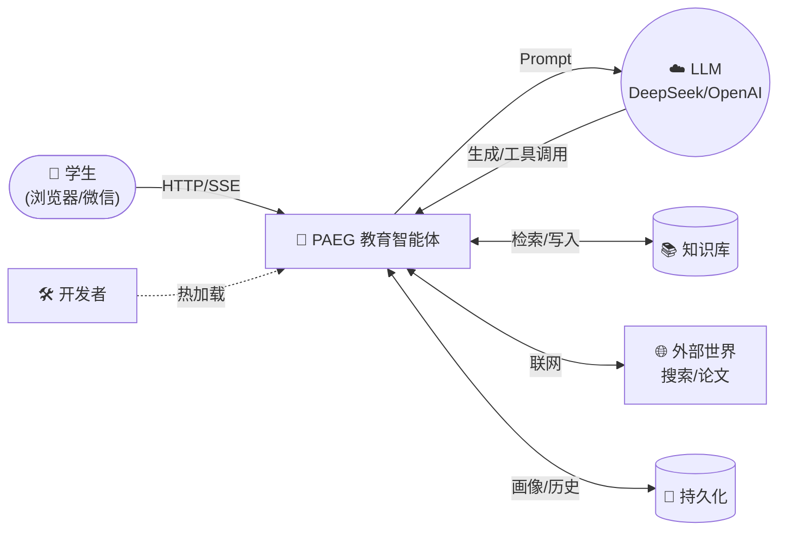
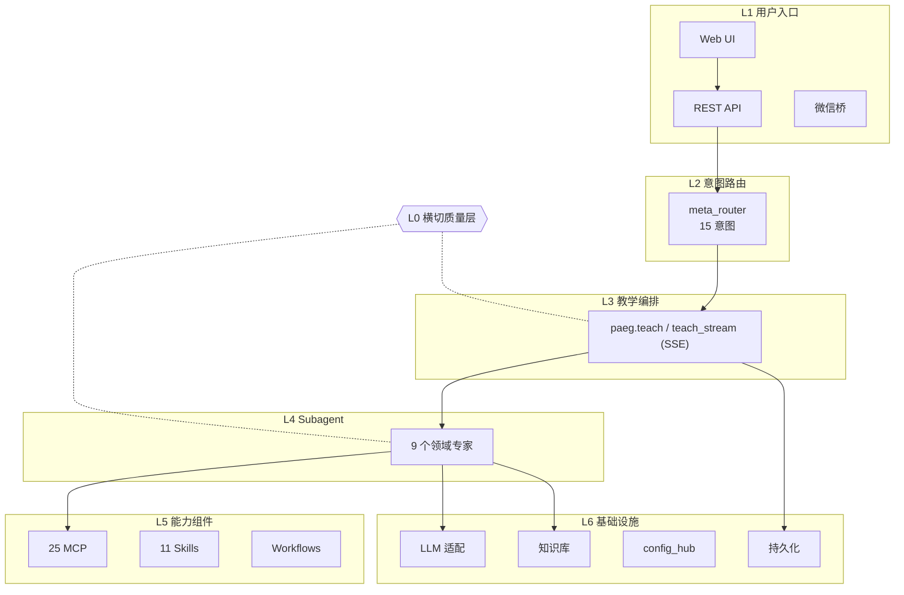
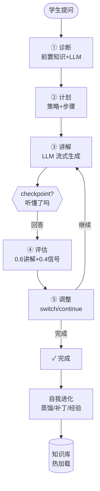
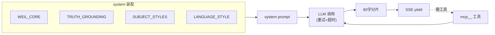

# PAEG 教育智能体 — 简明技术说明（v0.69）

> 面向项目所有者：快速恢复对 PAEG 技术实现的全貌认知。
> 结构：TL;DR → 能力全景（每个功能：技术路线 + 实现方法）→ 分层架构 → 关键流程 → 扩展指南。

---

## 第 0 章 TL;DR（30 秒看懂）

**PAEG 是什么**：一个**多 Agent 架构的学科教学智能体**——不是"给 LLM 套聊天框"，而是让 LLM 扮演"有教学法、有过程、有陪伴、能自我成长"的教师，完成诊断→计划→讲解→评估→调整→自我进化的完整教学闭环。

**三大核心能力**：
1. **智能教学**：像老师一样因材施教（诊断学情→规划路径→逐步讲解→评估掌握→调整策略）
2. **学科专精**：35 学科 × 4 学段各有专属教学法（哲学文献论证/大学物理拆键/外语母语迁移…）
3. **自我进化**：越用越好——从教学中自动蒸馏知识、沉淀教学经验、热更新知识库，还能用 RALPH 循环持续改进自身

**技术底座**：Python + Flask（SSE 流式）+ 多种 LLM（DeepSeek/OpenAI 兼容）+ MCP 工具链（25 工具）+ Skills + Workflows + 自我更新引擎。

---

### 先认识 5 个关键名词（30 秒速查）
- **subagent**：专科老师——每个负责一个领域（诊断/讲解/评估…），职责单一
- **MCP**：工具调用标准——让 AI 能联网、读写文件、调用外部工具（25 个）
- **Skill**：按需加载的能力包——需要时才加载的专业流程（11 个）
- **SSE**：流式推送——AI 边想边输出，像打字机一样逐字显示
- **TRUTH_GROUNDING**：防幻觉底线——10 条规则强制 AI 不准编造，宁可说"不知道"

## 第 1 章 项目概览

| 项 | 内容 |
|---|---|
| 定位 | 个性化自适应教育智能体（v0.69） |
| 入口 | Web UI（index.html）/ REST API（server.py）/ 微信桥 |
| 技术栈 | Python 3.12 / Flask / SSE / MCP / FastMCP / SQLite / JSON 持久化 |
| 核心模块 | meta_router（意图路由）/ paeg（教学编排）/ subagents（9 专家）/ prompts（提示词库）/ self_evolution（自我更新）/ config_hub（配置体系）/ ralph（循环器） |

---

## 第 2 章 能力全景（F1-F7，每功能含技术路线+实现方法）

### F1 智能教学对话

| 功能 | 用户场景 | 技术路线 | 实现方法 |
|---|---|---|---|
| **流式教学讲解** | 问"什么是导数" | 意图路由→Diagnostor→Planner→Presenter→Evaluator | `teach_stream`（SSE 流式）：diagnosis→plan→step→presentation→evaluation→adjustment 事件序列；Presenter 调 `build_presenter_system` 组装学科 system + LLM 生成分段讲解，60 字分片 yield |
| **交互式理解检查** | 讲完一步问"听懂了吗" | checkpoint 事件 + 前端问答面板 | teach_stream 每步 presentation 后发 `event: checkpoint`（携带复述问题）；前端显示"我理解了/不太清楚/有疑问"按钮，回答走教学续问 |
| **学情诊断** | 教学前评估学生水平 | Diagnostor subagent | 前置知识规则检查 + LLM 判断（recommended_depth/identified_gaps），输出 JSON |
| **教学策略选择** | 决定用苏格拉底/支架式/掌握式 | pedagogy.choose_strategy | 基于诊断（缺口/深度）+ 学科 Bloom 起点 + 画像（学段/认知风格/目标考试）选策略，生成差异化步骤 |
| **掌握度评估** | 判断学生是否学会 | Evaluator（纯确定性） | `score = 0.6*讲解质量 + 0.4*学生状态`；`_student_signal` 浅层语义分析（理解度/困惑/参与/情绪） |
| **教学调整** | 学生困惑时换讲法 | Adapter（纯确定性） | 根据 score/confusion/mastery 输出 switch_style/reinforce/continue + 6 种风格选项（类比/例子优先/苏格拉底/视觉…） |
| **倾诉陪伴** | "我压力好大" | AffectionSupportor | 三阶段对话（现象学倾听→薇依注意力→尼采自我克服）；注入完整 WEIL_CORE + TRUTH_GROUNDING；危机识别（自伤信号） |
| **找答案** | "直接告诉我答案" | AnswerSolver | 直接输出完整答案模板（不走教学引导）；强制检索知识库 + 暴露工具 |

### F2 学科能力矩阵

| 功能 | 用户场景 | 技术路线 | 实现方法 |
|---|---|---|---|
| **35 学科×4 学段教学法** | 各学科因材施教 | SUBJECT_STYLES 字典 | `prompts.py` 35 学科独立配置（persona/language/structure/emphasis/subfield_guide/method_guide/worked_example），`build_presenter_system` 按学科条件渲染注入 |
| **哲学专项** | 精读哲学文献 | philosophy method_guide | 文献论证结构分析（6 步法）+ 概念分析（6 步法：概念区分/关系/对子）+ 洞穴寓言 worked_example；考研档解锁 |
| **大学物理拆键** | 大学物理 vs 中学物理 | college_physics 独立键 | 普通物理/四大力学/数学物理方法 subfield_guide + 解题方法论 + 典型例题 |
| **外语母语迁移** | 英语/法语/德语学习 | NATIVE_TRANSFER_BLOCK | 正迁移（搭桥）/负迁移（防御）/易错点（口诀）/跨文化意识，仅语言学科注入 |
| **考研数学** | 考研备考 | graduate_exam 学段 | SUBJECT_GRADES 门控 + SUBFIELD_TREE 二级学科（考研数学/马原/西哲史…） |

### F3 学习辅助工具

| 功能 | 用户场景 | 技术路线 | 实现方法 |
|---|---|---|---|
| **个性化学习计划** | "制定考研数学 90 天计划" | services/planner.py | 5 阶段工作流（提取参数→聚合资源→阶段划分→个性化→结构化输出）；阶段骨架确定性 + 里程碑 LLM 个性化；推荐资料附录（用户物料/知识库/联网 4 路聚合） |
| **学习方法建议** | "怎么学物理" | services/handlers/method.py | method 意图 → 单次方法建议（非完整计划），注入问卷+约束分层 |
| **知识导图** | "画知识导图" | knowledge_map + skill | load_skill__knowledge-map 技能 + knowledge_map.py 主动加载 |
| **出题/例题** | "出一道经典题" | services/handlers/problem.py | 出题模板（经典题+完整解答+考查点）；薄弱点优先 |
| **文档生成** | "生成讲义/要点/例题/笔记" | services/handlers/keyword_doc.py | 4 类 doc_type 模板切换，教学对话中关键词触发 |
| **学习测评** | 出选择题 | services/quiz_service.py | 概念→单选题 JSON（题干/选项/正确索引/解析） |
| **用户反馈** | 消息气泡 👍/👎 | /api/feedback | 前端按钮→feedback_log.jsonl→自我更新消费 |

### F4 自我进化闭环

| 功能 | 用户场景 | 技术路线 | 实现方法 |
|---|---|---|---|
| **知识蒸馏** | 教学后沉淀知识点 | distill_knowledge（G1/G2/G7） | 教学会话→LLM 提炼→QualityGate L1-L3（含事实评分）→evolved_*.json→G3 热加载→KB 可检索；流式教学 done 后从对话历史抓取（G1） |
| **学科教学补丁** | 反思改进教学法 | subject_patches（G5） | 教学反思→战术/战略补丁→memory/subject_patches.md→teaching_memory 注入下次教学 |
| **工具经验** | 工具使用经验沉淀 | tool_lessons（G4/G6/G8） | 工具调用→LLM 提炼经验（成功信号词判定 G4）→tool_lessons.md（40KB 限长 G8） |
| **知识热加载** | 更新即时生效 | reload_library（G3） | evolved 写入后刷新 KB，无需重启 |
| **知识老化归档** | 旧知识整理 | SEL-7 | evolved 日文件 >90 天归档 Archive/ |
| **用户反馈学习** | 根据点赞/👎改进 | /api/feedback（SEL-8） | 反馈日志→自我更新消费 |
| **RALPH 循环** | 持续改进任务 | ralph/ 子系统 | 任务执行循环：执行→三层判定（L0 门禁/L1 指标/L2 证据）→承诺协议→防呆五防线（轮次上限/收益递减/质量回退/人类确认/资源熔断） |
| **周度自我更新** | 定期自动优化 | periodic_self_update | 洞察/改进建议/学科需求/建议回流/知识归档（时间触发） |

### F5 多模态产出

| 功能 | 用户场景 | 技术路线 | 实现方法 |
|---|---|---|---|
| **讲义/PPT/视频/manim/思维导图** | 制作教学材料 | 文件生成器 + MCP | 能力清单注入（_build_capability_manifest）→ LLM 判断何时生成 → manim 动画（manim_service）/PPT（mcp__pptx）/讲义（keyword_doc）/视频脚本（script_service）/思维导图（knowledge_map） |
| **MCP 工具链** | 联网/文件/检索 | 25 个 MCP 工具 | filesystem/memory/brave-search/pptx 等；config_hub 统一路由（mcp__ 前缀），spill 溢出防护（超 12000 字符截断） |
| **语音朗读** | 播放回复 | /api/voice/tts | 前端朗读按钮→TTS |

### F6 配置与扩展体系

| 功能 | 用户场景 | 技术路线 | 实现方法 |
|---|---|---|---|
| **统一配置中心** | 配置 MCP/skills/hooks/workflows | config_hub.py | 四子模块统一加载/路由/热更新（/api/admin/reload） |
| **技能库** | 按需加载专业能力 | skill_registry.py | 11 个 skill（teaching-capability/essay-feedback 等）；L1 目录注入 + L2 按需激活；inject_catalog 统一幂等 |
| **钩子系统** | 事件拦截扩展 | hooks_hub.py | 7 事件（session/message/llm/tool）+ waterfall 链 + repeat-tool-reminder Guard + timeout 隔离 |
| **工作流** | 声明式流程 | workflows_hub.py | teach_minimal/teach_concept DAG（诊断→计划→实施→评估），run_workflow__ 路由 |
| **权限预设** | 考试模式锁写工具 | Permission Preset | read_only/standard/exam/full 四档，exam 禁写工具 |
| **动态提示词拼接** | LLM 主动调取自我更新补丁 | compose_dynamic_prompt tool | LLM 调用返回 subject_patches/tool_lessons/教师笔记 动态段合并 |

### F7 安全与质量保障

| 功能 | 用户场景 | 技术路线 | 实现方法 |
|---|---|---|---|
| **防幻觉底线** | 不编造事实 | TRUTH_GROUNDING | 10 条底线（绝不编造/信源为绝对命令/允许说不知道）注入全模式（presenter/general_chat/affection），幂等 |
| **质量门禁** | 自我更新入库审核 | QualityGate | L1 宪法（有害/注入/PII）→L2 硬规则→L3 LLM 多维评分（factuality/safety/pedagogy）→L4 证据沙盒 |
| **语言规范** | 输出像人话 | LANGUAGE_STYLE + polish/refiner | 三层语言规范（主谓宾/词法/介词）+ 薇依语料矫正 + 反 AI 腔 |
| **安全协议** | 危机/有害内容 | safety.py | 危机识别（自伤/自杀）→ 注入指引不短路；有害内容 L1 拦截 |
| **事实锚定** | 真实信息优先 | 知识库检索 + 联网降级栈 | web_search（Brave→Tavily→Serper→Bing 降级）；知识库优先 |

---

## 第 3 章 系统架构（六层）

### 架构多尺度图（从最大尺度到精细尺度）

**图 1 · 全景尺度（PAEG 与外部世界）**

**图 2 · 系统尺度（六层 + 一次请求数据流）**

**图 3 · 教学流尺度（五阶段 + checkpoint 互动）**

**图 4 · 组件尺度（Presenter 内部装配）**

### 核心调用链（用户问"什么是导数"）
用户输入 → L1(POST /api/teach/stream) → L2(meta_router → intent=teach) → L3(teach_stream：诊断→计划→讲解→checkpoint→评估→调整) → L4(subagent 协作) → L5(工具按需调用) → L0(防幻觉全程约束)

## 第 4 章 关键流程

### 4.1 教学生命周期（序列图要点）
诊断(前置+LLM) → 计划(策略+步骤) → 讲解(学科风格+流式) → 检查(理解) → 评估(掌握度) → 调整(下一轮) → 反思(自我更新)

### 4.2 自我进化闭环（G1-G11）
教学完成 → 对话历史抓取(G1) → distill 蒸馏(门禁 L1-L3) → evolved 写入(G3 热加载) → KB 可检索；反思 → subject_patches(G5) → 注入下次教学；工具经验(G4/G6/G8) → 反馈学习(SEL-8) → 老化归档(SEL-7)

### 4.3 RALPH 循环
任务提交(TaskRegistry) → 每轮：执行(executor) → 判定(L0 门禁+L1 指标+L2 证据) → 持久化(快照) → 防呆(五防线) → DONE/ABORT；承诺协议 `<promise>DONE</promise>`

### 4.4 热加载与配置更新
改 config/*.json → POST /api/admin/reload → config_hub.reload_all() → MCP/skills/hooks/workflows 热更新；evolved 写入 → reload_library → KB 即时可见

### 4.5 防幻觉锚定
TRUTH_GROUNDING 全模式注入（幂等）→ LLM 必须：不编造/信源为绝对命令/允许说不知道 → QualityGate L3 factuality 评分把关自我更新

---

## 第 5 章 扩展指南

| 想做什么 | 怎么做 |
|---|---|
| 新增学科 | `prompts.py` SUBJECT_STYLES 加键（persona/language/structure/emphasis + 可选 subfield_guide/method_guide/worked_example）+ SUBJECT_GRADES/SUBFIELD_TREE |
| 新增 subagent | `subagents.py` 建类（run 方法组装 system + 调 _safe_reason_chat）+ 注册到 paeg.py |
| 接入 MCP 工具 | `config/mcp_servers.json` 加 server 声明 → 重启/`/api/admin/reload` → mcp__ 前缀自动路由 |
| 新增 skill | `skills/<name>/SKILL.md`（frontmatter: name+description + Markdown 正文）→ 自动注册 |
| 编写 workflow | `config/workflows/<name>.json`（DAG：steps+depends_on）→ run_workflow__ 路由 |
| 新增钩子 | `config/hooks.json` 加 {event, module, function} → 事件触发 |

---

---

## 第 6 章 即将更新（Roadmap · 2026-08-14 进行中）

> 以下能力正在开发/规划中，完成后将更新到本说明。

| 更新项 | 状态 | 技术路线 |
|---|---|---|
| **深入版教学互动** | ✅ 已完成 | strict_checkpoint 挂起（checkpoint 后结束流等回答）+ 续讲评估（_student_signal → understood/partial/confused → remediation 引导重讲）+ 复用 _pending_steps 续讲 |
| **Harness 引入补全** | ✅ 已完成 | compaction（compaction.py 守卫，30→13 验证）+ llm-retry（_safe_chat 重试 3 次）+ user-approval（Permission Preset + hooks 基础）+ timeout-policy（hooks P1-7） |
| **技术说明 PDF** | ✅ 已完成 | Markdown → HTML（微 agent 设计模板）→ Edge headless 渲染（1MB，已发微信+交付物） |
| 交互式教学深度版（挂起+resume 端点） | 📋 规划 | checkpoint 后结束流 → /api/teach/resume 从挂起状态续讲 |
| 学习效果评估闭环 | 📋 规划 | Evaluator 加 learning_effect（学生复述/答题正确率 → 画像） |
| 前端点赞 UI 完善 | 📋 规划 | 消息气泡反馈按钮已实现，反馈→策略调整深化 |

**更多未来规划（详细）**：
| 规划项 | 说明 |
|---|---|
| 交互式教学深度版（挂起+resume 端点） | checkpoint 后结束流 → /api/teach/resume 从挂起状态续讲（Oracle 方案 A） |
| 学习效果评估闭环 | Evaluator 加 learning_effect（学生复述/答题率→画像→下一轮计划） |
| 前端点赞 UI 完善 | 反馈→策略调整深化（SEL-8 完整闭环） |
| 记忆系统语义分层 | MemGPT 风格 episodic/semantic/procedural（当前时间维度三层已有） |
| 上下文工程全量统一 | context_bundle 覆盖所有 system 拼接（当前 9 处引用） |
| 多 agent 协作扩展 | 任务级并行（RALPH P2） |
| 教学反思独立循环 | 秒级课堂反思 + 小时级改进循环解耦 |
| 评估可视化 | RALPH 循环时间线 UI（每轮决策可追溯） |

**Roadmap 说明**：所有更新按需求文档（PAEG_任务总清单与操作规范.md §3.20-3.22）执行——先记录需求、再执行、完成后更新状态并同步本说明。

## 附录 A 术语表

| 术语 | 含义 |
|---|---|
| meta_router | 意图路由器（15 意图分类，LLM 优先+规则兜底+模式短路） |
| SUBJECT_STYLES | 35 学科教学风格字典（persona/语言/结构/侧重/方法论/例题） |
| subagent | 领域专家子代理（9 个，职责单一+上下文隔离） |
| MCP | Model Context Protocol——工具链（filesystem/brave-search 等 25 工具） |
| Skill | 按需加载的专业能力（SKILL.md，L1 目录+L2 激活） |
| Workflow | 声明式流程（JSON DAG，如 teach_minimal 诊断→计划→实施→评估） |
| hooks | 事件钩子（session/message/llm/tool 7 类，waterfall 链） |
| TRUTH_GROUNDING | 防幻觉底线（10 条，全模式注入） |
| QualityGate | 自我更新质量门禁（L1-L4） |
| RALPH | 任务驱动持续改进循环（ralph/ 子系统） |
| SSE | Server-Sent Events（流式教学输出协议） |

## 附录 B 核心文件索引

| 文件 | 职责 |
|---|---|
| server.py | Flask 入口（所有端点 + teach_stream SSE） |
| paeg.py | 教学编排主链（teach() 五阶段） |
| subagents.py | 9 个 subagent + Presenter + 能力清单 |
| prompts.py | 提示词库（WEIL_CORE/TRUTH_GROUNDING/SUBJECT_STYLES/build_*_system） |
| meta_router.py | 15 意图路由 |
| self_evolution.py | 自我更新（蒸馏/补丁/工具经验/老化） |
| config_hub.py | 配置中心（MCP/skills/hooks/workflows 统一） |
| ralph/ | RALPH 循环子系统（6 模块） |
| pedagogy.py | 教学策略选择（画像驱动） |
| services/ | 场景 handler（method/study_plan/quiz/keyword_doc 等）+ planner + 生产管线 |
| 09_GUI前端/index.html | Web UI（含 checkpoint 问答面板/反馈按钮） |
