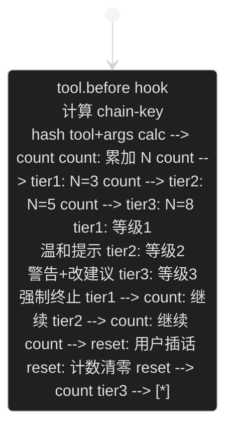
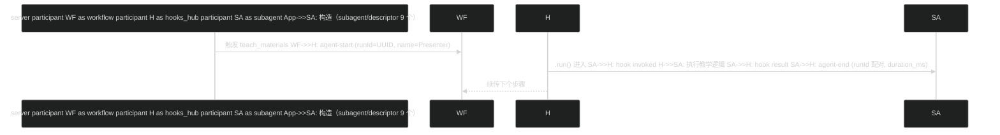

# PAEG 教育智能体 — 简明技术说明（v1.1.8）

> 面向项目所有者：快速恢复对 PAEG 技术实现的全貌认知。
> 结构：TL;DR → 能力全景（每个功能：技术路线 + 实现方法）→ 分层架构 → 关键流程 → 扩展指南。

---

## 第 0 章 TL;DR（快速概览）

**PAEG 是什么**：一个**多 Agent 架构的学科教学智能体**——不是"给 LLM 套聊天框"，而是让 LLM 扮演"有教学法、有过程、有陪伴、能自我成长"的教师，完成诊断→计划→讲解→评估→调整→自我进化的完整教学闭环。

**三大核心能力**：
1. **智能教学**：像老师一样因材施教（诊断学情→规划路径→逐步讲解→评估掌握→调整策略）
2. **学科专精**：35 学科 × 4 学段各有专属教学法（哲学文献论证/大学物理拆键/外语母语迁移…）
3. **自我进化**：越用越好——从教学中自动蒸馏知识、沉淀教学经验、热更新知识库，还能用 RALPH 循环持续改进自身 **技术底座**：Python + Flask（SSE 流式）+ 多种 LLM（DeepSeek/OpenAI 兼容）+ MCP 工具链（14 标准工具）+ Skills（11）+ Workflows + 自我更新引擎。

---


### 先认识 5 个关键名词（快速速查）
- **subagent**：专科老师——每个负责一个领域（诊断/讲解/评估…），职责单一
- **MCP**：工具调用标准——让 AI 能联网、读写文件、调用外部工具（14 个标准 MCP 工具）
- **Skill**：按需加载的能力包——需要时才加载的专业流程（11 个）
- **SSE**：流式推送——AI 边想边输出，像打字机一样逐字显示
- **TRUTH_GROUNDING**：防幻觉底线——10 条规则强制 AI 不准编造，宁可说"不知道"


## 第 1 章 项目概览 | 项 | 内容 |
|---|---|
| 定位 | 个性化自适应教育智能体（v0.73） |
| 入口 | Web UI（index.html）/ REST API（server.py）/ 微信桥 |
| 技术栈 | Python 3.12 / Flask / SSE / MCP / FastMCP / SQLite / JSON 持久化 |
| 核心模块 | meta_router（意图路由）/ paeg（教学编排）/ subagents（9 专家）/ prompts（提示词库）/ self_evolution（自我更新）/ config_hub（配置体系）/ ralph（循环器） |

---

## 第 2 章 能力全景（F1-F7，每功能含技术路线+实现方法）

### F1 智能教学对话 | 功能 | 用户场景 | 技术路线 | 实现方法 |
|---|---|---|---|
| **流式教学讲解** | 问"什么是导数" | 意图路由→Diagnostor→Planner→Presenter→Evaluator | `teach_stream`（SSE 流式）：diagnosis→plan→step→presentation→evaluation→adjustment 事件序列；Presenter 调 `build_presenter_system` 组装学科 system + LLM 生成分段讲解，60 字分片 yield |
| **交互式理解检查** | 讲完一步问"听懂了吗" | checkpoint 事件 + 前端问答面板 | teach_stream 每步 presentation 后发 `event: checkpoint`（携带复述问题）；前端显示"我理解了/不太清楚/有疑问"按钮，回答走教学续问 |
| **学情诊断** | 教学前评估学生水平 | Diagnostor subagent | 前置知识规则检查 + LLM 判断（recommended_depth/identified_gaps），输出 JSON |
| **教学策略选择** | 决定用苏格拉底/支架式/掌握式 | pedagogy.choose_strategy | 基于诊断（缺口/深度）+ 学科 Bloom 起点 + 画像（学段/认知风格/目标考试）选策略，生成差异化步骤 |
| **掌握度评估** | 判断学生是否学会 | Evaluator（纯确定性） | `score = 0.6*讲解质量 + 0.4*学生状态`；`_student_signal` 浅层语义分析（理解度/困惑/参与/情绪） |
| **教学调整** | 学生困惑时换讲法 | Adapter（纯确定性） | 根据 score/confusion/mastery 输出 switch_style/reinforce/continue + 6 种风格选项（类比/例子优先/苏格拉底/视觉…） |
| **倾诉陪伴** | "我压力好大" | AffectionSupportor | 三阶段对话（现象学倾听→薇依注意力→尼采自我克服）；注入完整 WEIL_CORE + TRUTH_GROUNDING；危机识别（自伤信号） |
| **找答案** | "直接告诉我答案" | AnswerSolver | 直接输出完整答案模板（不走教学引导）；强制检索知识库 + 暴露工具 |

### F2 学科能力矩阵 | 功能 | 用户场景 | 技术路线 | 实现方法 |
|---|---|---|---|
| **35 学科×4 学段教学法** | 各学科因材施教 | SUBJECT_STYLES 字典 | `prompts.py` 35 学科独立配置（persona/language/structure/emphasis/subfield_guide/method_guide/worked_example），`build_presenter_system` 按学科条件渲染注入 |
| **哲学专项** | 精读哲学文献 | philosophy method_guide | 文献论证结构分析（6 步法）+ 概念分析（6 步法：概念区分/关系/对子）+ 洞穴寓言 worked_example；考研档解锁 |
| **大学物理拆键** | 大学物理 vs 中学物理 | college_physics 独立键 | 普通物理/四大力学/数学物理方法 subfield_guide + 解题方法论 + 典型例题 |
| **外语母语迁移** | 英语/法语/德语学习 | NATIVE_TRANSFER_BLOCK | 正迁移（搭桥）/负迁移（防御）/易错点（口诀）/跨文化意识，仅语言学科注入 |
| **考研数学** | 考研备考 | graduate_exam 学段 | SUBJECT_GRADES 门控 + SUBFIELD_TREE 二级学科（考研数学/马原/西哲史…） |
| **学段教学模式差异化** | 初中/高中/大学/考研讲课风格本质不同 | GRADE_TEACHING_MODES + GRADE_SCAFFOLDS | 4 学段 × 6 维教学法结构（初中感官优先·三步可视化/高中结构优先·五步走/大学正式 lecture·五步论证/考研考点解剖·五步得分）+ 可执行段序列骨架模板（render_scaffold_to_system →【NEXT】逐段强制）——结构差异 + 内容深度量化（长度/形式约束）双落实 |

### F3 学习辅助工具 | 功能 | 用户场景 | 技术路线 | 实现方法 |
|---|---|---|---|
| **个性化学习计划** | "制定考研数学 90 天计划" | services/planner.py | 5 阶段工作流（提取参数→聚合资源→阶段划分→个性化→结构化输出）；阶段骨架确定性 + 里程碑 LLM 个性化；推荐资料附录（用户物料/知识库/联网 4 路聚合） |
| **学习方法建议** | "怎么学物理" | services/handlers/method.py | method 意图 → 单次方法建议（非完整计划），注入问卷+约束分层 |
| **知识导图** | "画知识导图" | knowledge_map + skill | load_skill__knowledge-map 技能 + knowledge_map.py 主动加载 |
| **出题/例题** | "出一道经典题" | services/handlers/problem.py | 出题模板（经典题+完整解答+考查点）；薄弱点优先 |
| **文档生成** | "生成讲义/要点/例题/笔记" | services/handlers/keyword_doc.py | 4 类 doc_type 模板切换，教学对话中关键词触发 |
| **学习测评** | 出选择题 | services/quiz_service.py | 概念→单选题 JSON（题干/选项/正确索引/解析） |
| **用户反馈** | 消息气泡 点赞/点踩 | /api/feedback | 前端按钮→feedback_log.jsonl→自我更新消费 |


### F4 自我进化闭环 | 功能 | 用户场景 | 技术路线 | 实现方法 |
|---|---|---|---|
| **知识蒸馏** | 教学后沉淀知识点 | distill_knowledge（G1/G2/G7） | 教学会话→LLM 提炼→QualityGate L1-L3（含事实评分）→evolved_*.json→G3 热加载→KB 可检索；流式教学 done 后从对话历史抓取（G1） |
| **学科教学补丁** | 反思改进教学法 | subject_patches（G5） | 教学反思→战术/战略补丁→memory/subject_patches.md→teaching_memory 注入下次教学 |
| **工具经验** | 工具使用经验沉淀 | tool_lessons（G4/G6/G8） | 工具调用→LLM 提炼经验（成功信号词判定 G4）→tool_lessons.md（40KB 限长 G8） |
| **知识热加载** | 更新即时生效 | reload_library（G3） | evolved 写入后刷新 KB，无需重启 |
| **知识老化归档** | 旧知识整理 | SEL-7 | evolved 日文件 >90 天归档 Archive/ |
| **用户反馈学习** | 根据点赞/点踩改进 | /api/feedback（SEL-8） | 反馈日志→自我更新消费 |
| **RALPH 循环** | 持续改进任务 | ralph/ 子系统 | 任务执行循环：执行→三层判定（L0 门禁/L1 指标/L2 证据）→承诺协议→防呆五防线（轮次上限/收益递减/质量回退/人类确认/资源熔断） |
| **周度自我更新** | 定期自动优化 | periodic_self_update | 洞察/改进建议/学科需求/建议回流/知识归档（时间触发） |

### F5 多模态产出 | 功能 | 用户场景 | 技术路线 | 实现方法 |
|---|---|---|---|
| **讲义/PPT/视频/manim/思维导图** | 制作教学材料 | 文件生成器 + MCP | 能力清单注入（_build_capability_manifest）→ LLM 判断何时生成 → manim 动画（manim_service）/PPT（mcp__pptx）/讲义（keyword_doc）/视频脚本（script_service）/思维导图（knowledge_map） |
| **MCP 工具链** | 联网/文件/检索 | 14 个 MCP 工具 | filesystem/memory/brave-search/pptx 等；config_hub 统一路由（mcp__ 前缀），spill 溢出防护（超 12000 字符截断） |
| **语音朗读** | 播放回复 | /api/voice/tts | 前端朗读按钮→TTS |
| **数学可视化视频** | 生成高质量数学动画 | visual_script_generator + manim_service | 对话+轮询→script.json（3B1B 原则）→Manim 渲染；脚本+讲稿+PPT+讲义+思维导图联动可下载 |
| **教学视频** | 授课视频生成 | script_service（视频讲稿）+ 视频管线 | 大纲→口语化讲稿（秒数控制）→合成视频 |
| **PPT** | 教学 PPT 生成 | pptx 管线 | 大纲→LLM 排版→.pptx |
| **讲义/要点/例题/笔记** | 教学文档生成 | keyword_doc | 4 类 doc_type 模板，教学对话关键词触发 |

### F6 配置与扩展体系 | 功能 | 用户场景 | 技术路线 | 实现方法 |
|---|---|---|---|
| **统一配置中心** | 配置 MCP/skills/hooks/workflows | config_hub.py | 四子模块统一加载/路由/热更新（/api/admin/reload） |
| **技能库** | 按需加载专业能力 | skill_registry.py | 11 个 skill（teaching-capability/essay-feedback 等）；L1 目录注入 + L2 按需激活；inject_catalog 统一幂等 |
| **钩子系统** | 事件拦截扩展 | hooks_hub.py | 7 事件（session/message/llm/tool）+ waterfall 链 + repeat-tool-reminder Guard + timeout 隔离 |
| **工作流** | 声明式流程 | workflows_hub.py | teach_minimal/teach_concept DAG（诊断→计划→实施→评估），run_workflow__ 路由 |
| **权限预设** | 考试模式锁写工具 | Permission Preset | read_only/standard/exam/full 四档，exam 禁写工具 |
| **动态提示词拼接** | LLM 主动调取自我更新补丁 | compose_dynamic_prompt tool | LLM 调用返回 subject_patches/tool_lessons/教师笔记 动态段合并 |
| **语言规范 MCP 化** | 语言质量成为可治理服务 | lang_gate + forbidden_words.json | 统一入口（13 处收敛 lang_gate_content）+ 违禁词数据化（内嵌 AI_TELLS 去重 555+外部 18）+ MCP 三工具（normalize_text/language_policy_check/forbidden_words），外部 agent 可调用 |
| **约束引擎 MCP 化** | L0-L8 约束可治理/自演进 | constraint_engine.py | 6 API（layer_get/set/compose/always_active/self_evolve/feedback_adjust）+ 数据化落盘（constraint_layers.json/always_active.json/feedback_log） |
| **sub agent 模型配置化** | 为每个 subagent 分配不同模型 | config_loader.py + config/agents.json | 三层合并（内置默认→用户~/.paeg→项目）+ {env:}/{file:} 变量替换 + per-subagent LLM 工厂（provider/model/temperature/max_tokens/thinking_level/enabled）——用户不改代码即可定制 |


- **MCP 工具配置驱动（v1.1.1 §3.36）**：14 个标准化工具由 config/mcp_tools.json 声明（name/description/risk/module/function/params），加载器安全动态注册——**改配置即生效**（/api/admin/reload 热重载），增删工具/调描述/切风险不改代码；四重安全边界（模块白名单/危险模块拒绝/函数名约束/禁 exec）
- **Profile Bundle 分层（v1.1.3 §3.38 H-2）**：standard/exam/weil 三预设 + bundle 堆叠（默认→bundle→profile→用户覆盖）+ 稀疏 patch——教师一键切教学场景
- **配置树导出（v1.1.3 §3.38 H-13）**：/api/admin/dump-config 完整可 patch 配置树（对齐 dsh --dump-config）
- **多级 skill 目录（v1.1.4 §3.38 A1）**：全局（skills/）< 项目（config/skills/）< 用户（~/.paeg/skills/）三层合并，用户配置支持 {env:KEY|默认}
- **sub agent 模型配置化（v0.71 §3.32）**：config/agents.json 每 subagent 可配 provider/model/temperature/thinking_level
### F7 安全与质量保障 | 功能 | 用户场景 | 技术路线 | 实现方法 |
|---|---|---|---|
| **防幻觉底线** | 不编造事实 | TRUTH_GROUNDING | 10 条底线（绝不编造/信源为绝对命令/允许说不知道）注入全模式（presenter/general_chat/affection），幂等 |
| **质量门禁** | 自我更新入库审核 | QualityGate | L1 宪法（有害/注入/PII）→L2 硬规则→L3 LLM 多维评分（factuality/safety/pedagogy）→L4 证据沙盒 |
| **语言规范** | 输出像人话 | LANGUAGE_STYLE + lang_gate + refiner | L1 提示词约束（主谓宾/词法/介词）+ L0/L2 规则+薇依语料矫正 + 违禁词兜底（内嵌 AI_TELLS + 外部 forbidden_words.json 合并）——统一入口 lang_gate_content，MCP 工具化（§3.28） |
| **安全协议** | 危机/有害内容 | safety.py | 危机识别（自伤/自杀）→ 注入指引不短路；有害内容 L1 拦截 |
| **事实锚定** | 真实信息优先 | 知识库检索 + 联网降级栈 | web_search（Brave→Tavily→Serper→Bing 降级）；知识库优先 |

---

## 第 3 章 系统架构（六层）

### 架构多尺度图（从最大尺度到精细尺度）

**图 1· 全景尺度（PAEG 与外部世界）**

| 参与方 | 与 PAEG 的关系 | 数据方向 |
|---|---|---|
| 学生（浏览器/微信） | 服务对象 | HTTP/SSE → PAEG |
| LLM（DeepSeek/OpenAI） | 算力提供者 | Prompt → LLM；生成/工具调用 ← |
| 知识库（Library/） | 记忆与素材 | 双向（检索/写入） |
| 外部世界（搜索/论文） | 信息源 | 双向（联网） |
| 持久化（users_data） | 画像/历史存储 | 双向 |
| 开发者 | 维护者 | 热加载注入改进（虚线） |

> 一句话：PAEG 是大脑，LLM 是算力，知识库/外部/持久化是记忆与耳目，学生是服务对象，开发者通过热加载持续改进。

**图示（Mermaid 渲染）**：

```mermaid
%%{init: {'theme': 'dark'}}%%
flowchart LR User(["学生<br/>浏览器/微信"]) -->|HTTP/SSE| PAEG["PAEG 教育智能体"]
    PAEG -->|Prompt| LLM(("LLM<br/>DeepSeek/OpenAI"))
    LLM -->|生成/工具调用| PAEG PAEG <-->|检索/写入| KB[("知识库")]
    PAEG <-->|联网| Ext["外部世界"]
    PAEG <-->|画像/历史| DB[("持久化")]
    Dev["开发者"] -.->|热加载| PAEG```

**图 2· 系统尺度（六层 + 一次请求数据流）**

| 层 | 职责 | 核心组件 | 本次请求的角色 |
|---|---|---|---|
| L1 用户入口 | 接收请求 | Web UI / REST API / 微信桥 | 收到提问，发起请求 |
| L2 意图路由 | 识别意图 | meta_router（15 意图） | 判定 intent=teach |
| L3 教学编排 | 流程控制 | paeg.teach / teach_stream（SSE） | 五阶段编排 + 流式输出 |
| L4 Subagent | 领域执行 | 9 个领域专家 | 诊断/计划/讲解/评估协作 |
| L5 能力组件 | 可复用能力 | 14 MCP / 11 Skills / Workflows | 按需调工具 |
| L6 基础设施 | 底层支撑 | LLM 适配 / 知识库 / config_hub / 持久化 | 提供算力与数据 |
| **L0 横切** | 质量保障 | TRUTH_GROUNDING / QualityGate / 语言规范 | **约束每一层** |

**一次请求的路径**：学生提问 → L1（POST /api/teach/stream）→ L2（判定 teach）→ L3（五阶段）→ L4（subagent 协作）→ L5（工具按需）→ 全程受 L0 约束。

**图示（Mermaid 渲染）**：

```mermaid
%%{init: {'theme': 'dark'}}%%
flowchart TB UI["Web UI"] --> API["REST API"] --> R["meta_router 15意图"] --> T["paeg.teach / teach_stream"]
    T --> S["9 个领域专家"]
    S --> M["14 MCP 工具"]
    S --> LL["LLM 适配"]
    T --> ST["持久化"]
    L0{{"L0 横切质量层"}} -.- T L0 -.- S```

**图 3· 教学流尺度（五阶段 + checkpoint 互动）**

| 阶段 | 执行者 | 做什么 | 产出 |
|---|---|---|---|
| ① 诊断 | Diagnostor | 前置知识检查 + LLM 深度建议 | recommended_depth/identified_gaps |
| ② 计划 | Planner | 策略选择 + 差异化步骤 | 3 步教学计划 |
| ③ 讲解 | Presenter | LLM 流式生成（60 字分片） | event: presentation |
| ↳ checkpoint | teach_stream | 每步后发理解检查问题 | event: checkpoint（前端 3 按钮） |
| ④ 评估 | Evaluator | score = 0.6·讲解 + 0.4·学生信号 | 掌握度/困惑信号 |
| ⑤ 调整 | Adapter | switch/reinforce/continue | 下一轮策略 |
| → 自我进化 | self_evolution | 蒸馏/补丁/工具经验 | evolved 写入 → 热加载 → 知识库可检索 |

**互动循环**：讲解 → checkpoint（听懂了吗）→ 学生回答 → 评估（_student_signal）→ 调整 → 继续或重讲；教学完成后自动进入自我进化（蒸馏知识点、沉淀教学补丁、积累工具经验）。

**图示（Mermaid 渲染）**：

```mermaid
%%{init: {'theme': 'dark'}}%%
flowchart LR subgraph Main["主线· 五阶段"]
        Start(["学生提问"]) --> D["① 诊断"]
        D --> P["② 计划"]
        P --> Pre["③ 讲解 LLM 流式"]
    end subgraph Loop["互动循环"]
        Pre --> CP{{"checkpoint 听懂了吗"}}
        CP -->|回答| E["④ 评估"]
        E --> A["⑤ 调整"]
        A -->|继续| Pre end subgraph Done["完成· 进化"]
        A -->|完成| Done2[" 完成"]
        Done2 --> Ev["自我进化"]
        Ev --> KB[("知识库 热加载")]
    end Main ~~~ Loop Loop ~~~ Done```

**图 4· 组件尺度（Presenter 内部装配）**

| 装配块 | 内容 | 作用 |
|---|---|---|
| WEIL_CORE | 薇依人格基线 | 身份与教育信念锚定 |
| TRUTH_GROUNDING | 防幻觉 10 条底线 | 不编造/信源为绝对命令 |
| SUBJECT_STYLES | 35 学科风格（persona/语言/方法论） | 因材施教 |
| LANGUAGE_STYLE | 语言规范三层 | 输出像人话 |
| 动态补丁 | compose_dynamic_prompt | 注入自我更新建议 |

**内部流程**：确定性装配（上述块）→ system prompt → LLM 调用（重试+超时）→ 60 字分片 → SSE yield；如需工具则经 config_hub 路由到 mcp__ 工具，结果回灌 LLM。

> 设计原则：**确定性骨架（装配/分片/路由）由 Agent 负责，生成由 LLM 负责**——这是"教学交给 Agent、生成交给 LLM"的具体实现。

**图示（Mermaid 渲染）**：

```mermaid
%%{init: {'theme': 'dark'}}%%
flowchart LR subgraph ASM["system 装配"]
        B["WEIL_CORE"]; T2["TRUTH_GROUNDING"]; SS["SUBJECT_STYLES"]; LG["LANGUAGE_STYLE"]
    end ASM --> Sys["system prompt"] --> LLM2["LLM 调用 重试+超时"]
    LLM2 --> St["60字分片"] --> Y["SSE yield"]
    Y -.->|需工具| MC["mcp__ 工具"] --> LLM2```

### 核心调用链（用户问"什么是导数"）
用户输入 → L1(POST /api/teach/stream) → L2(meta_router → intent=teach) → L3(teach_stream：诊断→计划→讲解→checkpoint→评估→调整) → L4(subagent 协作) → L5(工具按需调用) → L0(防幻觉全程约束)

### 架构图集（尺度分级· 从全景到模块）

**图集总览**：

| 尺度 | 图 | 覆盖 |
|---|---|---|
| L0 全景 | 图1 全景（PAEG 与外部世界） | 系统边界 |
| L1 系统 | 图2 六层架构 | 分层+数据流 |
| L2 教学流 | 图3 五阶段+checkpoint | 一次教学 |
| L3 组件 | 图4 Presenter 装配 | subagent 内部 |
| L4 机制 | 图5-9（自我进化/RALPH/意图路由/配置体系/checkpoint 时序） | 关键机制细节 |
| L5 事件 | 图9 时序（SSE 事件序列） | 流式协议 |
| L6 机制扩充 | 图20-26（配置驱动/权限双开关/事件类型化/repeat-guard/Profile Bundle/生命周期/物料流水线） | v1.1.x 新增能力 |

**图 5· 自我进化闭环（G1-G11）**

```mermaid
%%{init: {'theme': 'dark'}}%%
flowchart TD Teach["教学完成"] --> Hist["对话历史抓取 G1"]
    Hist --> Dist["知识蒸馏<br/>LLM 提炼"]
    Dist --> Gate["QualityGate L1-L3<br/>事实评分"]
    Gate -->|pass| Evolved["evolved_*.json"]
    Evolved --> Hot["热加载 G3"]
    Hot --> KB[("知识库可检索")]
    Teach --> Refl["教学反思"]
    Refl --> Patch["subject_patches G5"]
    Patch --> TM["教学记忆注入"]
    Tool["工具调用"] --> Lesson["工具经验 G4/G6"]
    Lesson --> TL["tool_lessons.md"]
    TL --> Next["下次教学注入"]```

**图 6· RALPH 循环（任务驱动持续改进）**

```mermaid
%%{init: {'theme': 'dark'}}%%
flowchart TD Sub["任务提交 TaskRegistry"] --> Exec["执行本轮 executor"]
    Exec --> Eval["三层判定<br/>L0门禁+L1指标+L2证据"]
    Eval -->|未达标| Guard{"防呆五防线"}
    Guard -->|继续| Exec Guard -->|轮次上限/停滞| ABORT["ABORT + 摘要"]
    Eval -->|达标| DONE["DONE 承诺协议"]
    DONE --> Back["结果回流 self_evolution"]```

**图 7· 意图路由（meta_router）**

```mermaid
%%{init: {'theme': 'dark'}}%%
flowchart TD In["用户输入"] --> Mode{"模式短路<br/>用户显式选择?"}
    Mode -->|是| Direct["确定性意图<br/>confidence 0.95"]
    Mode -->|否| LLM["LLM 判断 15 意图"]
    LLM -->|低置信/异常| Rule["规则兜底<br/>正则检测器"]
    LLM -->|高置信| Use["使用意图"]
    Rule --> Use Direct --> Use Use --> Route["路由到处理链"]```

**图 8· 配置体系（config_hub）**

```mermaid
%%{init: {'theme': 'dark'}}%%
flowchart LR App["server.py/subagents"] -->|get_all_tool_defs| Hub["config_hub"]
    Hub --> MCP["MCP 14 工具"]
    Hub --> SK["Skills 11"]
    Hub --> HK["hooks 7 事件"]
    Hub --> WF["Workflows DAG"]
    MCP -->|mcp__ 前缀| Exec["execute_tool 统一路由"]
    SK -->|load_skill__| Exec WF -->|run_workflow__| Exec Exec -->|spill 防护| Out["LLM 工具结果"]```

**图 9· checkpoint 互动时序（深入版教学互动）**

```mermaid
%%{init: {'theme': 'dark'}}%%
sequenceDiagram participant S as 学生 participant T as teach_stream participant P as Presenter participant E as Evaluator S->>T: 提问 T->>P: 讲解步骤 P-->>S: SSE 流式讲解 T-->>S: event: checkpoint(听懂了吗)
    S->>T: 回答(strict_checkpoint 挂起后)
    T->>E: _student_signal 评估 E-->>T: understood/partial/confused T->>P: 续讲(_pending_steps + remediation)
    P-->>S: 继续流式讲解```


**图 10· 17 维学生画像正交模型**

```mermaid
flowchart TD P["LearnerProfile 17 维"] --> L1["L1 核心 5 维<br/>identity/cognitive_style/mastery/study_goal/emotion"]
    P --> L2["L2 触发 5 维<br/>engagement/motivation/belief/intention/error_response"]
    P --> L3["L3 懒加载 6 维<br/>world_view/learning_rhythm/time/collaboration/media/accessibility"]
    P --> D["第 17 维<br/>动态扩展 add_dimension"]
    L1 -->|始终注入| SYS["system prompt"]
    L2 -->|条件注入| SYS L3 -->|按需注入| SYS Ind["Individuality 增量建模"] -->|对话后 LLM 提取| P```

**图 11· 三层记忆生命周期**

```mermaid
%%{init: {'theme': 'dark'}}%%
flowchart LR ST["短期记忆<br/>≤12 条/token≤6000"] -->|超阈值| CP["compress_if_needed<br/>LLM 摘要"]
    CP --> MT["中期记忆<br/>主题/掌握/薄弱/情感四信号<br/>≤900 字"]
    MT -->|持久化| LT["长期记忆<br/>memory_summary.json"]
    LT --> Profile["LearnerProfile 画像"]
    ST -->|build_context| LLM["注入 LLM"]
    MT -->|build_context| LLM```

**图 12· 教学策略决策树（choose_strategy）**

```mermaid
%%{init: {'theme': 'dark'}}%%
flowchart TD In["诊断+学科+画像"] --> Bloom["学科默认 Bloom 起点"]
    Bloom --> R1{"有缺口且无前置?"}
    R1 -->|是| S1["scaffolded 支架式"]
    R1 -->|否| R2{"depth=basic?"}
    R2 -->|是| S1 R2 -->|否| R3{"技能类学科?"}
    R3 -->|是| S2["mastery 掌握式"]
    R3 -->|否| R4{"高阶 Bloom?"}
    R4 -->|是| S3["socratic 苏格拉底"]
    R4 -->|否| R5{"画像兜底<br/>考研/初高中/具体偏好?"}
    R5 -->|考研| S3 R5 -->|初高中技能| S2 R5 -->|具体/视觉| S1 R5 -->|默认| S4["default"]```

**图 13· 单步教学续讲（_pending_steps 状态机）**

```mermaid
%%{init: {'theme': 'dark'}}%%
stateDiagram-v2 [*] --> step_idle step_idle --> step_in_progress: 首步进入 step_in_progress --> step_awaiting_answer: checkpoint 发出 step_awaiting_answer --> step_resumed: 学生回答 step_resumed --> step_awaiting_answer: 再 checkpoint step_resumed --> step_final: 无剩余步骤 step_final --> plan_complete: done 事件```

**图 14· QualityGate L1-L4 四层过滤**

```mermaid
%%{init: {'theme': 'dark'}}%%
flowchart TD C["候选内容"] --> L1["L1 宪法<br/>有害/注入/PII 正则 <1ms"]
    L1 -->|pass| L2["L2 硬规则<br/>长度/去重/格式 <1ms"]
    L2 -->|pass| L3["L3 LLM 评分 ~2s<br/>factuality/safety/pedagogy"]
    L3 -->|pass| L4["L4 证据门槛<br/>沙盒池+实证贡献分"]
    L1 -->|reject| X["拒绝"]
    L2 -->|reject| X L3 -->|reject| X L4 -->|通过| OK["入库"]```

**图 15· 周期自我更新调度（periodic）**

```mermaid
%%{init: {'theme': 'dark'}}%%
sequenceDiagram participant S as server participant P as PeriodicUpdater participant E as SelfEvolver participant I as SelfImprover S->>P: 启动后台线程 P->>P: 立即跑一次（消化积压）
    loop 每 24h 检查 P->>E: weekly_insight_update E-->>P: 洞察+Library 防护 P->>P: batch_update（清过期快照）
        P->>I: analyze_failures I-->>P: improvements.md end P-->>S: 下次教学自动加载改进```

**图 16· SSE 流式协议事件序列**

```mermaid
sequenceDiagram participant U as 用户 participant S as server participant A as Agent S->>A: connection_open U->>S: user_message S-->>U: event: diagnosis S-->>U: event: plan loop step 1..N S-->>U: event: step S-->>U: event: presentation（60字分片）
    end S-->>U: event: checkpoint S-->>U: event: evaluation S-->>U: event: adjustment S-->>U: event: done```

**图 17· hooks 事件链（横切关注点）**

```mermaid
sequenceDiagram participant App as 应用 participant H as hooks_hub participant Handler as 各 handler App->>H: session.start App->>H: message.before_user App->>H: llm.before（注入约束五层）
    App->>H: llm.after（语言规范修正）
    App->>H: tool.before/after App->>H: session.end H->>Handler: 按优先级串行（waterfall）
    Handler-->>H: 可短路/透传```

**图 18· 危机信号拦截协议（affection_gate）**

```mermaid
flowchart TD In["用户输入"] --> Det{"自伤/自杀信号?"}
    Det -->|否| Normal["正常回应"]
    Det -->|是| Gate["affection_gate 拦截"]
    Gate --> R1["先完整回应用户的话<br/>不短路成预制提示"]
    R1 --> R2["自然融入关怀<br/>热线+继续聊天+现实陪伴"]
    R2 --> R3{"用户明确拒绝?"}
    R3 -->|是| Respect["尊重选择不再重复"]
    R3 -->|否| R2```

**图 19· spill 防护（上下文溢出+注入防御）**

```mermaid
%%{init: {'theme': 'dark'}}%%
flowchart TD In["输入/工具返回"] --> L1["L1 注入模式正则"]
    L1 -->|pass| L2["L2 PII 检测"]
    L2 -->|pass| L3["L3 长文复合输入检测<br/>指令 vs 资料"]
    L3 -->|pass| L4["L4 元能力边界<br/>自我指涉路由"]
    L4 -->|pass| M["memory 写入审计"]
    L1 -->|reject| X["拦截"]
    L2 -->|reject| X Out["工具返回超长"] --> Sp["spill 截断 12000 字符"]
```

**图 20· MCP 工具配置驱动加载器（v1.1.1 ⭐）**

```mermaid
%%{init: {'theme': 'dark'}}%%
flowchart LR JSON["config/mcp_tools.json<br/>14 工具声明"] --> LD["mcp_tools_loader<br/>JSON→工具注册"]
    LD --> W1{"模块白名单<br/>mcp_tools.*"}
    W1 -->|拒绝| X["四重安全边界<br/>危险模块黑名单"]
    LD --> W2["函数名校验<br/>非下划线开头"]
    LD --> W3["危险模块拒绝<br/>os/sys/subprocess/importlib"]
    W1 -->|通过| REG["工具注册表"]
    W2 --> REG W3 --> REG REG --> R["/api/admin/reload<br/>热重载"]
    R --> EX["execute_tool<br/>统一路由"]
```

**图 21· 权限双开关（sandbox+approval+custom）**

```mermaid
%%{init: {'theme': 'dark'}}%%
flowchart TD REQ["tool.before<br/>调用请求"] --> LD["加载 Profile<br/>+ preset 预设"]
    LD --> P{"preset 类型<br/>read_only/standard/exam/full"}
    P --> SB{"sandbox 检查<br/>写工具类型?"}
    SB --> AP{"approval 检查<br/>需人工审批?"}
    AP --> CU{"custom 派生<br/>场景规则匹配"}
    CU -->|通过| OK["允许执行"]
    CU -->|拒绝| NO["拒绝"]
    AP -->|拒绝| NO SB -->|拒绝| NO OK --> EVT["权限事件 emit<br/>seq+profile+decision<br/>可回放审计"]
```

**图 22· 事件类型化（56 类型 + SessionEvent envelope）**

```mermaid
%%{init: {'theme': 'dark'}}%%
flowchart TB SRC["事件源<br/>hooks / subagent<br/>/ tool / workflow"] --> ENV["SessionEvent envelope<br/>seq + time + data<br/>+ surfaceOp"]
    ENV --> SURF{"surfaceOp 校验<br/>强制 schema"}
    SURF --> TY{"类型检查<br/>56 已知类型白名单"}
    TY -->|拼错| ERR["立即报错<br/>fail-fast"]
    TY -->|通过| RT["sinks 三路由"]
    RT --> S1["审计日志"]
    RT --> S2["持久化<br/>JSONL"]
    RT --> S3["UI 事件流"]
```

**图 23· repeat-tool-guard（chain-key + 多级阈值）**



**图 24· Profile Bundle 分层堆叠 + dump-config**

```mermaid
%%{init: {'theme': 'dark'}}%%
flowchart TB L1["L1 内嵌默认<br/>PAEG 原设计"] --> L2 L2["L2 Bundle 加载<br/>standard / exam / weil"]
    L2 --> L3 L3["L3 Bundle 堆叠<br/>多 bundle 顺序覆盖"] --> L4 L4["L4 Profile 加载<br/>教师预设场景"] --> L5 L5["L5 用户 patch<br/>稀疏字段覆盖"] --> L6 L6["L6 最终配置树<br/>→ execute_tool"]
    L6 --> EX["/api/admin/dump-config<br/>完整可 patch JSON"]
    EX -. 教师一键切换 .-> L2
```

**图 25· subagent 生命周期事件（构造 + start/end + hook）**



**图 26· 物料流水线 material_pipeline**

```mermaid
%%{init: {'theme': 'dark'}}%%
flowchart LR IN["主题输入"] --> DAG["teach_materials<br/>DAG 编排"]
    DAG --> P1["导图 + 讲义"]
    DAG --> P2["讲稿 + PPT"]
    DAG --> P3["视频脚本 + manim"]
    P1 --> GATE{"门控 self-check<br/>≤2 轮重生成"}
    P2 --> GATE P3 --> GATE GATE -->|通过| OUT["联动下载包<br/>6 类物料"]
    GATE -->|失败| REGEN["重生成"]
    REGEN --> GATE
```


## 第 4 章 关键流程 ### 4.1 教学生命周期（序列图要点）
诊断(前置+LLM) → 计划(策略+步骤) → 讲解(学科风格+流式) → 检查(理解) → 评估(掌握度) → 调整(下一轮) → 反思(自我更新)

### 4.2 自我进化闭环（G1-G11）
教学完成 → 对话历史抓取(G1) → distill 蒸馏(门禁 L1-L3) → evolved 写入(G3 热加载) → KB 可检索；反思 → subject_patches(G5) → 注入下次教学；工具经验(G4/G6/G8) → 反馈学习(SEL-8) → 老化归档(SEL-7)

### 4.3 RALPH 循环
任务提交(TaskRegistry) → 每轮：执行(executor) → 判定(L0 门禁+L1 指标+L2 证据) → 持久化(快照) → 防呆(五防线) → DONE/ABORT；承诺协议 `<promise>DONE</promise>`

### 4.4 热加载与配置更新
改 config/*.json → POST /api/admin/reload → config_hub.reload_all() → MCP/skills/hooks/workflows 热更新；evolved 写入 → reload_library → KB 即时可见 ### 4.5 防幻觉锚定
TRUTH_GROUNDING 全模式注入（幂等）→ LLM 必须：不编造/信源为绝对命令/允许说不知道 → QualityGate L3 factuality 评分把关自我更新 ---

## 第 5 章 扩展指南 | 想做什么 | 怎么做 |
|---|---|
| 新增学科 | `prompts.py` SUBJECT_STYLES 加键（persona/language/structure/emphasis + 可选 subfield_guide/method_guide/worked_example）+ SUBJECT_GRADES/SUBFIELD_TREE |
| 新增 subagent | `subagents.py` 建类（run 方法组装 system + 调 _safe_reason_chat）+ 注册到 paeg.py |
| 接入 MCP 工具 | `config/mcp_servers.json` 加 server 声明 → 重启/`/api/admin/reload` → mcp__ 前缀自动路由 |
| 新增 skill | `skills/<name>/SKILL.md`（frontmatter: name+description + Markdown 正文）→ 自动注册 |
| 编写 workflow | `config/workflows/<name>.json`（DAG：steps+depends_on）→ run_workflow__ 路由 |
| 新增钩子 | `config/hooks.json` 加 {event, module, function} → 事件触发 |
| 维护违禁词 | `normalize_text`/`language_policy_check`/`forbidden_words` MCP 工具（或直接编辑 data/forbidden_words.json 三类）——动态增删，不改代码 |
| 调整约束层 | `constraint_layer_set` MCP 工具（教学/考试/自由层 0-7）或 `constraint_always_active` 固定永远生效规则 |
| 约束自演化 | `constraint_self_evolve` 把教学洞察写入指定层组（落盘 data/constraint_layers.json） |
| 扩充 Library 资料 | `Library/` 下按级别放置：`usr_knowledge/<uid>/`（用户级）· `Library/<学科>/`（学科级）· 公共集（跨学科共享）· 模板与资源库（讲义/PPT/视频模板）——`/api/upload` purpose 指定 → 知识库自动索引，BM25 检索可命中 |

---

## 第 5A 章 可扩展模块（框架化· v0.70 ⭐）

> **框架化原则**：所有可扩展能力（约束层级/语言规范/配置体系）都是"**内嵌默认内容 + 外部扩展**"双层结构——PAEG 自身的设计逻辑与内容 100% 保留为内嵌默认，外部开发者可在此基础上更换内容或拓展结构，**不破坏原设计**。

### A. 约束层级框架（constraint_engine· §3.29）

**框架化确认**：是。约束层级已框架化，其他开发者可：

| 扩展操作 | 方法 | 示例 |
|---|---|---|
| **a. 更换每一层内容** | 编辑 `data/constraint_layers.json` 的 `layers`，同名层整体替换 | `{"5": ["M","R","X"]}` 替换 L5 放开组 |
| **b. 拓展更多层级** | `layers` 加新键（任意 L8+），`constraint_layer_set(layer=N)` 立即生效 | `{"8": ["M","R","T","D","S","P"]}` 新增 L8 |
| **c. 新增约束组** | `group_rules` 加新组，层定义引用即可 | `{"X": ["允许比喻"]}` + L5 含 X |
| **d. 永远激活** | `data/always_active.json` 的 `rules` 不随任何层放开 | 加自定义底线 |

**内嵌默认（PAEG 原设计完整保留，不可改源码）**：
- 8 层（L0 绝对底线 → L7 自由创造）× 6 组开关矩阵（M 节奏/R 修辞/T 温度/D 教学法深度/S 学科教学法/P 哲学框架）
- L0 保底 11 条（公式 LaTeX/语法完整/反伪共情/三条语言铁律/不重复/不煽情/学科风格/身份不泄漏/危机协议/反 AI 腔/关键信息先判断）
- 6 组共 25 条放开规则（内嵌）
- 3 位掩码兼容映射（MASK_A/B/C → L2-L7）

**自省 API**：`constraint_layer_scope`（MCP 工具）返回当前层范围、内嵌/外部来源、可用组、扩展指南——二次开发者可直接调用了解框架。

### B. 语言规范框架（lang_gate· §3.28）

| 扩展操作 | 方法 |
|---|---|
| 增删违禁词 | `forbidden_words` MCP 工具（list/add/remove）或编辑 `data/forbidden_words.json` 三类（网络用语/伪共情/套话） |
| 统一入口 | 所有生成内容过 `lang_gate_content`（L0 规则 + L2 薇依语料矫正），外部 agent 可调 `normalize_text` |
| 内嵌默认 | AI_TELLS 577 项（去重 555）+ LANGUAGE_STYLE 规范 + 薇依语料 few-shot——完整保留 |

### C. 配置体系框架（config_hub）

| 扩展操作 | 方法 |
|---|---|
| 接 MCP 工具 | `config/mcp_servers.json` 加声明 → `/api/admin/reload` 热更新 |
| 新增 skill | `skills/<name>/SKILL.md`（frontmatter + 正文）→ 自动注册 |
| 编写 workflow | `config/workflows/<name>.json`（DAG）→ run_workflow__ 路由 |
| 新增钩子 | `config/hooks.json` 加 {event, module, function} |

---

## 第 5B 章 DeepSeek Harness 借鉴蓝图（2026-08-14 调研· 30 项中 27 项已落地）

> 来源：[github.com/deepseek-ai/deepseek-harness](https://github.com/deepseek-ai/deepseek-harness)（81.5k stars· MIT）——**一切皆插件**（Everything is a Plugin），Cordis 驱动。PAEG 依据其架构产出 **30 项优化需求**（§二 Step 2 需求文档，9 P0 + 14 P1 + 7 P2）。

### 核心架构五要点（PAEG 已落地部分标注）

| dsh 机制 | 原理 | PAEG 对应状态 |
|---|---|---|
| **无特权核心** | 模型适配器/工具注册表/会话日志/agent 循环全是插件，注册即副作用（卸载自动 unwind）| config_hub 插件体系（MCP/skills/hooks/workflows） 部分对齐 |
| **Patch 行级覆盖** | YAML `- id:` 整体替换 config（非 deep merge）；`disabled: !!js expr` 条件启停 | constraint_layers.json 外部层覆盖 已用同思想 |
| **Profile/Bundle 分层** | profile = bundles 堆叠 + 用户 patch + --patch overlay；`--dump-config` 打印可 patch 树 |  待实施（H-2） |
| **事件三分域** | session 事件（持久）/ agent 事件（拦截进行中工作）/ 能力事件（fs/tools 接缝）| hooks_hub 7 事件 部分对齐 |
| **Capability Seam** | Service Definition/Provider/Consumer 三角色，换 provider 换全产品 |  待实施（H-5/#11） |

### 30 项优化需求速查（完整清单见需求文档 §二 Step 2）

**P0（9 项）→ 已完成 8/9**：#1 subagent patch· #2 profile bundle（§3.38 H-2 ）· #3 persona 外置· #7 教学预设· #8 PresetService· #11 三角色重构（契约层，具体化待后续）· #12 LLM Provider Seam· #13 Shell Seam· #21 Subagent Registry **P1（14 项）→ 已完成 12/14**：#4 !!js 条件· #5 home overlay· #9 per-agent scope· #10 preset 结构· #14 tool 按需加载· #15 Session Event Log· #18 权限预设升级· #19 权限事件· #22 subagent report· #24/25 UI 模式化（待确认）· #27 self-update via patch· #29 多级 skill· #30 ctx registry **P2（7 项）→ 已完成 6/7**：#6 OS 双轨· #16 hooks 瀑布· #17 subprocess 抽象· #20 custom 状态· #23 fresh-agent loop（对照 RALPH ）· #26 HMR（待确认）· #28 Constitutional patch ### 建议实施路线（4 阶段，6-10 周）

- **Phase 1 运行时底座**： 已完成（#30/#12/#13/#15 全部落地）
- **Phase 2 装扮系统**： 已完成（#1/#2/#3/#7-10/#4-6 全部落地）
- **Phase 3 能力接缝+权限+UI**： 大部分完成（#11 契约层/#14/#18-20/#21-23 落地；#24-26 UI 待确认）
- **Phase 4 元能力**： 已完成（#27/#28/#29 全部落地）

**衔接**：已落地的 constraint_engine（§3.29）+ lang_gate MCP（§3.28）+ services/ 全套 Seam/Registry（§10.20 技术全景）正是 Harness 落地的实体——约束/语言规范/服务注册已数据化可动态，30 项中 27 项完成（2026-08-16），剩余 #11 具体化 / #24-26 UI 待后续波次。

---


---

## 第 6 章 未来规划（Roadmap· Oracle 咨询 2026-08-14）

> 主线：**让现有闭环（教学互动 + 评估 + RALPH）具备生产可用性**——Q3 补齐工程化短板，Q4 教育语义层升级，2027 产品化。每项挂钩九模块薄弱点或调研成果（非空泛目标）。

### Q3 近期（1-2 月）：工程化补齐 + 闭环数据沉淀 | # | 目标 | 价值 | 依赖 | 工作量 |
|---|---|---|---|---|
| Q3-1 | timeout-policy（教学长任务分级超时+中断恢复）+ llm-retry 合并入 harness 统一 | 防长会话卡死/超时 | 当前 llm-retry | Short |
| Q3-2 | message-feedback 落地：每轮互动 点赞/点踩+文本反馈入库 SQLite | 给效果评估提供真实数据 | message-feedback 子包 | Short |
| Q3-3 | session-sqlite 全量替换：会话状态内存/JSON → SQLite（回放） | 会话可审计可回放（合规必需） | 现有会话管理 | Short |
| Q3-4 | 九模块薄弱点扫描：对照 §3.12 产出评估覆盖率矩阵 | 让 Roadmap 可量化 | §3.12 文档 | Quick |
| Q3-5 | 教学能力结构化 v2：teaching-capability 接入 TPACK/加涅元数据标注 | 能力体系真正接入运行 | teaching-capability | Short |

**Q3 退出条件**：生产会话零丢失；≥30% 会话带反馈数据；九模块覆盖矩阵公开。

### Q4 中期（3-4 月）：教育语义层 + 上下文工程统一 | # | 目标 | 价值 | 依赖 | 工作量 |
|---|---|---|---|---|
| Q4-1 | 记忆系统语义分层（working/episodic/semantic + 教学知识图谱） | 解耦对话与长期认知图谱 | Q3-3/Q3-5 | Medium |
| Q4-2 | 教育知识图谱 MVP（教资 8 模块 × 专业标准 6 能力 × ADDIE） | 诊断/画像有"该教什么"依据 | 教育体系调研 | Medium |
| Q4-3 | 多 agent 协作（教师+学生+评估 Agent，RALPH 编排不换框架） | Berliner 专家级反思 + LLM-as-judge | Q4-1/ralph | Medium |
| Q4-4 | 上下文工程全量统一（预算分配 + 知识图谱检索槽位） | 防长会话丢关键上下文 | runoob 调研/compaction | Short |
| Q4-5 | RAG 接入语义层（反馈+能力标注+知识图谱为检索源） | 画像/策略有据可查 | Q4-1/Q4-2/Q3-2 | Medium |

**Q4 退出条件**：同一学生 3 次会话可复现认知图谱；多 agent 评估与人工一致率 ≥70%。

### 2027 远期：产品化方向 | # | 方向 | 触发条件 | 里程碑 | 工作量 |
|---|---|---|---|---|
| Y-1 | 个性化自适应闭环成熟（诊断→画像→差异化→评估→反馈全自动） | Q4-3 跑通 ≥1 学科 | 自适应学习案例 | Large |
| Y-2 | 教师协作平台（班级薄弱点洞察 + 干预建议 + 策略编辑） | 反馈数据 ≥6 个月 | 教师端 dashboard | Large |
| Y-3 | 多模态教学（板书/公式 OCR、语音、图形化思维呈现） | 用户具体需求 | ≥1 学科可用 | Large |
| Y-4 | 数据洞察 + 学习分析（知识图谱薄弱热力图） | Q4-2 有真实数据 | 分析报告 | Medium |

### 价值-成本矩阵（优先做 三星→二星→一星）

| | 低成本 | 中成本 | 高成本 |
|---|---|---|---|
| **高价值** | Q3-1 timeout（高）、Q3-3 sqlite（高）、Q4-4 上下文统一（高） | Q4-1 记忆分层 ★★、Q4-2 知识图谱 ★★、Q4-3 多 agent ★★ | Y-1 自适应闭环 ★★★、Y-2 教师协作 ★★ |
| **中价值** | Q3-2 feedback、Q3-5 能力标注 | Q4-5 RAG、Y-4 数据洞察 | Y-3 多模态 |
| **低价值** | Q3-4 评估矩阵 | — | — |

### 决策规则（项目所有者）
1. 每条 Roadmap 项必须挂钩：九模块薄弱点 / 教育体系能力 / Harness 包——空泛项砍掉
2. 季度回顾硬指标：Q3 看"零丢失+反馈入库率"，Q4 看"认知图谱可复现"，2027 看"教师实际干预次数"
3. 多 agent 不换框架（复用 RALPH）；知识图谱先轻量本体（JSON）确认需求再上 Neo4j ## 第 7 章 能力全景与引用来源（v1.1.6）

### 7.1 能力全景：56 种能力，一套路由 PAEG 的能力体系围绕一条原则组织：**一切能力都可替换、可增删，且不改核心代码**。当前共有 **56 种可调用能力**，分五层：

- **常驻层（22 内置工具）**：web_search、verify_math、fetch_page 等直接调用的基础工具，常驻内存。
- **配置层（14 标准 MCP 工具）**：normalize_text、constraint 六件套、generate_* 等经 config_hub 统一路由。
- **按需层（11 Skills）**：concept-explainer、essay-feedback、pdf/docx/xlsx 等，三级渐进加载，用时才激活。
- **接入层（6 MCP 服务器）**：filesystem、memory、fetch、git、brave-search、pptx——外部标准服务。
- **编排层（3 Workflows）**：teach_materials、teach_concept、teach_minimal——声明式 DAG 流程。

> **口径说明**：早期文档写"25 个 MCP 工具"是混合统计（内置+标准混计）。v0.73 起精确分类为 **22 内置 + 14 标准**——能力并未减少，反而因 constraint 六件套、RAG 多路召回等新增基础设施而增强。

**扩展性如何？** 加一个内置工具 = 改一行注册表；加一个 Skill = 丢一个 SKILL.md；加一个 MCP = 改一个 JSON。四类扩展零代码侵入，唯一例外是新增 subagent（需改 subagents.py）——这也是下一步最值得做的声明式化改造。

### 7.2 能力增强落地（§3.54 ULW 循环· 2026-08-16· C1-C6 全部完成）

> Oracle 咨询（bg_e57b7aec）筛出 6 个候选，按"先补短板、再做增强"推进，**全部落地**（4 新服务 + 2 能力锁定）。

| 项 | 能力 | 实现 | 状态 |
|---|---|---|---|
| C1 | 间隔重复 SRS | services/srs_sm2.py（SM-2 算法，Anki 标准）| 已完成 |
| C2 | 学科知识图谱 | services/concept_graph.py（纯 Python 前驱图，19 概念）| 已完成 |
| C3 | 语义检索 | services/semantic_search.py（BM25Plus 基线 + BGE ONNX 扩展）| 已完成 |
| C4 | OCR（拍照作业识别）| services/ocr_service.py（RapidOCR 封装）| 已完成 |
| C5 | 后端 Whisper STT | voice_service.py（faster-whisper，能力已有+测试锁定）| 已完成 |
| C6 | 手写公式识别 | services/formula_ocr.py（pix2tex 接口预留+降级）| 已完成 |

**落地要点**：
- C1：SM-2 纯函数式，连续答对间隔 1→6→17→49→147 天；零依赖
- C2：前驱/后继/相关/学习路径四 API；内置数学物理链；未知节点容错
- C3：渐进式——模型缺失降级关键词（ratchet），BGE ONNX 就绪自动升级向量检索
- C4：RapidOCR 懒加载 + 依赖缺失降级；图片→文字→知识库检索
- C5：faster-whisper small/int8 CPU + 教学提示词；解决微信 X5 内核 STT 限制
- C6：pix2tex 重依赖接口预留（纪律 33 默认不装），缺失时降级 verify_math 文本路径 **能力全景更新**：C1-C4 新增 4 个服务模块，可调用能力从 56 增至 **60**（含 C5/C6 能力接口）。

### 7.3 引用来源（标准参考文献格式）

> 项目遵循"借鉴有来源· 改动有说明"原则。每个借鉴模块在文件头注释中标注来源；
> 下文按 **APA 参考文献格式**列出全部外部引用，便于审计与回溯。

**[1] deepseek-ai. (2025). deepseek-harness [Computer software]. GitHub. https://github.com/deepseek-ai/deepseek-harness**（MIT License· commit 47f9438）

> PAEG 的"一切皆插件"基础设施整体借鉴该项目的 Cordis 事件体系，落地 9 处：
> service_registry（ctx 服务注册）· subprocess_spawn（子进程抽象）· llm_adapter（LLM Provider Seam）· hooks_hub（事件钩子 + matcher）· workflows_hub（声明式工作流 + PTC 模式）· config_hub（溢出防护）· compaction（压缩守卫）· skill_registry（多级技能）· subagent_registry（子代理注册）

**[2] Bai, J. et al. (2024). Constitutional AI: Harmlessness from AI Feedback. arXiv. https://arxiv.org/abs/2212.08073**

**[3] Chen, L. et al. (2023). AlpaGasus: Training A Better Alpaca with Fewer Data. arXiv. https://arxiv.org/abs/2307.08701**

**[4] Asai, A. et al. (2023). Self-RAG: Learning to Retrieve, Generate, and Critique through Self-Reflection. arXiv. https://arxiv.org/abs/2310.11511**

**[5] Park, J. S. et al. (2023). Generative Agents: Interactive Simulacra of Human Behavior. arXiv. https://arxiv.org/abs/2304.03442**

**[6] Zhou, Z. et al. (2024). Large Language Models as Optimizers. arXiv. https://arxiv.org/abs/2309.03409**（ExpeL 证据追踪模式）

> [2]-[6] 共同构成 quality_gate.py 质量门禁的设计依据：L1 宪法过滤（[2]）· L3 多维评分（[3][4][5]）· L4 证据门槛（[6]）

**[7] Yao, S. et al. (2022). ReAct: Synergizing Reasoning and Acting in Language Models. arXiv. https://arxiv.org/abs/2210.03629**

**[8] Shinn, N. et al. (2023). Reflexion: Language Agents with Verbal Reinforcement Learning. arXiv. https://arxiv.org/abs/2303.11366**

**[9] OpenAI. (2023). Codex App Server [Computer software]. GitHub. https://github.com/openai/codex**

**[10] Anthropic. (2024). Claude Code & CLAUDE.md Memory [Computer software]. GitHub. https://github.com/anthropics/claude-code**

**[11] Liu, P. et al. (2023). LangChain: Build Context-aware Reasoning Applications [Computer software]. GitHub. https://github.com/langchain-ai/langchain**（ConversationSummaryBufferMemory）

**[12] OpenCode. (2024). opencode [Computer software]. GitHub. https://github.com/sst/opencode**（auth.json 凭据发现 + 标准 MCP server 包）

**[13] Robertson, S. & Zaragoza, H. (2009). The Probabilistic Relevance Framework: BM25 and Beyond. Foundations and Trends in IR, 3(4), 333-389.**

**[14] Sun, J. (2012). jieba: Chinese Text Segmentation [Computer software]. GitHub. https://github.com/fxsjy/jieba**（MIT License）

**框架级引用（项目结构层）**：Flask（Pallets Projects, https://flask.palletsprojects.com）· Kraken· EAS Station· llama-index（https://github.com/run-llama/llama_index）· lucide（https://github.com/lucide-icons/lucide, ISC License）

**标注规范**：每个借鉴模块文件头统一注释块（零运行时开销）：

```
source:  <项目名> <版本/commit>  |  repo: <URL>
path:    <原文件路径>            |  adapted: <PAEG 改动>
since:   <PAEG 版本号>
```

**待补标注 9 处**（后续开发逐处补全）：paeg.py· subagents.py· runtime.py· tool_registry.py· config_hub.py（4-hub 范式）· observability.py· lib/ingest（[13][14] 算法级）· sse/protocol.py· blueprints/*.py（Flask 框架级）


### 7.4 Docker 打包依赖纪律（用户执行标准· 2026-08-16）

> **原则**：本地能跑 ≠ Docker 能跑——任何新引入的依赖必须同步 Docker 打包。

| 依赖类型 | 同步位置 | 当前实例 |
|---|---|---|
| pip 包 | `05_实现原型/requirements.txt` | onnxruntime（C3）· rapidocr-onnxruntime（C4）· faster-whisper（C5）|
| 系统库 | Dockerfile `apt-get install` 段 | ffmpeg / libcairo（manim）|
| 模型文件 | Dockerfile COPY / .dockerignore 白名单 | bge ONNX（下载到 data/models/）|
| 可选重依赖 | requirements 注释 + 需求文档记录 | torch / pix2tex（C6，默认不装防镜像膨胀）|

**验证**：引入新依赖后 `docker compose up -d --build` 必须成功；魔搭部署（ms_deploy.json）构建时自动读 requirements.txt。


### 7.5 双远程同步（GitHub + ModelScope）

> **铁律**：项目双远程托管（GitHub + ModelScope），任何交付前必须双端同步。

| 通道 | 命令 | 说明 |
|---|---|---|
| GitHub | `python sync_check.py --fix` | API 通道，本地为权威源 |
| ModelScope | `git push modelscope master` | git 通道，oauth2 token 在 remote |

**判定标准**：sync_check 显示"一致 X 文件 / 缺失 0 / 差异 0" + modelscope push 成功。
**三处一致**：本地 ↔ GitHub ↔ Release（tag）内容一致，可从任一端恢复整个项目。

## 附录 A 术语表 | 术语 | 含义 |
|---|---|
| meta_router | 意图路由器（15 意图分类，LLM 优先+规则兜底+模式短路） |
| SUBJECT_STYLES | 35 学科教学风格字典（persona/语言/结构/侧重/方法论/例题） |
| subagent | 领域专家子代理（9 个，职责单一+上下文隔离） |
| MCP | Model Context Protocol——工具链（filesystem/brave-search 等 14 工具） |
| Skill | 按需加载的专业能力（SKILL.md，L1 目录+L2 激活） |
| Workflow | 声明式流程（JSON DAG，如 teach_minimal 诊断→计划→实施→评估） |
| hooks | 事件钩子（session/message/llm/tool 7 类，waterfall 链） |
| TRUTH_GROUNDING | 防幻觉底线（10 条，全模式注入） |
| QualityGate | 自我更新质量门禁（L1-L4） |
| RALPH | 任务驱动持续改进循环（ralph/ 子系统） |
| SSE | Server-Sent Events（流式教学输出协议） |

## 附录 B 核心文件索引 | 文件 | 职责 |
|---|---|
| server.py | Flask 入口（所有端点 + teach_stream SSE） |
| paeg.py | 教学编排主链（teach() 五阶段） |
| subagents.py | 9 个 subagent + Presenter + 能力清单 |
| prompts.py | 提示词库（WEIL_CORE/TRUTH_GROUNDING/SUBJECT_STYLES/build_*_system） |
| meta_router.py | 15 意图路由 |
| self_evolution.py | 自我更新（蒸馏/补丁/工具经验/老化） |
| config_hub.py | 配置中心（MCP/skills/hooks/workflows 统一） |
| ralph/ | RALPH 循环子系统（6 模块） |
| pedagogy.py | 教学策略选择（画像驱动） |
| constraint_engine.py | L0-L8 约束引擎（6 API：layer_get/set/compose/always_active/self_evolve/feedback_adjust） |
| services/lang_gate.py | 语言规范统一入口（L0+L2 守门，13 处收敛） |
| language_refiner.py | 薇依语料矫正（AI_TELLS + forbidden_words.json 合并） |
| services/ | 场景 handler（method/study_plan/quiz/keyword_doc 等）+ planner + 生产管线 |
| data/forbidden_words.json | 外部违禁词数据（extra_forbidden/pseudo_empathy_verbs/ai_tells_extra） |
| data/constraint_layers.json | 外部约束层覆盖（self_evolve 落盘） |
| data/always_active.json | 永远激活规则（外部维护） |
| config_loader.py | sub agent 配置加载器（三层合并 + 变量替换 + create_llm_for） |
| config/agents.json | 10 subagent 模型配置（provider/model/temperature/max_tokens/thinking_level） |
| 09_GUI前端/index.html | Web UI（含 checkpoint 问答面板/反馈按钮） |

---

## 附录 C 技术创新亮点（v0.70 ⭐）

> 展示 PAEG 核心技术创新的**原创设计亮点**——每个都是"独立设计思想 + 可框架化/可扩展 + 构成技术壁垒"的量级。全规范模块与动态约束模块为本次 v0.70 新增的并列双亮点。

### C.1 全规范模块：语言规范 MCP 化（§3.28）

**一句话**：把"语言像真人"从散落的函数调用升级为**统一入口 + 外部数据 + 标准工具**的可治理服务——外部 agent 也能调用 PAEG 的语言规范能力。

| 维度 | 内容 |
|---|---|
| **统一入口** | 13 处 `_polish_text` 收敛为 `lang_gate_content`（L0 规则检测 + L2 薇依语料深度矫正双守门），调用点不散调 |
| **违禁词数据化** | `forbidden_words.json` 外部数据源（网络用语/伪共情/套话三类），language_refiner 启动合并内嵌 AI_TELLS（577 项去重 555 + 外部 18），文件缺失容错 |
| **MCP 三工具** | `normalize_text`（生成内容统一过语言规范）/ `language_policy_check`（AI 味概率+违禁词命中，不调 LLM 零成本）/ `forbidden_words`（list/add/remove 动态维护禁词，不改代码） |
| **示例** | `normalize_text("简单来说，这个公式的推导很关键，加油！")` → `"这个公式的推导是关键的。我们来说明一下它的来龙去脉。"` |
| **创新点** | ①语言规范独立于模型性能（L1 提示词约束 + L0/L2 规则矫正 + 违禁词兜底三层）②MCP 化使外部智能体可复用 ③数据化可动态治理（对应元能力"标准化工具开发"4 原则） |

### C.2 动态约束模块：L0-L8 约束引擎 MCP 化（§3.29）

**一句话**：L0-L8 分层约束从"prompts.py 常量"升级为**6 API 约束引擎 + 可框架化扩展**——动态切换层、任意组合、永远激活、自我演化、反馈调强，全部数据化落盘。

| 维度 | 内容 |
|---|---|
| **6 API 全覆盖** | `layer_get`（读层放开组）/ `layer_set`（动态切换教学/考试/自由，支持外部扩展层）/ `compose`（任意提示词块拼接）/ `always_active`（永远激活不随层放开）/ `self_evolve`（教学洞察自动提炼入层）/ `feedback_adjust`（"太啰嗦→放宽节奏、太深→收紧深度"信号映射） |
| **框架化** | 内嵌 8 层 × 6 组（PAEG 原设计完整保留）+ 外部 JSON 可更换层内容/拓展 L8+ 层级/新增组；`constraint_layer_scope` 框架自省 API |
| **示例** | `constraint_feedback_adjust("你讲得太啰嗦了")` → 检测到『啰嗦』→ 建议放宽节奏组(M) + 落盘反馈日志；`constraint_self_evolve("分步讲解时先给结论再展开")` → 自动写入 L5 组 M |
| **创新点** | ①8 层线性约束谱（L0 绝对底线→L7 自由创造，crisis 强制 L1）②"约束"作为可治理资源（自演进/反馈调强=agent 自创生性）③框架化双层结构（内嵌默认+外部扩展） |

### C.3 同等量级技术创新一览（explore 调研确认· 2026-08-14）

> 与 C.1/C.2 旗鼓相当的项目内技术创新（按"框架化深度 × MCP/插件化形态 × 不可复制壁垒"三维度评估）。

| 等级 | 亮点 | 核心创新机制 | 实现证据 |
|---|---|---|---|
| **A+** | **RALPH 持续改进子系统** | 6 模块任务驱动循环：Verdict 承诺协议（DONE/CONTINUE/ABORT）+ L0-L2 三层完成判定 + 五道防线防呆（轮次上限/收益递减/质量回退/人类确认/资源熔断）+ 任务注册表持久化 + 优先级队列 | ralph/ 6 模块（contracts/loop_controller/completion_evaluator/termination_guard/task_registry） |
| **A+** | **插件生态中枢（config_hub 三件套）** | MCP/Skills/Hooks/Workflows 四子 hub 统一注册 + 热更新 + waterfall+next() 钩子链 + matcher 引擎 + DAG 工作流 + 两道防护（repeat_guard 防重复调用循环 + spill_guard 防上下文爆掉） | config_hub.py + hooks_hub.py + workflows_hub.py + config/*.json |
| **A** | **17 维学生画像 Individuality** | 16+1 维正交 dataclass + L1/L2/L3 三级注入 + add_dimension 动态扩展（加到第 18/19 维不破坏 to_prompt）+ 增量建模 merge 算法 + 五层注入控制（语言/风格/深度/节奏/情绪）+ 持久化闭环 | student_trait.py（956 行）+ subagents.py Individuality |
| **A-** | **3B1B 数学可视化剧本生成器** | 8 项铁律形式化（渐进揭示/单一聚焦/颜色语义/节奏/文字最小化/构图/回看锚点/依赖显式）+ 5 段式 JSON Schema + 校验修补循环（失败→重生成最多 2 轮）——3B1B 方法论工程化封装 | visual_script_generator.py + visual_script_validator.py |

### C.4 自我更新模块（四路自进化 + 质量门禁闭环· F4 展开）

**一句话**：PAEG 的自我更新不是"记录日志"，而是**四路进化 + 四层门禁 + 热加载闭环**的完整自成长系统——每次教学都沉淀为下一次教学的能力。

| 维度 | 内容 |
|---|---|
| **四路进化** | ①知识蒸馏（教学→LLM 提炼→evolved_*.json）②提示词补丁（反思→subject_patches.md→注入下次教学）③工具经验（工具成败→LLM 提炼→tool_lessons.md，40KB 限长）④学科需求闭环（用户问新学科→记录→反馈） |
| **四层门禁 QualityGate** | L1 宪法硬规则（有害/注入/PII）→ L2 长度去重 → L3 LLM 多维评分（factuality/safety/pedagogy）→ L4 证据沙盒 |
| **热加载闭环** | evolved 写入→reload_library→KB 即时可检索（G3，无需重启） |
| **被动 + 主动双子生态** | 四路自进化（被动，教学后沉淀）+ RALPH 循环（主动，任务驱动持续改进）——自成长双引擎 |
| **动态提示词拼接** | compose_dynamic_prompt tool：LLM 主动调取 subject_patches/tool_lessons/教师笔记动态段，与固定 system 合并 |
| **创新点** | ①蒸馏有门禁（不是什么都进）②失败案例也可提炼（ReasoningBank 反直觉）③G1-G11 闭环全验证（流式蒸馏/门禁澄清/热加载/教学记忆/LLM 提炼） |

### C.5 更多亮点速览（简明）

| 亮点 | 一句话 |
|---|---|
| **哲学三角情绪支持** | 胡塞尔（如何看）+ 薇依（为何看）+ 尼采（看完后重新站立）+ 危机协议（先回应再关怀 + 12356 热线 + 尊重拒绝）——不可复制的价值观壁垒 |
| **防幻觉底层约束** | TRUTH_GROUNDING 10 条底线（不编造/信源为绝对命令/允许说不知道）注入全模式，幂等兜底 |
| **九模块教学底座** | 诊断→计划→呈现→评估→调整→反思→自更新完整闭环，评估用确定性启发式（可复现不随机） |
| **三层记忆** | SESSIONS 短期 + 画像长期 + 教学记忆语义层（token 估算 + 摘要压缩） |
| **教学物料 workflow** | teach_materials DAG：一个主题→6 类物料（知识导图/讲义/PPT/讲稿/视频脚本/数学动画）联动可下载 |
| **权限预设** | read_only/standard/exam/full 四档，exam 锁写工具（借鉴 deepseek-harness） |

---

### C.6 MCP 工具可移植性：配置驱动加载器（v1.1.1 §3.36 ⭐）

语言规范/约束引擎/物料流水线等 14 个标准化工具升级为**配置驱动**——mcp_tools_loader.py 把 config/mcp_tools.json 声明翻译为可注册工具（白名单+三重校验+异常隔离），/api/admin/reload 热重载即生效（14/14 与配置一致），外部项目可整套移植（附手册）。安全边界四重：模块前缀白名单 / 危险模块拒绝（os/sys/subprocess/importlib...）/ 函数名非下划线 / 永不 exec。

### C.7 运行可治理三件套（v1.1.2-1.1.3 §3.37/§3.38 ⭐）

- **权限双开关（#18）**：sandbox + approval 命名组合——pply("exam") 一键锁写工具+禁审批；custom 派生防误判；意图事件可回放审计（services/permission.py）
- **repeat-tool-guard（H-16）**：chain-key 精确计数（同工具不同参数不算重复）+ 多级阈值 [3,5,8] + 用户插话重置——防 AI 死循环（hooks_hub）
- **事件类型化（H-1/H-12）**：56 个已知事件类型 + SessionEvent envelope（seq/time/data/surfaceOp）——拼错类型立即报错，surface 事件强制校验（infra/event_types.py）

### C.8 subagent 生命周期事件 + 多级 skill（v1.1.4 §3.38 ⭐）

- **subagent/descriptor**：构造时 9 个 subagent 各一个；**tool-workflow/agent-start/end**：每个 .run() 前后成对（runId UUID 配对 + duration_ms），teach 直调与 workflow 路径双覆盖；hook/invoked/result 包裹钩子链——调试像看剧本
- **多级 skill**：~/.paeg/skills.json + {env:KEY|默认} 替换——用户级技能覆盖项目/全局 ## 附录 D 需求文档即工作流中枢（2026-08-14 ⭐）

> **工程治理原则**：`PAEG_任务总清单与操作规范.md` 是项目的**工作流规范中枢**——提出执行标准、工作纪律，并记录需求更新迭代情况。技术/维护/元能力/亮点各文档都从它派生。

**三大职能**：
1. **执行标准**：操作纪律（git 铁律/引号铁律/正则 AST 铁律/运行卡住 SOP/更新及时记文档/subagent 结果及时移入项目）、任务核对、完成验证（无证据=未完成）、调研落盘、进程管理
2. **工作纪律**：任务先记录（先写需求文档再动手）/ 实时更新状态（ 不批量）/ 借鉴外部项目记录来源 / 每项完成即验证 + 文档落盘
3. **需求更新迭代记录**：§3.x 按时间顺序记录每次需求（来源/现状/方案/实施记录/验证）——需求的唯一真相源 **工作流**：任务核对 → 按优先级执行 → 每项完成更新状态 → 完成验证 → 调研落盘 → 重大改动回归 → 更新技术快照 **元技能**：**"先记录，后执行"是第一纪律**——需求文档是记忆的外部化、版本化的决策日志；没有需求文档的工作流不可追溯、不可复盘、不可交接。
