# PAEG 教育智能体 — 简明技术说明（v1.2.27）

> **v1.1.9（2026-08-18）**：新增 §7.9 技术栈与前后端联通（前端/后端/API 与 SSE 协议/部署四层）；附录 C 追加 C.9-C.13 五条亮点（运行时 LLM 故障自愈链 / LLM 动态教学规划防幻觉双层兜底 / 教学进度状态机 / 场景化教学用语参考库 / 对象性×个体性四维达标评估）；§7.1 能力口径对齐 60。

> 面向项目所有者：快速恢复对 PAEG 技术实现的全貌认知。
> 结构：TL;DR → 能力全景（每个功能：技术路线 + 实现方法）→ 分层架构 → 关键流程 → 扩展指南。

---

---

## 目录

- 第 0 章 TL;DR（快速概览）
- 第 1 章 项目概览
- 第 2 章 能力全景（F1-F7，每功能含技术路线+实现方法）
- 第 3 章 系统架构（六层）
- 第 4 章 关键流程（含 4.6 物料路由架构 §3.91 ⭐ + 4.7 动态约束架构 §3.92 ⭐）
- 第 5 章 扩展指南
- 第 5A 章 可扩展模块（框架化 · v0.70 ⭐）
- 第 5B 章 DeepSeek Harness 借鉴蓝图（2026-08-14 调研 · 30 项中 27 项已落地）
- 第 5C 章 OpenAI Codex Harness 借鉴（2026-08-21 开源调研 · §3.85，见 §7.11 主线六）
- 第 6 章 未来规划（Roadmap · Oracle 咨询 2026-08-14）
- 第 7 章 能力全景与引用来源（v1.2.27）
  - §7.1 能力全景 / §7.2 能力增强 / **§7.3 引用来源（[1]-[48]：技术栈+学术+教育 Agent 项目）**
  - §7.4-§7.10 专项（Docker/双远程/fallback/进度/结构/技术栈/备课）
  - **§7.11 工程化就绪融贯（Round 4-12 六主线）**
- 附录 A 术语表
- 附录 B 核心文件索引
- 附录 C 技术创新亮点（v0.70 ⭐ · C.1-C.13 技术亮点 + C.14 主题总表 + C.15 物料制作体系全览）
- 附录 D 需求文档即工作流中枢（2026-08-14 ⭐）
- 附录 E 功能×模块连通性矩阵（§3.77 盘点）

> **结构说明**：正文 §7.11 为融贯主线（按主题组织 Round 4-12 优化）；附录 C 为
> 技术亮点（C.1-C.13 单点亮点 + C.14 主题总表），**非版本流水账**——逐版本追溯见
> `CHANGELOG.md`。新功能先入 §7.11 对应主线，附录 C 仅登记技术亮点。

---

## 第 0 章 TL;DR（快速概览）

**PAEG 是什么**：一个**多 Agent 架构的学科教学智能体**——不是"给 LLM 套聊天框"，而是让 LLM 扮演"有教学法、有过程、有陪伴、能自我成长"的教师，完成诊断→计划→讲解→评估→调整→自我进化的完整教学闭环。

**三大核心能力**：
1. **智能教学**：像老师一样因材施教（诊断学情→规划路径→逐步讲解→评估掌握→调整策略）
2. **学科专精**：35 学科 × 4 学段各有专属教学法（哲学文献论证/大学物理拆键/外语母语迁移…）
3. **自我进化**：越用越好——从教学中自动蒸馏知识、沉淀教学经验、热更新知识库，还能用 RALPH 循环持续改进自身

**技术底座**：Python + Flask（SSE 流式）+ 多种 LLM（DeepSeek/OpenAI 兼容）+ MCP 工具链（14 标准工具）+ Skills（11）+ Workflows + 自我更新引擎。

---


### 先认识 5 个关键名词（快速速查）
- **subagent**：专科老师——每个负责一个领域（诊断/讲解/评估…），职责单一
- **MCP**：工具调用标准——让 AI 能联网、读写文件、调用外部工具（14 个标准 MCP 工具）
- **Skill**：按需加载的能力包——需要时才加载的专业流程（11 个）
- **SSE**：流式推送——AI 增量式生成文本，像打字机一样逐字显示
- **TRUTH_GROUNDING**：防幻觉底线——10 条规则要求 AI 不得编造事实，宁可说"不知道"


## 第 1 章 项目概览

| 项 | 内容 |
|---|---|
| 定位 | 个性化自适应教育智能体（v1.1.8） |
| 入口 | Web UI（index.html）/ REST API（server.py）/ 微信桥 |
| 技术栈 | Python 3.12 / Flask / SSE / MCP / FastMCP / SQLite / JSON 持久化 |
| 核心模块 | meta_router（意图路由）/ paeg（教学编排）/ subagents（9 专家）/ prompts（提示词库）/ self_evolution（自我更新）/ config_hub（配置体系）/ ralph（循环器） |

---

## 第 2 章 能力全景（F1-F7，每功能含技术路线+实现方法）

### F1 智能教学对话

| 功能 | 用户场景 | 技术路线 | 实现方法 |
|---|---|---|---|
| **流式教学讲解** | 问"什么是导数" | 意图路由→Diagnostor→Planner→Presenter→Evaluator | `teach_stream`（SSE 流式）：diagnosis→plan→step→presentation→evaluation→adjustment 事件序列；Presenter 调 `build_presenter_system` 组装学科 system + LLM 生成分段讲解，60 字分片 yield |
| **交互式理解检查** | 讲完一步问"听懂了吗" | checkpoint 事件 + 前端问答面板 | teach_stream 每步 presentation 后发 `event: checkpoint`（携带复述问题）；前端显示"我理解了/不太清楚/有疑问"按钮，回答走教学续问 |
| **学情诊断** | 教学前评估学生水平 | Diagnostor subagent | 前置知识规则检查 + LLM 判断（recommended_depth/identified_gaps），输出 JSON |
| **教学策略选择** | 决定用苏格拉底/支架式/掌握式 | pedagogy.choose_strategy | 基于诊断（缺口/深度）+ 学科 Bloom 起点 + 画像（学段/认知风格/目标考试）选策略，生成差异化步骤 |
| **掌握度评估** | 判断学生是否学会 | Evaluator（纯确定性） | `score = 0.6*讲解质量 + 0.4*学生状态`；`_student_signal` 信号分析（理解度/困惑/参与/情绪四维） |
| **教学调整** | 学生困惑时换讲法 | Adapter（纯确定性） | 根据 score/confusion/mastery 输出 switch_style/reinforce/continue + 6 种风格选项（类比/例子优先/苏格拉底/视觉…） |
| **倾诉陪伴** | "我压力好大" | AffectionSupportor | 三阶段对话（现象学倾听→薇依注意力→尼采自我克服）；注入完整 WEIL_CORE + TRUTH_GROUNDING；危机识别（自伤信号） |
| **找答案** | "直接告诉我答案" | AnswerSolver | 直接输出完整答案模板（不走教学引导）；强制检索知识库 + 暴露工具 |

### F2 学科能力矩阵

| 功能 | 用户场景 | 技术路线 | 实现方法 |
|---|---|---|---|
| **35 学科×4 学段教学法** | 各学科因材施教 | SUBJECT_STYLES 字典 | `prompts.py` 35 学科独立配置（persona/language/structure/emphasis/subfield_guide/method_guide/worked_example），`build_presenter_system` 按学科条件渲染注入 |
| **哲学专项** | 精读哲学文献 | philosophy method_guide | 文献论证结构分析（6 步法）+ 概念分析（6 步法：概念区分/关系/对子）+ 洞穴寓言 worked_example；考研档解锁 |
| **大学物理拆键** | 大学物理 vs 中学物理 | college_physics 独立键 | 普通物理/四大力学/数学物理方法 subfield_guide + 解题方法论 + 典型例题 |
| **外语母语迁移** | 英语/法语/德语学习 | NATIVE_TRANSFER_BLOCK | 正迁移（搭桥）/负迁移（防御）/易错点（口诀）/跨文化意识，仅语言学科注入 |
| **考研数学** | 考研备考 | graduate_exam 学段 | SUBJECT_GRADES 门控 + SUBFIELD_TREE 二级学科（考研数学/马原/西哲史…） |
| **学段教学模式差异化** | 初中/高中/大学/考研讲课风格本质不同 | GRADE_TEACHING_MODES + GRADE_SCAFFOLDS | 4 学段 × 6 维教学法结构（初中感官优先·三步可视化/高中结构优先·五步走/大学正式 lecture·五步论证/考研考点解剖·五步得分）+ 可执行段序列骨架模板（render_scaffold_to_system →【NEXT】逐段强制）——结构差异 + 内容深度量化（长度/形式约束）双落实 |

### F3 学习辅助工具

| 功能 | 用户场景 | 技术路线 | 实现方法 |
|---|---|---|---|
| **个性化学习计划** | "制定考研数学 90 天计划" | services/planner.py | 5 阶段工作流（提取参数→聚合资源→阶段划分→个性化→结构化输出）；阶段骨架确定性 + 里程碑 LLM 个性化；推荐资料附录（用户物料/知识库/联网 4 路聚合） |
| **学习方法建议** | "怎么学物理" | services/handlers/method.py | method 意图 → 单次方法建议（非完整计划），注入问卷+约束分层 |
| **知识导图** | "画知识导图" | knowledge_map + skill | load_skill__knowledge-map 技能 + knowledge_map.py 主动加载 |
| **出题/例题** | "出一道经典题" | services/handlers/problem.py | 出题模板（经典题+完整解答+考查点）；薄弱点优先 |
| **文档生成** | "生成讲义/要点/例题/笔记" | services/handlers/keyword_doc.py | 4 类 doc_type 模板切换，教学对话中关键词触发 |
| **学习测评** | 出选择题 | services/quiz_service.py | 概念→单选题 JSON（题干/选项/正确索引/解析） |
| **用户反馈** | 消息气泡 👍/👎 | /api/feedback | 前端按钮→feedback_log.jsonl→自我更新消费 |


### F4 自我进化闭环

| 功能 | 用户场景 | 技术路线 | 实现方法 |
|---|---|---|---|
| **知识蒸馏** | 教学后沉淀知识点 | distill_knowledge（G1/G2/G7） | 教学会话→LLM 提炼→QualityGate L1-L3（含事实评分）→evolved_*.json→G3 热加载→KB 可检索；流式教学 done 后从对话历史抓取（G1） |
| **学科教学补丁** | 反思改进教学法 | subject_patches（G5） | 教学反思→战术/战略补丁→memory/subject_patches.md→teaching_memory 注入下次教学 |
| **工具经验** | 工具使用经验沉淀 | tool_lessons（G4/G6/G8） | 工具调用→LLM 提炼经验（成功信号词判定 G4）→tool_lessons.md（40KB 限长 G8） |
| **知识热加载** | 更新即时生效 | reload_library（G3） | evolved 写入后刷新 KB，无需重启 |
| **知识老化归档** | 旧知识整理 | SEL-7 | evolved 日文件 >90 天归档 Archive/ |
| **用户反馈学习** | 根据点赞/👎改进 | /api/feedback（SEL-8） | 反馈日志→自我更新消费 |
| **RALPH 循环** | 持续改进任务 | ralph/ 子系统 | 任务执行循环：执行→三层判定（L0 门禁/L1 指标/L2 证据）→承诺协议→防呆五防线（轮次上限/收益递减/质量回退/人类确认/资源熔断） |
| **周度自我更新** | 定期自动优化 | periodic_self_update | 洞察/改进建议/学科需求/建议回流/知识归档（时间触发） |

### F5 多模态产出

| 功能 | 用户场景 | 技术路线 | 实现方法 |
|---|---|---|---|
| **讲义/PPT/视频/manim/思维导图** | 制作教学材料 | material_router 统一调度 + MaterialPipeline v2.0 | **§3.91 物料路由**（magic_intent 精确关键词 → ROUTER 表 → 生成器 → SSE 统一发流，详见 §4.6）+ 6 类管线（讲义 handout/讲稿 script/PPT/思维导图/教学视频/Manim 数学动画，见 C.15.1） |
| **MCP 工具链** | 联网/文件/检索 | 14 个 MCP 工具 | filesystem/memory/brave-search/pptx 等；config_hub 统一路由（mcp__ 前缀），spill 溢出防护（超 12000 字符截断） |
| **语音朗读** | 播放回复 | /api/voice/tts | 前端朗读按钮→TTS |
| **数学可视化视频** | 生成高质量数学动画 | visual_script_generator + manim_service | 对话+轮询→script.json（3B1B 原则）→Manim 渲染；脚本+讲稿+PPT+讲义+思维导图联动可下载 |
| **教学视频** | 授课视频生成 | script_service（视频讲稿）+ 视频管线 | 大纲→口语化讲稿（秒数控制）→合成视频 |
| **PPT** | 教学 PPT 生成 | pptx 管线 | 大纲→LLM 排版→.pptx |
| **讲义/要点/例题/笔记** | 教学文档生成 | keyword_doc | 4 类 doc_type 模板，教学对话关键词触发 |
| **练习题 quiz** | 出练习题 | file_generator.generate_quiz | 由浅入深 + 每题意向解析（薇依式命题） |
| **讲解文章 article** | 生成讲解/科普文 | file_generator.generate_article | 短/中/长三档（300/600/1000 字） |
| **备课产物 lesson_prep** | 一键备课 | paeg.lesson_prep（8 步渐进） | lesson_plan/handout/script/ppt_outline/quiz 五件套（详见 §3.90 盘点） |
| **学习计划 study_plan** | 系统学习路径 | meta_router is_study_plan_intent | "想系统学X"触发阶段化计划 |

### F6 配置与扩展体系

| 功能 | 用户场景 | 技术路线 | 实现方法 |
|---|---|---|---|
| **统一配置中心** | 配置 MCP/skills/hooks/workflows | config_hub.py | 四子模块统一加载/路由/热更新（/api/admin/reload） |
| **技能库** | 按需加载专业能力 | skill_registry.py | 11 个 skill（teaching-capability/essay-feedback 等）；L1 目录注入 + L2 按需激活；inject_catalog 统一幂等 |
| **钩子系统** | 事件拦截扩展 | hooks_hub.py | 7 事件（session/message/llm/tool）+ waterfall 链 + repeat-tool-reminder Guard + timeout 隔离 |
| **工作流** | 声明式流程 | workflows_hub.py | teach_minimal/teach_concept DAG（诊断→计划→实施→评估），run_workflow__ 路由 |
| **权限预设** | 考试模式锁写工具 | Permission Preset | read_only/standard/exam/full 四档，exam 禁写工具 |
| **动态提示词拼接** | LLM 主动调取自我更新补丁 | compose_dynamic_prompt tool | LLM 调用返回 subject_patches/tool_lessons/教师笔记 动态段合并 |
| **语言规范 MCP 化** | 语言质量成为可治理服务 | lang_gate + forbidden_words.json | 统一入口（统一入口 lang_gate_content（替换 13 处散落调用））+ 违禁词数据化（内嵌 AI_TELLS 去重 555+外部 18）+ MCP 三工具（normalize_text/language_policy_check/forbidden_words），外部 agent 可调用 |
| **约束引擎 MCP 化** | L0-L8 约束可治理/自演进 | constraint_engine.py | 6 API（layer_get/set/compose/always_active/self_evolve/feedback_adjust）+ 数据化落盘（constraint_layers.json/always_active.json/feedback_log） |
| **sub agent 模型配置化** | 为每个 subagent 分配不同模型 | config_loader.py + config/agents.json | 三层合并（内置默认→用户~/.paeg→项目）+ {env:}/{file:} 变量替换 + per-subagent LLM 工厂（provider/model/temperature/max_tokens/thinking_level/enabled）——用户不改代码即可定制 |


- **MCP 工具配置驱动（v1.1.1 §3.36）**：14 个标准化工具由 config/mcp_tools.json 声明（name/description/risk/module/function/params），加载器安全动态注册——**改配置即生效**（/api/admin/reload 热重载），增删工具/调描述/切风险不改代码；四重安全边界（模块白名单/危险模块拒绝/函数名约束/禁 exec）
- **Profile Bundle 分层（v1.1.3 §3.38 H-2）**：standard/exam/weil 三预设 + bundle 堆叠（默认→bundle→profile→用户覆盖）+ 稀疏 patch——教师一键切教学场景
- **配置树导出（v1.1.3 §3.38 H-13）**：/api/admin/dump-config 完整可 patch 配置树（对齐 dsh --dump-config）
- **多级 skill 目录（v1.1.4 §3.38 A1）**：全局（skills/）< 项目（config/skills/）< 用户（~/.paeg/skills/）三层合并，用户配置支持 {env:KEY|默认}
- **sub agent 模型配置化（v0.71 §3.32）**：config/agents.json 每 subagent 可配 provider/model/temperature/thinking_level
### F7 安全与质量保障

| 功能 | 用户场景 | 技术路线 | 实现方法 |
|---|---|---|---|
| **防幻觉底线** | 不编造事实 | TRUTH_GROUNDING | 10 条底线（绝不编造/信源为绝对命令/允许说不知道）注入全模式（presenter/general_chat/affection），幂等 |
| **质量门禁** | 自我更新入库审核 | QualityGate | L1 宪法（有害/注入/PII）→L2 硬规则→L3 LLM 多维评分（factuality/safety/pedagogy）→L4 证据沙盒 |
| **语言规范** | 输出文本自然化 | LANGUAGE_STYLE + lang_gate + refiner | L1 提示词约束（主谓宾/词法/介词）+ L0/L2 规则+薇依语料矫正 + 违禁词兜底（内嵌 AI_TELLS + 外部 forbidden_words.json 合并）——统一入口 lang_gate_content，MCP 工具化（§3.28） |
| **安全协议** | 危机/有害内容 | safety.py | 危机识别（自伤/自杀）→ 注入指引不短路；有害内容 L1 拦截 |
| **事实锚定** | 真实信息优先 | 知识库检索 + 联网降级栈 | web_search（Brave→Tavily→Serper→Bing 降级）；知识库优先 |

---

## 第 3 章 系统架构（六层）

### 架构多尺度图（从最大尺度到精细尺度）

**图 1 · 全景尺度（PAEG 与外部世界）**

| 参与方 | 与 PAEG 的关系 | 数据方向 |
|---|---|---|
| 👤 学生（浏览器/微信） | 服务对象 | HTTP/SSE → PAEG |
| ☁️ LLM（DeepSeek/OpenAI） | 算力提供者 | Prompt → LLM；生成/工具调用 ← |
| 📚 知识库（Library/） | 记忆与素材 | 双向（检索/写入） |
| 🌐 外部世界（搜索/论文） | 信息源 | 双向（联网） |
| 💾 持久化（users_data） | 画像/历史存储 | 双向 |
| 🛠️ 开发者 | 维护者 | 热加载注入改进（虚线） |

> 一句话：PAEG 是大脑，LLM 是算力，知识库/外部/持久化是记忆与耳目，学生是服务对象，开发者通过热加载持续改进。

**图示（Mermaid 渲染）**：

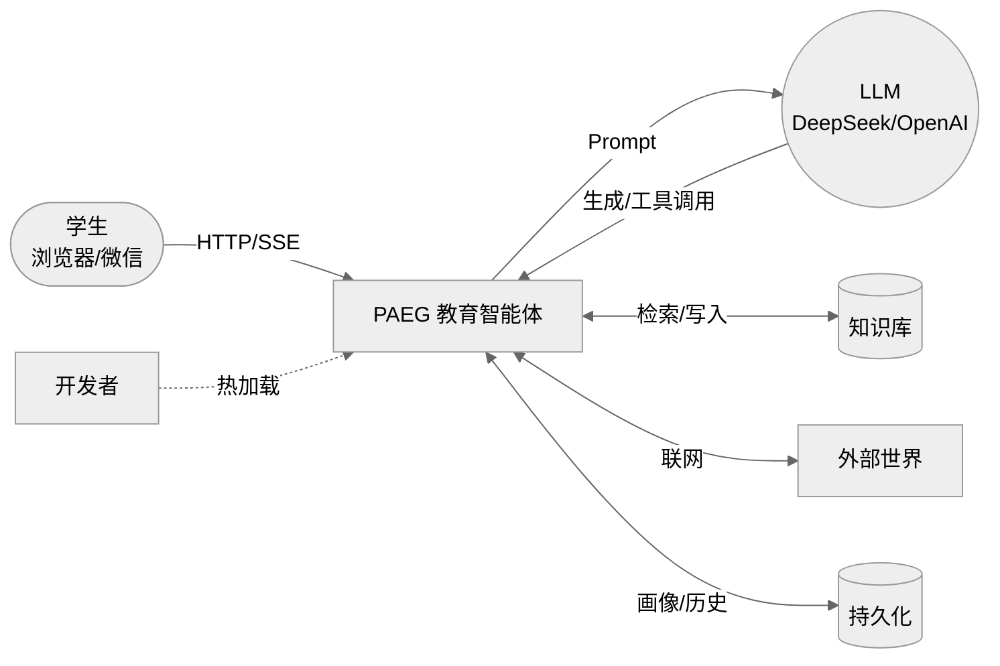
```mermaid
%%{init: {'theme': 'neutral'}}%%
flowchart LR
    User(["学生<br/>浏览器/微信"]) -->|HTTP/SSE| PAEG["PAEG 教育智能体"]
    PAEG -->|Prompt| LLM(("LLM<br/>DeepSeek/OpenAI"))
    LLM -->|生成/工具调用| PAEG
    PAEG <-->|检索/写入| KB[("知识库")]
    PAEG <-->|联网| Ext["外部世界"]
    PAEG <-->|画像/历史| DB[("持久化")]
    Dev["开发者"] -.->|热加载| PAEG
```

**图 2 · 系统尺度（六层 + 一次请求数据流）**

| 层 | 职责 | 核心组件 | 本次请求的角色 |
|---|---|---|---|
| L1 用户入口 | 接收请求 | Web UI / REST API / 微信桥 | 收到提问，发起请求 |
| L2 意图路由 | 识别意图 | meta_router（15 意图） | 判定 intent=teach |
| L3 教学编排 | 流程控制 | paeg.teach / teach_stream（SSE） | 五阶段编排 + 流式输出 |
| L4 Subagent | 领域执行 | 9 核心 subagent + ResourceLibrarian | 诊断/计划/讲解/评估协作 |
| L5 能力组件 | 可复用能力 | 14 MCP / 11 Skills / Workflows | 按需调工具 |
| L6 基础设施 | 底层支撑 | LLM 适配 / 知识库 / config_hub / 持久化 | 提供算力与数据 |
| **L0 横切** | 质量保障 | TRUTH_GROUNDING / QualityGate / 语言规范 | **约束每一层** |

**一次请求的路径**：学生提问 → L1（POST /api/teach/stream）→ L2（判定 teach）→ L3（五阶段）→ L4（subagent 协作）→ L5（工具按需）→ 全程受 L0 约束。

**图示（Mermaid 渲染）**：

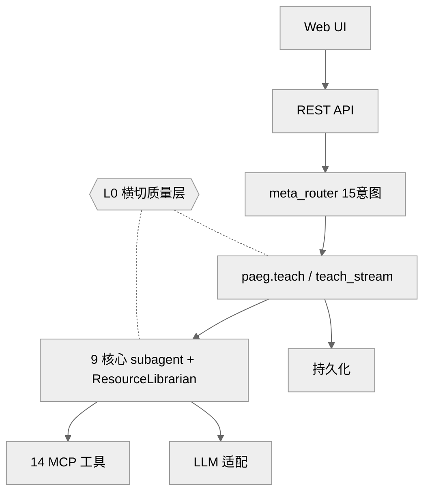
```mermaid
%%{init: {'theme': 'neutral'}}%%
flowchart TB
    UI["Web UI"] --> API["REST API"] --> R["meta_router 15意图"] --> T["paeg.teach / teach_stream"]
    T --> S["9 核心 subagent + ResourceLibrarian"]
    S --> M["14 MCP 工具"]
    S --> LL["LLM 适配"]
    T --> ST["持久化"]
    L0{{"L0 横切质量层"}} -.- T
    L0 -.- S
```


**图 2B · Blueprints 分层架构（Phase 3 · 12 蓝图）**

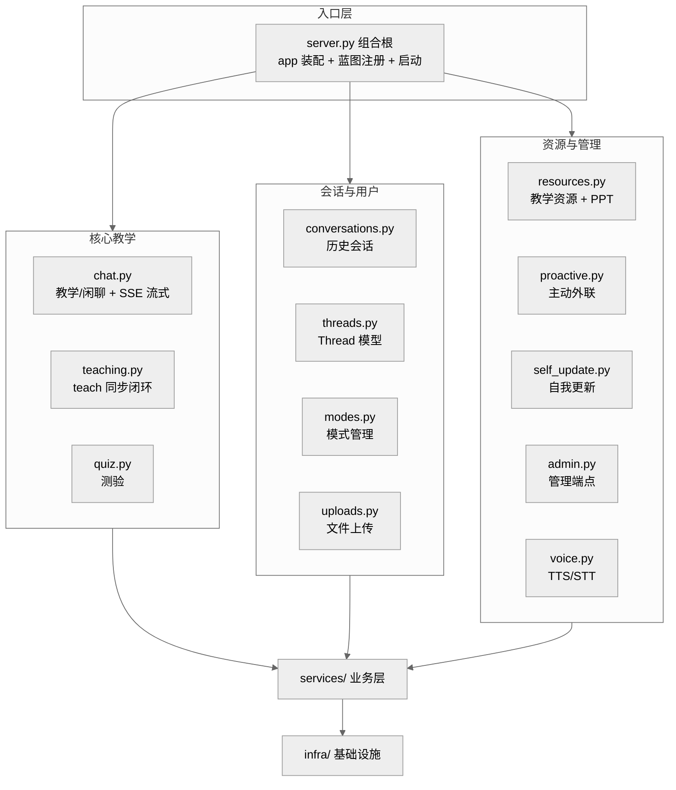
```mermaid
%%{init: {'theme': 'neutral'}}%%
flowchart TB
    subgraph 入口层
        server["server.py 组合根<br/>app 装配 + 蓝图注册 + 启动"]
    end
    subgraph 核心教学
        chat["chat.py<br/>教学/闲聊 + SSE 流式"]
        teaching["teaching.py<br/>teach 同步闭环"]
        quiz["quiz.py<br/>测验"]
    end
    subgraph 会话与用户
        conversations["conversations.py<br/>历史会话"]
        threads["threads.py<br/>Thread 模型"]
        modes["modes.py<br/>模式管理"]
        uploads["uploads.py<br/>文件上传"]
    end
    subgraph 资源与管理
        resources["resources.py<br/>教学资源 + PPT"]
        proactive["proactive.py<br/>主动外联"]
        self_update["self_update.py<br/>自我更新"]
        admin["admin.py<br/>管理端点"]
        voice["voice.py<br/>TTS/STT"]
    end
    server --> 核心教学
    server --> 会话与用户
    server --> 资源与管理
    核心教学 --> services[services/ 业务层]
    会话与用户 --> services
    资源与管理 --> services
    services --> infra[infra/ 基础设施]
```

**图 3 · 教学流尺度（五阶段 + checkpoint 互动）**

| 阶段 | 执行者 | 做什么 | 产出 |
|---|---|---|---|
| ① 诊断 | Diagnostor | 前置知识检查 + LLM 深度建议 | recommended_depth/identified_gaps |
| ② 计划 | Planner | 策略选择 + 差异化步骤 | 3 步教学计划 |
| ③ 讲解 | Presenter | LLM 流式生成（60 字分片） | event: presentation |
| ↳ checkpoint | teach_stream | 每步后发理解检查问题 | event: checkpoint（前端 3 按钮） |
| ④ 评估 | Evaluator | score = 0.6·讲解 + 0.4·学生信号 | 掌握度/困惑信号 |
| ⑤ 调整 | Adapter | switch/reinforce/continue | 下一轮策略 |
| → 自我进化 | self_evolution | 蒸馏/补丁/工具经验 | evolved 写入 → 热加载 → 知识库可检索 |

**互动循环**：讲解 → checkpoint（听懂了吗）→ 学生回答 → 评估（_student_signal）→ 调整 → 继续或重讲；教学完成后自动进入自我进化（蒸馏知识点、沉淀教学补丁、积累工具经验）。

**图示（Mermaid 渲染）**：

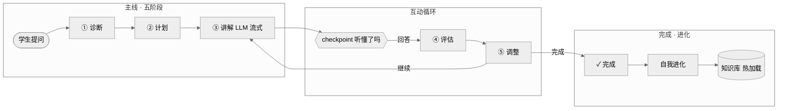
```mermaid
%%{init: {'theme': 'neutral'}}%%
flowchart LR
    subgraph Main["主线 · 五阶段"]
        Start(["学生提问"]) --> D["① 诊断"]
        D --> P["② 计划"]
        P --> Pre["③ 讲解 LLM 流式"]
    end
    subgraph Loop["互动循环"]
        Pre --> CP{{"checkpoint 听懂了吗"}}
        CP -->|回答| E["④ 评估"]
        E --> A["⑤ 调整"]
        A -->|继续| Pre
    end
    subgraph Done["完成 · 进化"]
        A -->|完成| Done2["✓ 完成"]
        Done2 --> Ev["自我进化"]
        Ev --> KB[("知识库 热加载")]
    end
    Main ~~~ Loop
    Loop ~~~ Done
```

**图 4 · 组件尺度（Presenter 内部装配）**

| 装配块 | 内容 | 作用 |
|---|---|---|
| WEIL_CORE | 薇依人格基线 | 身份与教育信念锚定 |
| TRUTH_GROUNDING | 防幻觉 10 条底线 | 不编造/信源为绝对命令 |
| SUBJECT_STYLES | 35 学科风格（persona/语言/方法论） | 因材施教 |
| LANGUAGE_STYLE | 语言规范三层 | 输出文本自然化 |
| 动态补丁 | compose_dynamic_prompt | 注入自我更新建议 |

**内部流程**：确定性装配（上述块）→ system prompt → LLM 调用（重试+超时）→ 60 字分片 → SSE yield；如需工具则经 config_hub 路由到 mcp__ 工具，结果回灌 LLM。

> 设计原则：**确定性骨架（装配/分片/路由）由 Agent 负责，生成由 LLM 负责**——这是"教学交给 Agent、生成交给 LLM"的具体实现。

**图示（Mermaid 渲染）**：

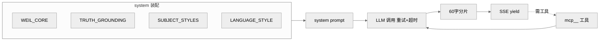
```mermaid
%%{init: {'theme': 'neutral'}}%%
flowchart LR
    subgraph ASM["system 装配"]
        B["WEIL_CORE"]; T2["TRUTH_GROUNDING"]; SS["SUBJECT_STYLES"]; LG["LANGUAGE_STYLE"]
    end
    ASM --> Sys["system prompt"] --> LLM2["LLM 调用 重试+超时"]
    LLM2 --> St["60字分片"] --> Y["SSE yield"]
    Y -.->|需工具| MC["mcp__ 工具"] --> LLM2
```

### 核心调用链（用户问"什么是导数"）
用户输入 → L1(POST /api/teach/stream) → L2(meta_router → intent=teach) → L3(teach_stream：诊断→计划→讲解→checkpoint→评估→调整) → L4(subagent 协作) → L5(工具按需调用) → L0(防幻觉全程约束)

### 架构图集（尺度分级 · 从全景到模块）

**图集总览**：

| 尺度 | 图 | 覆盖 |
|---|---|---|
| L0 全景 | 图1 全景（PAEG 与外部世界） | 系统边界 |
| L1 系统 | 图2 六层架构 | 分层+数据流 |
| L2 教学流 | 图3 五阶段+checkpoint | 一次教学 |
| L3 组件 | 图4 Presenter 装配 | subagent 内部 |
| L4 机制 | 图5-9（自我进化/RALPH/意图路由/配置体系/checkpoint 时序） | 关键机制细节 |
| L5 事件 | 图9 时序（SSE 事件序列） | 流式协议 |
| L6 机制扩充 | 图20-26（配置驱动/权限双开关/事件类型化/repeat-guard/Profile Bundle/生命周期/物料流水线） | v1.1.x 新增能力 |

**图 5 · 自我进化闭环（G1-G11）**

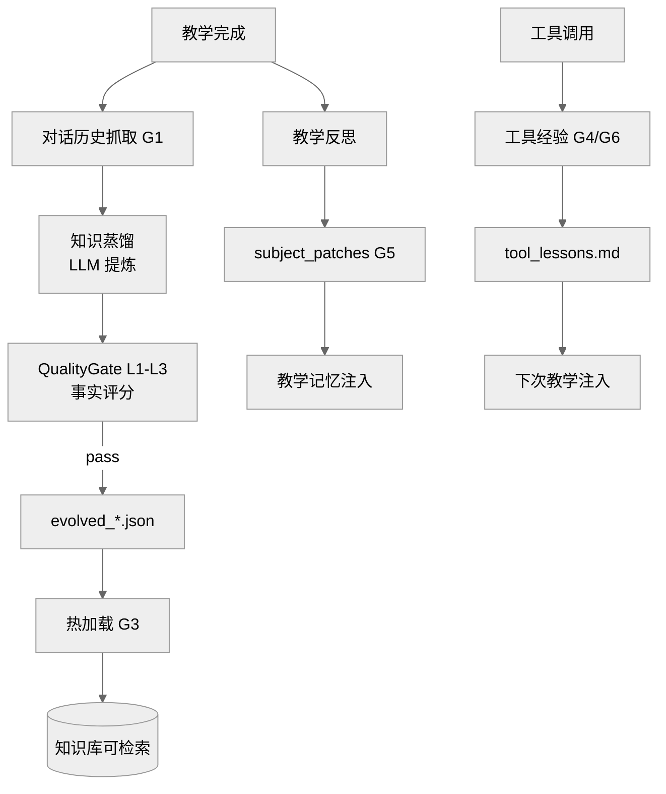
```mermaid
%%{init: {'theme': 'neutral'}}%%
flowchart TD
    Teach["教学完成"] --> Hist["对话历史抓取 G1"]
    Hist --> Dist["知识蒸馏<br/>LLM 提炼"]
    Dist --> Gate["QualityGate L1-L3<br/>事实评分"]
    Gate -->|pass| Evolved["evolved_*.json"]
    Evolved --> Hot["热加载 G3"]
    Hot --> KB[("知识库可检索")]
    Teach --> Refl["教学反思"]
    Refl --> Patch["subject_patches G5"]
    Patch --> TM["教学记忆注入"]
    Tool["工具调用"] --> Lesson["工具经验 G4/G6"]
    Lesson --> TL["tool_lessons.md"]
    TL --> Next["下次教学注入"]
```

**图 6 · RALPH 循环（任务驱动持续改进）**

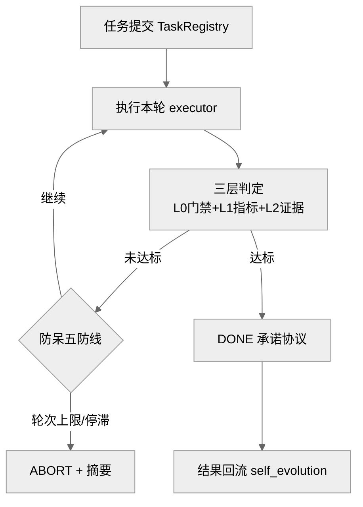
```mermaid
%%{init: {'theme': 'neutral'}}%%
flowchart TD
    Sub["任务提交 TaskRegistry"] --> Exec["执行本轮 executor"]
    Exec --> Eval["三层判定<br/>L0门禁+L1指标+L2证据"]
    Eval -->|未达标| Guard{"防呆五防线"}
    Guard -->|继续| Exec
    Guard -->|轮次上限/停滞| ABORT["ABORT + 摘要"]
    Eval -->|达标| DONE["DONE 承诺协议"]
    DONE --> Back["结果回流 self_evolution"]
```

**图 7 · 意图路由（meta_router）**

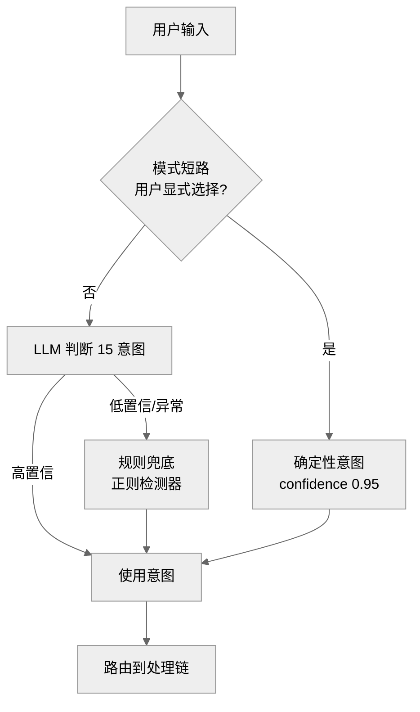
```mermaid
%%{init: {'theme': 'neutral'}}%%
flowchart TD
    In["用户输入"] --> Mode{"模式短路<br/>用户显式选择?"}
    Mode -->|是| Direct["确定性意图<br/>confidence 0.95"]
    Mode -->|否| LLM["LLM 判断 15 意图"]
    LLM -->|低置信/异常| Rule["规则兜底<br/>正则检测器"]
    LLM -->|高置信| Use["使用意图"]
    Rule --> Use
    Direct --> Use
    Use --> Route["路由到处理链"]
```

**图 8 · 配置体系（config_hub）**

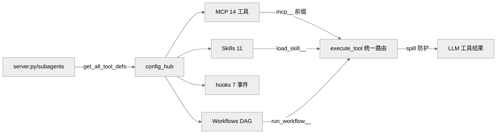
```mermaid
%%{init: {'theme': 'neutral'}}%%
flowchart LR
    App["server.py/subagents"] -->|get_all_tool_defs| Hub["config_hub"]
    Hub --> MCP["MCP 14 工具"]
    Hub --> SK["Skills 11"]
    Hub --> HK["hooks 7 事件"]
    Hub --> WF["Workflows DAG"]
    MCP -->|mcp__ 前缀| Exec["execute_tool 统一路由"]
    SK -->|load_skill__| Exec
    WF -->|run_workflow__| Exec
    Exec -->|spill 防护| Out["LLM 工具结果"]
```

**图 9 · checkpoint 互动时序（深入版教学互动）**

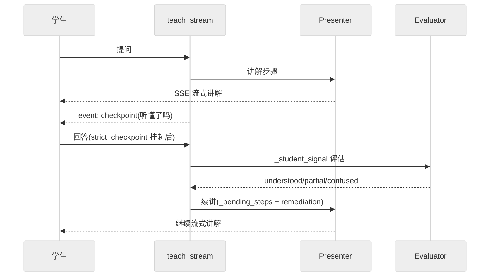
```mermaid
%%{init: {'theme': 'neutral'}}%%
sequenceDiagram
    participant S as 学生
    participant T as teach_stream
    participant P as Presenter
    participant E as Evaluator
    S->>T: 提问
    T->>P: 讲解步骤
    P-->>S: SSE 流式讲解
    T-->>S: event: checkpoint(听懂了吗)
    S->>T: 回答(strict_checkpoint 挂起后)
    T->>E: _student_signal 评估
    E-->>T: understood/partial/confused
    T->>P: 续讲(_pending_steps + remediation)
    P-->>S: 继续流式讲解
```


**图 10 · 17 维学生画像独立性模型**

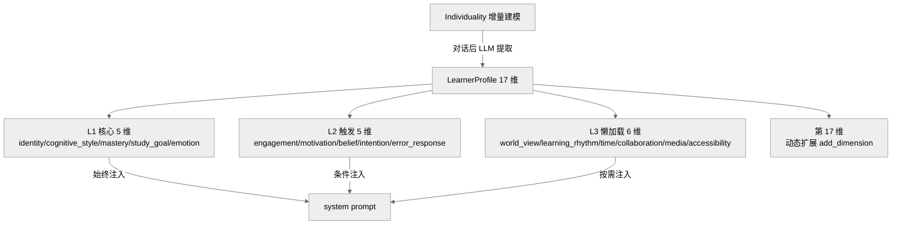
```mermaid
%%{init: {'theme': 'neutral'}}%%
flowchart TD
    P["LearnerProfile 17 维"] --> L1["L1 核心 5 维<br/>identity/cognitive_style/mastery/study_goal/emotion"]
    P --> L2["L2 触发 5 维<br/>engagement/motivation/belief/intention/error_response"]
    P --> L3["L3 懒加载 6 维<br/>world_view/learning_rhythm/time/collaboration/media/accessibility"]
    P --> D["第 17 维<br/>动态扩展 add_dimension"]
    L1 -->|始终注入| SYS["system prompt"]
    L2 -->|条件注入| SYS
    L3 -->|按需注入| SYS
    Ind["Individuality 增量建模"] -->|对话后 LLM 提取| P
```

**图 11 · 三层记忆生命周期**

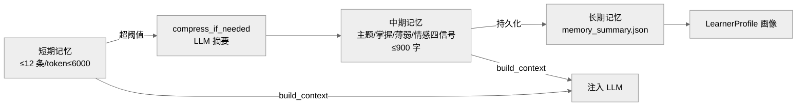
```mermaid
%%{init: {'theme': 'neutral'}}%%
flowchart LR
    ST["短期记忆<br/>≤12 条/token≤6000"] -->|超阈值| CP["compress_if_needed<br/>LLM 摘要"]
    CP --> MT["中期记忆<br/>主题/掌握/薄弱/情感四信号<br/>≤900 字"]
    MT -->|持久化| LT["长期记忆<br/>memory_summary.json"]
    LT --> Profile["LearnerProfile 画像"]
    ST -->|build_context| LLM["注入 LLM"]
    MT -->|build_context| LLM
```

**图 12 · 教学策略决策树（choose_strategy）**

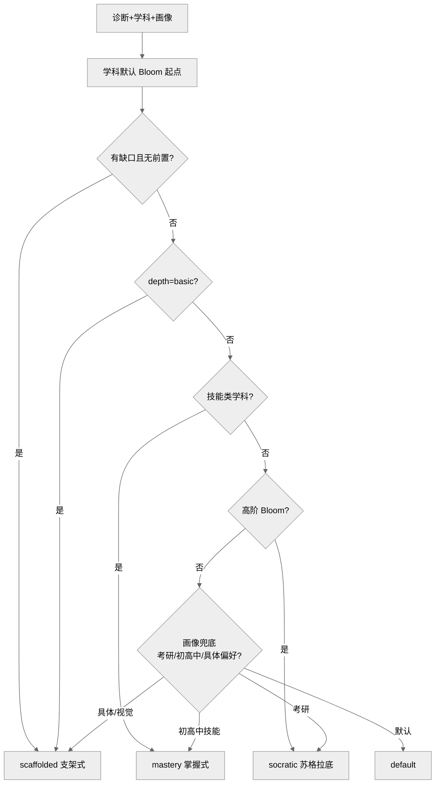
```mermaid
%%{init: {'theme': 'neutral'}}%%
flowchart TD
    In["诊断+学科+画像"] --> Bloom["学科默认 Bloom 起点"]
    Bloom --> R1{"有缺口且无前置?"}
    R1 -->|是| S1["scaffolded 支架式"]
    R1 -->|否| R2{"depth=basic?"}
    R2 -->|是| S1
    R2 -->|否| R3{"技能类学科?"}
    R3 -->|是| S2["mastery 掌握式"]
    R3 -->|否| R4{"高阶 Bloom?"}
    R4 -->|是| S3["socratic 苏格拉底"]
    R4 -->|否| R5{"画像兜底<br/>考研/初高中/具体偏好?"}
    R5 -->|考研| S3
    R5 -->|初高中技能| S2
    R5 -->|具体/视觉| S1
    R5 -->|默认| S4["default"]
```

**图 13 · 单步教学续讲（_pending_steps 状态机）**

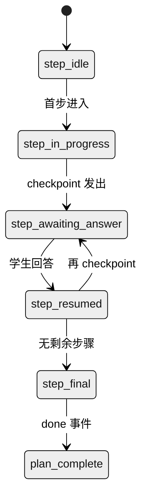
```mermaid
%%{init: {'theme': 'neutral'}}%%
stateDiagram-v2
    [*] --> step_idle
    step_idle --> step_in_progress: 首步进入
    step_in_progress --> step_awaiting_answer: checkpoint 发出
    step_awaiting_answer --> step_resumed: 学生回答
    step_resumed --> step_awaiting_answer: 再 checkpoint
    step_resumed --> step_final: 无剩余步骤
    step_final --> plan_complete: done 事件
```

**图 14 · QualityGate L1-L4 四层过滤**

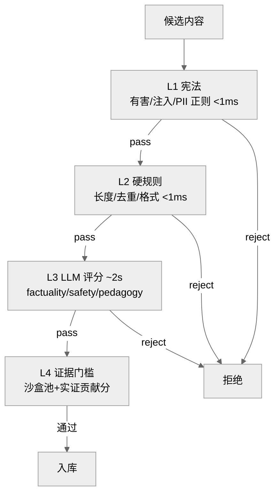
```mermaid
%%{init: {'theme': 'neutral'}}%%
flowchart TD
    C["候选内容"] --> L1["L1 宪法<br/>有害/注入/PII 正则 <1ms"]
    L1 -->|pass| L2["L2 硬规则<br/>长度/去重/格式 <1ms"]
    L2 -->|pass| L3["L3 LLM 评分 ~2s<br/>factuality/safety/pedagogy"]
    L3 -->|pass| L4["L4 证据门槛<br/>沙盒池+实证贡献分"]
    L1 -->|reject| X["拒绝"]
    L2 -->|reject| X
    L3 -->|reject| X
    L4 -->|通过| OK["入库"]
```

**图 15 · 周期自我更新调度**

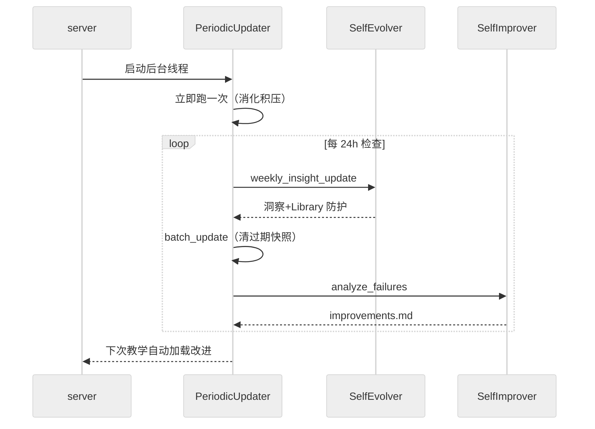
```mermaid
%%{init: {'theme': 'neutral'}}%%
sequenceDiagram
    participant S as server
    participant P as PeriodicUpdater
    participant E as SelfEvolver
    participant I as SelfImprover
    S->>P: 启动后台线程
    P->>P: 立即跑一次（消化积压）
    loop 每 24h 检查
        P->>E: weekly_insight_update
        E-->>P: 洞察+Library 防护
        P->>P: batch_update（清过期快照）
        P->>I: analyze_failures
        I-->>P: improvements.md
    end
    P-->>S: 下次教学自动加载改进
```

**图 16 · SSE 流式协议事件序列**

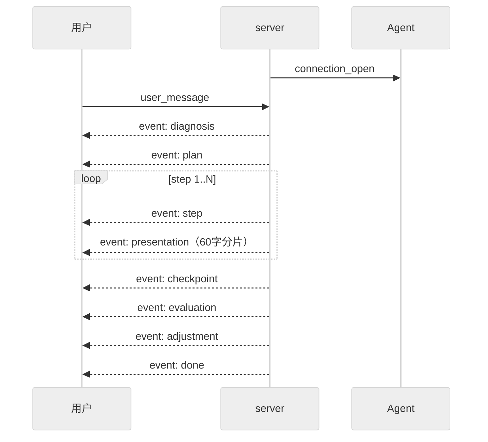
```mermaid
%%{init: {'theme': 'neutral'}}%%
sequenceDiagram
    participant U as 用户
    participant S as server
    participant A as Agent
    S->>A: connection_open
    U->>S: user_message
    S-->>U: event: diagnosis
    S-->>U: event: plan
    loop step 1..N
        S-->>U: event: step
        S-->>U: event: presentation（60字分片）
    end
    S-->>U: event: checkpoint
    S-->>U: event: evaluation
    S-->>U: event: adjustment
    S-->>U: event: done
```

**图 17 · hooks 事件链（贯穿各层）**

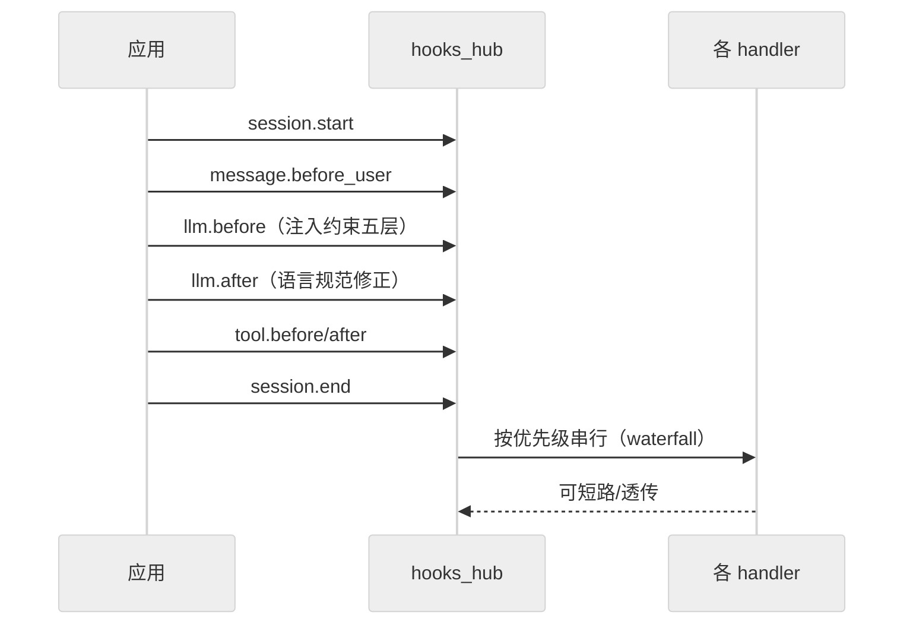
```mermaid
%%{init: {'theme': 'neutral'}}%%
sequenceDiagram
    participant App as 应用
    participant H as hooks_hub
    participant Handler as 各 handler
    App->>H: session.start
    App->>H: message.before_user
    App->>H: llm.before（注入约束五层）
    App->>H: llm.after（语言规范修正）
    App->>H: tool.before/after
    App->>H: session.end
    H->>Handler: 按优先级串行（waterfall）
    Handler-->>H: 可短路/透传
```

**图 18 · 危机信号识别协议（affection_gate）**

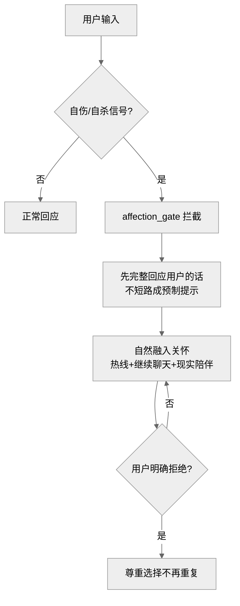
```mermaid
%%{init: {'theme': 'neutral'}}%%
flowchart TD
    In["用户输入"] --> Det{"自伤/自杀信号?"}
    Det -->|否| Normal["正常回应"]
    Det -->|是| Gate["affection_gate 拦截"]
    Gate --> R1["先完整回应用户的话<br/>不短路成预制提示"]
    R1 --> R2["自然融入关怀<br/>热线+继续聊天+现实陪伴"]
    R2 --> R3{"用户明确拒绝?"}
    R3 -->|是| Respect["尊重选择不再重复"]
    R3 -->|否| R2
```

**图 19 · spill 防护（上下文溢出+注入防御）**

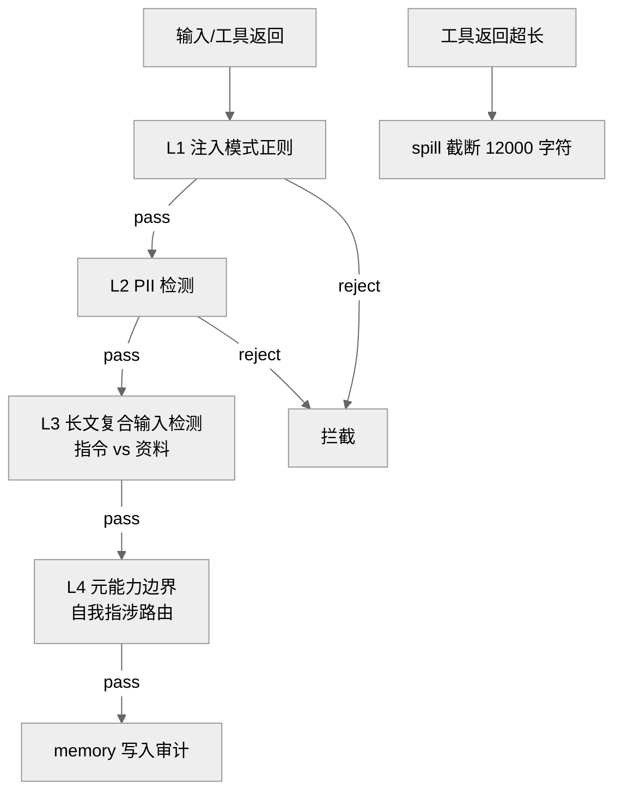
```mermaid
%%{init: {'theme': 'neutral'}}%%
flowchart TD
    In["输入/工具返回"] --> L1["L1 注入模式正则"]
    L1 -->|pass| L2["L2 PII 检测"]
    L2 -->|pass| L3["L3 长文复合输入检测<br/>指令 vs 资料"]
    L3 -->|pass| L4["L4 元能力边界<br/>自我指涉路由"]
    L4 -->|pass| M["memory 写入审计"]
    L1 -->|reject| X["拦截"]
    L2 -->|reject| X
    Out["工具返回超长"] --> Sp["spill 截断 12000 字符"]
```

**图 20 · MCP 工具配置化加载器（v1.1.1 ⭐）**

```mermaid
%%{init: {'theme': 'neutral'}}%%
flowchart LR
    JSON["config/mcp_tools.json<br/>14 工具声明"] --> LD["mcp_tools_loader<br/>JSON→工具注册"]
    LD --> W1{"模块白名单<br/>mcp_tools.*"}
    W1 -->|拒绝| X["四重安全边界<br/>危险模块黑名单"]
    LD --> W2["函数名校验<br/>非下划线开头"]
    LD --> W3["危险模块拒绝<br/>os/sys/subprocess/importlib"]
    W1 -->|通过| REG["工具注册表"]
    W2 --> REG
    W3 --> REG
    REG --> R["/api/admin/reload<br/>热重载"]
    R --> EX["execute_tool<br/>统一路由"]
```

**图 21 · 权限控制三层（sandbox+approval+custom）**

```mermaid
%%{init: {'theme': 'neutral'}}%%
flowchart TD
    REQ["tool.before<br/>调用请求"] --> LD["加载 Profile<br/>+ preset 预设"]
    LD --> P{"preset 类型<br/>read_only/standard/exam/full"}
    P --> SB{"sandbox 检查<br/>写工具类型?"}
    SB --> AP{"approval 检查<br/>需人工审批?"}
    AP --> CU{"custom 派生<br/>场景规则匹配"}
    CU -->|通过| OK["允许执行"]
    CU -->|拒绝| NO["拒绝"]
    AP -->|拒绝| NO
    SB -->|拒绝| NO
    OK --> EVT["权限事件 emit<br/>seq+profile+decision<br/>可回放审计"]
```

**图 22 · 事件类型化（62 类型：13 CORE + 35 PLUGIN + 14 PAEG）**

```mermaid
%%{init: {'theme': 'neutral'}}%%
flowchart TB
    SRC["事件源<br/>hooks / subagent<br/>/ tool / workflow"] --> ENV["SessionEvent 信封<br/>seq + time + data<br/>+ surfaceOp"]
    ENV --> SURF{"surfaceOp 校验<br/>强制 schema"}
    SURF --> TY{"类型检查<br/>56 已知类型白名单"}
    TY -->|拼错| ERR["立即报错<br/>fail-fast"]
    TY -->|通过| RT["sinks 三路由"]
    RT --> S1["审计日志"]
    RT --> S2["持久化<br/>JSONL"]
    RT --> S3["UI 事件流"]
```

**图 23 · repeat-tool-guard（chain-key + 多级阈值）**

```mermaid
%%{init: {'theme': 'neutral'}}%%
stateDiagram-v2
    [*] --> calc
    calc: tool.before hook<br/>计算 chain-key<br/>hash tool+args
    calc --> count
    count: 累加 N
    count --> tier1: N=3
    count --> tier2: N=5
    count --> tier3: N=8
    tier1: 等级1<br/>温和提示
    tier2: 等级2<br/>警告+改建议
    tier3: 等级3<br/>强制终止
    tier1 --> count: 继续
    tier2 --> count: 继续
    count --> reset: 用户插话
    reset: 计数清零
    reset --> count
    tier3 --> [*]
```

**图 24 · Profile Bundle 分层堆叠 + dump-config**

```mermaid
%%{init: {'theme': 'neutral'}}%%
flowchart TB
    L1["L1 内嵌默认<br/>PAEG 原设计"] --> L2
    L2["L2 Bundle 加载<br/>standard / exam / weil"]
    L2 --> L3
    L3["L3 Bundle 堆叠<br/>多 bundle 顺序覆盖"] --> L4
    L4["L4 Profile 加载<br/>教师预设场景"] --> L5
    L5["L5 用户 patch<br/>稀疏字段覆盖"] --> L6
    L6["L6 最终配置树<br/>→ execute_tool"]
    L6 --> EX["/api/admin/dump-config<br/>完整可 patch JSON"]
    EX -. 教师一键切换 .-> L2
```

**图 25 · subagent 生命周期事件（构造 + start/end + hook）**

```mermaid
%%{init: {'theme': 'neutral'}}%%
sequenceDiagram
    participant App as server
    participant WF as workflow
    participant H as hooks_hub
    participant SA as subagent
    App->>SA: 构造（subagent/descriptor 9 个）
    App->>WF: 触发 teach_materials
    WF->>H: agent-start (runId=UUID, name=Presenter)
    H->>SA: .run() 进入
    SA->>H: hook invoked
    H->>SA: 执行教学逻辑
    SA->>H: hook result
    SA->>H: agent-end (runId 配对, duration_ms)
    H-->>WF: 续传下个步骤
```

**图 26 · 教学物料流水线 material_pipeline**

```mermaid
%%{init: {'theme': 'neutral'}}%%
flowchart LR
    IN["主题输入"] --> DAG["teach_materials<br/>DAG 编排"]
    DAG --> P1["导图 + 讲义"]
    DAG --> P2["讲稿 + PPT"]
    DAG --> P3["视频脚本 + manim"]
    P1 --> GATE{"门控 self-check<br/>≤2 轮重生成"}
    P2 --> GATE
    P3 --> GATE
    GATE -->|通过| OUT["联动下载包<br/>6 类物料"]
    GATE -->|失败| REGEN["重生成"]
    REGEN --> GATE
```


**图 27 · Docker 打包 + 双远程部署（§7.4/§7.5）**

```mermaid
%%{init: {'theme': 'neutral'}}%%
flowchart LR
    subgraph "本地开发"
        dev["本地 :5000<br/>python server.py"]
        docker["Docker Compose<br/>docker compose up"]
    end
    subgraph "依赖打包(纪律33)"
        pip["requirements.txt<br/>onnxruntime/rapidocr/whisper"]
        sys["Dockerfile apt<br/>ffmpeg/libcairo"]
        model["模型文件<br/>bge ONNX / whisper"]
    end
    subgraph "双远程同步(纪律34)"
        gh["GitHub<br/>sync_check.py --fix"]
        ms["ModelScope<br/>git push modelscope master"]
        deploy["魔搭创空间<br/>ms_deploy.json :7860"]
    end
    dev --> docker
    docker --> pip
    docker --> sys
    docker --> model
    docker --> gh
    docker --> ms
    ms --> deploy
    deploy --> user["公网用户"]
```


## 第 4 章 关键流程

### 4.1 教学生命周期（序列图要点）
诊断(前置+LLM) → 计划(策略+步骤) → 讲解(学科风格+流式) → 检查(理解) → 评估(掌握度) → 调整(下一轮) → 反思(自我更新)

### 4.2 自我进化闭环（G1-G11）
教学完成 → 对话历史抓取(G1) → distill 蒸馏(门禁 L1-L3) → evolved 写入(G3 热加载) → KB 可检索；反思 → subject_patches(G5) → 注入下次教学；工具经验(G4/G6/G8) → 反馈学习(SEL-8) → 老化归档(SEL-7)

### 4.3 RALPH 循环
任务提交(TaskRegistry) → 每轮：执行(executor) → 判定(L0 门禁+L1 指标+L2 证据) → 持久化(快照) → 防呆(五防线) → DONE/ABORT；承诺协议 `<promise>DONE</promise>`

### 4.4 热加载与配置更新
改 config/*.json → POST /api/admin/reload → config_hub.reload_all() → MCP/skills/hooks/workflows 热更新；evolved 写入 → reload_library → KB 即时可见

### 4.5 防幻觉锚定
TRUTH_GROUNDING 全模式注入（幂等）→ LLM 必须：不编造/信源为绝对命令/允许说不知道 → QualityGate L3 factuality 评分把关自我更新

### 4.7 动态约束架构（§3.92 ⭐ LLM 自主判断放开 · 不类型化意图）

> **背景**：教学输出质量提升中发现——硬编码"教授级 6 层骨架"会让输出僵硬（用户反馈）。
> 用户核心要求："告诉大模型知悉有多少层动态约束、每层内容是什么，让大模型选择去放开一些约束"、
> "不要类型化，简单讲/详细讲不是仅有的三种意图，这都需要大模型去判断"、
> "必须增强输出能力，而不是通过约束限制大模型的发挥"。

**设计原则**（Oracle 方案 + 用户要求）：
- **告知而非强制**：system prompt 注入"约束清单告知块"（L0-L7 层 + 每层内容 + 当前状态），LLM 自主理解用户意图
- **不类型化意图**：不预设 easy/normal/deep 分类，由 LLM 根据用户真实表达判断（可远超三种）
- **数据驱动**：所有约束内容存 `data/constraint_config.json`（layer_meta + group_rules 结构化），热更新零改码
- **默认全放开**：default_layer = 7（L0 保底永不放开）——增强输出能力，按需收紧

**8 层约束体系（L0 保底 + L1-L7 渐进放开）**：

| 层 | 名称 | 放开组 | 用途 |
|---|---|---|---|
| L0 | 保底层 | — | 语言规范/公式/反AI腔/安全，永不放开 |
| L1 | 极简层 | M | 用户要"简单讲"→ 仅节奏 |
| L2 | 简明层 | M+R | 要点式 + 允许 1 类比 |
| L3 | 标准层 | M+R+T | 含温度不深度 |
| L4 | 基线层 | — | 兜底兼容 |
| L5 | 深教层 | M+D | 教学法深度（完整骨架） |
| L6 | 学科深教层 | M+R+D+S | +学科教学法 |
| L7 | 完全放开层 | 全组 | 教授级 6 层骨架 + 比喻 + 学科法 + 哲学 |

**组定义**（正交：每层单一职责不干扰）：M 节奏 / R 修辞（含比喻放开项）/ T 温度 / D 教学法深度（skeleton_full/brief）/ S 学科教学法 / P 哲学框架。

**教学法骨架动态化（D 层）**：
- D 放开（L≥5）→ 注入 `skeleton_full`：教授级 6 层（核心前提→基础机制→底层原理→现实权衡→⚠️边界条件→延伸引导→小结 + 硬性误区纠正/概念性类比）
- D 收紧 → 注入 `skeleton_brief`（简洁版）
- 骨架从 prompts.py 硬编码抽离至 constraint_config.json（数据驱动）

**比喻动态化（R 层）**：LANGUAGE_STYLE"比喻是最后手段"保留为 default_rules；R 放开时允许 1-2 个结构性类比。

**实测验证**（§3.92 标杆同题）：
- 教授级 6 层骨架完整呈现：核心前提→基础机制→底层原理→现实权衡→⚠️边界条件（两前提+反直觉点）→费雪方程→例题→检查理解
- 8 维提升：结构层次 0%→45%、学术深度 71%→88%、延伸引导 0%→20%（冲销干预）
- 物料质量：PPT 85 / 讲义 85 / 教学视频 87.8（三 Oracle）

### 4.6 物料路由架构（§3.91 ⭐ 数据驱动统一调度）

> **背景**：早期物料生成以 6 个 if 早退分支堆叠在 teach_stream（约 195 行重复代码：
> ppt/handout/video/manim/mindmap/script 各写一遍 topic 提取 + 生成器调用 + SSE 组装）。
> §3.91 按 Oracle 架构重构为**数据驱动路由表 + 统一调度器**，消除重复并增强路由判断。

**核心模块**（3 个新文件，server.py 净减约 209 行）：

| 模块 | 职责 |
|---|---|
| `material_router.py` | ROUTER 表（数据驱动：intent→生成器/超时/降级文案/是否走管线）+ `route_material()` 统一调度 + `is_material_intent()` 意图白名单 + `extract_topic()` 统一 topic 提取 |
| `sse_presenter.py` | 统一 SSE 事件序列化：`fmt_presentation`/`fmt_done`/`fmt_progress`/`fmt_error`（契约字节级不变，14 单测锚定） |
| `material_generators.py` | 6 个生成器封装（并入 material_router 内部），返回统一 `{ok, content, url, error, step_type}` dict |

**数据驱动 ROUTER 表**（关键设计）：

```python
ROUTER = {
  "ppt":     MaterialRoute("ppt", gen_ppt,     timeout=60,  use_pipeline=False),
  "handout": MaterialRoute("handout", gen_handout, timeout=30),
  "video":   MaterialRoute("video", gen_video, timeout=45),
  "manim":   MaterialRoute("manim", gen_manim, timeout=300, use_pipeline=True),  # 长任务走 MaterialPipeline v2.0
  "mindmap": MaterialRoute("mindmap", gen_mindmap, timeout=30),
  "script":  MaterialRoute("script", gen_script, timeout=30),
}
```

**调度流程**：`teach_stream` 一行接入（`if is_material_intent(_magic): yield from route_material(...); return`）→
`extract_topic` 剥离"生成X："前缀 → ROUTER 查表 → 生成器（异常围栏 + fallback_msg 降级）→
`sse_presenter` 统一发流（presentation + done，契约字节级保持）→ `_save_teach_turn` 存档。

**设计要点**：
- **默认 5 类直调生成器**（响应快 + SSE 契约稳），**仅 manim 走 MaterialPipeline v2.0**（渲染 2-5min，需 6 阶段门控）
- **意图冲突消解**：magic_intent 优先级最高（magic > rule_fallback > lesson_prep > 普通教学），router 仅处理 magic 命中
- **灰度开关** `PAEG_USE_MATERIAL_ROUTER=0` 可回退旧分支（当前默认 1，已删旧分支）
- 单物料失败不影响其他（try/except 围栏 + fallback_msg 降级文案）
- 与 magic_intent.py 零耦合（复用其 match_magic 输出）；与 MaterialPipeline v2.0 按需接线（见附录 C.15.2）

**修复的既有 bug**（§3.90 全物料测试暴露）：
- manim/video 关键词落入普通教学流 → 补早退分支（现已统一由 router 调度）
- 思维导图/讲稿关键词缺失 → magic_intent 补 `生成思维导图：`/`生成讲稿：`
- 讲稿空大纲崩溃 → 先生成大纲再 generate_full_script
- 讲义 learner 依赖 → 改 save_answer 路径（与 material_pipeline.handout_pipeline 同路径）
- PPT 下载链接缺失 → 从 path 构造 `/api/download/ppt/{filename}`

**验证**：96/96 测试全绿（14 新增 router/sse_presenter 单测 + 82 既有）；6 类物料 UI 端到端全 PASS
（PPT 下载 HTTP 200 / 讲义内容完整 / 教学视频分镜 / 思维导图 / 讲稿多节 / 数学动画真实出片 761KB + 下载 200）。
物料体系全景见附录 C.15.1；统一流水线见 C.15.2。

---

## 第 5 章 扩展指南

| 想做什么 | 怎么做 |
|---|---|
| 新增学科 | `prompts.py` SUBJECT_STYLES 加键（persona/language/structure/emphasis + 可选 subfield_guide/method_guide/worked_example）+ SUBJECT_GRADES/SUBFIELD_TREE |
| 新增 subagent | `subagents.py` 建类（run 方法组装 system + 调 _safe_reason_chat）+ 注册到 paeg.py |
| 接入 MCP 工具 | `config/mcp_servers.json` 加 server 声明 → 重启/`/api/admin/reload` → mcp__ 前缀自动路由 |
| 新增 skill | `skills/<name>/SKILL.md`（frontmatter: name+description + Markdown 正文）→ 自动注册 |
| 编写 workflow | `config/workflows/<name>.json`（DAG：steps+depends_on）→ run_workflow__ 路由 |
| 新增钩子 | `config/hooks.json` 加 {event, module, function} → 事件触发 |
| 维护违禁词 | `normalize_text`/`language_policy_check`/`forbidden_words` MCP 工具（或直接编辑 data/forbidden_words.json 三类）——动态增删，不改代码 |
| 调整约束层 | `constraint_layer_set` MCP 工具（教学/考试/自由层 0-7）或 `constraint_always_active` 固定永远生效规则 |
| 约束自演化 | `constraint_self_evolve` 把教学洞察写入指定层组（落盘 data/constraint_layers.json） |
| 扩充 Library 资料 | `Library/` 下按级别放置：`usr_knowledge/<uid>/`（用户级）· `Library/<学科>/`（学科级）· 公共集（跨学科共享）· 模板与资源库（讲义/PPT/视频模板）——`/api/upload` purpose 指定 → 知识库自动索引，BM25 检索可命中 |

---

## 第 5A 章 可扩展模块（框架化 · v0.70 ⭐）

> **框架化原则**：所有可扩展能力（约束层级/语言规范/配置体系）都是"**内嵌默认内容 + 外部扩展**"双层结构——PAEG 自身的设计逻辑与内容 100% 保留为内嵌默认，外部开发者可在此基础上更换内容或拓展结构，**不破坏原设计**。

### A. 约束层级框架（constraint_engine · §3.29）

**框架化确认**：是。约束层级已框架化，其他开发者可：

| 扩展操作 | 方法 | 示例 |
|---|---|---|
| **a. 更换每一层内容** | 编辑 `data/constraint_layers.json` 的 `layers`，同名层整体替换 | `{"5": ["M","R","X"]}` 替换 L5 放开组 |
| **b. 拓展更多层级** | `layers` 加新键（任意 L8+），`constraint_layer_set(layer=N)` 立即生效 | `{"8": ["M","R","T","D","S","P"]}` 新增 L8 |
| **c. 新增约束组** | `group_rules` 加新组，层定义引用即可 | `{"X": ["允许比喻"]}` + L5 含 X |
| **d. 永远激活** | `data/always_active.json` 的 `rules` 不随任何层放开 | 加自定义底线 |

**内嵌默认（PAEG 原设计完整保留，不可改源码）**：
- 8 层（L0 绝对底线 → L7 自由创造）× 6 组开关矩阵（M 节奏/R 修辞/T 温度/D 教学法深度/S 学科教学法/P 哲学框架）
- L0 保底 11 条（公式 LaTeX/语法完整/反伪共情/三条语言铁律/不重复/不煽情/学科风格/身份不泄漏/危机协议/反 AI 腔/关键信息先判断）
- 6 组共 25 条放开规则（内嵌）
- 3 位掩码兼容映射（MASK_A/B/C → L2-L7）

**自省 API**：`constraint_layer_scope`（MCP 工具）返回当前层范围、内嵌/外部来源、可用组、扩展指南——二次开发者可直接调用了解框架。

### B. 语言规范框架（lang_gate · §3.28）

| 扩展操作 | 方法 |
|---|---|
| 增删违禁词 | `forbidden_words` MCP 工具（list/add/remove）或编辑 `data/forbidden_words.json` 三类（网络用语/伪共情/套话） |
| 统一入口 | 所有生成内容过 `lang_gate_content`（L0 规则 + L2 薇依语料矫正），外部 agent 可调 `normalize_text` |
| 内嵌默认 | AI_TELLS 577 项（去重 555）+ LANGUAGE_STYLE 规范 + 薇依语料 few-shot——完整保留 |
| 病句规则（v0.71） | `fix_known_gaffes` 确定性修正悬空"听着你"（缺补语病句，用户反馈）——句末/停顿锚定只修病句、负向保护"听着你说"类合法搭配；接入 L0-0 前置 + 最终收口，保证"输出永不含悬空'听着你'"不变量 |

### C. 配置体系框架（config_hub）

| 扩展操作 | 方法 |
|---|---|
| 接 MCP 工具 | `config/mcp_servers.json` 加声明 → `/api/admin/reload` 热更新 |
| 新增 skill | `skills/<name>/SKILL.md`（frontmatter + 正文）→ 自动注册 |
| 编写 workflow | `config/workflows/<name>.json`（DAG）→ run_workflow__ 路由 |
| 新增钩子 | `config/hooks.json` 加 {event, module, function} |

---

## 第 5B 章 DeepSeek Harness 借鉴蓝图（2026-08-14 调研 · 30 项中 27 项已落地）

> 来源：[github.com/deepseek-ai/deepseek-harness](https://github.com/deepseek-ai/deepseek-harness)（81.5k stars · MIT）——**一切皆插件**（Everything is a Plugin），基于 Cordis 事件框架。PAEG 依据其架构产出 **30 项优化需求**（§二 Step 2 需求文档，9 P0 + 14 P1 + 7 P2）。

### 核心架构五要点（PAEG 已落地部分标注）

| dsh 机制 | 原理 | PAEG 对应状态 |
|---|---|---|
| **无特权核心** | 模型适配器/工具注册表/会话日志/agent 循环全是插件，注册即副作用（卸载自动 unwind）| config_hub 插件体系（MCP/skills/hooks/workflows）✅ 部分对齐 |
| **Patch 行级覆盖** | YAML `- id:` 整体替换 config（非 deep merge）；`disabled: !!js expr` 条件启停 | constraint_layers.json 外部层覆盖 ✅ 已用同思想 |
| **Profile/Bundle 分层** | profile = bundles 堆叠 + 用户 patch + --patch overlay；`--dump-config` 打印可 patch 树 | ❌ 待实施（H-2） |
| **事件三分域** | session 事件（持久）/ agent 事件（拦截进行中工作）/ 能力事件（fs/tools 接缝）| hooks_hub 7 事件 ✅ 部分对齐 |
| **Capability Seam** | Service Definition/Provider/Consumer 三角色，换 provider 换全产品 | ❌ 待实施（H-5/#11） |

### 30 项优化需求速查（完整清单见需求文档 §二 Step 2）

**P0（9 项）→ 已完成 8/9**：#1 subagent patch ✅ · #2 profile bundle（§3.38 H-2 ✅）· #3 persona 外置 ✅ · #7 教学预设 ✅ · #8 PresetService ✅ · #11 三角色重构（契约层 ✅，具体化待后续）· #12 LLM Provider Seam ✅ · #13 Shell Seam ✅ · #21 Subagent Registry ✅

**P1（14 项）→ 已完成 12/14**：#4 !!js 条件 ✅ · #5 home overlay ✅ · #9 per-agent scope ✅ · #10 preset 结构 ✅ · #14 tool 按需加载 ✅ · #15 Session Event Log ✅ · #18 权限预设升级 ✅ · #19 权限事件 ✅ · #22 subagent report ✅ · #24/25 UI 模式化（待确认）· #27 self-update via patch ✅ · #29 多级 skill ✅ · #30 ctx registry ✅

**P2（7 项）→ 已完成 6/7**：#6 OS 双轨 ✅ · #16 hooks 瀑布 ✅ · #17 subprocess 抽象 ✅ · #20 custom 状态 ✅ · #23 fresh-agent loop（对照 RALPH ✅）· #26 HMR（待确认）· #28 Constitutional patch ✅

### 建议实施路线（4 阶段，6-10 周）

- **Phase 1 运行时底座**：✅ 已完成（#30/#12/#13/#15 全部落地）
- **Phase 2 装扮系统**：✅ 已完成（#1/#2/#3/#7-10/#4-6 全部落地）
- **Phase 3 能力接缝+权限+UI**：🔄 大部分完成（#11 契约层/#14/#18-20/#21-23 落地；#24-26 UI 待确认）
- **Phase 4 元能力**：✅ 已完成（#27/#28/#29 全部落地）

**衔接**：已落地的 constraint_engine（§3.29）+ lang_gate MCP（§3.28）+ services/ 全套 Seam/Registry（§10.20 技术全景）正是 Harness 落地的实体——约束/语言规范/服务注册已数据化可动态，30 项中 27 项完成（2026-08-16），剩余 #11 具体化 / #24-26 UI 待后续波次。

---


---

## 第 6 章 未来规划（Roadmap · Oracle 咨询 2026-08-14）

> 主线：**让现有闭环（教学互动 + 评估 + RALPH）具备生产可用性**——Q3 补齐工程化短板，Q4 教育语义层升级，2027 产品化。每项挂钩九模块薄弱点或调研成果（非空泛目标）。

### Q3 近期（1-2 月）：工程化补齐 + 闭环数据沉淀

| # | 目标 | 价值 | 依赖 | 工作量 |
|---|---|---|---|---|
| Q3-1 | timeout-policy（教学长任务分级超时+中断恢复）+ llm-retry 合并入 harness 统一 | 防长会话卡死/超时 | 当前 llm-retry | Short |
| Q3-2 | message-feedback 落地：每轮互动 👍/👎+文本反馈入库 SQLite | 给效果评估提供真实数据 | message-feedback 子包 | Short |
| Q3-3 | session-sqlite 全量替换：会话状态内存/JSON → SQLite（回放） | 会话可审计可回放（合规必需） | 现有会话管理 | Short |
| Q3-4 | 九模块薄弱点扫描：对照 §3.12 产出评估覆盖率矩阵 | 让 Roadmap 可量化 | §3.12 文档 | Quick |
| Q3-5 | 教学能力结构化 v2：teaching-capability 接入 TPACK/加涅元数据标注 | 能力体系真正接入运行 | teaching-capability | Short |

**Q3 退出条件**：生产会话零丢失；≥30% 会话带反馈数据；九模块覆盖矩阵公开。

### Q4 中期（3-4 月）：教育语义层 + 上下文工程统一

| # | 目标 | 价值 | 依赖 | 工作量 |
|---|---|---|---|---|
| Q4-1 | 记忆系统语义分层（working/episodic/semantic + 教学知识图谱） | 解耦对话与长期认知图谱 | Q3-3/Q3-5 | Medium |
| Q4-2 | 教育知识图谱 MVP（教资 8 模块 × 专业标准 6 能力 × ADDIE） | 诊断/画像有"该教什么"依据 | 教育体系调研 | Medium |
| Q4-3 | 多 agent 协作（教师+学生+评估 Agent，RALPH 编排不换框架） | Berliner 专家级反思 + LLM-as-judge | Q4-1/ralph | Medium |
| Q4-4 | 上下文工程全量统一（预算分配 + 知识图谱检索槽位） | 防长会话丢关键上下文 | runoob 调研/compaction | Short |
| Q4-5 | RAG 接入语义层（反馈+能力标注+知识图谱为检索源） | 画像/策略有据可查 | Q4-1/Q4-2/Q3-2 | Medium |

**Q4 退出条件**：同一学生 3 次会话可复现认知图谱；多 agent 评估与人工一致率 ≥70%。

### 2027 远期：产品化方向

| # | 方向 | 触发条件 | 里程碑 | 工作量 |
|---|---|---|---|---|
| Y-1 | 个性化自适应闭环成熟（诊断→画像→差异化→评估→反馈全自动） | Q4-3 跑通 ≥1 学科 | 自适应学习案例 | Large |
| Y-2 | 教师协作平台（班级薄弱点洞察 + 干预建议 + 策略编辑） | 反馈数据 ≥6 个月 | 教师端 dashboard | Large |
| Y-3 | 多模态教学（板书/公式 OCR、语音、图形化思维呈现） | 用户具体需求 | ≥1 学科可用 | Large |
| Y-4 | 数据洞察 + 学习分析（知识图谱薄弱热力图） | Q4-2 有真实数据 | 分析报告 | Medium |

### 价值-成本矩阵（优先做 ★★★→★★→★）

| | 低成本 | 中成本 | 高成本 |
|---|---|---|---|
| **高价值** | Q3-1 timeout ★、Q3-3 sqlite ★、Q4-4 上下文统一 ★ | Q4-1 记忆分层 ★★、Q4-2 知识图谱 ★★、Q4-3 多 agent ★★ | Y-1 自适应闭环 ★★★、Y-2 教师协作 ★★ |
| **中价值** | Q3-2 feedback、Q3-5 能力标注 | Q4-5 RAG、Y-4 数据洞察 | Y-3 多模态 |
| **低价值** | Q3-4 评估矩阵 | — | — |

### 决策规则（项目所有者）
1. 每条 Roadmap 项必须挂钩：九模块薄弱点 / 教育体系能力 / Harness 包——空泛项砍掉
2. 季度回顾硬指标：Q3 看"零丢失+反馈入库率"，Q4 看"认知图谱可复现"，2027 看"教师实际干预次数"
3. 多 agent 不换框架（复用 RALPH）；知识图谱先轻量本体（JSON）确认需求再上 Neo4j


## 第 7 章 能力全景与引用来源（v1.2.27）

### 7.1 能力全景：60 种能力，一套路由

PAEG 的能力体系围绕一条原则组织：**一切能力都可替换、可增删，且不改核心代码**。当前共有 **60 种可调用能力**：五层基础能力 56 种（见下），叠加 §7.2 能力增强的 4 项服务模块（C1-C4，SRS/知识图谱/语义检索/OCR），合计 60。

- **常驻层（22 内置工具）**：web_search、verify_math、fetch_page 等直接调用的基础工具，常驻内存。
- **配置层（14 标准 MCP 工具）**：normalize_text、constraint 六件套、generate_* 等经 config_hub 统一路由。
- **按需层（11 Skills）**：concept-explainer、essay-feedback、pdf/docx/xlsx 等，三级渐进加载，用时才激活。
- **接入层（6 MCP 服务器）**：filesystem、memory、fetch、git、brave-search、pptx——外部标准服务。
- **编排层（3 Workflows）**：teach_materials、teach_concept、teach_minimal——声明式 DAG 流程。

> **口径说明**：早期文档写"25 个 MCP 工具"是混合统计（内置+标准混合统计）。v0.73 起精确分类为 **22 内置 + 14 标准**——能力并未减少，反而因 constraint 六件套、RAG 多路召回等新增基础设施而增强。

**扩展性如何？** 加一个内置工具 = 改一行注册表；加一个 Skill = 丢一个 SKILL.md；加一个 MCP = 改一个 JSON。四类扩展零代码侵入，唯一例外是新增 subagent（需改 subagents.py）——这也是下一步最值得做的声明式化改造。

### 7.2 能力增强落地（§3.54 ULW 循环 · 2026-08-16 · C1-C6 全部完成）

> Oracle 咨询（bg_e57b7aec）筛出 6 个候选，按"先补短板、再做增强"推进，**全部落地**（4 新服务 + 2 能力锁定）。

| 项 | 能力 | 实现 | 状态 |
|---|---|---|---|
| C1 | 间隔重复 SRS | services/srs_sm2.py（SM-2 算法，Anki 标准）| 已完成 |
| C2 | 学科知识图谱 | services/concept_graph.py（纯 Python 前驱图，19 概念）| 已完成 |
| C3 | 语义检索 | services/semantic_search.py（BM25Plus 基线 + BGE ONNX 扩展）| 已完成 |
| C4 | OCR（拍照作业识别）| services/ocr_service.py（RapidOCR 封装）| 已完成 |
| C5 | 后端 Whisper STT | voice_service.py（faster-whisper，能力已有+测试锁定）| 已完成 |
| C6 | 手写公式识别 | services/formula_ocr.py（pix2tex 接口预留+降级）| 已完成 |

**落地要点**：
- C1：SM-2 纯函数式，连续答对间隔 1→6→17→49→147 天；零依赖
- C2：前驱/后继/相关/学习路径四 API；内置数学物理链；未知节点容错
- C3：渐进式——模型缺失降级关键词（ratchet），BGE ONNX 就绪自动升级向量检索
- C4：RapidOCR 懒加载 + 依赖缺失降级；图片→文字→知识库检索
- C5：faster-whisper small/int8 CPU + 教学提示词；解决微信 X5 内核 STT 限制
- C6：pix2tex 重依赖接口预留（纪律 33 默认不装），缺失时降级 verify_math 文本路径

**能力全景更新**：C1-C4 新增 4 个服务模块，可调用能力从 56 增至 **60**（含 C5/C6 能力接口）。

### 7.3 引用来源（标准参考文献格式 · 全部并列）

> 原则：**借鉴标注来源，改动附说明**。以下按 **APA 格式**列出全部外部引用——GitHub 库、学术文献、教育学理论统一编号并列（用户执行标准：参考的所有项目、GitHub 库、成熟项目均须作为引用来源）。

#### 7.3.1 技术栈与库（GitHub / 软件）

**[1] deepseek-ai. (2025). deepseek-harness [Computer software]. GitHub. https://github.com/deepseek-ai/deepseek-harness**（MIT · commit 47f9438）
> PAEG"一切皆插件"基础设施整体借鉴其 Cordis 事件体系，落地 9 处（service_registry/subprocess_spawn/llm_adapter/hooks_hub/workflows_hub/config_hub/compaction/skill_registry/subagent_registry）

**[2] OpenAI. (2023). Codex App Server [Computer software]. GitHub. https://github.com/openai/codex**（Thread/Turn/Item 三层会话模型）

**[3] Anthropic. (2024). Claude Code & CLAUDE.md Memory [Computer software]. GitHub. https://github.com/anthropics/claude-code**（记忆分层设计）

**[4] langchain-ai. (2023). LangChain [Computer software]. GitHub. https://github.com/langchain-ai/langchain**（ConversationSummaryBufferMemory）

**[5] sst. (2024). opencode [Computer software]. GitHub. https://github.com/sst/opencode**（auth.json 凭据发现 + 标准 MCP server 包）

**[6] Pallets Projects. (2010). Flask [Computer software]. GitHub. https://github.com/pallets/flask**（Web 框架）

**[7] run-llama. (2023). llama-index [Computer software]. GitHub. https://github.com/run-llama/llama_index**（RAG 框架参考）

**[8] lucide-icons. (2023). lucide [Computer software]. GitHub. https://github.com/lucide-icons/lucide**（ISC · 前端 SVG 图标）

**[9] Kraken [Computer software]. GitHub. https://github.com/mittagessen/kraken**（项目结构借鉴）

**[10] EAS Station [Computer software]. GitHub.**（项目结构借鉴；URL 以官方文档为准）

**[11] RapidAI. (2023). RapidOCR [Computer software]. GitHub. https://github.com/RapidAI/RapidOCR**（C4 OCR：PaddleOCR 的 ONNX 精简版）

**[12] SYSTRAN. (2023). faster-whisper [Computer software]. GitHub. https://github.com/SYSTRAN/faster-whisper**（C5 后端 STT）

**[13] BAAI. (2023). bge (BGE Embedding Models) [Computer software]. GitHub. https://github.com/BAAI/bge**（C3 语义检索向量模型）

**[14] lukas-blecher. (2022). LaTeX-OCR (pix2tex) [Computer software]. GitHub. https://github.com/lukas-blecher/LaTeX-OCR**（C6 手写公式识别，接口预留）

**[15] rany2. (2023). edge-tts [Computer software]. GitHub. https://github.com/rany2/edge-tts**（TTS 语音合成）

**[16] Manim Community. (2020). manim [Computer software]. GitHub. https://github.com/ManimCommunity/manim**（数学动画引擎；源于 3Blue1Brown）

**[17] fxsjy. (2012). jieba [Computer software]. GitHub. https://github.com/fxsjy/jieba**（MIT · 中文分词）

**[18] Robertson, S. & Zaragoza, H. (2009). The Probabilistic Relevance Framework: BM25 and Beyond. Foundations and Trends in IR, 3(4), 333-389.**（检索算法）

**[19] Lv, Y. & Zhai, C. (2011). When Documents are Very Long, BM25 Fails! SIGIR.**（BM25Plus 扩展，C3 检索基线）

#### 7.3.2 学术文献与 AI 研究

**[20] Bai, Y. et al. (2024). Constitutional AI: Harmlessness from AI Feedback. arXiv:2212.08073.**（L1 宪法过滤）

**[21] Chen, L. et al. (2023). AlpaGasus: Training A Better Alpaca with Fewer Data. arXiv:2307.08701.**（L3 多维评分）

**[22] Asai, A. et al. (2023). Self-RAG: Learning to Retrieve, Generate, and Critique through Self-Reflection. arXiv:2310.11511.**（L3 反思令牌）

**[23] Park, J. S. et al. (2023). Generative Agents: Interactive Simulacra of Human Behavior. arXiv:2304.03442.**（L3 importance 评分）

**[24] Zhou, Z. et al. (2024). Large Language Models as Optimizers (OPRO/ExpeL). arXiv:2309.03409.**（L4 证据追踪）

**[25] Yao, S. et al. (2022). ReAct: Synergizing Reasoning and Acting in Language Models. arXiv:2210.03629.**（Plan→Act→Observe→Reflect）

**[26] Shinn, N. et al. (2023). Reflexion: Language Agents with Verbal Reinforcement Learning. arXiv:2303.11366.**（反思循环）

**[27] Wozniak, P. (1990). SuperMemo SM-2 Algorithm. supermemo.com.**（C1 间隔重复调度）

**[28] Grant Sanderson (3Blue1Brown). Mathematical Visualizations & Manim Methodology. YouTube.**（F5 数学可视化原则）

**[29] Google Research. (2025). ReasoningBank（失败案例提炼参考）. GitHub.**（C.4 反直觉失败案例；URL 以官方为准）

#### 7.3.3 教育学与认知科学理论

**[30] Mishra, P. & Koehler, M. J. (2006). Technological Pedagogical Content Knowledge (TPACK). Teachers College Record, 108(6), 1017-1054.**（Q3-5 教学设计框架）

**[31] Gagne, R. M. (1965). The Conditions of Learning. New York: Holt, Rinehart & Winston.**（Q3-5 学习条件理论）

**[32] Branson, R. K. et al. (1975). Interservice Procedures for Instructional Systems Development (ADDIE). Florida State University.**（Q4-2 教学设计模型）

**[33] Anderson, L. W. & Krathwohl, D. R. (2001). A Taxonomy for Learning, Teaching, and Assessing (Bloom's Revised Taxonomy). Longman.**（F2 学习目标分类）

**[34] Berliner, D. C. (1988/2001). The Development of Expertise in Pedagogy. AACTE.**（Q4-3 教师专长发展）

**[35] Vygotsky, L. S. (1978). Mind in Society: The Development of Higher Psychological Processes. Harvard University Press.**（ZPD 最近发展区）

**[36] Neo4j Inc. (2015). Neo4j Graph Database [Computer software]. neo4j.com.**（Q4 知识图谱路线）

#### 7.3.4 外部检索服务

**[37] Brave Search API. brave.com/search/api.**（F7 联网检索）
**[38] Tavily Search API. tavily.com.**（F7 联网检索降级）
**[39] Serper API. serper.dev.**（F7 联网检索降级）
**[40] Bing Search API. Microsoft Azure Cognitive Search.**（F7 联网检索降级）

#### 7.3.5 教育 Agent 参考项目与 GitHub 库（2026-08-21 增补 ⭐）

> 本轮（§3.79 Round 12 + §3.81-3.85）调研并借鉴的教育智能体/Agent 工程参考项目——
> 与 7.3.1-7.3.4 并列编号。用户执行标准：参考的所有项目、GitHub 库均须在此登记。

**[41] shiguangzhe666. (2025). Chinese-Teaching-AI-Agent [Computer software]. GitHub. https://github.com/shiguangzhe666/Chinese-Teaching-AI-Agent**（面向语文教师的大模型备课助手——结构化 Prompt 模板/角色/分步生成/多维配置；PAEG 备课模式与提示词结构化对齐）

**[42] Guo, X. et al. (2025). Knowledge-Enhanced LLM Lesson Planning. Humanities and Social Sciences Communications, 12, 06004-2. https://link.springer.com/article/10.1057/s41599-025-06004-2**（知识增强 LLM 教案生成——PAEG 备课素材注入 B1 联网 + B2 用户资料库即知识增强路径）

**[43] 多智能体教学设计（EduPlanner）. (2025). ERIC EJ1469583. https://eric.ed.gov/?id=EJ1469583**（LLM 多智能体定制教学设计——PAEG 10 subagent 分诊：诊断/计划/呈现/评估/调整对齐）

**[44] OpenAI. (2026). Codex Harness（全面开源：codex exec / Codex SDK / App Server 三件套）. GitHub. https://github.com/openai/codex**（2026-08-21 开源 · Apache-2.0 · 110.9k⭐——Agent 运行时治理新标杆：Thread/Turn/Item 事件流 + Rollout 持久化 + sandbox/approval + attempt token；PAEG 借鉴 A8 exec 引擎 / A11 幂等 / Rollout / A9 sandbox / A10 approval / A12 App Server，详见 §7.11 主线六）

**[45] OpenAI. (2026). Codex as a platform: build on the open agent harness. OpenAI Developers Blog. https://developers.openai.com/blog/codex-as-a-platform**（Codex Harness 平台化设计说明——三层集成接口）

**[46] deepseek-ai. (2026). DeepSeek Harness (dsh) [Computer software]. GitHub. https://github.com/deepseek-ai/deepseek-harness**（本机运行时 dsh@0.1.0-rc.7——PAEG"一切皆插件"基础设施借鉴其 Cordis 事件体系，落地 9 处；§5B 完整蓝图）

**[47] Dai5297. (2026). harness-engineer-codex [Computer software]. GitHub. https://github.com/Dai5297/harness-engineer-codex**（Codex Harness 工程化实践——sandbox/approvals 中文指南，A9/A10 落地参考）

**[48] 张宇扬课件（公共知识库）. (2026). 用户提供课件集（演化/生态/生物信息/实验设计/生物统计/遗传学 7 门课）. Library/common/张宇扬课件/**（教学材料质量特征基准：文献锚定/精确概念定义/机制解释/分层递进——PAEG material_quality 检查器与输出守门吸收）

> **标注规范**：每个借鉴模块文件头统一注释块（零运行时开销）：
```
source:  <项目名> <版本/commit>  |  repo: <URL>
path:    <原文件路径>            |  adapted: <PAEG 改动>
since:   <PAEG 版本号>
```

### 7.4 Docker 打包依赖纪律（用户执行标准 · 2026-08-16）

> **原则**：本地能跑 ≠ Docker 能跑——任何新引入的依赖必须同步 Docker 打包。

| 依赖类型 | 同步位置 | 当前实例 |
|---|---|---|
| pip 包 | `05_实现原型/requirements.txt` | onnxruntime（C3）· rapidocr-onnxruntime（C4）· faster-whisper（C5）|
| 系统库 | Dockerfile `apt-get install` 段 | ffmpeg / libcairo（manim）|
| 模型文件 | Dockerfile COPY / .dockerignore 白名单 | bge ONNX（下载到 data/models/）|
| 可选重依赖 | requirements 注释 + 需求文档记录 | torch / pix2tex（C6，默认不装防镜像膨胀）|

**验证**：引入新依赖后 `docker compose up -d --build` 必须成功；魔搭部署（ms_deploy.json）构建时自动读 requirements.txt。


### 7.5 双远程同步（GitHub + ModelScope）

> **铁律**：项目双远程托管（GitHub + ModelScope），任何交付前必须双端同步。

| 通道 | 命令 | 说明 |
|---|---|---|
| GitHub | `python sync_check.py --fix` | API 通道，本地为权威源 |
| ModelScope | `git push modelscope master` | git 通道，oauth2 token 在 remote |

**判定标准**：sync_check 显示"一致 X 文件 / 缺失 0 / 差异 0" + modelscope push 成功。
**三处一致**：本地 ↔ GitHub ↔ Release（tag）内容一致，可从任一端恢复整个项目。

### 7.6 多模型 fallback 链（§3.55 · 魔搭 Docker 对话修复）

> **背景**：魔搭 Docker 未配 LLM key 时对话不输出（fallback 到 Mock）。修复：多模型自动 fallback。

**检测顺序**（`llm_api.auto_detect_model_api()`，任一命中即返回）：

| 优先级 | 环境变量 | Provider | 端点 |
|---|---|---|---|
| ① | `PAEG_API_KEY`（自定义） | 默认 DeepSeek | 可配 `PAEG_API_BASE` |
| ② | `DEEPSEEK_API_KEY` | DeepSeek V4-Flash | api.deepseek.com/v1 |
| ③ | `QWEN_API_KEY` / `DASHSCOPE_API_KEY` | 阿里通义千问 | dashscope.aliyuncs.com/compatible-mode/v1 |
| ④ | `ANTHROPIC_API_KEY` / `OPENAI_API_KEY` | Claude / GPT | 官方端点 |
| ⑤ | opencode auth.json | 本地开发兜底 | deepseek 优先 |
| ⑥ | —（全无） | MockModelAPI | 离线演示（明确标注） |

**魔搭部署**：创空间"环境变量"配置 `DEEPSEEK_API_KEY`（或任一 fallback key），镜像无需改。
**验证**：`python -m llm_api`（打印当前 provider + 真实回复）。

**运行时故障切换**（§3.60 · 2026-08-18）：上述链只解决"启动时选哪个"；运行中 LLM 调用失败还需自动换轨道——`llm_adapter.AdapterLLM.chat()` 层 failover：

| 机制 | 设计 |
|---|---|
| 候选列表 | `detect_model_candidates()` 返回有序候选（含 QWEN 扩展分支），按 `(base_url, key[:8])` 去重（env + auth.json 同 key 不重试）|
| 错误分类 | `ModelError`：permanent(401/403) + `is_failoverable()`（401/403/429/5xx/网络可切；400/404/解析/内容过滤不切）|
| 状态机 | 401/403 → 立即标记 dead；429/5xx → cooldown 60s；网络 → 试下一家 |
| 全失败 | 抛 `AllProvidersFailedError(attempts)` 多行摘要——有真实 key 失败不静默 Mock |
| 透传 | failover 循环透传全部 kwargs（含 tools）|

**验证**（pytest 4 组）：401 → 切 qwen + 二次跳过 dead deepseek；429 → 冷却期内跳过 + 过期重试；全失败 → AllProvidersFailedError；400 → 不切换直接抛。**解决场景**：魔搭 DEEPSEEK(401 无效) + QWEN(有效) → 自动切 QWEN 成功教学。

### 7.7 教学进度延续 + LLM 动态规划（§3.61/§3.62 · 2026-08-18）

> **背景**：用户实测"逐句讲解《将进酒》→ '继续' → 不延续进度（重讲/跑偏到练习）"。根因：teach_stream 每次把管线当新课程重跑，SESSIONS 无进度状态。

**进度延续架构**（§3.61）：

| 组件 | 设计 |
|---|---|
| `teach_state_{learner_id}` | SESSIONS 存 original_concept/completed_step_ids/history_summary/last_response_tail |
| 续讲识别 | §3.58 classify_topic_relation（followup→续讲 / detour→新主题 / revisit→绕回恢复）|
| 学生原话保留 | `_student_raw` 入口捕获，followup/revisit 拼接"主题——学生追问：原话"（LLM 理解具体指令）|

**LLM 动态规划**（§3.62）：

| 组件 | 设计 |
|---|---|
| `Planner.run(teach_state, action)` | LLM 基于完整上下文（输入/画像/学段/进度/§3.58 action）动态生成 plan；步数动态（逐句=句数）|
| `pedagogy.PLANNER_SYSTEM_PROMPT` | 策略知识库作为参考（非强制模板）；action 作为方向参考（结合学科取舍）|
| `pedagogy.validate_plan()` | 防幻觉（schema 校验），非法→静态兜底 |
| 双层兜底 | LLM 失败/无 LLM → choose_strategy + build_plan_steps（静态，能力保留）|
| tool_calls 修复 | Presenter 教学主输出不传 tools（生成讲解场景，避免 JSON 泄漏）|

**关键改进**（实测验证）：
- "这句'天生我材必有用'是什么意思" → LLM 准确回应（原话保留生效）
- 将进酒逐句进度延续（R1原文→R2时代→R3开头四句）
- give_example 平衡：古诗自然融入意象/数学具体举例（LLM 按学科取舍）
- max_tokens 拉高：Presenter 4000 / 全局 4000（支持长文稿）

**对象性 × 个体性四维评估**（§3.66 · 2026-08-18）：对照技术文档标准（对象意识 §3.9：自我描述 + infer_user_model 隐式推断；个体化亮点总览 §2.5：17 维画像 + inject_control 五层注入），实测教学对话四维全达标：

| 维度 | 标准 | 实测 |
|---|---|---|
| 专业性 | 内容准确 | 李白/将进酒讲解准确 |
| 教学性 | 完整教学结构 | 引入→概念→推进 |
| 对象性 | 感知用户个体 | 昵称"小明" + 自述"喜欢画面"被尊重 |
| 个体性 | 因材施教（同问题不同对待）| 视觉型→画面讲解 / 匿名→通用讲解，明显不同 |

**关键证据**（"讲一讲将进酒"）：小明（自述"喜欢画面"）→"好的，小明，我们开始。你说你喜欢观察画面，那我们从画面进入…"；匿名 →"我们现在开始学习。你要学习的不是标签，而是真正会呼吸的诗人"。机制链：infer_user_model + infer_bdi + Individuality.run + inject_control + build_presenter_system 全链路注入（§3.65 开场"自然承接"修正：去客服腔但保留对象意识）。

### 7.8 代码与文件结构详解（§3.67 · 2026-08-18）

> 本节从文件组织、提示词拼接、工具注册、Subagent 架构四个层面，说明 PAEG 在代码层面的组织方式与实现逻辑。内容对应项目真实文件结构（v5323，经重构后）。

#### 7.8.1 整体文件结构总览

项目按「入口层—编排层—执行层—基础设施层」分层组织，核心代码与配置严格分离。以下为核心目录与文件：

```text
05_实现原型/
├── server.py                  # 【入口】Flask 服务主文件，全部 API/SSE 端点
├── paeg.py                    # 【核心编排】教学主流程控制，五阶段闭环实现
├── meta_router.py             # 意图路由：15 类意图识别与分发（模块级函数）
├── pedagogy.py                # 教学策略库：STRATEGIES 字典 + choose_strategy 等函数
├── subagents.py               # 【子Agent层】核心 subagent 类定义（Diagnostor/Planner/Presenter/Evaluator/Adapter 等）
├── prompts.py                 # 【提示词库】全部静态提示词块、学科/学段配置（build_presenter_system 在 1483 行）
│
├── config_hub.py              # 【插件中枢】统一管理工具/技能/钩子/工作流（class ConfigHub @ 32）
├── config_loader.py           # 配置加载器：三级合并 + 环境变量替换
├── constraint_engine.py       # L0-L8 动态约束引擎（模块级函数）
├── skill_registry.py          # Skill 注册与懒加载管理器（class SkillRegistry @ 112）
├── hooks_hub.py               # 事件钩子执行引擎（class HooksHub @ 197）
├── workflows_hub.py           # 声明式工作流执行引擎（class WorkflowsHub @ 99）
├── mcp_tools_loader.py        # MCP 工具配置加载（模块级函数 + 四重安全校验）
│
├── blueprints/                # 【HTTP 蓝图层 · Phase 3 已完成】12 模块
│   ├── chat.py                #   闲聊/流式对话
│   ├── teaching.py            #   教学模式端点
│   ├── voice.py               #   语音端点（TTS/STT）
│   ├── admin.py / modes.py / quiz.py / resources.py / threads.py
│   ├── conversations.py / proactive.py / self_update.py / uploads.py
│   └── __init__.py
├── services/                  # 【业务服务层 · Phase 2 已完成】
│   ├── handlers/              #   场景处理器（出题/讲义/方法建议等）
│   ├── retrieval/             #   知识检索（BM25+Tag RRF）
│   └── 40+ 顶层模块           #   lang_gate / preset_service / teach_strategy / steering 等
├── infra/                     # 【基础设施层 · Phase 2 已完成】
│   └── cache / checkpoint / event_types / retry_policy / runtime / sessions / watchdog 等 11 模块
├── ralph/                     # 【RALPH 子系统】主动自我优化循环
│   ├── task_registry.py / executor 相关 / evaluator / termination_guard / contracts
├── self_evolution.py          # 【自我进化】知识蒸馏/教学补丁/工具经验
├── quality_gate.py            # 四层质量门禁实现
├── language_refiner.py        # 语言风格矫正与薇依语料校准
│
├── config/                    # 【配置目录】数据化配置，改配置不改代码
│   ├── agents.json / hooks.json / mcp_tools.json / rag.json / skills.json
│   ├── workflows/             #   工作流 DAG 定义（teach_concept / teach_materials / teach_minimal）
│   └── profiles/              #   预设模式配置（standard / exam / weil）
├── data/                      # 【数据层】运行时数据（paeg.db SQLite / 约束规则 / 违禁词等）
├── skills/                    # 全局 Skill 库（11 个技能包，含 teaching-capability）
├── Library/                   # 知识库：按学科分类的知识文件（Simone Weil 薇依原著等）
├── users_data/                # 用户数据：画像、会话历史、反馈日志
│
└── 09_GUI前端/                # 【Web 前端】index.html（271KB）+ weather.html + assets
```

**重构说明**：server.py 经 Phase 1-3 拆分，将 6 个低风险域（voice/threads/admin/conversations/uploads/quiz）迁入 blueprints/，随后 chat/teaching 拆分为独立蓝图；services/ + infra/ 在 Phase 2 完成拆分。**此结构与参考内容（未提及 blueprints/）的差异来自近期重构，本节以真实代码为准。**

#### 7.8.2 提示词动态拼接的实现

**核心设计原则**：确定性骨架装配 + 动态块按需注入。提示词不是一整段写死，而是像搭积木一样按固定规则拼接，同时支持运行时动态增补。

**提示词的积木化拆分**：全部基础提示词块收敛在 `prompts.py` 中，以常量/字典形式独立存储：

| 提示词块 | 存储形式 | 作用 |
|---|---|---|
| WEIL_CORE | 字符串常量 | 人格与教育信念基线，全模式通用 |
| TRUTH_GROUNDING | 字符串常量 | 防幻觉 10 条底线，幂等注入 |
| SUBJECT_STYLES | 字典（35 键） | 每个学科独立的 persona、语言风格、教学法、例题模板 |
| GRADE_TEACHING_MODES | 字典（4 学段） | 初中/高中/大学/考研的教学结构、深度、脚手架模板 |
| LANGUAGE_STYLE | 字符串常量 | 基础语言表达规范（含七项自查口诀） |
| PEDAGOGICAL_LANGUAGE | 字符串常量 | 教学用语模块（§3.64，语言风格参考） |

**核心装配入口：`build_presenter_system()`**（prompts.py:1483）。每个 Subagent 有专属的提示词装配函数，以讲解核心 Presenter 为例，装配顺序是确定的：

```text
装配顺序（自上而下）：
1. 基础身份层：WEIL_CORE
2. 全局底线层：TRUTH_GROUNDING
3. 教学判断层：判断用户此刻最关键的信息需求（§3.65 开场自然承接）
4. 学科专属层：SUBJECT_STYLES[subject] → 教学法、侧重点、例题
5. 学段适配层：GRADE_TEACHING_MODES[grade] → 讲解结构与深度要求
6. 画像注入层：LearnerProfile（昵称/认知风格/掌握水平）+ infer_user_model 推断
7. 语言规范层：LANGUAGE_STYLE
8. 教学用语层：PEDAGOGICAL_LANGUAGE（§3.64，按场景动态注入）
9. 后置追加：_inject_skill_catalog / 知识依赖图 / 学段学科 profile / 追问指令（§3.57）
```

**动态补丁按需调用**：教学经验沉淀的补丁（学科补丁、工具经验）不会全量塞进提示词，而是通过工具化方式按需获取——LLM 在需要时主动调用 `compose_dynamic_prompt` 工具，传入「学科/场景」参数，工具从 `subject_patches.md`、`tool_lessons.md` 检索相关片段返回。优势是上下文占用极小，只有真正需要时才加载。

**后置二次矫正**：输出端还有 `llm.after` 钩子触发的后置矫正——调用 `services/lang_gate.py` 的 `lang_gate_content()`，依次执行违禁词检测、AI 腔矫正、薇依语料风格校准、语法通顺度修正。优势是不占用 LLM 上下文，纯规则执行，速度快、效果可量化。

#### 7.8.3 工具注册与多模式接入

**核心设计原则**：配置驱动、统一入口、权限分层、热更生效。所有工具能力不硬编码在业务逻辑里。

**统一调度中枢：`config_hub.py`**（class ConfigHub @ 32）。对外提供三个核心能力：

| 能力 | 说明 |
|---|---|
| `reload_all()` | 全量重载工具、技能、钩子、工作流 |
| `execute_tool(name, args)` | 统一工具调用入口，所有 LLM 工具请求都走这里（@ 170 行） |
| `get_available_tools(profile)` | 根据当前模式返回可用工具定义列表 |

所有工具调用不直接调用函数，必须经过 config_hub 路由，以此统一鉴权、审计、防护。

**MCP 工具配置化注册流程**：

定义层（`config/mcp_tools.json`）——每个工具是一个 JSON 对象，包含名称、描述、风险等级、模块、函数、参数 schema。

加载层（`mcp_tools_loader` 模块函数）——读取 JSON 配置后执行**四重安全校验**：模块白名单校验、危险模块黑名单拦截、函数名格式校验、禁止 exec/eval 类函数；通过后动态导入模块、注册函数到工具注册表。

调用层——LLM 发起工具调用 → config_hub 匹配工具名 → 权限校验 → 执行函数 → 结果截断格式化 → 返回给 LLM。

**Skill 技能包**：三级覆盖规则（全局 `/skills/` → 项目 `/config/skills/` → 用户 `~/.paeg/skills/`），高优先级覆盖低优先级。两阶段加载：启动阶段仅扫描 SKILL.md 头部 frontmatter 生成目录索引（轻量）；触发阶段命中时读取完整内容注入上下文。新增一个 Skill 只需新建文件夹写 SKILL.md，无需修改 Python 代码。

**多模式切换：Profile Bundle 分层堆叠**。不同模式（标准/考试/陪伴）通过配置堆叠实现：基础默认配置 → Bundle 配置 → Profile 配置 → 用户自定义补丁逐层覆盖。切换流程：调用 `/api/mode/switch` → `permission.py` 重算可用工具/约束层级 → `config_hub` 更新对外暴露定义 → 后续新会话使用新模式配置，已有会话不受影响。典型例子是 exam 考试模式——禁用写文件/联网/上传工具，约束收紧到 L2，关闭情感陪伴，仅保留知识点讲解、题目解析、基础测评。

#### 7.8.4 Subagent 的架构设计与接入

**核心设计原则**：单一职责、上下文隔离、配置化模型、可插拔替换。每个子 Agent 只负责一件事，彼此独立。

**Subagent 职责**（subagents.py 中为独立类，无共同基类——通过 paeg.py 持有引用统一调度）：

| Subagent | 核心职责 | 输出形式 |
|---|---|---|
| Diagnostor（@877） | 学情诊断，定位知识缺口 | JSON：掌握水平、知识缺口、推荐深度 |
| Planner（@928） | 制定教学步骤与策略 | JSON：步骤列表、每步目标、教学法 |
| Presenter（@1045） | 知识点流式讲解 | SSE 分片文本流 |
| Evaluator（@1599） | 掌握度评估 | JSON：得分、困惑点、调整建议 |
| Adapter（@1857） | 教学策略调整 | JSON：下一步动作、风格切换 |
| AffectionSupportor | 情感支持与危机识别 | 自然语言回复 + 危机标记 |
| AnswerSolver | 直接输出答案 | 完整答案 + 解析 |
| ResourceLibrarian | 知识库检索 | 相关知识片段 |
| Individuality | 个体化（17 维画像） | 五维控制（语言/风格/深度/节奏/情绪） |

**调度方式：主流程线性编排**（paeg.py `teach()` @ 240）。按教学阶段顺序实例化并调用对应 Subagent，数据单向流转：

```text
用户输入
    ↓
Diagnostor.run(问题, 学科, 学段) → 诊断结果
    ↓
Planner.run(诊断结果, 画像) → 教学步骤计划
    ↓
循环每一步：
    Presenter.run(知识点) → 流式讲解输出
    Checkpoint 等待学生反馈
    Evaluator.run(讲解内容, 学生反馈) → 掌握度
    Adapter.run(掌握度) → 调整决策（不达标时 Verify Gate 重讲）
    ↓ 继续/重讲/进阶
教学结束
    ↓
self_evolution 触发知识蒸馏（经 QualityGate 入库热加载）
```

**PTC-5 策略分派**：`paeg.teach()` 入口通过 `services.teach_strategy.get_strategy()` 注册表支持运行时替换主循环——默认 DefaultTeachStrategy 走原逻辑，注册其他策略可整体替换教学主循环（§3.44 PTC-1~5）。

**模型配置化**：`config/agents.json` 为每个 Subagent 独立配置模型参数（provider/model/temperature/max_tokens/thinking_level）。`config_loader.py` 按「内置默认 → 项目配置 → 用户配置」三级合并，支持 `{env:MODEL_KEY}` 环境变量替换。不同职责匹配不同能力、不同成本的模型——重讲解用大模型，纯规则评估用小模型。

**生命周期与钩子联动**：每个 Subagent 的 `run()` 执行前后自动触发钩子事件（`agent-start` 携带 runId/名称/开始时间；`agent-end` 携带 runId/耗时/状态/结果摘要），通过 `hooks_hub` 统一调度，用于日志审计、性能监控、结果后置处理，新增扩展逻辑无需修改 Subagent 代码。

#### 7.8.5 一次完整请求的代码链路

以「用户问什么是导数」为例：

1. 前端 POST `/api/teach/stream` → server.py 接收请求，建立 SSE 连接
2. 调用 `meta_router.route()` → 判定意图为 teach_concept
3. 进入 `paeg.teach_stream()` 主流程（经 `services.teach_strategy` 策略分派）
4. 实例化 Diagnostor，装配诊断提示词 → 调用 LLM → 返回诊断结果
5. 实例化 Planner，传入诊断结果 → 生成教学计划（§3.62 LLM 动态规划）
6. 循环每一步：实例化 Presenter，调用 `build_presenter_system()` 拼接完整提示词 → LLM 流式生成，60 字分片，通过 SSE 推送 → 发送 checkpoint 事件 → 学生提交反馈后 Evaluator 计算掌握度 → Adapter 输出调整策略
7. 全部步骤完成，发送 done 事件
8. 后台异步触发 `self_evolution.distill()`，提炼知识点，经 QualityGate 后入库热加载

### 7.9 技术栈与前后端联通（v1.1.9 · 新增章节）

> 本章把 PAEG 的技术栈分层讲清：前端（单文件 SPA）→ 后端（Flask + 12 蓝图）→ 联通协议（API 端点 + SSE 事件流）→ 部署链路。前后端同源部署（`API_BASE = ''`），默认同进程。

#### 7.9.1 前端技术栈（09_GUI前端/ · 单文件 SPA）

| 层 | 技术 | 角色 |
|---|---|---|
| 形态 | 单文件 `index.html`（5454 行，无构建步骤、无框架运行时） | 部署零依赖 |
| 标记 | 原生 HTML5 + CSS3（无 Tailwind 等框架） | 语义化结构 + 暗色主题 |
| 行为 | 原生 JavaScript + 事件委托 | 状态管理 / DOM 操作 |
| Markdown | marked@12.0.2（本地优先 + jsdelivr CDN 兜底） | 流式增量解析 |
| 数学 | KaTeX@0.16.9（同步渲染 + throwOnError 降级） | 行内/块级公式渲染 |
| 流消费 | **手写 SSE 解析器**：`fetch` + `resp.body.getReader()` + `TextDecoder('utf-8')` 扫描 `event:` 行（120s 超时保护） | 流式接收 LLM 分片（不用 EventSource，超时可控） |
| 语音输入 | MediaRecorder API（audio/webm;codecs=opus） | 录音→后端 STT |
| 语音输出 | Web Audio API（`new Audio().play()`） | 播放 TTS MP3 |
| 存储 | localStorage + 同源 API（`API_BASE = ''`） | 会话恢复 / 偏好记忆 |
| 图标 | 内联 SVG（assets/icons/） | 无外部图标依赖 |

#### 7.9.2 后端技术栈（05_实现原型/）

| 层 | 技术 | 角色 |
|---|---|---|
| Web 框架 | Flask + flask-cors（CORS_ORIGINS，dev `*` / prod `PAEG_CORS_ORIGINS`） | 入口薄壳 server.py（app factory + 蓝图注册） |
| 反向代理 | Werkzeug ProxyFix 包装 wsgi_app | 支持 Nginx/Caddy 反代 + HTTPS 头转发 |
| 路由拆分 | **12 blueprints**：admin / chat / conversations / modes / proactive / quiz / resources / self_update / teaching / threads / uploads / voice（23 路由） | 按域独立维护 |
| 主入口 | server.py 32 个 `@app.route`（含 teach_stream SSE） | 全系统共 **55 路由** |
| 流式协议 | SSE（MIME `text/event-stream`；`X-Request-ID` + `Cache-Control: no-cache` 响应头） | LLM 分片推送 + 教学 checkpoint |
| 数据 | SQLite（paeg.db）+ JSON 文件混合 | 用户/会话/教学记忆 → SQLite；画像/知识库 → JSON |
| 配置 | config/ + config_loader.py（内置→项目→用户三级合并 + `{env:KEY}` 替换） | 改配置不改代码 |
| LLM | llm_api.py 多 provider 抽象 + llm_adapter.py 运行时 failover（见 C.9） | DeepSeek / Qwen / OpenAI / Claude + Mock |
| MCP | 6 server（filesystem/memory/fetch/git/brave-search/pptx）+ 14 标准工具 | 双向打通 |
| 钩子 | hooks_hub.py（waterfall + matcher + repeat_guard + spill_guard） | 56 类事件 + LLM 输出后置矫正 |
| 基础设施 | infra/（cache / checkpoint / watchdog / retry_policy / event_types） | 教学中间态 / LLM 重试 / 健康探测 |
| 启动 | `app.run(host, port, debug=False, threaded=True)` + `start_mcp_server(port)` 旁路 | 前后端同进程 + MCP Server |

#### 7.9.3 前后端联通：API 端点与 SSE 事件协议

**联通骨架**：前端 POST `/api/teach/stream` → 后端 `meta_router` 路由 → `paeg.teach_stream()` 主流程 → LLM 流式生成 → SSE 事件推送 → 前端手写解析器按 `event:` 增量渲染。

**代表性 API 端点**（全量 55 路由，此处列高频 + SSE + 关键管理类）：

| 域 | 端点 | 协议 | 说明 |
|---|---|---|---|
| 教学 | `/api/teach/stream` | **SSE** | 教学主流程（diagnosis→plan→step→presentation→checkpoint→evaluation→adjustment→done） |
| 教学 | `/api/teach` | POST | 同步教学 |
| 聊天 | `/api/chat/stream` | **SSE** | 一般对话流（seg/tool/retrieval/doc/done） |
| 语音 | `/api/voice/tts` · `/api/voice/stt` | POST | TTS 合成 / STT 识别 |
| 模式 | `/api/mode/switch` · `/api/mode/list` | POST | Profile Bundle 重载 |
| 资源 | `/api/resources` · `/api/upload` | POST | 资料检索 / 文件上传 |
| 自进化 | `/api/self-update/run` · `/api/self-update/from-feedback` | POST | 自我更新 / 反馈→洞察 |
| 管理 | `/api/admin/reload` · `/api/admin/health` | POST / GET | 配置热重载 / 健康检查 |

**SSE 事件类型**（teach_stream 15 种 + chat_stream 5 种，去重后 16 种唯一事件）：

| 事件 | 触发时机 | payload 关键字段 |
|---|---|---|
| `diagnosis` | 学情诊断 | 诊断结果 JSON |
| `retrieval` | 知识库/联网检索 | 徽章信息 + subject |
| `plan` | 教学计划 | steps + steps_left |
| `step` | 单步开始 | step_id + status |
| `presentation` | 讲解分片（60 字/片） | step_id + content + step_type |
| `checkpoint` | 学生理解检查（暂停等反馈） | step_id + question + options |
| `evaluation` | 掌握度评估 | score + confusion + mastery |
| `adjustment` | 教学调整决策 | decision + action |
| `reflection` | 反思日志 | 反思 JSON |
| `self_update` | 自我更新触发 | history_size |
| `summary` | 教学总结 | 总结 JSON |
| `self_evolution` | 自我进化事件流 | events |
| `doc` | 文档生成 | doc 事件 |
| `seg` | 段落（off_topic 提示 / 一般对话） | text |
| `tool` | 工具调用记录 | name + args |
| `done` | 流终止 | status + resume_at_step |

**前端消费要点**：chunk/presentation 事件用 marked 增量解析；checkpoint 事件暂停生成、收集反馈后 POST 续传；120s 读流超时保护防挂死。

#### 7.9.4 部署技术栈

| 通道 | 技术 | 说明 |
|---|---|---|
| 本地 | `python server.py`（:5000） | 开发/调试入口 |
| 公网隧道 | cloudflared | 免配置 HTTPS——Web Speech API/MediaRecorder 的 HTTPS 前置条件 |
| 容器化 | Docker + docker-compose（Dockerfile + ms_deploy.json） | apt 段装 ffmpeg/libcairo 等系统库 |
| 模型托管 | ModelScope 创空间 | 镜像自动读 requirements.txt 构建；Secrets 配 `DEEPSEEK_API_KEY`（下划线） |
| 双远程 | GitHub（API）+ ModelScope（git oauth2） | sync_check.py --fix |
| 密钥 | 环境变量 + auth.json（opencode 兼容，不入库） | 0 硬编码 |
| 可观测 | `/api/admin/health` + observability.py | 结构化日志 / 指标 / 事件流 |

**关键约束**：公网部署必须经 cloudflared 或 TLS 终结（HTTPS 是 STT 前置条件）；Docker 依赖同步纪律见 §7.4；可选重依赖（torch / pix2tex）默认不装、缺失降级。

### 7.10 备课模式（§3.69/§3.73/§3.75 · v1.1.9+ 第 10 个 subagent）

> **「我要备课」是备课模式的独立激活词**（ULW 风格）——在教学模式下，**在输入内容前加上「我要备课」** 即进入备课模式，启用 LessonPrep 备课 subagent，按张宇扬课件级质量标准渐进式产出完整教学物料。

**三种使用方式**（§3.73/§3.75）：

```
方式一：一步到位（推荐）
  用户：我要备课：高中数学，函数单调性，45分钟，重点讲图像变换
  PAEG：提取需求（topic/subject/grade/duration/extra_requirement）→ 直接产出

方式二：先激活后补充
  用户：我要备课
  PAEG：（引导·结构化缺失提示）我还需要：1.学科+学段 2.知识点 3.课时长度（已填字段自动剔除）
  用户：高中数学，函数单调性，45分钟
  PAEG：确定性短路识别补充句 → 自动合并产出

方式三：多轮修改（§3.75）
  用户：（生成后）重点讲图像变换
  PAEG：识别修改指令 → 基于上一版重新生成（mode=lesson_prep_modify）
```

**技术实现**：

| 组件 | 说明 |
|---|---|
| `magic_intent.py` | 独立激活词正则：`^我要备课$`（纯词→引导）与 `^我要备课[:：\s、,，]*(.{1,60}?)$`（带需求→直接生成）；不做变体匹配 |
| `meta_router._extract_lesson_topic()` | 零 LLM 提取 {topic, subject, grade, duration_min, extra_requirement}；先剥离"我要备课"前缀 → 再 extra（重点讲X）→ 学科/学段 → 时长；topic 空但有 subject/grade → 返回部分 dict（供引导剔除已填字段） |
| `server.py` fast-path | 三分类：topic 完整→直接生成；topic 空→引导分支（零 LLM SSE + intent_frame 结构化）；pending 标记 + 确定性短路→引导后补充合并 |
| `server.py` 多轮修改 | `_MODIFY_RE` 修改指令识别（独立于 rfi intent）+ `lesson_prep_last_{learner_id}` 状态 + 修改路由（mode=lesson_prep_modify） |
| `LessonPrep`（subagents.py） | 8 步渐进式生成：教案骨架→完整教案→讲义→讲稿→PPT 大纲→视频脚本（理科）→思维导图→质量报告；独立 token 预算 25000；`run` 支持 `prior_lesson_plan`（多轮修改基于上一版） |

**质量标准（三源融合 + §3.75 教师AI指引）**：张宇扬课件 18 条 + 教育部课标/UbD/5E/Bloom + Mayer 多媒体 12 原则；**§3.75 新增**——教案须分课前/课中/课后三维（stage: pre/during/post），课中段必含 1 案例教学 + 1 互动环节（均含设计目的/实施步骤/预期效果）。

**质量守门（§3.71/§3.75）**：每份产出过四类评分（教案 6 维 / 讲义 / PPT 大纲 5 维 / 视频脚本）+ **15 条硬性检查**（7 自动 + 5 LLM 评审 + 3 条 §3.75：三维结构/案例教学/互动环节），产出 `dim_scores` 与 `eval_mode`；`/api/lesson_prep/feedback` 收集教师反馈（L3 人工评估）。**PPT 自动配图**：三级来源（用户资料库 → 公共文件夹 → 联网 Bing 免 key）+ 缓存，缺图不阻塞。

### 7.11 工程化就绪：Round 4-12 优化融贯（§3.79 · v1.2.14-v1.2.24 ⭐）

> 本小节把 Round 4-11 逐轮改进按主题融贯成五条主线（版本追溯见附录 C.26-C.35）——不再按版本流水账罗列，而是呈现"从功能可用到商业就绪"的完整链路。

**主线一：物料生产真实联通（PPT/讲义/讲稿/思维导图/视频）**：
- `teach_materials` 工作流 7 步真实运行暴露并修复 2 断链：outline 步 Planner 签名不匹配（`run()` 缺参）→ `_run_subagent` planner 分支适配；knowledge_map/keyword_doc 工具未注册 → `_run_tool` 兜底（优先复用 handler，失败回退 LLM 生成）
- 静态讲稿缺生活化例子（`_static_script` 补例子/类比收尾）、`_parse_outline` 只收 str 而 LessonPrep 产 list（备课→PPT 断链）→ 兼容 list；真实 .pptx 落盘 6 页 + 文本物料 4/4 过检查器
- **manim 数学视频真实出片**：AST 安全校验 → 真实渲染 → mp4 落盘；修复 `render_manim` 未指定 encoding 导致 Windows GBK 解码崩溃 + 质量档输出目录 5 档（480p15…2160p60）
- 学习计划 format bug：`unsupported format string passed to dict.__format__`（mastery 值 float/dict 混用）→ `_fmt_mastery` 鲁棒格式化
- **PPT 大纲结构检查（Round 11 ⭐）**：`check_ppt_outline`（分页/每页要点/无空页/无占位）接入 LessonPrep `quality_report.ppt_check`——物料检查补齐 handout/script/mindmap/ppt 四类覆盖
- **物料结构化提示词模板（Round 13 ⭐ §3.88）**：`material_prompts.py` 为 5 类物料内置"角色（学科×学段 persona）→ schema → 硬约束 → 优秀范例"三层模板；`build_material_system` 统一装配（5 层基础约束 + 动态学科学段注入）；`upgrade_simple_intent` 把"生成PPT：光合作用"升级为完整 user prompt——约束是层不是墙（详见附录 C.15.3）
- **物料制作统一流水线（Round 13 ⭐ §3.89）**：`MaterialPipeline v2.0` 六阶段（规划→草稿→门控→修复→实现→合成）+ 可插拔 gates/fix_strategy 槽位；6 类物料（讲义/讲稿/PPT/导图/教学视频/Manim）统一注册；gates_lib 门库 + fixers_lib 三修复策略（retry/escalate/regenerate）；Manim 补 4 缺口（Audio-First TTS / Visual Anchor Grid / ScopeRefine 三级 / Block Cleanup）——详见附录 C.15
- **物料体系全盘点（Round 13 ⭐ §3.90）**：系统实际 10 类产出 + 4 类文档流——除 6 类统一管线物料外，另有练习题 quiz / 讲解文章 article / 学习计划 study_plan / 备课产物 lesson_prep（lesson_plan+handout+script+ppt_outline+quiz 五件套）独立生成器；前端 6 物料按钮 + 4 快速开始 chip 统一填前缀激活（§3.87 方案 C）；Manim 网页端实测真实出片可下载（详见附录 C.15.1）

**主线二：质量守护网（学段×深度双层守门 + 输出质量注入 + golden set）**：
- **teach_stream 守门接线**：学段特征/内容深度守门此前只挂 sync 路径 `paeg.teach`，GUI 实际走的 `/api/teach/stream` 从不执行 → 主循环接入（同门控 llm_generated+PAEG_GRADE_GATE）→ probe 4/4 全特征通过
- **输出质量注入（Round 11 ⭐ 第三轮专门强化）**：`GRADE_OUTPUT_QUALITY` 4 学段输出指令（大学 lecture 式：严格定义→定理→推导→应用 + 高屋建瓴（先点透本质）+ 举一反三变式；高中例题+误区；考研考点/题型/易错；初中生活化）+ `SUBJECT_GRADE_DEPTH_EXT` 扩展 5 学科 × 2 学段深度阶梯（英语/计算机/经济/法学/哲学）——真实 E2E：大学"线性变换" 6/6 特征全过（含几何直觉、完整推导、学科视野）
- **golden set 质检集**：51 → 101 → 151 → 201 → **252 条（Round 12 ⭐）** × 3 断言 = **511 测试全绿**——学段特征必过（per-grade MUST_HAVE 质量红线）+ 呈现长度（≥80 字防碎片）+ 坏样例漏检守护；覆盖 20+ 学科 × 4 学段；Round 12 补薄弱学科（art/CS/politics/sociology/statistics）+ 大学生 lecture 式/考研题型专项

**主线三：运维可治理（灰度/回滚/kill switch/限频/观测）**：
- `deploy/canary.ps1` 灰度发布可执行化：Canary 阶梯（C1 5%→C4 100%）+ 闸门检查（错误率≤0.5%/P95≤120s/health）+ rollback（git revert+smoke）；修复 .ps1 中文 UTF-8 BOM（PS 5.1 无 BOM 按 ANSI 解析乱码）
- **kill switch**：`paeg_modules.json` 热重载 60s 止损 + `GET/POST /api/admin/modules` 远程切换（PAEG_ADMIN_TOKEN 写保护，未配置→401 安全默认）+ `module/toggle` 事件注册；首次演练 PASS（关闭→热重载→审计→恢复 <10s）
- **admin rate-limit 二道防线（Round 12 ⭐）**：`POST /api/admin/modules` 每 IP 滑动窗口限频（默认 10 次/60s，PAEG_ADMIN_RATE_LIMIT 可配）——与 token 认证叠加防爆破；401 不消耗额度、GET 不受限
- 观测：`/api/metrics` + 效果指标管道 + SLO 分模式（D1 延迟归因：teach 35s = 路由/诊断 1.3s + 规划 5.6s + 首步讲解 19.6s 主导 + 其余 8.6s，presenter 长输出为基础设施级主因）

**主线四：教学对话体验（模式识别/首步先行/后台预生成/前端健壮）**：
- `_detect_teaching_mode` 规则优先（deep/easy 关键词命中零 LLM）+ LLM 结果缓存 10 分钟（上限 256）；Diagnostor include_kb=False
- **首步先行**：presenter 19.6s 延迟 UX 缓解——`step` 事件携带 topic 骨架（截 40 字），前端显示"正在讲解第 N 步：xxx"（骨架先行于内容：step@16.9s vs presentation@38s 真实验证）；流式预渲染决策：presenter A 级思考链流式化破坏质量 → 不实施，替代为后续步骤后台预生成
- **后续步骤后台预生成（Round 11 ⭐ 兑现）**：首轮第 1 步讲解期间，后台线程（独立 Presenter + learner 浅拷贝 + daemon + 步间节流防限流）预生成剩余步骤 → 续讲轮命中缓存**零 LLM 等待**（8.6s/步 → ~0）；缓存失效语义精确化（continue_step 兼容，仅改变讲解方式指令/话题切换/困惑 remediation 失效）
- 前端健壮：`friendlyHttpError`（429/500 UX）、done 后按钮恢复 + `_genAbort` 清理（E2E 找茬发现"正在生成上一条回复"吞消息 bug）

**主线五：数据安全与既有 bug 挖掘（Round 10-11 ⭐）**：
- **users.json 数据丢失事故**：审计发现磁盘 users.json 被清空为默认空模板（历史 commit 503f416 含 u106=团聚体+真实密码哈希）→ 注册用户降级匿名"学习者"、登录系统失效；从 git 历史重建（真实用户 u3/u8/u106 + learner 同步当前 profile.json 三方一致 + next_id=466），API 验证恢复
- **根因加固**：`user_store._load` 遇损坏静默兜底空模板 + 后续 `_save()` 写回磁盘固化丢失 → 损坏先备份 `.corrupt_<ts>` 留证再兜底
- **续讲轮判定 P0（Round 11）**：`_is_continuation` 在 pop 后重读 `teach_plan_done_` → 恒 False → 续讲轮被误判新 plan 只讲 1 步 → 多步永远讲不完；修复为 pop 前定格 `bool(_pending_steps)`
- **LLM failover 签名 P0（Round 11）**：failover 统一传 tools/tool_choice，但 Anthropic/Mock chat 签名缺参 → 兜底必 TypeError（"got an unexpected keyword argument 'tools'"）；签名对齐 + 参数化契约测试
- **量子力学被拒 P0（Round 12，用户报告）**：教学模式问"量子力学"被拒（"未列入学科清单"）——根因：LLM prompt 把量子力学当 unknown 示例 + 无子学科映射；按**元能力 L918 铁律（LLM 先判断、规则兜底）**修复：prompt 注入子学科归属知识（开放性指引），LLM 语义归入父学科；`SUBJECT_ALIASES` 别名表仅作 LLM 不可用兜底 + unknown 名二次映射；规则不覆盖 LLM 判断；真实 LLM 10/10 + 端到端 8/8
- **审计基建**：audit_check.py 40/40 全绿——重构完整检查适配 wrapper 重构（`_teach_stream_gen` 函数体）；静默异常 except:pass 7→0 处；数据卫生 users_data 53→18

**主线六：Codex Harness 借鉴（Round 12 ⭐ OpenAI 2026-08-21 全面开源）**：
- **A8 受控子进程执行引擎**（`services/exec_engine.py`）：物料生产重活（PPT/Manim/脚本执行）统一走 AST 安全校验（黑名单 import/call）+ 子进程隔离 + 超时 + 输出截断 + 临时目录清理——仿 `codex exec`（Codex Harness 三件套之一）；13 测试全过
- **A11 attempt token 幂等护栏**（`services/idempotency.py`）：teach_stream 带 X-Attempt-Token，同 (learner_id, token) 90s 窗口内重复请求短路（网络重试/前端连点不重复生成/落盘）；10 测试全过（并发单胜者/状态流转/TTL）
- **Rollout 持久化（§3.85 P0 ⭐）**：`services/rollout.py`——教学六阶段事件流（append-only SQLite）+ RunState 快照（覆盖写）——崩溃可恢复、审计可回放；teach_stream 已接入（run_start→stage_enter→stage_exit→material_emitted→done）；8 测试全过 + 真实 teach 事件流验证
- A9 sandbox 治理 / A10 approval 审批流 / A12 App Server 托管——已登记需求文档 §4，待续

**验证基线**：golden 607/607（300 条）+ 全量回归绿 + audit 40/40 + E2E 找茬累计发现修复 8 个真实 bug + 终极版 E2E 高压测试（对抗对话/全物料/防幻觉）。

## 附录 A 术语表

| 术语 | 含义 |
|---|---|
| meta_router | 意图路由器（15 意图分类，LLM 优先+规则兜底+模式短路） |
| SUBJECT_STYLES | 35 学科教学风格字典（persona/语言/结构/侧重/方法论/例题） |
| subagent | 领域专家子代理（10 个，职责单一+上下文隔离） |
| MCP | Model Context Protocol——工具链（filesystem/brave-search 等 14 工具） |
| Skill | 按需加载的专业能力（SKILL.md，L1 目录+L2 激活） |
| Workflow | 声明式流程（JSON DAG，如 teach_minimal 诊断→计划→实施→评估） |
| hooks | 事件钩子（session/message/llm/tool 7 类，waterfall 链） |
| TRUTH_GROUNDING | 防幻觉底线（10 条，全模式注入） |
| QualityGate | 自我更新质量门禁（L1-L4） |
| RALPH | 任务驱动持续改进循环（ralph/ 子系统） |
| SSE | Server-Sent Events（流式教学输出协议） |

## 附录 B 核心文件索引

| 文件 | 职责 |
|---|---|
| server.py | Flask 入口（所有端点 + teach_stream SSE） |
| paeg.py | 教学编排主链（teach() 五阶段） |
| subagents.py | 9 核心 subagent + ResourceLibrarian + Presenter + 能力清单 |
| prompts.py | 提示词库（WEIL_CORE/TRUTH_GROUNDING/SUBJECT_STYLES/build_*_system） |
| meta_router.py | 15 意图路由 |
| self_evolution.py | 自我更新（蒸馏/补丁/工具经验/老化） |
| config_hub.py | 配置中心（MCP/skills/hooks/workflows 统一） |
| ralph/ | RALPH 循环子系统（6 模块） |
| pedagogy.py | 教学策略选择（画像驱动） |
| constraint_engine.py | L0-L8 约束引擎（6 API：layer_get/set/compose/always_active/self_evolve/feedback_adjust） |
| services/lang_gate.py | 语言规范统一入口（L0+L2 守门，13 处收敛） |
| language_refiner.py | 薇依语料矫正（AI_TELLS + forbidden_words.json 合并） |
| services/ | 场景 handler（method/study_plan/quiz/keyword_doc 等）+ planner + 生产管线 |
| data/forbidden_words.json | 外部违禁词数据（extra_forbidden/pseudo_empathy_verbs/ai_tells_extra） |
| data/constraint_layers.json | 外部约束层覆盖（self_evolve 落盘） |
| data/always_active.json | 永远激活规则（外部维护） |
| config_loader.py | sub agent 配置加载器（三层合并 + 变量替换 + create_llm_for） |
| config/agents.json | 10 subagent 模型配置（provider/model/temperature/max_tokens/thinking_level） |
| 09_GUI前端/index.html | Web UI（含 checkpoint 问答面板/反馈按钮） |

---

## 附录 C 技术创新亮点（v0.70 ⭐）

> 展示 PAEG 核心技术创新的**原创设计亮点**——每个都是"独立设计思想 + 可框架化/可扩展 + 构成技术壁垒"的量级。全规范模块与动态约束模块为本次 v0.70 新增的并列双亮点。

### C.1 全规范模块：语言规范 MCP 化（§3.28）

**一句话**：把"语言像真人"从散落的函数调用升级为**统一入口 + 外部数据 + 标准工具**的可治理服务——外部 agent 也能调用 PAEG 的语言规范能力。

| 维度 | 内容 |
|---|---|
| **统一入口** | 13 处 `_polish_text` 收敛为 `lang_gate_content`（L0 规则检测 + L2 薇依语料深度矫正双守门），调用点不散调 |
| **违禁词数据化** | `forbidden_words.json` 外部数据源（网络用语/伪共情/套话三类），language_refiner 启动合并内嵌 AI_TELLS（577 项去重 555 + 外部 18），文件缺失容错 |
| **MCP 三工具** | `normalize_text`（生成内容统一过语言规范）/ `language_policy_check`（AI 味概率+违禁词命中，不调 LLM 零成本）/ `forbidden_words`（list/add/remove 动态维护禁词，不改代码） |
| **示例** | `normalize_text("简单来说，这个公式的推导很关键，加油！")` → `"这个公式的推导是关键的。我们来说明一下它的来龙去脉。"` |
| **创新点** | ①语言规范独立于模型性能（L1 提示词约束 + L0/L2 规则矫正 + 违禁词兜底三层）②MCP 化使外部智能体可复用 ③数据化可动态治理（对应元能力"标准化工具开发"4 原则） |

### C.2 动态约束模块：L0-L8 约束引擎 MCP 化（§3.29）

**一句话**：L0-L8 分层约束从"prompts.py 常量"升级为**6 API 约束引擎 + 可框架化扩展**——动态切换层、任意组合、永远激活、自我演化、反馈调强，全部数据化落盘。

| 维度 | 内容 |
|---|---|
| **6 API 全覆盖** | `layer_get`（读层放开组）/ `layer_set`（动态切换教学/考试/自由，支持外部扩展层）/ `compose`（任意提示词块拼接）/ `always_active`（永远激活不随层放开）/ `self_evolve`（教学洞察自动提炼入层）/ `feedback_adjust`（"太啰嗦→放宽节奏、太深→收紧深度"信号映射） |
| **框架化** | 内嵌 8 层 × 6 组（PAEG 原设计完整保留）+ 外部 JSON 可更换层内容/拓展 L8+ 层级/新增组；`constraint_layer_scope` 框架自省 API |
| **示例** | `constraint_feedback_adjust("你讲得太啰嗦了")` → 检测到'啰嗦'信号→ 建议放宽节奏组(M) + 落盘反馈日志；`constraint_self_evolve("分步讲解时先给结论再展开")` → 自动写入 L5 组 M |
| **创新点** | ①8 层线性约束谱（L0 绝对底线→L7 自由创造，crisis 强制 L1）②"约束"作为可治理资源（自演进/反馈调强=agent 自创生性）③框架化双层结构（内嵌默认+外部扩展） |

### C.3 同等量级技术创新一览（explore 调研确认 · 2026-08-14）

> 与 C.1/C.2 旗鼓相当的项目内技术创新（按"框架化深度 × MCP/插件化形态 × 不可复制壁垒"三维度评估）。

| 等级 | 亮点 | 核心创新机制 | 实现证据 |
|---|---|---|---|
| **A+** | **RALPH 持续改进子系统** | 6 模块任务驱动循环：Verdict 承诺协议（DONE/CONTINUE/ABORT）+ L0-L2 三层完成判定 + 五道防线防呆（轮次上限/收益递减/质量回退/人类确认/资源熔断）+ 任务注册表持久化 + 优先级队列 | ralph/ 6 模块（contracts/loop_controller/completion_evaluator/termination_guard/task_registry） |
| **A+** | **插件生态中枢（config_hub 三件套）** | MCP/Skills/Hooks/Workflows 四子 hub 统一注册 + 热更新 + waterfall+next() 钩子链 + matcher 引擎 + DAG 工作流 + 两道防护（repeat_guard 防重复调用循环 + spill_guard 防上下文爆掉） | config_hub.py + hooks_hub.py + workflows_hub.py + config/*.json |
| **A** | **17 维学生画像 Individuality** | 16+1 维独立 dataclass + L1/L2/L3 三级注入 + add_dimension 动态扩展（加到第 18/19 维不破坏 to_prompt）+ 增量建模 merge 算法 + 五层注入控制（语言/风格/深度/节奏/情绪）+ 持久化闭环 | student_trait.py（956 行）+ subagents.py Individuality |
| **A-** | **3B1B 数学可视化剧本生成器** | 8 项铁律形式化（渐进揭示/单一聚焦/颜色语义/节奏/文字最小化/构图/回看锚点/依赖显式）+ 5 段式 JSON Schema + 校验修补循环（失败→重生成最多 2 轮）——3B1B 方法论工程化封装 | visual_script_generator.py + visual_script_validator.py |

### C.4 自我更新模块（四路自进化 + 质量门禁闭环 · F4 展开）

**一句话**：PAEG 的自我更新不是"记录日志"，而是**四路进化 + 四层门禁 + 热加载闭环**的完整自成长系统——每次教学都沉淀为下一次教学的能力。

| 维度 | 内容 |
|---|---|
| **四路进化** | ①知识蒸馏（教学→LLM 提炼→evolved_*.json）②提示词补丁（反思→subject_patches.md→注入下次教学）③工具经验（工具成败→LLM 提炼→tool_lessons.md，40KB 限长）④学科需求闭环（用户问新学科→记录→反馈） |
| **四层门禁 QualityGate** | L1 宪法硬规则（有害/注入/PII）→ L2 长度去重 → L3 LLM 多维评分（factuality/safety/pedagogy）→ L4 证据沙盒 |
| **热加载闭环** | evolved 写入→reload_library→KB 即时可检索（G3，无需重启） |
| **被动 + 主动双子生态** | 四路自进化（被动，教学后沉淀）+ RALPH 循环（主动，任务驱动持续改进）——自成长双引擎 |
| **动态提示词拼接** | compose_dynamic_prompt tool：LLM 主动调取 subject_patches/tool_lessons/教师笔记动态段，与固定 system 合并 |
| **创新点** | ①蒸馏有门禁（不是什么都进）②失败案例也可提炼（ReasoningBank 反直觉）③G1-G11 闭环全验证（流式蒸馏/门禁澄清/热加载/教学记忆/LLM 提炼） |

### C.5 更多亮点速览（简明）

| 亮点 | 一句话 |
|---|---|
| **哲学三角情绪支持** | 胡塞尔（如何看）+ 薇依（为何看）+ 尼采（看完后重新站立）+ 危机协议（先回应再关怀 + 12356 热线 + 尊重拒绝）——不可复制的价值观壁垒 |
| **防幻觉底层约束** | TRUTH_GROUNDING 10 条底线（不编造/信源为绝对命令/允许说不知道）注入全模式，幂等兜底 |
| **九模块教学底座** | 诊断→计划→呈现→评估→调整→反思→自更新完整闭环，评估用确定性启发式（可复现不随机） |
| **三层记忆** | SESSIONS 短期 + 画像长期 + 教学记忆语义层（token 估算 + 摘要压缩） |
| **教学物料 workflow** | teach_materials DAG：一个主题→6 类物料（知识导图/讲义/PPT/讲稿/视频脚本/数学动画）联动可下载 |
| **权限预设** | read_only/standard/exam/full 四档，exam 锁写工具（借鉴 deepseek-harness） |

---

### C.6 MCP 工具可移植性：配置驱动加载器（v1.1.1 §3.36 ⭐）

语言规范/约束引擎/物料流水线等 14 个标准化工具升级为**配置驱动**——mcp_tools_loader.py 把 config/mcp_tools.json 声明翻译为可注册工具（白名单+三重校验+异常隔离），/api/admin/reload 热重载即生效（14/14 与配置一致），外部项目可整套移植（附手册）。安全边界四重：模块前缀白名单 / 危险模块拒绝（os/sys/subprocess/importlib...）/ 函数名非下划线 / 永不 exec。

### C.7 运行可治理三件套（v1.1.2-1.1.3 §3.37/§3.38 ⭐）

- **权限控制三层（#18）**：sandbox + approval 命名组合——apply("exam") 一键锁写工具+禁审批；custom 派生防误判；意图事件可回放审计（services/permission.py）
- **repeat-tool-guard（H-16）**：chain-key 精确计数（同工具不同参数不算重复）+ 多级阈值 [3,5,8] + 用户插话重置——防 AI 死循环（hooks_hub）
- **事件类型化（H-1/H-12）**：56 个已知事件类型 + SessionEvent 信封（seq/time/data/surfaceOp）——拼错类型立即报错，surface 事件强制校验（infra/event_types.py）

### C.8 subagent 生命周期事件 + 多级 skill（v1.1.4 §3.38 ⭐）

- **subagent/descriptor**：构造时 9 核心 subagent + ResourceLibrarian 各一个；**tool-workflow/agent-start/end**：每个 .run() 前后成对（runId UUID 配对 + duration_ms），teach 直调与 workflow 路径双覆盖；hook/invoked/result 包裹钩子链——调试体验如翻阅剧本
- **多级 skill**：~/.paeg/skills.json（用户级）+ {env:KEY|默认} 替换——用户级技能覆盖项目/全局

### C.9 运行时 LLM 故障自愈链（v1.1.9 §3.55/§3.60 ⭐）

LLM 调用失败无需人工重启——**启动时 fallback 链**（§3.55，多 provider 按优先级探测）+ **运行时故障切换**（§3.60，401/403→dead、429/5xx→冷却、全失败抛 AllProvidersFailedError）双层自愈，把"模型挂了"从运维事故变为透明切换。详见 §7.6。

### C.10 LLM 动态教学规划 + 防幻觉双层兜底（v1.1.9 §3.62 ⭐）

Planner 不再绑死模板——LLM 基于完整上下文实时生成教学计划，`validate_plan` 防幻觉 + 静态策略双层兜底，教学能力不因 LLM 异常而缺失。详见 §7.7。

### C.11 教学进度状态机（teach_state · v1.1.9 §3.61 ⭐）

`teach_state_{learner_id}` 持久化进度四元组 + `classify_topic_relation` 续讲识别 + 学生原话 `_student_raw` 全场景保留——学生说"继续"即接上次逐句讲解。详见 §7.7。

### C.12 场景化教学用语参考库（PEDAGOGICAL_LANGUAGE · v1.1.9 §3.64 ⭐）

5 类教学场景语言参考（开课/衔接/检查理解/鼓励/收尾）——参考风格库而非硬约束，拼入 `build_presenter_system()` 第 8 层，与 L0-L8 硬约束正交。装配见 §7.8.2。

### C.13 对象性 × 个体性四维达标评估（v1.1.9 §3.66 ⭐）

专业/教学/对象/个体四维评估矩阵——实测全维度达标，同一问题对画像学生与匿名者明显不同对待，从架构上杜绝"千人一面"。详见 §7.7 四维评估小节。


### C.14 技术亮点主题总表（v1.2.14-v1.2.25 · 去日志化整合）

> 说明：以下为 §3.79-§3.85 各轮技术亮点的**主题化整合**（非版本流水账）。
> 逐版本追溯见 `CHANGELOG.md`；架构级融贯叙述见正文 §7.11 六主线。

**主题 1 · 教学输出质量**（对应 §7.11 主线二）
- 学段特征守门（grade_quality_gate：check_grade_features 四学段 MUST_HAVE + check_content_depth 五要素）接入 teach_stream 主循环
- 输出质量注入：GRADE_OUTPUT_QUALITY 四学段指令（大学 lecture 式+高屋建瓴+举一反三 / 高中例题+误区 / 考研考点+题型+易错 / 初中生活化）+ SUBJECT_GRADE_DEPTH_EXT 五学科扩展
- 教学意图解读（§3.58 topic 四分类：followup/detour/revisit/off_topic）+ 绕出柔性引导策略（不强制拉回）
- 学科子学科映射（subject_detector：量子力学→physics 等，LLM 先判断规则兜底——元能力 L918）

**主题 2 · 教学体验**（对应 §7.11 主线四）
- 首步先行：step 事件 topic 骨架（截 40 字）缓解 presenter 长生成空白
- 后续步骤后台预生成：首步讲解期间预生成剩余步骤 → 续讲轮命中缓存零 LLM 等待；缓存失效语义精确化
- LLM 延迟优化：教学模式识别规则优先 + 结果缓存 10 分钟 + Diagnostor include_kb=False
- 前端健壮：friendlyHttpError（429/500 UX）+ done 后按钮恢复 + _genAbort 清理

**主题 3 · 物料生产**（对应 §7.11 主线一）
- teach_materials 工作流七步联通（Planner 签名适配 + _run_tool 兜底）
- 物料产出真实化：PPT 真实落盘 / manim 数学视频渲染（5 质量档）/ 学习计划 format 修复
- 物料质量评审：material_judge（5 维 LLM-as-judge + 5 深检）+ material_quality 结构检查器（handout/script/mindmap/ppt_outline）+ feedback_aggregator 聚合面板 + golden 物料化
- 视频多模板视觉（default/comparison/example/formula）+ Manim 叙事复核（manim_judge 4 维）
- exec_engine 受控子进程执行引擎（物料重活下沉，AST 安全校验）

**主题 4 · 质量守护网**（对应 §7.11 主线二）
- E2 golden set：51→101→151→201→252→**300 条**（24 学科，607 测试全绿）
- 坏样例漏检守护 + 呈现长度 ≥80 字红线 + 学段特征必过（MUST_HAVE）
- 终极版 E2E 高压测试（对抗对话/全物料 Manim+Mermaid+PPT/防幻觉/LaTeX 闭合）

**主题 5 · 运维可治理**（对应 §7.11 主线三）
- 灰度发布：canary.ps1（C1 5%→C4 100% + 闸门错误率≤0.5%/P95≤120s）
- kill switch：paeg_modules.json 热重载 + /api/admin/modules 远程切换（token 认证 + rate-limit 二道防线 + approval 审批流）
- App Server 管理面：/api/admin/health 独立健康视图 + subagent 图视图
- 观测：/api/metrics + SLO 分模式 + OTel 导出 + 效果指标管道（四指标）

**主题 6 · 数据安全与既有 bug 修复**（对应 §7.11 主线五）
- users.json 数据丢失事故修复 + 复发根治（服务器内存/磁盘同步 + conftest 防写空 + 征兆告警）
- LLM failover 签名对齐（Anthropic/Mock chat tools/tool_choice）
- 续讲轮判定 P0 修复（_is_continuation pop 前定格）
- 静默异常清零（except:pass 7→0 处）+ audit 40/40

**主题 7 · Agent 架构与 Codex Harness 借鉴**（对应 §7.11 主线六）
- 后台预生成（独立 Presenter + learner 浅拷贝 + 步间节流）
- attempt token 幂等护栏（services/idempotency.py：重复提交短路）
- Rollout 持久化（services/rollout.py：教学六阶段事件流 + RunState 快照）
- subagent 显式图（config/subagent_graph.json：10 节点 + 边 + 环检测）
- sandbox 治理（services/sandbox.py：工具分域 + 角色 preset）
- AGENTS.md 层级（根级机构记忆 + Golden Principles）

**主题 8 · 知识库与自进化**
- 张宇扬课件知识库接线（PDF/PPTX 文本提取 → search_facts 课件检索 + 落盘缓存 _manifest 快速路径）
- 自我更新闭环：QualityGate（promote=采纳事件）+ adoption_tracker 精确采纳率 + E1 埋点
- C5 家长学情看板 + B3 OTel 导出

### C.15 物料制作体系全览（v1.2.26 §3.88-§3.89 ⭐）

> **定位**：6 类教学物料（讲义/讲稿/PPT/思维导图/教学视频/Manim 数学动画）统一接入
> `MaterialPipeline v2.0`（策略模式 + 可插拔门控/修复槽位）。每类物料都有**独立的流程、
> 方法、内置提示词模板与质量门**——不是"一个聊天框里做材料"，而是 Agent 指挥 LLM
> 走完整的"规划→草稿→门控→修复→实现→审查→合成"流水线。

#### C.15.1 物料类型总表（§3.90 盘点：10 类产出 + 4 类文档流 ⭐）

**A. 已入统一管线（6 类 MaterialPipeline v2.0）**：

| 物料 | 触发词（精确匹配） | 管线 | 内置提示词文件 | 专属门 | 质量评审 | 下载产物 |
|---|---|---|---|---|---|---|
| 讲义 handout | `生成讲义：` | handout_pipeline（复用 file_generator.generate_handout） | material_prompts.py handout 模板 | gates_lib 讲义门（≥3 节/四块/密度） | material_judge 5 维 | .md |
| 讲稿 script | `生成讲稿：` | script_pipeline（script_service 口语化） | material_prompts.py（讲稿约束） | 语言规范门 | material_quality | .md |
| PPT | `生成PPT：` | ppt_pipeline（大纲→pptx_mcp_server 排版） | material_prompts.py ppt 模板（6×6 原则） | gates_lib PPT 门（6-10 页/密度/例子） | material_judge 5 维 | .pptx |
| 思维导图 | `生成思维导图：` | mindmap_pipeline（knowledge_map） | material_prompts.py mindmap 模板 | gates_lib 导图门（3-5 分支/深度） | material_judge 5 维 | .md/图 |
| 教学视频 | `生成教学视频：` | video_pipeline（scenes 8-15s 分镜 + TTS mux） | material_prompts.py video 模板 | 视频门（镜数≥3/时长/旁白） | material_judge 5 维 | 脚本/视频 |
| Manim 数学动画 | `生成数学动画：` | manim_pipeline_unified（复用成熟 6 阶段管线） | material_prompts.py manim 模板 + manim_prompts.py（7 场景）+ visual_script_generator（3b1b 8 原则） | run_all_gates（beats/时序/可执行/几何） | manim_judge 4 维 | .mp4 |

**B. 独立生成器（未入统一管线，4 类）**：

| 物料 | 生成器 | 触发 | 说明 |
|---|---|---|---|
| 练习题 quiz | file_generator.generate_quiz | 生成练习题：X | 由浅入深 + 每题意向解析 |
| 讲解文章 article | file_generator.generate_article | 生成文章：X | 短/中/长（300/600/1000 字）三档 |
| 学习计划 study_plan | meta_router is_study_plan_intent | "想系统学X" | 阶段化学习路径 |
| 备课产物 lesson_prep | paeg.lesson_prep（8 步渐进） | 我要备课：X | 产出 lesson_plan/handout/script/ppt_outline/quiz 五件套 |

**C. 前端物料入口**：6 个物料按钮/chip（讲义/PPT/授课视频/数学动画/讲稿/思维导图）+ 4 个快速开始 chip——点击填前缀不自动发送（§3.87 方案 C），补主题后回车激活。

#### C.15.2 统一流水线框架（MaterialPipeline v2.0 · §3.89 ⭐）

**六阶段**：规划（spec）→ 草稿（draft）→ **门控（gates）** → **修复（fix_strategy）** →
实现（implement）→ 审查/合成（compose）。语言规范门贯穿全程（纪律 23）。

**v2.0 可插拔槽位**（扩展而非重构，v1.1 行为 ratchet 保持）：
- `gates`：`(content, ctx) -> (ok, reason)` 门列表，门失败可中止或触发修复
- `fix_strategy`：`(stage_name, content, ctx, errors) -> new_content` 修复策略
  - `retry`（同级重生成）/ `escalate`（ScopeRefine 三级升级 L1→L2→L3）/ `regenerate`（整体重跑 plan+draft）

**单一真相源**：每类物料统一落盘 `evolve_data/material_pipeline/<type>_<jobid>.json`
（spec + output + stages + 时间戳），评审/追溯/复盘共用。

#### C.15.3 内置提示词体系（§3.88 ⭐）

`material_prompts.py` 为 5 类物料提供**三层模板**：角色（学科×学段 persona）→
输出 schema（结构化约束）→ 硬约束（质量红线）→ 优秀范例（启发深度）。

- `build_material_system(type, topic, subject, grade)`：统一装配器——5 层基础约束
  （语言层 + 真实底线 + 学科 persona + 学段 + 物料专属）+ 动态注入（学科学段可换）
- `upgrade_simple_intent(topic, type)`：简单指令升级器——"生成PPT：光合作用"
  自动扩展为带学科/学段/物料要求的完整 user prompt
- **约束是"层"不是"墙"**：硬约束黑名单（不得空壳/必须例子/必须准确）为底线，
  优秀范例仅启发不照抄——给 LLM 灵活性而非过度限制

`manim_prompts.py` 另含 7 场景意图模板（公式/几何/过程/对比/应用/推导/复习）+
关键词匹配；`visual_script_generator.py` 内置 3b1b 8 原则（几何直觉优先/变换过程
可视/关键步骤 pause）。

#### C.15.4 门控与修复体系（§3.89 · gates_lib + fixers_lib）

`gates_lib.py` 通用门库：结构门（required_fields）/ 列表数量门 / 长度密度门 /
PPT 页数·密度·例子门 / 讲义节数·四块门 / 导图分支·深度门。门注册表按物料类型
装配（GATE_REGISTRY）。

`fixers_lib.py` 修复策略库：`retry`（LLM 按错误同级重写）→ `escalate`（跨轮升级
修复范围）→ `regenerate`（整体重跑）。Manim 场景走 `manim_extensions.scope_refine`
三级修复（L1 场景内修补 → L2 重写 1-3 场景 → L3 全剧本重生）。

#### C.15.5 Manim 深度管线（对标 claude2video/Code2Video · §3.89 Step4 ⭐）

在成熟 6 阶段管线（phase1 规划含门控修复 → phase2 剧本+代码 → phase3 渲染评审 +
manim_judge 4 维 + manim_speed 三档）基础上，§3.89 补齐 4 缺口：

| 缺口 | 落地方案 | 文件 |
|---|---|---|
| Audio-First TTS 同步 | edge-tts 旁白 + ffmpeg mux（`tts_mux`） | manim_extensions.py |
| Visual Anchor Grid | 6×6 网格定位 `place(mob, col, row)` 防重叠越界 | teaching_scene.py |
| ScopeRefine 三级修复 | L1 场景内 → L2 重写 → L3 全剧本重生 | manim_extensions.py |
| Block Cleanup | VGroup + FadeOut 屏幕对象清理（`cleanup`） | teaching_scene.py |

#### C.15.6 质量评审闭环

- `material_judge.py`：5 维 LLM-as-judge（内容/结构/教学性/语言/格式）+ 5 深检 +
  反馈聚合（feedback_aggregator）+ golden 物料化
- `manim_judge.py`：4 维评审（概念表达/动画质量/教学节奏/数学准确性）
- 三 Oracle 质量测试工程（`10_封闭测试/三Oracle质量测试/`）：test_engine --mode
  material 对四类物料实测（PPT 69.0 / 讲义 96.0 / 教学视频 77.2 / 数学动画 待测）

#### C.15.7 物料路由层（§3.91 ⭐ 数据驱动统一调度）

> 正文融贯叙述见 §4.6；此处记录路由层与流水线的接线关系。

- **magic_intent 精确关键词**（6 个）：`生成PPT：`/`生成讲义：`/`生成教学视频：`/`生成数学动画：`/`生成思维导图：`/`生成讲稿：` → intent（ppt/handout/video/manim/mindmap/script）——零正则模糊匹配（§3.87 用户设计）
- **ROUTER 表**（material_router.py）：intent → 生成器/超时/降级文案/use_pipeline 数据驱动；新增物料只需加一行
- **统一 SSE**（sse_presenter.py）：fmt_presentation/fmt_done/fmt_progress——14 单测字节级锚定前端契约
- **与流水线接线**：默认 5 类直调生成器（快+契约稳），仅 manim use_pipeline=True 走 MaterialPipeline v2.0（渲染 2-5min 需门控）；后续可平滑切换（改 ROUTER 表 generator 列即可）
- **灰度**：`PAEG_USE_MATERIAL_ROUTER` 环境变量（默认 1，旧分支已删）

---

## 附录 D 需求文档即工作流中枢（2026-08-14 ⭐）

> **工程治理原则**：`PAEG_任务总清单与操作规范.md` 是项目的**工作流规范中枢**——提出执行标准、工作纪律，并记录需求更新迭代情况。技术/维护/元能力/亮点各文档都从它派生。

**三大职能**：
1. **执行标准**：操作纪律（git 铁律/引号铁律/正则 AST 铁律/运行卡住 SOP/更新及时记文档/subagent 结果及时移入项目）、任务核对、完成验证（无证据=未完成）、调研落盘、进程管理
2. **工作纪律**：任务先记录（先写需求文档再动手）/ 实时更新状态（✅🔄⏳ 不批量）/ 借鉴外部项目记录来源 / 每项完成即验证 + 文档落盘
3. **需求更新迭代记录**：§3.x 按时间顺序记录每次需求（来源/现状/方案/实施记录/验证）——需求的唯一真相源

**工作流**：任务核对 → 按优先级执行 → 每项完成更新状态 → 完成验证 → 调研落盘 → 重大改动回归 → 更新技术快照

**元技能**：**"先记录，后执行"是第一纪律**——需求文档是团队记忆的外部载体，也是版本化的决策日志；没有需求文档的工作流不可追溯、不可复盘、不可交接。
## 附录 E 功能×模块连通性矩阵（§3.77 盘点）

> 接线盘点：五大核心功能与 55 个模块/库/工具的连通状态。
> 完整行列清单（39 行 × 55 列）见 `audit/PAEG架构设计标准.md` 附录；此处保留结论与断点。

### 矩阵总览（✅ 已接线 / ⚠️ 部分·间接 / ❌ 未接线 / — 不适用）

| 功能 | 教学管线 | 物料生产 | 知识检索 | 自我进化 | 运维治理 |
|---|---|---|---|---|---|
| teach 教学 | ✅ | ✅ | ✅ | ✅ | ✅ |
| chat 对话 | ✅ | — | ✅ | ✅ | ✅ |
| answer 找答案 | ✅ | — | ✅ | ✅ | ✅ |
| method 学习方法 | ✅ | ✅ | ✅ | ✅ | ✅ |
| knowledge 知识库 | ✅ | — | ✅ | ✅ | ✅ |
| affection 情绪陪伴 | ✅ | — | ✅ | ✅ | ✅ |
| lesson_prep 备课 | ✅ | ✅ | ✅ | ✅ | ✅ |
| video 视频 | ✅ | ✅ | — | ✅ | ✅ |
| ppt 演示 | ✅ | ✅ | — | ✅ | ✅ |
| voice 语音 | ✅ | — | — | — | ✅ |

### 关键结论

- **断点已清零**：B1-B5（备课×3/查资料×1/倾诉×1）全部接线修复；孤儿模块归零
- **接线率**：五大核心已接线 15/26 适用格 ≈ 58%（不含 N/A）——剩余为平台化方向（多租户/计费）
- **治理四列**（condition_eval/agent_scope/agent_trirole/platform_dual_track）已全部接线

### 版本追溯指引

| 文档 | 内容 |
|---|---|
| `CHANGELOG.md` | 逐版本变更记录（v1.2.1-v1.2.26） |
| `PAEG技术全景文档.md` §10.21-§10.26 | 架构级轮次记录 |
| `PAEG_任务总清单与操作规范.md` | NEW-xx 任务状态与需求 §3.79-§3.85 |
| `维护手册.md` §18.x | 运维要点与教训 |
