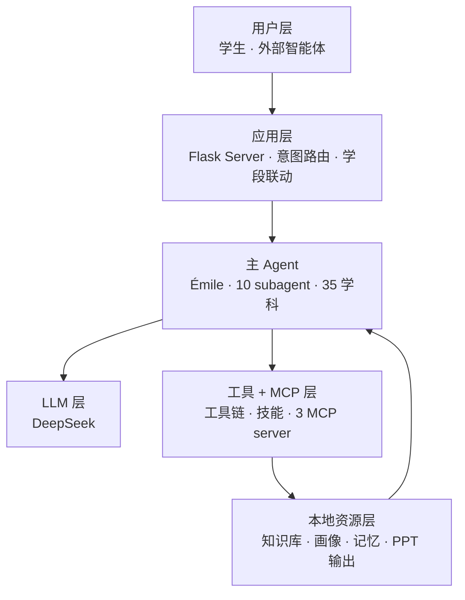

# PAEG — Pedagogical Agent with Evolving Growth

基于**西蒙娜·薇依（Simone Weil）**教育哲学、由 Agent 架构驱动的 AI 教育智能体（**v1.2.0 · 35 学科 × 4 学段 + 10 subagent + 自我进化 + 双 LLM 约束引擎**）。

      

> **"注意力是最稀有、最纯粹的慷慨。"** — 西蒙娜·薇依，《关于注意力》（1942）

⭐ 如果这个项目对你有启发，欢迎点 Star 支持。

## 目录

[真实故事](#真实故事) · [这是什么](#这是什么) · [核心能力](#核心能力) · [架构全景](#架构全景) · [快速开始](#快速开始) · [备课模式](#备课模式) · [目录结构](#目录结构) · [技术栈](#技术栈) · [Customization](#customization) · [Tips](#tips) · [文档](#文档) · [贡献](#贡献) · [License](#license)

---

## 真实故事

### 一句话区分度

学生说"我撑不住了"时，大多数 AI 继续讲下一题，**PAEG 会停下来**。AffectionSupportor 检测到危机信号时，先完整回应用户说的话，再自然融入关怀（12356 热线 + 继续聊天/现实陪伴）；用户明确拒绝热线后不再重复提示（尊重选择）。这是"刷题 AI"和"教育智能体"的分水岭——不机械短路成预制提示词。

### 情绪 + 物理混合输入

生产日志里学生先说「**我这次考试又没考好，我妈说我不如别人……**」，紧接着追问「**我没看懂铁球沉轮船浮**」「**铁球为什么沉**」。PAEG 在同一轮对话里先用 AffectionSupportor 接住挫败感（不教、不答、不解决，以注意力陪伴），再切到物理讲解子代理按"诊断 → 计划 → 呈现 → 评估 → 调整"教学循环一步步讲。一个 AI，能在同一会话里区分"人需要被看见"和"知识需要被讲清楚"。

### 跨学科真实使用

生产日志 11 个真实 learner、87+ 条原始请求横跨量子力学（量子纠缠 / 量子场论真空 / 量子退相干）/ 热力学（波尔兹曼熵）/ 计算机科学（动态规划 / 数据库事务）到人文学科（汉字学 / 计算语言学 / 优生学）。最重度用户 `v032_matrix_` 一段时间内连续提了 51 个问题（"什么是计算语言学"系列）。这证明 PAEG 不只做 K-12，**35 学科 × 4 学段**真的有人在用——而且会反复追问同一个主题，正是间隔重复教学需要的真实信号。

---

## 这是什么

> **定位**：PAEG = **新一代教育智能体解决方案**——为教育重新设计的 Agent 架构，让智能体指挥大模型完成教学全过程（诊断、计划、讲解、评估、调整、反思），使教育从"一次性问答"跃迁为"有教学法、有过程、有陪伴、能自我进化"的完整闭环。

**是什么**：为教育重新设计的 Agent 架构——把教学的"过程"从 LLM 的一次性输出中结构化地抽离出来，让 Agent 真正**指挥** LLM 完成教育。它是一名会自我进化、有完整人格、能情绪陪伴的老师。

**不是什么**：不是"给 LLM 套聊天框"的壳，不是单纯的刷题 AI，不是 LLM 直接面向用户的 RAG 包装。

**为什么不同**：通用 AI 教育产品只能做到"才"（知识传授）；PAEG 还要做到"德"（品格陪伴）——这是任何刷题 AI 都无法复制的价值观壁垒。

---

## 核心能力

### 1. 完整教学闭环（不是聊天，是教学）

`paeg.teach()` 六阶段闭环：**诊断 → 计划 → 呈现 → 评估 → 调整 → 反思 → 自更新**。评估用确定性启发式（可复现不随机），LLM 只负责最擅长的"讲解"。多层意图路由（Steering 学科切换 / 意向性层 / 情绪拦截 / **复合输入检测 v0.21.9 防注入**）+ 上下文打包契约（每次 LLM 调用回传完整上下文）+ 模式自动纠正 + **Thread/Turn/Item 三层会话模型**（v0.21.1，借鉴 Codex，支持 fork/archive/SSE 事件流续传）。

### 2. 10 个子代理架构

Diagnostor（诊断）/ Planner（计划）/ Presenter（呈现）/ Evaluator（评估）/ Adapter（调整）/ AnswerSolver（找答案）/ AffectionSupportor（情绪陪伴）/ SelfUpdateAgent（自我更新）/ Individuality（个体化因材施教）/ ResourceLibrarian（资料检索员）/ **LessonPrep（备课 · 第 10 个 · v1.1.9+）**。设计原则：诊断深度、评估分数、调整决策用确定性规则（可测试可复现），只有"生成讲解"用 LLM。LessonPrep 详见[第 7 章](#备课模式)。

### 3. 17 维学生画像（因材施教）

**Individuality**：17 维正交画像 + LLM 增量建模（对话中说"代数弱"→画像自动记薄弱点）+ persist 持久化（users_data/profile.json）+ 动态维度扩展（add_dimension 可加到第 18/19 维）+ inject_control 五层注入（语言/风格/深度/节奏/情绪）——对每个学生个别对待。

### 4. 系统性自我进化

四路自进化：知识蒸馏（成功教学入库 evolved_*.json）/ 提示词补丁（SCOPE 双流）/ 工具经验 / 新学科需求闭环（用户问"量子力学"自动记录并反馈）。质量门禁（Constitutional AI 风格）过滤有害内容。SelfUpdateAgent 读取过滤后洞察 + 用户反馈生成结构化建议（/api/self-update/from-feedback）。**RALPH 循环（v0.69+）**：任务驱动自我循环——执行→验证→承诺→续触发迭代，三层完成判定 + 五道反教条防呆防线（轮次上限/收益递减/质量回退/人类确认/资源熔断）。

### 5. MCP 双向打通

对外暴露教育工具（MCP Server），对内调用外部标准工具（MCP Client）——LLM 可用工具从 7 个扩到 34 个。MCP **3/3 全连接**：filesystem + memory + pptx。**PPT 演示文稿生成（v0.25 ⭐）**：根据用户上传文档 + 知识库检索 + 对话历史，LLM 生成大纲 → python-pptx 自动排版 → 输出 .pptx。**L0-L8 约束引擎 MCP 化（v0.70+ · §3.29）**：6 API `layer_get` / `layer_set` / `compose` / `always_active` / `self_evolve` / `feedback_adjust`，约束可治理、自演进、反馈调强。**教学物料包 workflow（v0.70+）**：`teach_materials` 工作流一个主题自动产出 6 类教学物料（知识导图/讲义/PPT/讲稿/视频脚本/数学动画），DAG 并行执行。

### 6. 全局中文语言质量层（v0.21.8 ⭐）

语言规范性是教育智能体独立于模型性能的待解决问题——通过语法分析 + 分层限制（L1 提示词约束：主谓宾/动宾搭配/词法句法完整/介词规范 / L2 规则检测 / L3 LLM 修正）程序化保证。**v0.70+ §3.28 MCP 标准化**：13 处 `_polish_text` 收敛为 `lang_gate_content` 统一守门；违禁词数据化 `forbidden_words.json`（可动态维护不改代码）；MCP 三工具 `normalize_text` / `language_policy_check` / `forbidden_words`——外部 agent 也能调用 PAEG 的语言规范能力。

### 7. affection 情绪支持（立德树人 · 哲学三角）

胡塞尔（如何看）+ 薇依（为何看）+ 尼采（看完后如何重新站立）+ 生命现象学（约纳斯/梅洛-庞蒂/海德格尔）。约纳斯克制语言风格（真实/朴素/克制）。**底层世界观（v0.22.3，从薇依原著提炼）**：①世界的真实是唯一被看重的——不美化、不粉饰、不虚构安慰 ②真实中罪恶无法消除，善也无法被罪恶消除 ③一切属世之物皆有条件，有条件即矛盾，矛盾的张力构成真实 ④情绪支持 = 疏导情绪 + 认知真实（帮学生检视自我价值判断是否苛刻、对世界的理解是否失真）。**危机协议（人性化）**：检测到自伤/自杀信号时，**LLM 先完整回应用户说的话**，再自然融入关怀（12356 热线 + 继续聊天/现实陪伴）；用户明确拒绝热线/服务后不再重复提示（尊重选择）。

### 8. 备课模式（第 10 个 subagent · 详见[第 7 章](#备课模式)）

输入「我要备课」即启用 LessonPrep——按张宇扬课件级质量标准渐进式产出 8 步完整教学物料（教案骨架 → 完整教案 → 讲义 → 讲稿 → PPT 大纲 → 视频脚本 → 思维导图 → 质量报告）。独立预算 25000 token，不占用教学会话预算。

> **市场垂直 + 学段差异化**：35 学科横跨文理（数学→哲学/美学/伦理/现象学/语言学/大气科学/量子场论）+ 薇依人格——"刷题 AI"红海中的差异化垂直智能体。**学段教学模式差异化（v0.71+ §3.33）**：同一知识点，初中"感官优先·三步可视化"、高中"结构优先·五步走"、大学"正式 lecture·五步论证"、考研"考点解剖·五步得分"——`GRADE_SCAFFOLDS` 可执行段序列骨架 + 内容深度量化双落实。

---

## 架构全景



**分层细图**：见 `ARCHITECTURE_LINKS.md`（L0 总览 + 5 张 L1 主题图：教学闭环 / 个体化 / 立德树人 / 工具 MCP / 自我进化，每张 ≤10 节点，GitHub 原生渲染）。

---

## 快速开始

### 方式 A：Docker（推荐 · Python 3.12 统一环境）

```bash
# Fork → 配置 → 启动
cp .env.example .env             # 编辑 .env：DEEPSEEK_API_KEY=xxx
docker compose up -d --build
# 访问 http://localhost:5000
# 日志 / 停止：docker compose logs -f / docker compose down
```

> 单容器含：主服务 + manim 动画 + ffmpeg + 语音（TTS/STT）。数据卷持久化 users_data / downloads / Library。详见 [Dockerfile](./Dockerfile) 与 [docker-compose.yml](./docker-compose.yml)。

### 方式 B：源码（本机开发）

```bash
pip install -r requirements.txt
# .env 或环境变量：DEEPSEEK_API_KEY=xxx
cd 05_实现原型 && python server.py
# 访问 http://localhost:5000
# 测试（132+ · v1.2.0）
python -m pytest tests -q
python -m pytest "..\06_测试与验证\tests\test_paeg_v0_5.py" -q
```

**测试哲学（v0.45 ⭐）**：LLM 驱动功能必须双维度验证——有无（路由存在/返回 200/结构正确）+ 好坏（检索条数≥5/相关性/内容长度/PPT 大纲结构，质量测试 `test_quality_*`）。"能用就行"不算完成。详见 `memo/010` + 维护手册 §3.5。

### 生产部署 + 高级评估

```bash
gunicorn -w 1 -k gthread --threads 8 -b 0.0.0.0:5000 server:app
# HTTPS 由反代（Nginx/Caddy/cloudflared）前置，应用已支持 ProxyFix
# 生产环境变量：PAEG_ENV=production  +  PAEG_CORS_ORIGINS=https://你的域名
# 并发边界（不引入 Redis 的务实上限）：≤200 注册用户 / ≤20 QPS / ≤50 并发 SSE
# 评估工具：python multi_turn_eval.py --mode all / api_sweep.py / eval_harness.py [--fast]
```

---

## 备课模式

**快速开始**：**「我要备课」是备课模式的独立激活词**——在教学模式下，**在输入内容前加上「我要备课」** 即可进入备课模式，启用 **LessonPrep 备课 subagent**（第 10 个），按张宇扬课件级质量标准渐进式产出完整教学物料：

```
方式一：一步到位（ULW 风格 · 推荐）
  用户：我要备课：高中数学，函数单调性，45分钟，重点讲图像变换
  PAEG：直接提取需求 → 产出完整备课物料（不需额外确认）

方式二：先激活后补充
  用户：我要备课
  PAEG：（引导）好的，你想备哪门课、哪个知识点？大概多长时间？有什么特别要求吗？
  用户：高中数学，函数单调性，45分钟
  PAEG：自动合并需求 → 产出完整备课物料

产出流程（8 步渐进式）：
  ① 教案骨架（5E/UbD 框架 · 三维目标 · 6 环节概述）→ 确认
  ② 完整教案（三维目标/学情分析/重难点/教学环节/板书/反思）
  ③ 讲义（Markdown）→ ④ 讲稿（口语化含过渡句）
  ⑤ PPT 大纲（6×6 法则）→ ⑥ 视频脚本（理科 · 3b1b 风格）
  ⑦ 思维导图 → ⑧ 质量报告（12 条硬性检查 · 自动打分）
```

**能力**：与讲义/思维导图/讲稿/PPT/数学视频/教学视频全链路接线（material_pipeline + /api/ppt/generate + /api/manim/generate）；生成内容全部过**动态约束（L0-L8）+ 语言规范（L0+L2）**双层质量闸门。

**质量标准（三源融合）**：张宇扬课件 18 条（历史人物锚定/原典引用/真实数据例题/节末思考题）+ 教育部课标/UbD/5E/Bloom（三维目标可测动词/学情含迷思概念/评价与目标对齐）+ Mayer 多媒体 12 原则（一页一重点/6×6 法则/推导可视化）。

**独立预算**：备课任务使用独立 token 池（上限 25000），不占用教学会话预算；渐进式产出可随时中断续做。

**质量守门（v1.1.9+）**：每份产出落地前过四类评分（教案 6 维 / 讲义 / PPT 大纲 5 维 / 视频脚本）+ **12 条硬性检查**（7 条自动 + 5 条 LLM 评审），产出 `dim_scores` 与 `eval_mode`（auto/hybrid）写入质量报告。`/api/lesson_prep/feedback` 收集教师反馈（L3 人工评估）回流到评分器。**PPT 自动配图（v1.1.9+）**：备课模式与 PPT 生成现支持三级来源自动配图——用户资料库（`Library/usr_knowledge/<uid>/`）→ 公共文件夹（`Library/ppt_images/` + `~/.paeg/ppt_images/`）→ 联网检索（Bing 图片，免 key）；优先级链：资料库 > 公共 > 联网 > 缓存 > 无图（**永不阻塞**，缺图保持文字版）。`generate_ppt` 支持 `enable_images=True/False`。

---

## 目录结构

```
PAEG/
├── 05_实现原型/        # 核心代码（40+ Python 模块 · 详见附录）
│   ├── server.py        # Flask 后端 + 全部端点
│   ├── paeg.py          # 教学主循环
│   ├── subagents.py     # 10 个子代理（含 LessonPrep）
│   ├── prompts.py       # 35 学科 × 4 学段提示词中心
│   ├── meta_router.py   # 意图检测（8 类）
│   ├── context_bundle.py# 上下文打包器
│   ├── language_refiner.py # 语言质量修正
│   ├── self_evolution.py  # 四路自进化
│   ├── mcp_client.py / mcp_gateway.py  # MCP 客户端 + 服务端
│   ├── subject_detector.py / multi_turn_eval.py
│   └── memory/           # 教学记忆 + AffectionSAPAO.md
├── 09_GUI前端/          # Web 界面
├── Library/             # 知识库（语言/数学/哲学/薇依原著）
├── Lessons/             # 备课产物（教案/讲义/PPT/讲稿/视频脚本/思维导图/质量报告）
├── PAEG技术全景文档.md   # 完整技术文档（§1.13 上下文打包契约等）
├── 亮点总览.md           # 亮点总结
└── CHANGELOG.md          # 版本历史
```

---

## 技术栈

| 层 | 技术 |
|---|---|
| 后端 | Python + Flask（47+ API 路由）+ module_registry 模块门控 |
| LLM | DeepSeek（云端推理，agent 指挥 LLM） |
| 前端 | 原生 HTML/CSS/JS（无框架）+ KaTeX 数学渲染 + marked Markdown |
| 语音 | v0.36 ⭐：edge-tts（TTS 免key）+ 浏览器 Web Speech API（STT） |
| 工具 | 7 内置工具 + 10 Skills + 3 MCP（filesystem/memory/pptx） |
| 图片 | Pillow（缩放/格式转换）+ python-pptx（PPT 排版与配图嵌入） |
| 存储 | JSON 文件落盘（users_data/ + data/ + Library/） |
| 部署 | 本地 :5000 + cloudflared 隧道公网 / Docker 单容器 |

---

## Customization

### sub agent 模型配置化（v0.71+ §3.32）

像 Oh My OpenCode 一样，`config/agents.json` JSON 配置即可为每个 sub agent 分配不同模型（provider/model/temperature/max_tokens/thinking_level）：三层合并（默认 → 用户 `~/.paeg` → 项目）+ `{env:}/{file:}` 变量替换——用户不改代码定制 PAEG 的 10 个 sub agent。

### 模块门控 + 画像扩展（v0.21）

14 个功能模块可独立启用/禁用（`paeg_modules.json`），上架下架不改代码。17 维画像可通过 `Individuality.add_dimension()` 扩展到第 18/19 维，配合 `inject_control` 五层注入（语言/风格/深度/节奏/情绪）。

### Skills 生态 + 用户文件（v0.22.0）

10 个技能经 `tool_registry` 暴露为 LLM function calling：concept-explainer / essay-feedback / knowledge-map / math-step-solver / study-planner / pdf / docx / xlsx / doc-coauthoring / teach。

上传资料到 `Library/usr_knowledge/<uid>/` 触发 4 能力：找答案（BM25 检索）/ 讲解（区分原文 vs 讲解）/ 输出原文（逐字，不依赖 LLM）/ 重组结构（大纲/表格/思维导图）。技术：`lib/ingest/`（readers → chunker → retriever BM25+jieba → intent_router → handlers）。

### 元能力 + 可观测性（v0.21）

`元能力文档.md`（智能体设计方法论，含 §6.15 成熟项目结构借鉴元技术）+ `observability.py`（结构化日志/指标/事件流）。

---

## Tips

### STT 语音输入限制

依赖浏览器 `webkitSpeechRecognition`（Chrome/Edge/Safari 桌面版）+ HTTPS 或 localhost 安全环境。微信内置浏览器（X5 内核）与非 HTTPS 局域网 IP 访问**不支持**——此时麦克风按钮会明确提示原因，可直接打字交流。

### TTS 朗读自动播放拦截

需后端已安装 `edge-tts`（`pip install edge-tts`）；播放可能被浏览器自动播放策略拦截——点一次页面任意处再点 🔊 即可。

### 气象页面（v0.20.5）

顶部"气象"链接 → windy.com 气象图（免费嵌入）+ 位置共享 + Open-Meteo 实时数据。

### 检索徽章（v0.27 + v0.36.1）

回答前显示"已完成知识库检索 / 网络检索"徽章：知识库有该概念 → 知识库检索；知识库无匹配（如偏门/自创概念）→ **自动联网补充**并显示"网络检索"。推荐类问题（"推荐几本书"）始终真联网。

---

## 文档

- **PAEG技术全景文档.md** —— 完整技术文档（架构/数据流/API/部署/测试/亮点）
- **亮点总览.md** —— 八大亮点（示例+技术说明+对 LLM 操控的提升）
- **CHANGELOG.md** —— 版本历史（v0.5 → v1.2.0）
- **维护手册** —— 维护操作流程（含 §六 成熟项目结构借鉴）
- **元能力文档** —— 智能体设计方法论 + 可观测性
- **06_测试与验证/** —— 测试用例集 + 测试报告
- **交付物/** —— 测试报告（.md+.pdf）、演示文稿、用户测试表

---

## 贡献

欢迎以 Issue / PR 形式贡献：bug 报告、新学科提示词、教学场景案例、文档改进。提交前请跑 `audit_check.py` + `pytest tests/` + `sync_check.py`。

---

## License

MIT

---

## 附录：架构与维护

> 本节面向**接手维护者**和**未来想二次开发**的读者——项目目录怎么组织、怎么检视健康度、下一步往哪里走。

### 最近新增能力（v0.69 → v1.2.0）

| 版本 | 能力 | 一句话说明 |
|---|---|---|
| v0.69 | RALPH 循环 | 任务驱动自我循环：执行→验证→承诺→续触发迭代，三层判定 + 五道防呆 |
| v0.70 | 视频脚本生成 | 3b1b 风格数学动画 + 同步讲稿/PPT/讲义/思维导图 |
| v0.70 | 教学物料包 | `teach_materials` 工作流：DAG 并行产出 6 类物料 |
| v0.70 | 语言规范 MCP | 13 处 `_polish_text` → 统一 `lang_gate_content` 守门 |
| v0.70 | L0-L8 约束 MCP | 6 API：layer_get/set/compose/always_active/self_evolve/feedback_adjust |
| v0.71 | 学段差异化 | 初中三步可视化 / 高中五步 / 大学五步 / 考研五步得分 |
| v0.71 | sub agent 配置化 | `config/agents.json` JSON 配置 provider/model/temperature |
| v1.1.9 | 备课模式 | 第 10 个 LessonPrep subagent，8 步渐进式产出（详见[第 7 章](#备课模式)） |
| v1.1.9+ | PPT 配图增强 | 三级来源自动配图（资料库 → 公共 → 联网），永不阻塞 |
| v1.1.9+ | 四类质量评估 | 教案/讲义/PPT 大纲/视频脚本评分 + 12 条硬性检查 + 教师反馈端点 |

### 详细目录（5 个一级目录）

```
05_实现原型/
├── server.py              # 入口薄壳（app factory + 蓝图注册）
├── config/                # 配置层（settings / secrets / env loader）
├── utils/                 # 纯函数工具（text / json / time）
├── services/              # 业务服务（tts / user / llm — Phase 2 拆分中）
├── blueprints/            # HTTP 蓝图（api / admin / voice — Phase 3 规划）
├── agents/                # subagent 实现（planner / presenter / evaluator）
├── infra/                 # 基础设施（db / cache / file_lock / audit）
├── subagents.py           # 10 个子代理注册与调度
├── voice_service.py       # TTS/STT 接口抽象（v0.36+）
├── reflection_store.py    # 反思日志持久化
├── prompt_loader.py       # 提示词模板加载
├── paeg_modules.json      # 模块门控配置
└── tests/                 # 镜像结构测试
```

**关键文件**：`config/`（secrets 从环境变量读取，无硬编码密钥）/ `subagents.py`（10 个 subagent 注册与调度）/ `voice_service.py`（TTS/STT provider 抽象）/ `reflection_store.py`（自我进化反思日志）/ `paeg_modules.json`（模块开关门控）。

### 检视命令 + 多端一致（每次改动前后必跑）

```powershell
# === 检视铁律：5 命令全过 ===
python audit_check.py          # 静态检视（P0/P1 必须全过）
python smoke_test.py           # 端点冒烟（27 秒内验证关键 API）
python -m pytest tests/ -q     # 全量回归（pytest 必须全绿）
python arch_check.py           # 架构连通性（每季度跑一次）

# === 多端一致（本地 ↔ GitHub ↔ ModelScope ↔ Release）===
$env:GH_TOKEN='<你的token>'
python sync_check.py --fix     # 自动推送差异（本地为权威）
# 或手动：
# git add . && git commit -m "改动"
# git push origin master && git push modelscope master   # 或 git pushall
```

**检视铁律**：改核心链路（server.py / subagents.py / prompts.py）后**至少**跑 smoke_test + pytest；发版前必须 5 命令全过；任何 `bare except: pass` 会被 audit_check 抓住（P0）；任何写端点缺 `_is_registered` 校验会被抓住（P0）。

**优化方向**：参考 Flask / Kraken / EAS Station / llama-index / langchain 六个成熟项目做渐进拆分——Phase 1 `config/utils` ✅ / Phase 2 `infra/services` ✅ / Phase 3 `blueprints` 📋 / Phase 4 `agents` 📋。**拆分铁律**：①行为不变性（API 字节级一致）②Expand-Migrate-Contract 三阶段可回滚 ③ratchet（只前进不后退）。

**多端原则**：①本地为权威源 ②每次变更后同步 ③Release 保持最新（重大版本更新时更新 Release 名称与正文，tag 可复用 v0.26）④敏感数据不上传（users.json / users_data/ / uploads/ / data/ 不参与备份）⑤token 不入库（GH_TOKEN 环境变量读取）。

**完成状态**：2026-08-08，106 个代码/文档文件全部一致（0 缺失 0 差异）。

### 进一步阅读

- 详细技术全景：[《PAEG技术全景文档》§10.2.21 成熟项目可借鉴结构](./PAEG技术全景文档.md)
- 维护操作流程：[《维护手册》§六 成熟项目结构借鉴](./维护手册.md)
- 元能力沉淀：[《元能力文档》§6.15 成熟项目结构借鉴元技术](./元能力文档.md)
- 投资人视角亮点：[《亮点总览》§六 架构可维护性](./亮点总览.md)
