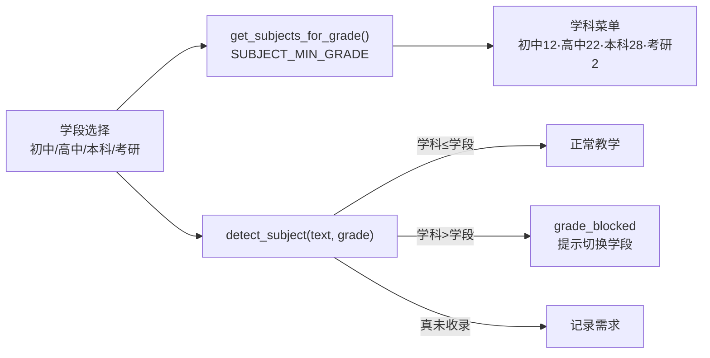
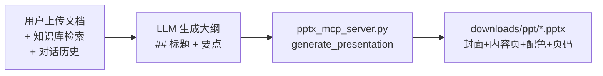
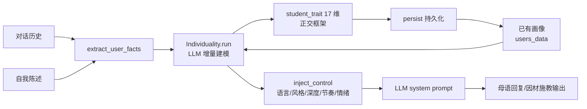
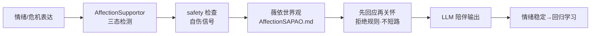

# PAEG — 新一代教育智能体解决方案（投资人版 · v0.25 关键节点）

> **一句话定位**：PAEG 不是给 LLM 套一个聊天框的问答工具，而是**为教育重新设计了 Agent 架构**——让智能体指挥大模型完成教学的全过程（诊断、计划、讲解、评估、调整、反思、自我进化），使教育从"一次性问答"跃迁为"有教学法、有过程、有陪伴、能自我成长"的完整闭环。

---

## 一、为什么是现在？（市场机会）

**教育 AI 正处于从"工具"到"教师"的临界点。** 通用 AI 教育产品（ChatGPT/豆包/Kimi 的教育模式）本质是"让 LLM 回答问题"——它们没有教学法、没有过程、没有评估、没有陪伴。而真实教育的价值恰恰在于：**教的过程**（诊断学生、设计路径、引导思考、评估掌握、调整方法），而非答案本身。

PAEG 抓住的正是这个缺口：**用 Agent 架构把"教学"从 LLM 的一次性输出中结构化地抽离出来**，让智能体扮演教师，让 LLM 扮演教师手中的笔。

**市场数据支撑**（教育 AI 赛道）：
- 在线教育向 AI 个性化转型是明确趋势（Khanmigo、Duolingo 已验证付费意愿）
- 家长/学生的核心痛点是"没有懂我的老师"——个性化、有陪伴、能记住学生情况
- 博雅教育（人文/哲学/批判性思维）是通用 AI 教育产品的空白——它们只会做题，不会育人

---

## 二、我们做了什么？（产品与能力）

### 能力全景：十大亮点（含技术细节）

#### 亮点 1：完整教学循环（不是聊天，是教学）
- **之前**：通用 AI 问"什么是导数？"→ 一次性输出定义，学生没学会
- **之后**：PAEG 六阶段闭环——诊断（判断学生基础）→ 计划（按学科风格+学段定制）→ 呈现（分步讲解）→ 评估（判断是否真懂）→ 调整（不懂就换讲法）→ 反思（沉淀经验）
- **技术栈**：`paeg.py` 六阶段流水线，评估用确定性启发式（可复现、不随机），LLM 只负责最擅长的"讲解"

#### 亮点 2：9 个子代理架构（LLM 只做擅长的事 · v0.25 29 学科）
- **之前**：一个 prompt 干所有事（诊断/讲解/评估混在一起，质量不可控）
- **之后**：**9 个专职 subagent**分工——Diagnostor（诊断）/ Planner（计划）/ Presenter（讲解）/ Evaluator（评估）/ Adapter（调整）/ AnswerSolver（找答案）/ AffectionSupportor（情绪陪伴）/ SelfUpdateAgent（自我更新）/ **Individuality（个体化因材施教）**
- **v0.24 修复**：PAEG 主 agent 现在**持有全部 9 个 subagent**，统一调度（之前 3 个挂靠 PAEG、其余独立调用）
- **v0.25 增强**：**SelfUpdateAgent 升级为 7 分类**（新增 `subject_addition` 新增学科建议 + `library_update` 资料扩充建议）+ 周期调度器**落地执行**（建议不再只写文档，而是自动生成学科注册 JSON 入库 / 记录 Library 待办）；**Individuality 个体化与学段联动**（17 维画像 + 学段约束）
- **技术栈**：`subagents.py` + `agent_core.py` + `paeg.py` 持有 9 subagent；诊断深度、评估分数、调整决策用确定性规则（可测试可复现），只有"生成讲解"用 LLM

#### 亮点 2.1：学段-学科联动（⭐ v0.25 · 教学伦理的工程化）
- **之前**：学段与学科完全独立——高中生也能选"语言学/量子场论"（大学学科），教学体系混乱
- **之后**：**每个学科绑定最低学段**（SUBJECT_MIN_GRADE）——初中 12 学科 / 高中 22 学科 / 本科 28 学科 / 考研 2 学科；前端学科菜单按学段动态过滤；**自动流转（Steering）重新设计**：高中生问语言学 → 智能拦截并提示"该学科需大学本科及以上学段，可切换学段"，而不是误报"未收录"
- **价值**：教学循序渐进（先打好基础，再学专业学科）——"学科不是孤立的知识点，而是有学段秩序的成长路径"
- **技术栈**：`prompts.py` SUBJECT_MIN_GRADE + `subject_detector.detect_subject(grade)` + GUI 学段联动

**图一：学段-学科联动链路（v0.25 真实连接）**

#### 亮点 2.2：一键生成演示文稿（PPT MCP · ⭐ v0.25 新能力）
- **之前**：学生学完知识，没有产出物——对话结束就结束了，学到的内容无法沉淀成可交付的文件
- **之后**：PAEG 接入 **PPT 生成 MCP**（pptx_mcp_server.py）——**从"对话"到"文件"的完整产出闭环**：根据**用户上传文档 + 知识库检索 + 对话历史**，LLM 生成大纲 → python-pptx 自动排版（封面 + 内容页 + 品牌配色 + 页码 + 备注）→ **输出可下载的 .pptx 文件**（downloads/ppt/），学生可以把课堂内容直接变成演讲/展示/复习材料
- **示例**：学完"语言学导论"→ 说"帮我做成 PPT"→ 自动生成 4 页演示文稿文件（什么是语言学/语音音系/语法结构）
- **价值**：教学不只是"对话"，还能**沉淀为产出物**——对 K12 学生是展示作业，对成人是工作汇报，是教育 AI 从"问答工具"走向"生产力工具"的关键一步
- **技术栈**：`pptx_mcp_server.py`（FastMCP + python-pptx）+ `mcp_servers.json`（MCP 连接 2/2→3/3）

**图二：PPT 演示文稿生成链路（v0.25 真实连接）**

#### 亮点 2.5：个体化·因材施教（17 维正交学生画像 ⭐ 核心竞争力 · v0.25 学段联动）

> **教育理念**：因材施教——**个别地对待每一个不同的学生，尊重每一个学生的个体特征**。对每个学生用不同的语言、不同的节奏、不同的深度、不同的情绪呼应，像一位真正记住每个学生的老师。

- **之前**：教育 AI 对每个学生一视同仁，用同一套话术
- **之后**：PAEG 为**每一个学生建立 17 维正交画像**（v0.24 新增母语维）——通过存储用户的对话记录、自我介绍和用户建模（user_model/BDI），**LLM 增量建模 + 持久化 + 动态维度扩展**，每一轮对话都注入这个学生的专属画像
- **17 个正交维度**（v0.24 新增 1 维）：身份学段 / 认知通道（VARK）/ 知识掌握状态（双向证据）/ 学习目标 / 价值观世界观 / 情感状态 / 学习动机 / 自我信念 / 会话意图 / 投入度 / 学习节奏 / 时段偏好 / 错误反应模式 / 协作偏好 / 多媒体偏好 / 可用性需求 / **母语**（v0.24 新增）
- **v0.24 闭环修复**（⭐ 关键）：
  - **增量建模**：对话中说"代数弱" → `extract_user_facts` 抽取 → `Individuality.run` LLM 增量更新画像 → 下一轮对话画像已含"薄弱点：代数"
  - **持久化**：`persist()` 落盘 `users_data/profile.json`，跨会话保持
  - **动态维度扩展**：`add_dimension()` 支持加到第 18/19 维（不只是固定 16 维）
  - **inject_control 五层注入**：语言 / 风格 / 深度 / 节奏 / 情绪五层分别注入 system prompt
- **技术栈**：`student_trait.py`（17 维正交框架 + add_dimension 动态扩展）+ `individuality.py`（增量建模 + persist）+ `inject_control` 五层注入

#### 亮点 2.6：立德树人·立德为先（AffectionSupportor · v0.25 危机钩子先行 ⭐ 价值观壁垒）

> **教育理念**：**立德树人、立德为先**——**先成人，后成才**。不教、不答、不解决，而是以注意力陪伴学生；情绪稳定后才回归学习。这是 PAEG 与所有"刷题 AI"最深层的差异化壁垒——**我们不只教书，我们育人**。

- **之前**：AI 情绪回复是模板化的"一切都会好起来的"——空洞、虚假；学生有情绪危机时 AI 直接讲题或忽略
- **之后**：AffectionSupportor 用**哲学三角**（胡塞尔现象学悬置 / 薇依注意力 / 尼采自我克服）+ 生命现象学（约纳斯 / 梅洛-庞蒂 / 海德格尔）——**不教、不答、不解决，以注意力陪伴**；危机信号**先回应再关怀**（不机械短路成预制提示词）
- **v0.24 修复**（⭐ 关键）：`_affection_gate_check` 危机信号**先行**——危机时转 AffectionSupportor，否则进入教学流水线（立德为先原则的程序化保障）
- **底层世界观（薇依原著提炼）**：①世界的真实是唯一被看重的——不美化、不粉饰、不虚构安慰 ②真实中罪恶无法消除，善也无法被罪恶消除 ③一切属世之物皆有条件，有条件即矛盾，矛盾的张力构成真实 ④情绪支持 = 疏导情绪 + 认知真实（帮学生检视自我价值判断是否苛刻、对世界的理解是否失真）
- **危机协议（人性化）**：检测到自伤/自杀信号时 LLM 先完整回应用户说的话，再自然融入关怀（12356 热线 + 继续聊天/现实陪伴的替代方法）；用户明确拒绝后尊重选择不再重复提示（不机械短路）
- **技术栈**：`subagents.py` AffectionSupportor + `memory/AffectionSAPAO.md`（原则宪法）+ `_affection_gate_check`（v0.24 危机先行钩子）

**因材施教 × 立德树人 = 德才兼备 ⭐**

> 与亮点 2.5（Individuality 因材施教）形成 PAEG 教育理念的**双支柱**——**德才兼备**：
> - **Individuality（因材施教）**：根据每个学生的个体特征定制教学
> - **AffectionSupportor（立德树人）**：以注意力陪伴、危机先回应、稳定情绪后才回归学习
>
> 通用 AI 教育产品只能做到"才"（知识传授）；PAEG 还要做到"德"（品格陪伴）——这是任何"刷题 AI"都无法复制的价值观壁垒。

**图三：个体化闭环链路（因材施教 · v0.25 真实连接）**

**图四：立德树人闭环链路（v0.25 真实连接）**

#### 亮点 3：多层意图路由（Agent 自动判断该做什么）
- **之前**：用户必须手动切模式，选错就答非所问
- **之后**：多层拦截链自动判断——问"考研政治"的经济学问题自动切学科（Steering）、问"今天怎么样"走一般化回应、问"我很难过"走情绪陪伴、粘贴"帮我分析这段文字：<长文>"自动区分指令与资料
- **技术栈**：`meta_router.py` + `self_referential.py` + 知识库/搜索注入矩阵；规则层（廉价确定性）优先，LLM 判断层兜底

#### 亮点 4：自我进化（越用越懂怎么教）
- **之前**：静态知识库，每次教学都从零开始
- **之后**：四路自进化——知识蒸馏（成功教学入库 evolved_*.json）/ 提示词补丁 / 工具经验 / 新学科需求闭环；质量门禁（Constitutional AI 风格）过滤有害内容；SelfUpdateAgent 读取过滤后洞察 + 用户反馈生成结构化改进建议
- **v0.25 升级（⭐ 自我更新闭环补全）**：SelfUpdateAgent 从 5 类建议扩到 **7 类**——新增 `subject_addition`（新增学科建议：学生问未收录分支 → 自动生成 pending_subject JSON 到 Library/KnowledgeBase/subjects/，重启自动注册入库）和 `library_update`（资料扩充建议：记录到 data/pending_library.json）；周期调度器消费建议后**落地执行**（不再只写文档供人工看）
- **技术栈**：`self_evolution.py` + `quality_gate.py` + `periodic_self_update.py`（v0.25 落地执行器）+ `subagents.py` SelfUpdateAgent

#### 亮点 5：MCP 双向打通（工具标准化）
- **之前**：封闭工具，LLM 只能说话不能做事
- **之后**：对外暴露教育工具（MCP Server），对内调用外部标准工具（MCP Client）——LLM 可用工具从 7 个扩到 34 个（web_search/verify_math/文件系统/记忆）
- **技术栈**：`mcp_gateway.py` + `mcp_client.py` + `tool_registry.py`

#### 亮点 6：全局中文语言质量层（输出像人话，程序化保证）
- **之前**：LLM 输出"不催你""先不急""带着重量"等残缺句、动宾不当表达——像 AI 生成物，不像老师
- **之后**：三层语言质量层程序化保证——L1 提示词约束（完整主谓宾/动宾搭配/词法句法完整）+ L2 规则检测（零 LLM 成本，检出残缺句/悬空宾语/省略词）+ L3 LLM 修正（保持风格地补全）
- **实测**："我有点倦，想和你探讨" → "我有点疲倦了，但我还是想和你探讨这个问题。因为教学这件事很重要，所以即使累了，我也愿意把想法说出来"
- **技术栈**：`language_refiner.py`（L1/L2/L3 分层）；**语言规范性是教育智能体独立于模型性能的能力**——换更强的模型 ≠ 语言更规范，靠语法分析和限制程序化保证

#### 亮点 7：情绪支持（哲学三角 + 循证技术）
- **之前**：AI 情绪回复是模板化的"一切都会好起来的"——空洞、虚假
- **之后**：AffectionSupportor 用哲学三角（胡塞尔现象学悬置/薇依注意力/尼采自我克服）+ 生命现象学（约纳斯）——不教、不答、不解决，以注意力陪伴；结合情绪标注（Lieberman 神经科学：命名情绪即调节情绪）、反映性倾听、危机协议（检测自伤信号→转介 12356 热线）
- **技术栈**：`subagents.py` AffectionSupportor + `memory/AffectionSAPAO.md`（原则宪法）

#### 亮点 8：博雅教育垂直（有灵魂的教育者）
- **之前**：教育 AI 全是"刷题工具"，没有人格、没有价值观
- **之后**：29 学科横跨文理（数学→哲学/美学/伦理/现象学/语言学/大气科学/量子场论）；薇依哲学内核（"注意力是最稀有的慷慨"）；"先做人，再教书"最高原则——这是第一个以完整教育人格为壁垒的博雅教育智能体

#### 亮点 9：Skills 生态（能力可插拔）
- **之前**：能力写死在代码里，扩展要改系统
- **之后**：10 个技能经 skill_registry → tool_registry 暴露为 LLM function calling（`load_skill__<名称>`）——LLM 自主决定加载哪个技能工作流；从市场下载成熟 skills（pdf/docx/xlsx/doc-coauthoring/teach）
- **技术栈**：`skill_registry.py` + `skills/` 目录（SKILL.md 标准格式）

#### 亮点 10：基于用户上传文件的 4 能力
- **之前**：上传文件只做摘要注入（前 3 个 md/txt 前 500 字），PDF/DOCX 不可读
- **之后**：BM25 + jieba 检索（155 教育术语词典，无需向量数据库）——学生上传讲义/笔记后，可：①从文件找答案 ②基于文件讲解 ③输出文件原文（不依赖 LLM）④重组文件结构（提纲/表格）
- **技术栈**：`lib/ingest/`（readers 多格式提取 → chunker 中文分块 → retriever BM25 → intent_router 路由 → handlers 4 能力）

### 回答前强制检索 + 自我进化（v0.22.2 架构强化 ⭐）

**每个 subagent 回答前完成"检索知识库 + 调用工具"步骤**——`_safe_chat_with_retrieval` 在 LLM 生成前自动注入知识库检索结果（jieba 分词提升中文命中率），并暴露 web_search/verify_math 等工具让 LLM 查证。同时**完整上下文传递**：对话历史、用户建模（user_model/BDI）、自我描述、学段学科全部注入 LLM。

**自我进化闭环（v0.25 完整链路）**：教学反思（平均分 <0.7 时）→ `evolve_prompt` 提炼提示词补丁 → 写入 subject_patches.md → 下次教学自动注入；SelfUpdateAgent 建议定期回流 improvements.md，**v0.25 起周期调度器把建议落地执行**（新增学科建议 → 生成学科注册 JSON 自动入库；资料扩充建议 → 记录 Library 待办）——**越用越懂怎么教**。

**危机协议**：自伤/自杀信号立即响应（12356 热线 + 继续聊天/现实陪伴的替代方法）；用户明确拒绝后尊重选择不再重复提示。

---

## 三、技术实现的"前后对比"（只增不减的成效）

| 维度 | 通用 AI 教育 | PAEG（改造后） | 提升 |
|---|---|---|---|
| 教学循环 | 一次性问答 | 六阶段闭环（诊断→计划→呈现→评估→调整→反思）| 从"给答案"到"教会" |
| 子代理分工 | 一个 prompt 干所有 | 9 个子代理按"LLM 只做擅长事"拆分 | 质量可控、可测试 |
| 意图路由 | 用户手动切模式 | 多层拦截链自动判断 | 零学习成本 |
| 自我进化 | 静态知识 | 四路自进化 + 质量门禁 | 越用越懂怎么教 |
| 工具互通 | 封闭工具 | MCP 双向打通（34 工具）| 从"能说"到"能做" |
| 语言质量 | 输出即答案（AI 腔）| 三层语言质量层（程序化保证）| 输出像真实老师 |
| 知识检索 | 无检索，靠 LLM 记忆 | 回答前强制检索 + BM25 文件检索 | 答案有据可依 |
| 上下文 | 单轮对话 | 历史 + 用户建模 + 自我描述全注入 | 记住学生、个性化 |

---

## 四、为什么这套架构是革命性的？（竞争壁垒）

1. **教学法壁垒**：不是"套壳 LLM"，是完整的教学 Agent 架构（诊断/计划/评估/调整/反思）——同行难以复制
2. **人格壁垒**：薇依式教师人格 + 哲学三角情绪支持——有灵魂，不是工具
3. **自我进化壁垒**：越用越懂怎么教（四路自进化 + 质量门禁）——数据飞轮
4. **语言规范壁垒**：程序化保证的规范中文输出——教育场景的硬要求
5. **博雅教育定位**：29 学科横跨文理（含语言学/大气科学/量子场论），专注通用 AI 教育产品的空白（人文/哲学/批判性思维）

---

## 五、技术栈一览

**后端**：Python + Flask + SSE 流式 + 多 subagent 架构
**模型**：DeepSeek（OpenAI 兼容 API）
**知识**：KnowledgeBase（结构化节点）+ Library（原始资料）+ BM25/jieba 检索
**工具**：MCP 双向 + web_search/verify_math + 10 skills
**前端**：单文件 Web GUI（index.html）
**部署**：本地 + Cloudflare 隧道（公网访问）

---

*本文档由 Sisyphus 编写，面向投资人阅读。技术细节完整保留（可验证），语言经 PAEG 全局语言质量层规范化。详细技术见《PAEG技术全景文档》。*
